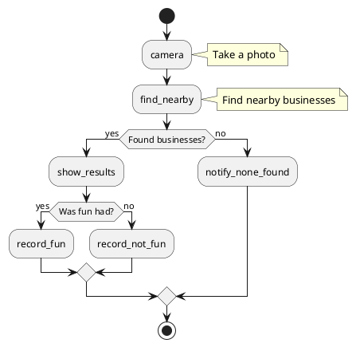

# Quick Reference: What You Can Do Next

**Date:** 2026-01-08  
**Status:** All Core Features Implemented ✅

---

## 🎯 Ready-to-Use Features

### 1. Camera Service
```csharp
// Inject and use
private readonly ICameraService _cameraService;

// Take photo
var imageBytes = await _cameraService.TakePhotoAsync();
if (imageBytes != null)
{
    // Use the photo
}
```

### 2. GPS Service
```csharp
// Inject and use
private readonly IGpsService _gpsService;

// Get current location
var coords = await _gpsService.GetCurrentLocationAsync();
if (coords != null && coords.IsValid())
{
    var lat = coords.Latitude;
    var lon = coords.Longitude;
}
```

### 3. Location API
```csharp
// Inject and use
private readonly ILocationService _locationService;

// Find nearby businesses
var businesses = await _locationService.GetNearbyBusinessesAsync(
    latitude: 37.7749,
    longitude: -122.4194,
    radiusMeters: 1000);
```

### 4. Notifications
```csharp
// Inject and use
private readonly INotificationService _notificationService;

// Show notification
_notificationService.ShowError("Camera unavailable", "Camera Error");
_notificationService.ShowSuccess("Photo saved!", "Success");
_notificationService.ShowInfo("Finding nearby businesses...", "Searching");
```

---

## 🚀 Quick Implementation Examples

### Example 1: Get Nearby Businesses at Current Location

```csharp
public class NearbyBusinessesViewModel
{
    private readonly IGpsService _gpsService;
    private readonly ILocationService _locationService;
    private readonly INotificationService _notificationService;
    
    public async Task FindNearbyAsync()
    {
        // 1. Get current location
        _notificationService.ShowInfo("Getting your location...", "Please Wait");
        
        var coords = await _gpsService.GetCurrentLocationAsync();
        if (coords == null)
        {
            _notificationService.ShowError(
                "Could not get your location. Enable GPS and try again.",
                "Location Error");
            return;
        }
        
        // 2. Find nearby businesses
        _notificationService.ShowInfo("Finding nearby businesses...", "Searching");
        
        var businesses = await _locationService.GetNearbyBusinessesAsync(
            coords.Latitude,
            coords.Longitude,
            radiusMeters: 1000);
        
        var list = businesses.ToList();
        
        // 3. Show results
        if (list.Any())
        {
            var message = $"Found {list.Count} businesses:\\n" +
                string.Join("\\n", list.Take(5).Select(b => 
                    $"• {b.Name} ({b.DistanceMeters:F0}m)"));
            
            _notificationService.ShowSuccess(message, "Nearby Businesses");
        }
        else
        {
            _notificationService.ShowInfo(
                "No businesses found nearby.",
                "Search Complete");
        }
    }
}
```

### Example 2: Take Photo and Check Location

```csharp
public class CheckInViewModel
{
    private readonly ICameraService _cameraService;
    private readonly IGpsService _gpsService;
    private readonly INotificationService _notificationService;
    
    public async Task CheckInAsync()
    {
        // 1. Take photo
        _notificationService.ShowInfo("Open camera to check in", "Check-In");
        
        var photo = await _cameraService.TakePhotoAsync();
        if (photo == null)
        {
            _notificationService.ShowWarning("Photo cancelled", "Check-In Cancelled");
            return;
        }
        
        // 2. Get location
        var coords = await _gpsService.GetCurrentLocationAsync();
        if (coords == null)
        {
            _notificationService.ShowWarning(
                "Could not get location. Check-in saved without location.",
                "Location Unavailable");
        }
        
        // 3. Save check-in
        var checkIn = new CheckIn
        {
            Photo = photo,
            Location = coords,
            Timestamp = DateTimeOffset.UtcNow
        };
        
        // Save to database...
        
        _notificationService.ShowSuccess(
            $"Checked in at {coords?.Latitude:F4}, {coords?.Longitude:F4}",
            "Check-In Saved");
    }
}
```

### Example 3: Add to Workflow

**Create a workflow action handler:**

```csharp
public class LocationBasedActionHandler : IWorkflowActionHandler
{
    private readonly IGpsService _gpsService;
    private readonly ILocationService _locationService;
    private readonly INotificationService _notificationService;
    
    public LocationBasedActionHandler(
        IGpsService gpsService,
        ILocationService locationService,
        INotificationService notificationService)
    {
        _gpsService = gpsService;
        _locationService = locationService;
        _notificationService = notificationService;
    }
    
    public string Name => "find_nearby";
    
    public async Task<IDictionary<string, string>?> HandleAsync(
        ActionHandlerContext context,
        IDictionary<string, string> parameters,
        CancellationToken cancellationToken)
    {
        // Get current location
        var coords = await _gpsService.GetCurrentLocationAsync(cancellationToken);
        if (coords == null)
        {
            _notificationService.ShowError(
                "Location not available",
                "GPS Error");
            return null;
        }
        
        // Get nearby businesses
        var businesses = await _locationService.GetNearbyBusinessesAsync(
            coords.Latitude,
            coords.Longitude,
            1000,
            cancellationToken: cancellationToken);
        
        var list = businesses.ToList();
        
        if (list.Any())
        {
            _notificationService.ShowSuccess(
                $"Found {list.Count} nearby places",
                "Results");
            
            return new Dictionary<string, string>
            {
                ["count"] = list.Count.ToString(),
                ["closest"] = list.First().Name,
                ["location"] = $"{coords.Latitude},{coords.Longitude}"
            };
        }
        else
        {
            _notificationService.ShowInfo("No places found nearby", "Results");
            return new Dictionary<string, string> { ["count"] = "0" };
        }
    }
}
```

**Register the handler:**

```csharp
// In FWH.Common.Workflow or startup configuration
services.AddScoped<IWorkflowActionHandler, LocationBasedActionHandler>();
```

**Use in workflow.puml:**



---

## 📋 Common Patterns

### Pattern 1: Permission Handling

```csharp
public async Task<bool> EnsureLocationPermissionAsync()
{
    if (_gpsService.IsLocationAvailable)
        return true;
    
    _notificationService.ShowInfo(
        "Location permission required",
        "Permission Needed");
    
    var granted = await _gpsService.RequestLocationPermissionAsync();
    
    if (!granted)
    {
        _notificationService.ShowError(
            "Permission denied. Enable in settings.",
            "Permission Required");
    }
    
    return granted;
}
```

### Pattern 2: Error Handling

```csharp
public async Task<T?> ExecuteWithErrorHandling<T>(
    Func<Task<T>> action,
    string errorMessage)
{
    try
    {
        return await action();
    }
    catch (Exception ex)
    {
        _logger.LogError(ex, errorMessage);
        _notificationService.ShowError(errorMessage, "Error");
        return default;
    }
}
```

### Pattern 3: Combining Services

```csharp
public async Task<BusinessLocation?> FindClosestBusinessAsync()
{
    // Step 1: Ensure permission
    if (!await EnsureLocationPermissionAsync())
        return null;
    
    // Step 2: Get location
    var coords = await _gpsService.GetCurrentLocationAsync();
    if (coords == null)
    {
        _notificationService.ShowError("Could not get location", "GPS Error");
        return null;
    }
    
    // Step 3: Find closest
    var business = await _locationService.GetClosestBusinessAsync(
        coords.Latitude,
        coords.Longitude,
        maxDistanceMeters: 500);
    
    if (business == null)
    {
        _notificationService.ShowInfo("No businesses found nearby", "Search");
    }
    
    return business;
}
```

---

## 🔧 Platform-Specific Notes

### Android Permissions

**AndroidManifest.xml:**
```xml
<uses-permission android:name="android.permission.CAMERA" />
<uses-permission android:name="android.permission.ACCESS_FINE_LOCATION" />
<uses-permission android:name="android.permission.ACCESS_COARSE_LOCATION" />
```

**MainActivity.cs:**
```csharp
protected override void OnCreate(Bundle savedInstanceState)
{
    base.OnCreate(savedInstanceState);
    
    // Request permissions
    if (ContextCompat.CheckSelfPermission(this, Manifest.Permission.Camera) 
        != Permission.Granted)
    {
        RequestPermissions(new[] { 
            Manifest.Permission.Camera,
            Manifest.Permission.AccessFineLocation 
        }, 1000);
    }
}
```

### iOS Permissions

**Info.plist:**
```xml
<key>NSCameraUsageDescription</key>
<string>We need camera access to let you take photos</string>

<key>NSLocationWhenInUseUsageDescription</key>
<string>We need your location to find nearby businesses</string>
```

---

## 🎨 UI Integration

### Add to Existing View

```csharp
public class YourViewModel : ObservableObject
{
    private readonly IGpsService _gpsService;
    private readonly ILocationService _locationService;
    private readonly INotificationService _notificationService;
    
    [ObservableProperty]
    private string? _currentLocation;
    
    [ObservableProperty]
    private ObservableCollection<BusinessLocation> _nearbyBusinesses = new();
    
    [RelayCommand]
    private async Task RefreshLocationAsync()
    {
        var coords = await _gpsService.GetCurrentLocationAsync();
        if (coords != null)
        {
            CurrentLocation = $"{coords.Latitude:F4}, {coords.Longitude:F4}";
            
            var businesses = await _locationService.GetNearbyBusinessesAsync(
                coords.Latitude, coords.Longitude, 1000);
            
            NearbyBusinesses.Clear();
            foreach (var b in businesses)
            {
                NearbyBusinesses.Add(b);
            }
        }
    }
}
```

---

## 📊 Testing Your Implementation

### Test GPS Service

```csharp
[Fact]
public async Task GpsService_GetCurrentLocation_ReturnsValidCoordinates()
{
    // Arrange
    var gpsService = _serviceProvider.GetRequiredService<IGpsService>();
    
    // Act
    var coords = await gpsService.GetCurrentLocationAsync();
    
    // Assert
    Assert.NotNull(coords);
    Assert.True(coords.IsValid());
    Assert.InRange(coords.Latitude, -90, 90);
    Assert.InRange(coords.Longitude, -180, 180);
}
```

### Test Integration

```csharp
[Fact]
public async Task FindNearbyBusinesses_WithGPS_ReturnsResults()
{
    // Arrange
    var gps = _serviceProvider.GetRequiredService<IGpsService>();
    var location = _serviceProvider.GetRequiredService<ILocationService>();
    
    // Act
    var coords = await gps.GetCurrentLocationAsync();
    var businesses = await location.GetNearbyBusinessesAsync(
        coords!.Latitude, coords.Longitude, 1000);
    
    // Assert
    Assert.NotNull(businesses);
}
```

---

## 🐛 Troubleshooting

### GPS Not Working

1. **Check permissions** - Verify AndroidManifest.xml / Info.plist
2. **Check device settings** - GPS enabled in device settings?
3. **Check provider** - Is GPS provider enabled?
4. **Try Network provider** - May work better indoors
5. **Check timeout** - 30s may not be enough for cold GPS start

### Camera Not Working

1. **Check permissions** - Camera permission granted?
2. **Check device** - Does device have camera?
3. **Check intent resolution** - Camera app installed?
4. **Try on physical device** - Emulator may not support camera

### Location API Not Working

1. **Check API is running** - `dotnet run --project FWH.Location.Api`
2. **Check URL** - Correct for your platform (localhost vs 10.0.2.2)
3. **Check CORS** - API allows requests from mobile app?
4. **Check network** - Device has internet connection?

---

## 📚 Documentation References

- **Camera Service:** `RuntimePlatformDetection_CameraService_Summary.md`
- **GPS Service:** `GPS_Location_Service_Implementation_Summary.md`
- **Notifications:** `Notification_System_Implementation_Summary.md`
- **Location API:** `Mobile_Location_API_Integration_Summary.md`
- **Platform Registration:** `PlatformServiceRegistration_QuickReference.md`

---

## ✅ Next Steps Checklist

- [ ] Choose a feature to implement (check-in, nearby search, etc.)
- [ ] Create ViewModel with service dependencies
- [ ] Add UI view (XAML) with bindings
- [ ] Register ViewModel in DI
- [ ] Add to navigation/workflow
- [ ] Test on Android device
- [ ] Test on iOS device
- [ ] Add unit tests
- [ ] Update documentation

---

## 🎉 You're Ready!

All the building blocks are in place. Just:
1. Pick a feature to build
2. Inject the services you need
3. Follow the patterns above
4. Test on device
5. Ship it! 🚀

**What would you like to build next?**

---

*Document Version: 1.0*  
*Date: 2026-01-08*
