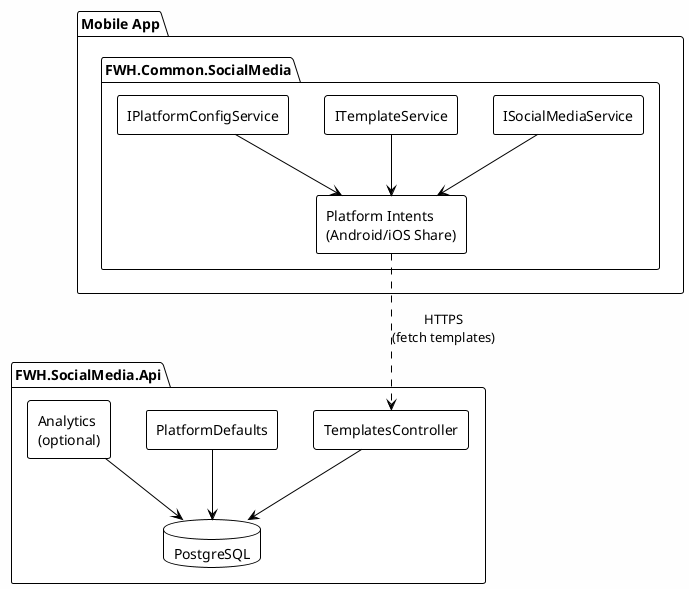
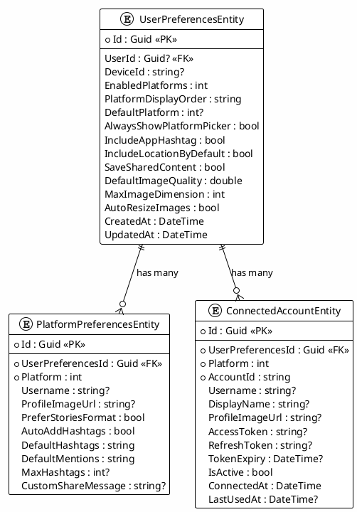
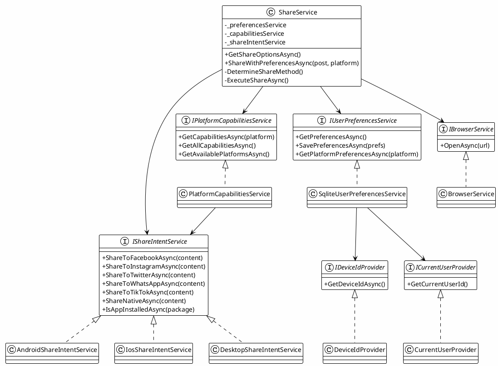
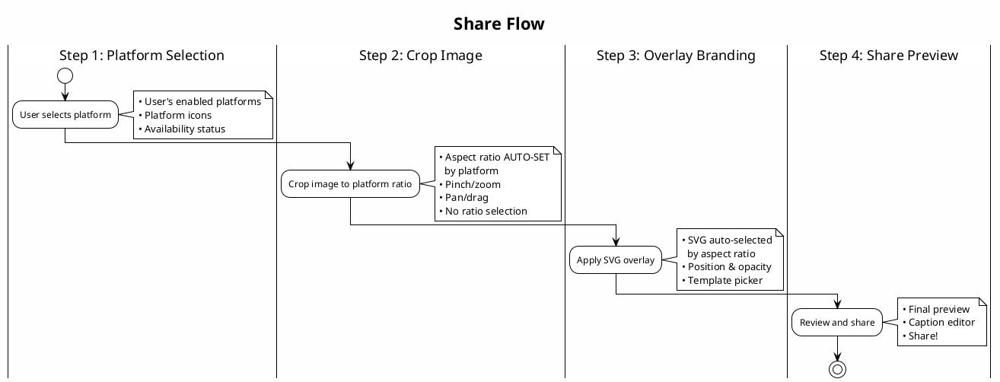
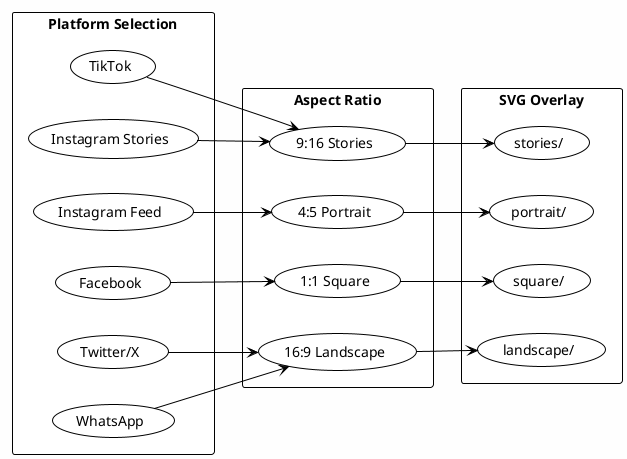

add missing UI components
# MVP-APP-001: SocialMediaService Library Implementation Plan

## Overview

Create a SocialMediaService library for client-side social media sharing operations, with an accompanying SocialMediaApi for distributing templates and platform defaults to mobile apps.

**Estimate:** 160-200 hours (20-25 days)

---

## Goals

1. Enable users to share content (photos, activities, locations) to social media platforms
2. Provide pre-configured defaults for major social media platforms
3. Support customizable sharing templates with placeholders
4. Distribute templates via API for easy updates without app releases
5. Client-side only sharing (no server-side posting)

---

## MVP Scope Constraints

### Images Only (No Video in MVP)

| Supported | Not Supported (Future) |
|-----------|------------------------|
| Single image sharing | Video recording |
| Image with branding overlay | Video compression |
| Photo slideshow (TikTok) | Video editing |
| Image cropping/resizing | Multi-video posts |

**Rationale:** Video compression requires significant development effort and platform-specific codecs. MVP focuses on image sharing which covers the primary use case.

### TikTok Photo Slideshow

For TikTok, MVP shares a **single image as a photo slideshow**:
- TikTok converts static images into short video slideshows
- User can add music/effects in TikTok's editor
- No video compression needed on our side
- Opens TikTok editor with image pre-loaded

```
MVP Flow for TikTok:
┌─────────────┐    ┌─────────────┐    ┌─────────────┐
│ Single      │ -> │ Apply       │ -> │ TikTok      │
│ Image       │    │ Branding    │    │ Slideshow   │
│             │    │ Overlay     │    │ Editor      │
└─────────────┘    └─────────────┘    └─────────────┘
```

### Stories Format

For Instagram Stories, Facebook Stories, and WhatsApp Status:
- Single image with 9:16 aspect ratio
- Branding overlay applied
- Native stories intent opens platform editor

---

## Architecture

### Components



### Key Design Decisions

| Decision | Rationale |
|----------|-----------|
| Client-side sharing | Privacy - app never has user's social media credentials |
| Templates from API | Update sharing formats without app releases |
| Fallback defaults | App works offline with embedded defaults |
| Platform intents | Native share sheets for best UX |

---

## Supported Platforms

### Phase 1 (MVP)

| Platform | Share Types | Intent/Scheme |
|----------|-------------|---------------|
| Facebook | Text, Image, Link | `fb://` / Share Intent |
| Instagram | Image, Story | `instagram://` / Share Intent |
| X (Twitter) | Text, Image, Link | `twitter://` / Share Intent |
| WhatsApp | Text, Image | `whatsapp://` / Share Intent |
| TikTok | Video, Image | `snssdk1233://` / Share Intent |
| Native Share | All | System share sheet |

### Phase 2 (Future)

- LinkedIn
- Pinterest
- Snapchat
- Threads

---

## Project Structure

### FWH.Common.SocialMedia (Client Library)

```
src/FWH.Common.SocialMedia/
├── FWH.Common.SocialMedia.csproj
├── Extensions/
│   └── SocialMediaServiceCollectionExtensions.cs
├── Configuration/
│   ├── SocialMediaOptions.cs
│   └── PlatformDefaults.cs
├── Models/
│   ├── ShareContent.cs
│   ├── ShareResult.cs
│   ├── SocialMediaPlatform.cs
│   ├── SocialMediaPost.cs
│   ├── ShareTemplate.cs
│   ├── PlaceholderToken.cs
│   ├── PlatformCapabilities.cs
│   ├── UserSocialMediaPreferences.cs
│   └── PlatformPreferences.cs
├── Data/
│   ├── SocialMediaDbContext.cs
│   ├── Entities/
│   │   ├── UserPreferencesEntity.cs
│   │   ├── PlatformPreferencesEntity.cs
│   │   └── ConnectedAccountEntity.cs
│   ├── Configurations/
│   │   ├── UserPreferencesConfiguration.cs
│   │   └── PlatformPreferencesConfiguration.cs
│   └── Migrations/
│       └── (EF Core migrations)
├── Services/
│   ├── ISocialMediaService.cs
│   ├── SocialMediaService.cs
│   ├── ITemplateService.cs
│   ├── TemplateService.cs
│   ├── IPlatformConfigService.cs
│   ├── PlatformConfigService.cs
│   ├── IPlatformCapabilitiesService.cs
│   ├── PlatformCapabilitiesService.cs
│   ├── IUserPreferencesService.cs
│   ├── SqliteUserPreferencesService.cs
│   └── IShareIntentService.cs
├── Templates/
│   ├── ITemplateRenderer.cs
│   └── TemplateRenderer.cs
├── Preferences/
│   └── UserPreferencesFactory.cs
└── Platforms/
    ├── IPlatformShareHandler.cs
    ├── AndroidShareHandler.cs
    ├── IosShareHandler.cs
    └── DesktopShareHandler.cs
```

### FWH.SocialMedia.Api

```
src/FWH.SocialMedia.Api/
├── FWH.SocialMedia.Api.csproj
├── Program.cs
├── appsettings.json
├── appsettings.Development.json
├── appsettings.Staging.json
├── Controllers/
│   ├── TemplatesController.cs              # Template CRUD endpoints
│   └── PlatformsController.cs              # Platform config endpoints
├── Data/
│   ├── SocialMediaDbContext.cs             # EF Core context with seeding
│   ├── Entities/
│   │   ├── TemplateEntity.cs
│   │   └── DeletedTemplateEntity.cs
│   └── Migrations/
│       └── (EF Core migrations)
├── Models/
│   ├── DTOs/
│   │   ├── TemplateDto.cs
│   │   ├── TemplatesResponse.cs
│   │   ├── PlatformConfigDto.cs
│   │   ├── PlatformsResponse.cs
│   │   └── ImageSizeDto.cs
│   └── Enums/
│       └── SocialMediaPlatform.cs
├── Services/
│   ├── ITemplateRepository.cs
│   └── TemplateRepository.cs
├── Middleware/
│   └── ApiKeyAuthenticationMiddleware.cs
├── Dockerfile
└── Properties/
    └── launchSettings.json
```

### Test Projects

```
tests/
├── FWH.Common.SocialMedia.Tests/
│   ├── TemplateServiceTests.cs
│   ├── TemplateRendererTests.cs
│   ├── PlatformConfigServiceTests.cs
│   ├── PlatformCapabilitiesServiceTests.cs
│   ├── UserPreferencesServiceTests.cs
│   ├── ShareServiceTests.cs
│   └── SocialMediaServiceTests.cs
└── FWH.SocialMedia.Api.Tests/
    ├── TemplatesControllerTests.cs
    ├── PlatformsControllerTests.cs
    └── CustomWebApplicationFactory.cs
```

---

## Data Models

### SocialMediaPost (Universal Post Object)

A comprehensive object that can represent any social media post across all platforms.

```csharp
/// <summary>
/// Represents a social media post with all possible content types.
/// Designed to be platform-agnostic and serializable for API transport.
/// </summary>
public record SocialMediaPost
{
    /// <summary>
    /// Unique identifier for tracking/analytics.
    /// </summary>
    public Guid Id { get; init; } = Guid.NewGuid();

    /// <summary>
    /// Primary text content/description of the post.
    /// </summary>
    public string? Description { get; init; }

    /// <summary>
    /// Optional title or headline (used by LinkedIn, Facebook articles, etc.).
    /// </summary>
    public string? Title { get; init; }

    /// <summary>
    /// Keywords/hashtags without the # symbol.
    /// Example: ["FunWasHad", "Travel", "Austin"]
    /// </summary>
    public IReadOnlyList<string> Keywords { get; init; } = [];

    /// <summary>
    /// User mentions without the @ symbol.
    /// Example: ["username", "businesspage"]
    /// </summary>
    public IReadOnlyList<string> Mentions { get; init; } = [];

    /// <summary>
    /// Attached images.
    /// </summary>
    public IReadOnlyList<MediaAttachment> Images { get; init; } = [];

    /// <summary>
    /// Attached videos.
    /// </summary>
    public IReadOnlyList<MediaAttachment> Videos { get; init; } = [];

    /// <summary>
    /// Primary URL to share (link posts).
    /// </summary>
    public Uri? Url { get; init; }

    /// <summary>
    /// Additional URLs referenced in the post.
    /// </summary>
    public IReadOnlyList<Uri> AdditionalUrls { get; init; } = [];

    /// <summary>
    /// Location information for geo-tagged posts.
    /// </summary>
    public PostLocation? Location { get; init; }

    /// <summary>
    /// Target platform (if known). Null for native share sheet.
    /// </summary>
    public SocialMediaPlatform? TargetPlatform { get; init; }

    /// <summary>
    /// Template placeholders for dynamic content rendering.
    /// </summary>
    public IReadOnlyDictionary<string, string> Placeholders { get; init; } =
        new Dictionary<string, string>();

    /// <summary>
    /// Platform-specific metadata (JSON-serializable).
    /// </summary>
    public IReadOnlyDictionary<string, object> PlatformMetadata { get; init; } =
        new Dictionary<string, object>();

    /// <summary>
    /// When the post was created locally.
    /// </summary>
    public DateTimeOffset CreatedAt { get; init; } = DateTimeOffset.UtcNow;

    /// <summary>
    /// Optional scheduled publish time.
    /// </summary>
    public DateTimeOffset? ScheduledAt { get; init; }
}

/// <summary>
/// Represents an image or video attachment.
/// </summary>
public record MediaAttachment
{
    /// <summary>
    /// Unique identifier for the attachment.
    /// </summary>
    public Guid Id { get; init; } = Guid.NewGuid();

    /// <summary>
    /// Media type.
    /// </summary>
    public required MediaType Type { get; init; }

    /// <summary>
    /// Local file path (for local files).
    /// </summary>
    public string? FilePath { get; init; }

    /// <summary>
    /// Remote URL (for already-uploaded media).
    /// </summary>
    public Uri? RemoteUrl { get; init; }

    /// <summary>
    /// Raw bytes (for in-memory media).
    /// </summary>
    public byte[]? Data { get; init; }

    /// <summary>
    /// MIME type (e.g., "image/jpeg", "video/mp4").
    /// </summary>
    public string? MimeType { get; init; }

    /// <summary>
    /// Original filename.
    /// </summary>
    public string? FileName { get; init; }

    /// <summary>
    /// File size in bytes.
    /// </summary>
    public long? FileSize { get; init; }

    /// <summary>
    /// Width in pixels (images/videos).
    /// </summary>
    public int? Width { get; init; }

    /// <summary>
    /// Height in pixels (images/videos).
    /// </summary>
    public int? Height { get; init; }

    /// <summary>
    /// Duration in seconds (videos/audio).
    /// </summary>
    public double? DurationSeconds { get; init; }

    /// <summary>
    /// Alt text for accessibility.
    /// </summary>
    public string? AltText { get; init; }

    /// <summary>
    /// Thumbnail for videos.
    /// </summary>
    public MediaAttachment? Thumbnail { get; init; }

    /// <summary>
    /// Display order (0-based).
    /// </summary>
    public int Order { get; init; }
}

/// <summary>
/// Media type enumeration.
/// </summary>
public enum MediaType
{
    Image,
    Video,
    Gif,
    Audio
}

/// <summary>
/// Location information for geo-tagged posts.
/// </summary>
public record PostLocation
{
    /// <summary>
    /// Latitude coordinate.
    /// </summary>
    public double Latitude { get; init; }

    /// <summary>
    /// Longitude coordinate.
    /// </summary>
    public double Longitude { get; init; }

    /// <summary>
    /// Human-readable place name.
    /// </summary>
    public string? PlaceName { get; init; }

    /// <summary>
    /// Business or venue name.
    /// </summary>
    public string? VenueName { get; init; }

    /// <summary>
    /// Street address.
    /// </summary>
    public string? Address { get; init; }

    /// <summary>
    /// City name.
    /// </summary>
    public string? City { get; init; }

    /// <summary>
    /// State/province/region.
    /// </summary>
    public string? Region { get; init; }

    /// <summary>
    /// Country name.
    /// </summary>
    public string? Country { get; init; }

    /// <summary>
    /// Postal/ZIP code.
    /// </summary>
    public string? PostalCode { get; init; }

    /// <summary>
    /// Platform-specific place ID (Facebook Place ID, Google Place ID, etc.).
    /// </summary>
    public string? PlaceId { get; init; }
}
```

### Usage Examples

```csharp
// Simple text post with hashtags
var textPost = new SocialMediaPost
{
    Description = "Had an amazing lunch today!",
    Keywords = ["FunWasHad", "Foodie", "Austin"],
    Location = new PostLocation
    {
        PlaceName = "Joe's Cafe",
        City = "Austin",
        Latitude = 30.2672,
        Longitude = -97.7431
    }
};

// Photo post with multiple images
var photoPost = new SocialMediaPost
{
    Description = "Beautiful sunset at the lake",
    Keywords = ["Sunset", "Nature", "Photography"],
    Images =
    [
        new MediaAttachment
        {
            Type = MediaType.Image,
            FilePath = "/storage/photos/sunset1.jpg",
            MimeType = "image/jpeg",
            AltText = "Orange sunset over the lake",
            Order = 0
        },
        new MediaAttachment
        {
            Type = MediaType.Image,
            FilePath = "/storage/photos/sunset2.jpg",
            MimeType = "image/jpeg",
            AltText = "Silhouette of trees against sunset",
            Order = 1
        }
    ]
};

// Video post with thumbnail
var videoPost = new SocialMediaPost
{
    Title = "My Trip to Austin",
    Description = "Highlights from my weekend adventure!",
    Keywords = ["Travel", "Austin", "Vlog"],
    Videos =
    [
        new MediaAttachment
        {
            Type = MediaType.Video,
            FilePath = "/storage/videos/austin-trip.mp4",
            MimeType = "video/mp4",
            DurationSeconds = 120.5,
            Width = 1920,
            Height = 1080,
            Thumbnail = new MediaAttachment
            {
                Type = MediaType.Image,
                FilePath = "/storage/videos/austin-trip-thumb.jpg",
                MimeType = "image/jpeg"
            }
        }
    ],
    Url = new Uri("https://funwashad.app/trips/austin-2026")
};

// Link share with preview
var linkPost = new SocialMediaPost
{
    Title = "Check out this amazing restaurant!",
    Description = "Best tacos I've ever had. Highly recommend!",
    Url = new Uri("https://funwashad.app/places/joes-tacos"),
    Keywords = ["Tacos", "Austin", "FoodReview"],
    Location = new PostLocation
    {
        VenueName = "Joe's Tacos",
        City = "Austin",
        Region = "TX"
    }
};

// Post with template placeholders
var templatePost = new SocialMediaPost
{
    Description = "{{activity}} at {{location}} - {{rating}} stars!",
    Placeholders = new Dictionary<string, string>
    {
        ["activity"] = "Had dinner",
        ["location"] = "The Steakhouse",
        ["rating"] = "4.5"
    },
    Keywords = ["FunWasHad", "{{city}}"],
    TargetPlatform = SocialMediaPlatform.Instagram
};
```

### ShareContent (Simplified for backward compatibility)

### ShareTemplate

```csharp
public record ShareTemplate
{
    public Guid Id { get; init; }
    public required string Name { get; init; }
    public required string Platform { get; init; }  // "facebook", "instagram", etc.
    public required string Category { get; init; }  // "activity", "location", "photo"
    public required string TextTemplate { get; init; }
    public string? HashtagTemplate { get; init; }
    public int MaxTextLength { get; init; }
    public bool SupportsImages { get; init; }
    public bool SupportsLinks { get; init; }
    public DateTime CreatedAt { get; init; }
    public DateTime UpdatedAt { get; init; }
}
```

### SocialMediaPlatform

```csharp
/// <summary>
/// Social media platforms supported for sharing.
/// Defined as flags to allow multiple platform selection.
/// </summary>
[Flags]
public enum SocialMediaPlatform
{
    /// <summary>No platform selected.</summary>
    None = 0,

    /// <summary>System native share sheet.</summary>
    Native = 1 << 0,       // 1

    /// <summary>Facebook.</summary>
    Facebook = 1 << 1,     // 2

    /// <summary>Instagram (Feed and Stories).</summary>
    Instagram = 1 << 2,    // 4

    /// <summary>X (formerly Twitter).</summary>
    Twitter = 1 << 3,      // 8

    /// <summary>WhatsApp.</summary>
    WhatsApp = 1 << 4,     // 16

    /// <summary>TikTok.</summary>
    TikTok = 1 << 5,       // 32

    /// <summary>LinkedIn (Phase 2).</summary>
    LinkedIn = 1 << 6,     // 64

    /// <summary>Pinterest (Phase 2).</summary>
    Pinterest = 1 << 7,    // 128

    /// <summary>Snapchat (Phase 2).</summary>
    Snapchat = 1 << 8,     // 256

    /// <summary>Threads (Phase 2).</summary>
    Threads = 1 << 9,      // 512

    // ─────────────────────────────────────────────────────────────────
    // Common Combinations
    // ─────────────────────────────────────────────────────────────────

    /// <summary>All Phase 1 platforms.</summary>
    Phase1 = Native | Facebook | Instagram | Twitter | WhatsApp | TikTok,

    /// <summary>All Phase 2 platforms.</summary>
    Phase2 = LinkedIn | Pinterest | Snapchat | Threads,

    /// <summary>All supported platforms.</summary>
    All = Phase1 | Phase2,

    /// <summary>Platforms that support direct image sharing.</summary>
    ImagePlatforms = Facebook | Instagram | Twitter | WhatsApp | TikTok | Pinterest | Snapchat | Native,

    /// <summary>Platforms that support video sharing.</summary>
    VideoPlatforms = Facebook | Instagram | Twitter | WhatsApp | TikTok | Snapchat | Native,

    /// <summary>Platforms that support Stories/Status format.</summary>
    StoriesPlatforms = Facebook | Instagram | WhatsApp | TikTok | Snapchat,

    /// <summary>Platforms with web fallback (don't require app installed).</summary>
    WebFallbackPlatforms = Facebook | Twitter | WhatsApp,

    /// <summary>Platforms requiring SDK integration.</summary>
    SdkPlatforms = Facebook | TikTok,

    /// <summary>Meta platforms (shared SDK/App ID).</summary>
    MetaPlatforms = Facebook | Instagram | Threads
}

/// <summary>
/// Extension methods for SocialMediaPlatform flags.
/// </summary>
public static class SocialMediaPlatformExtensions
{
    /// <summary>
    /// Get individual platforms from a flags combination.
    /// </summary>
    public static IEnumerable<SocialMediaPlatform> GetIndividualPlatforms(
        this SocialMediaPlatform platforms)
    {
        foreach (SocialMediaPlatform platform in Enum.GetValues<SocialMediaPlatform>())
        {
            // Skip None and combination flags
            if (platform == SocialMediaPlatform.None ||
                platform == SocialMediaPlatform.Phase1 ||
                platform == SocialMediaPlatform.Phase2 ||
                platform == SocialMediaPlatform.All ||
                platform == SocialMediaPlatform.ImagePlatforms ||
                platform == SocialMediaPlatform.VideoPlatforms ||
                platform == SocialMediaPlatform.StoriesPlatforms ||
                platform == SocialMediaPlatform.WebFallbackPlatforms ||
                platform == SocialMediaPlatform.SdkPlatforms ||
                platform == SocialMediaPlatform.MetaPlatforms)
            {
                continue;
            }

            if (platforms.HasFlag(platform))
            {
                yield return platform;
            }
        }
    }

    /// <summary>
    /// Check if this is a single platform (not a combination).
    /// </summary>
    public static bool IsSinglePlatform(this SocialMediaPlatform platform)
    {
        if (platform == SocialMediaPlatform.None) return false;
        return (platform & (platform - 1)) == 0; // Power of 2 check
    }

    /// <summary>
    /// Count how many platforms are selected.
    /// </summary>
    public static int Count(this SocialMediaPlatform platforms)
    {
        return platforms.GetIndividualPlatforms().Count();
    }

    /// <summary>
    /// Get display name for a single platform.
    /// </summary>
    public static string GetDisplayName(this SocialMediaPlatform platform)
    {
        return platform switch
        {
            SocialMediaPlatform.Native => "Share",
            SocialMediaPlatform.Facebook => "Facebook",
            SocialMediaPlatform.Instagram => "Instagram",
            SocialMediaPlatform.Twitter => "X",
            SocialMediaPlatform.WhatsApp => "WhatsApp",
            SocialMediaPlatform.TikTok => "TikTok",
            SocialMediaPlatform.LinkedIn => "LinkedIn",
            SocialMediaPlatform.Pinterest => "Pinterest",
            SocialMediaPlatform.Snapchat => "Snapchat",
            SocialMediaPlatform.Threads => "Threads",
            _ => platform.ToString()
        };
    }

    /// <summary>
    /// Check if platform supports a specific feature.
    /// </summary>
    public static bool SupportsImages(this SocialMediaPlatform platform)
        => SocialMediaPlatform.ImagePlatforms.HasFlag(platform);

    public static bool SupportsVideos(this SocialMediaPlatform platform)
        => SocialMediaPlatform.VideoPlatforms.HasFlag(platform);

    public static bool SupportsStories(this SocialMediaPlatform platform)
        => SocialMediaPlatform.StoriesPlatforms.HasFlag(platform);

    public static bool HasWebFallback(this SocialMediaPlatform platform)
        => SocialMediaPlatform.WebFallbackPlatforms.HasFlag(platform);

    public static bool RequiresSdk(this SocialMediaPlatform platform)
        => SocialMediaPlatform.SdkPlatforms.HasFlag(platform);

    public static bool IsMetaPlatform(this SocialMediaPlatform platform)
        => SocialMediaPlatform.MetaPlatforms.HasFlag(platform);
}
```

### Usage Examples (Flags)

```csharp
// User preferences - enable multiple platforms
var enabledPlatforms = SocialMediaPlatform.Instagram |
                       SocialMediaPlatform.TikTok |
                       SocialMediaPlatform.Twitter;

// Check if a platform is enabled
if (enabledPlatforms.HasFlag(SocialMediaPlatform.Instagram))
{
    // Instagram is enabled
}

// Add a platform
enabledPlatforms |= SocialMediaPlatform.Facebook;

// Remove a platform
enabledPlatforms &= ~SocialMediaPlatform.Twitter;

// Get all individual platforms as a list
var platformList = enabledPlatforms.GetIndividualPlatforms().ToList();
// Result: [Instagram, TikTok, Facebook]

// Check platform capabilities
if (SocialMediaPlatform.TikTok.SupportsStories())
{
    // Show Stories option
}

// Filter to only platforms with web fallback
var webPlatforms = enabledPlatforms & SocialMediaPlatform.WebFallbackPlatforms;

// Check if user has any video platforms enabled
var hasVideoPlatform = (enabledPlatforms & SocialMediaPlatform.VideoPlatforms) != SocialMediaPlatform.None;

// Use Phase 1 as default enabled platforms
var defaultEnabled = SocialMediaPlatform.Phase1;
```

### PlatformConfig

```csharp
public record PlatformConfig
{
    public required SocialMediaPlatform Platform { get; init; }
    public required string DisplayName { get; init; }
    public string? IconUrl { get; init; }
    public string? PackageName { get; init; }      // Android
    public string? UrlScheme { get; init; }        // iOS deep link
    public int MaxTextLength { get; init; }
    public bool SupportsImages { get; init; }
    public bool SupportsVideos { get; init; }
    public bool SupportsLinks { get; init; }
    public bool SupportsHashtags { get; init; }
    public bool IsEnabled { get; init; } = true;
}
```

### PlatformCapabilities

A comprehensive object describing what a platform supports, used to drive UI behavior and content validation.

```csharp
/// <summary>
/// Describes the capabilities of a social media platform.
/// Used to dynamically enable/disable UI features and validate content before sharing.
/// </summary>
public record PlatformCapabilities
{
    /// <summary>
    /// The platform these capabilities apply to.
    /// </summary>
    public required SocialMediaPlatform Platform { get; init; }

    /// <summary>
    /// Display name for the platform.
    /// </summary>
    public required string DisplayName { get; init; }

    /// <summary>
    /// Whether the platform app is currently installed on the device.
    /// </summary>
    public bool IsInstalled { get; init; }

    /// <summary>
    /// Whether sharing to this platform is currently available.
    /// False if app not installed and no web fallback exists.
    /// </summary>
    public bool IsAvailable { get; init; }

    /// <summary>
    /// Whether a web fallback is available when app is not installed.
    /// </summary>
    public bool HasWebFallback { get; init; }

    // ─────────────────────────────────────────────────────────────────
    // Content Support
    // ─────────────────────────────────────────────────────────────────

    /// <summary>
    /// Whether the platform supports text/description content.
    /// </summary>
    public bool SupportsText { get; init; }

    /// <summary>
    /// Whether text can be pre-filled by the app (some platforms prohibit this).
    /// </summary>
    public bool AllowsPrefilledText { get; init; }

    /// <summary>
    /// Whether the platform supports a title field (separate from description).
    /// </summary>
    public bool SupportsTitle { get; init; }

    /// <summary>
    /// Whether the platform supports hashtags.
    /// </summary>
    public bool SupportsHashtags { get; init; }

    /// <summary>
    /// Whether hashtags are clickable/searchable on the platform.
    /// </summary>
    public bool HashtagsClickable { get; init; }

    /// <summary>
    /// Whether the platform supports @mentions.
    /// </summary>
    public bool SupportsMentions { get; init; }

    /// <summary>
    /// Whether mentions are clickable/linkable on the platform.
    /// </summary>
    public bool MentionsClickable { get; init; }

    /// <summary>
    /// Whether the platform supports sharing URLs/links.
    /// </summary>
    public bool SupportsLinks { get; init; }

    /// <summary>
    /// Whether shared links generate a preview card.
    /// </summary>
    public bool SupportsLinkPreview { get; init; }

    // ─────────────────────────────────────────────────────────────────
    // Media Support
    // ─────────────────────────────────────────────────────────────────

    /// <summary>
    /// Whether the platform supports image attachments.
    /// </summary>
    public bool SupportsImages { get; init; }

    /// <summary>
    /// Whether the platform supports multiple images in a single post.
    /// </summary>
    public bool SupportsMultipleImages { get; init; }

    /// <summary>
    /// Whether the platform supports video attachments.
    /// </summary>
    public bool SupportsVideos { get; init; }

    /// <summary>
    /// Whether the platform supports GIF animations.
    /// </summary>
    public bool SupportsGifs { get; init; }

    /// <summary>
    /// Whether the platform supports Stories/Status format.
    /// </summary>
    public bool SupportsStories { get; init; }

    /// <summary>
    /// Whether the platform supports sticker overlays.
    /// </summary>
    public bool SupportsStickers { get; init; }

    /// <summary>
    /// Whether the platform supports location/geo tagging.
    /// </summary>
    public bool SupportsLocation { get; init; }

    /// <summary>
    /// Whether the platform supports adding music/sounds.
    /// </summary>
    public bool SupportsMusic { get; init; }

    /// <summary>
    /// Whether the platform supports alt text for accessibility.
    /// </summary>
    public bool SupportsAltText { get; init; }

    // ─────────────────────────────────────────────────────────────────
    // Platform-Specific Features
    // ─────────────────────────────────────────────────────────────────

    /// <summary>
    /// Whether the platform opens an editor before posting (e.g., TikTok).
    /// </summary>
    public bool RequiresUserEdit { get; init; }

    /// <summary>
    /// Whether an SDK is required for sharing (vs. simple intents).
    /// </summary>
    public bool RequiresSdk { get; init; }

    /// <summary>
    /// Whether an App ID is required for sharing.
    /// </summary>
    public bool RequiresAppId { get; init; }

    /// <summary>
    /// Whether a Content Provider is required for media sharing (Android).
    /// </summary>
    public bool RequiresContentProvider { get; init; }

    /// <summary>
    /// Special share formats supported (e.g., "GreenScreen" for TikTok).
    /// </summary>
    public IReadOnlyList<string> SpecialFormats { get; init; } = [];

    // ─────────────────────────────────────────────────────────────────
    // Constraints
    // ─────────────────────────────────────────────────────────────────

    /// <summary>
    /// Text/caption constraints for this platform.
    /// </summary>
    public required TextConstraints Text { get; init; }

    /// <summary>
    /// Image constraints for this platform.
    /// </summary>
    public required ImageConstraints Image { get; init; }

    /// <summary>
    /// Video constraints for this platform.
    /// </summary>
    public required VideoConstraints Video { get; init; }

    // ─────────────────────────────────────────────────────────────────
    // Platform Identifiers
    // ─────────────────────────────────────────────────────────────────

    /// <summary>
    /// Android package name for the platform's app.
    /// </summary>
    public string? AndroidPackage { get; init; }

    /// <summary>
    /// iOS URL scheme for the platform.
    /// </summary>
    public string? IosUrlScheme { get; init; }

    /// <summary>
    /// iOS bundle identifier for the platform's app.
    /// </summary>
    public string? IosBundleId { get; init; }

    /// <summary>
    /// Web fallback URL pattern (if available).
    /// </summary>
    public string? WebFallbackUrl { get; init; }
}

/// <summary>
/// Text/caption constraints for a platform.
/// </summary>
public record TextConstraints
{
    /// <summary>
    /// Maximum character length for text content.
    /// </summary>
    public int MaxLength { get; init; }

    /// <summary>
    /// Maximum number of hashtags allowed.
    /// </summary>
    public int MaxHashtags { get; init; }

    /// <summary>
    /// Recommended number of hashtags for best engagement.
    /// </summary>
    public int RecommendedHashtags { get; init; }

    /// <summary>
    /// Maximum number of mentions allowed.
    /// </summary>
    public int MaxMentions { get; init; }

    /// <summary>
    /// Whether emojis are supported in text.
    /// </summary>
    public bool SupportsEmoji { get; init; } = true;

    /// <summary>
    /// Whether line breaks are preserved.
    /// </summary>
    public bool SupportsLineBreaks { get; init; } = true;
}

/// <summary>
/// Image constraints for a platform.
/// </summary>
public record ImageConstraints
{
    /// <summary>
    /// Maximum number of images per post.
    /// </summary>
    public int MaxCount { get; init; }

    /// <summary>
    /// Maximum file size in bytes.
    /// </summary>
    public long MaxFileSize { get; init; }

    /// <summary>
    /// Minimum width in pixels.
    /// </summary>
    public int MinWidth { get; init; }

    /// <summary>
    /// Minimum height in pixels.
    /// </summary>
    public int MinHeight { get; init; }

    /// <summary>
    /// Recommended width in pixels.
    /// </summary>
    public int RecommendedWidth { get; init; }

    /// <summary>
    /// Recommended height in pixels.
    /// </summary>
    public int RecommendedHeight { get; init; }

    /// <summary>
    /// Recommended aspect ratio (e.g., "9:16", "1:1", "16:9").
    /// </summary>
    public string RecommendedAspectRatio { get; init; } = "1:1";

    /// <summary>
    /// Supported aspect ratios.
    /// </summary>
    public IReadOnlyList<string> SupportedAspectRatios { get; init; } = [];

    /// <summary>
    /// Supported MIME types (e.g., "image/jpeg", "image/png").
    /// </summary>
    public IReadOnlyList<string> SupportedFormats { get; init; } = [];
}

/// <summary>
/// Video constraints for a platform.
/// </summary>
public record VideoConstraints
{
    /// <summary>
    /// Maximum number of videos per post.
    /// </summary>
    public int MaxCount { get; init; }

    /// <summary>
    /// Maximum file size in bytes.
    /// </summary>
    public long MaxFileSize { get; init; }

    /// <summary>
    /// Minimum duration in seconds.
    /// </summary>
    public int MinDurationSeconds { get; init; }

    /// <summary>
    /// Maximum duration in seconds.
    /// </summary>
    public int MaxDurationSeconds { get; init; }

    /// <summary>
    /// Minimum width in pixels.
    /// </summary>
    public int MinWidth { get; init; }

    /// <summary>
    /// Minimum height in pixels.
    /// </summary>
    public int MinHeight { get; init; }

    /// <summary>
    /// Recommended width in pixels.
    /// </summary>
    public int RecommendedWidth { get; init; }

    /// <summary>
    /// Recommended height in pixels.
    /// </summary>
    public int RecommendedHeight { get; init; }

    /// <summary>
    /// Recommended aspect ratio.
    /// </summary>
    public string RecommendedAspectRatio { get; init; } = "9:16";

    /// <summary>
    /// Supported aspect ratios.
    /// </summary>
    public IReadOnlyList<string> SupportedAspectRatios { get; init; } = [];

    /// <summary>
    /// Supported MIME types (e.g., "video/mp4", "video/quicktime").
    /// </summary>
    public IReadOnlyList<string> SupportedFormats { get; init; } = [];

    /// <summary>
    /// Recommended video codec.
    /// </summary>
    public string RecommendedCodec { get; init; } = "H.264";

    /// <summary>
    /// Recommended frame rate.
    /// </summary>
    public int RecommendedFrameRate { get; init; } = 30;

    /// <summary>
    /// Maximum frame rate.
    /// </summary>
    public int MaxFrameRate { get; init; } = 60;
}
```

### IPlatformCapabilitiesService

```csharp
/// <summary>
/// Service for retrieving platform capabilities.
/// </summary>
public interface IPlatformCapabilitiesService
{
    /// <summary>
    /// Get capabilities for a specific platform.
    /// </summary>
    Task<PlatformCapabilities> GetCapabilitiesAsync(
        SocialMediaPlatform platform,
        CancellationToken cancellationToken = default);

    /// <summary>
    /// Get capabilities for all available platforms.
    /// </summary>
    Task<IReadOnlyList<PlatformCapabilities>> GetAllCapabilitiesAsync(
        CancellationToken cancellationToken = default);

    /// <summary>
    /// Get only platforms that are currently available (installed or have web fallback).
    /// </summary>
    Task<IReadOnlyList<PlatformCapabilities>> GetAvailablePlatformsAsync(
        CancellationToken cancellationToken = default);

    /// <summary>
    /// Refresh platform availability (re-check installed apps).
    /// </summary>
    Task RefreshAvailabilityAsync(CancellationToken cancellationToken = default);
}
```

### Pre-configured Platform Capabilities

```csharp
public static class PlatformCapabilitiesDefaults
{
    public static PlatformCapabilities Facebook => new()
    {
        Platform = SocialMediaPlatform.Facebook,
        DisplayName = "Facebook",
        IsInstalled = false, // Set at runtime
        IsAvailable = true,
        HasWebFallback = true,

        // Content
        SupportsText = true,
        AllowsPrefilledText = false, // Policy restriction
        SupportsTitle = true,
        SupportsHashtags = true,
        HashtagsClickable = true,
        SupportsMentions = true,
        MentionsClickable = true,
        SupportsLinks = true,
        SupportsLinkPreview = true,

        // Media
        SupportsImages = true,
        SupportsMultipleImages = true,
        SupportsVideos = true,
        SupportsGifs = true,
        SupportsStories = true,
        SupportsStickers = false,
        SupportsLocation = true,
        SupportsMusic = false,
        SupportsAltText = true,

        // Platform
        RequiresUserEdit = false,
        RequiresSdk = true,
        RequiresAppId = true,
        RequiresContentProvider = true,
        SpecialFormats = [],

        // Identifiers
        AndroidPackage = "com.facebook.katana",
        IosUrlScheme = "fb",
        IosBundleId = "com.facebook.Facebook",
        WebFallbackUrl = "https://www.facebook.com/sharer/sharer.php?u={url}",

        // Constraints
        Text = new TextConstraints
        {
            MaxLength = 63206,
            MaxHashtags = 30,
            RecommendedHashtags = 3,
            MaxMentions = 50
        },
        Image = new ImageConstraints
        {
            MaxCount = 6,
            MaxFileSize = 8 * 1024 * 1024,
            MinWidth = 600,
            MinHeight = 315,
            RecommendedWidth = 1200,
            RecommendedHeight = 630,
            RecommendedAspectRatio = "1.91:1",
            SupportedAspectRatios = ["1:1", "4:5", "1.91:1", "9:16"],
            SupportedFormats = ["image/jpeg", "image/png", "image/gif"]
        },
        Video = new VideoConstraints
        {
            MaxCount = 1,
            MaxFileSize = 4L * 1024 * 1024 * 1024,
            MinDurationSeconds = 1,
            MaxDurationSeconds = 14400, // 240 min
            MinWidth = 600,
            MinHeight = 315,
            RecommendedWidth = 1920,
            RecommendedHeight = 1080,
            RecommendedAspectRatio = "16:9",
            SupportedAspectRatios = ["16:9", "1:1", "4:5", "9:16"],
            SupportedFormats = ["video/mp4", "video/quicktime"]
        }
    };

    public static PlatformCapabilities Instagram => new()
    {
        Platform = SocialMediaPlatform.Instagram,
        DisplayName = "Instagram",
        IsInstalled = false,
        IsAvailable = false, // Requires app
        HasWebFallback = false,

        // Content
        SupportsText = true,
        AllowsPrefilledText = false,
        SupportsTitle = false,
        SupportsHashtags = true,
        HashtagsClickable = true,
        SupportsMentions = true,
        MentionsClickable = true,
        SupportsLinks = false, // Bio link only
        SupportsLinkPreview = false,

        // Media
        SupportsImages = true,
        SupportsMultipleImages = true,
        SupportsVideos = true,
        SupportsGifs = false,
        SupportsStories = true,
        SupportsStickers = true,
        SupportsLocation = true,
        SupportsMusic = true,
        SupportsAltText = true,

        // Platform
        RequiresUserEdit = false,
        RequiresSdk = false,
        RequiresAppId = true, // For Stories
        RequiresContentProvider = true,
        SpecialFormats = ["Stories", "Reels"],

        // Identifiers
        AndroidPackage = "com.instagram.android",
        IosUrlScheme = "instagram",
        IosBundleId = "com.burbn.instagram",
        WebFallbackUrl = null,

        // Constraints
        Text = new TextConstraints
        {
            MaxLength = 2200,
            MaxHashtags = 30,
            RecommendedHashtags = 5,
            MaxMentions = 20
        },
        Image = new ImageConstraints
        {
            MaxCount = 10,
            MaxFileSize = 30 * 1024 * 1024,
            MinWidth = 640,
            MinHeight = 640,
            RecommendedWidth = 1080,
            RecommendedHeight = 1080,
            RecommendedAspectRatio = "1:1",
            SupportedAspectRatios = ["1:1", "4:5", "1.91:1"],
            SupportedFormats = ["image/jpeg", "image/png"]
        },
        Video = new VideoConstraints
        {
            MaxCount = 1,
            MaxFileSize = 4L * 1024 * 1024 * 1024,
            MinDurationSeconds = 3,
            MaxDurationSeconds = 60,
            MinWidth = 640,
            MinHeight = 640,
            RecommendedWidth = 1080,
            RecommendedHeight = 1350,
            RecommendedAspectRatio = "4:5",
            SupportedAspectRatios = ["1:1", "4:5", "1.91:1", "9:16"],
            SupportedFormats = ["video/mp4", "video/quicktime"]
        }
    };

    public static PlatformCapabilities Twitter => new()
    {
        Platform = SocialMediaPlatform.Twitter,
        DisplayName = "X (Twitter)",
        IsInstalled = false,
        IsAvailable = true,
        HasWebFallback = true,

        // Content
        SupportsText = true,
        AllowsPrefilledText = true,
        SupportsTitle = false,
        SupportsHashtags = true,
        HashtagsClickable = true,
        SupportsMentions = true,
        MentionsClickable = true,
        SupportsLinks = true,
        SupportsLinkPreview = true,

        // Media
        SupportsImages = true,
        SupportsMultipleImages = true,
        SupportsVideos = true,
        SupportsGifs = true,
        SupportsStories = false,
        SupportsStickers = false,
        SupportsLocation = false,
        SupportsMusic = false,
        SupportsAltText = true,

        // Platform
        RequiresUserEdit = false,
        RequiresSdk = false,
        RequiresAppId = false,
        RequiresContentProvider = false,
        SpecialFormats = [],

        // Identifiers
        AndroidPackage = "com.twitter.android",
        IosUrlScheme = "twitter",
        IosBundleId = "com.atebits.Tweetie2",
        WebFallbackUrl = "https://twitter.com/intent/tweet?text={text}&url={url}&hashtags={hashtags}",

        // Constraints
        Text = new TextConstraints
        {
            MaxLength = 280,
            MaxHashtags = 10,
            RecommendedHashtags = 2,
            MaxMentions = 10
        },
        Image = new ImageConstraints
        {
            MaxCount = 4,
            MaxFileSize = 5 * 1024 * 1024,
            MinWidth = 600,
            MinHeight = 335,
            RecommendedWidth = 1200,
            RecommendedHeight = 675,
            RecommendedAspectRatio = "16:9",
            SupportedAspectRatios = ["16:9", "1:1", "2:1"],
            SupportedFormats = ["image/jpeg", "image/png", "image/gif", "image/webp"]
        },
        Video = new VideoConstraints
        {
            MaxCount = 1,
            MaxFileSize = 512 * 1024 * 1024,
            MinDurationSeconds = 1,
            MaxDurationSeconds = 140,
            MinWidth = 600,
            MinHeight = 335,
            RecommendedWidth = 1920,
            RecommendedHeight = 1080,
            RecommendedAspectRatio = "16:9",
            SupportedAspectRatios = ["16:9", "1:1"],
            SupportedFormats = ["video/mp4", "video/quicktime"]
        }
    };

    public static PlatformCapabilities WhatsApp => new()
    {
        Platform = SocialMediaPlatform.WhatsApp,
        DisplayName = "WhatsApp",
        IsInstalled = false,
        IsAvailable = true,
        HasWebFallback = true,

        // Content
        SupportsText = true,
        AllowsPrefilledText = true,
        SupportsTitle = false,
        SupportsHashtags = false,
        HashtagsClickable = false,
        SupportsMentions = false,
        MentionsClickable = false,
        SupportsLinks = true,
        SupportsLinkPreview = true,

        // Media
        SupportsImages = true,
        SupportsMultipleImages = false, // One at a time
        SupportsVideos = true,
        SupportsGifs = true,
        SupportsStories = true, // Status
        SupportsStickers = false,
        SupportsLocation = false,
        SupportsMusic = false,
        SupportsAltText = false,

        // Platform
        RequiresUserEdit = false,
        RequiresSdk = false,
        RequiresAppId = false,
        RequiresContentProvider = true,
        SpecialFormats = ["Status"],

        // Identifiers
        AndroidPackage = "com.whatsapp",
        IosUrlScheme = "whatsapp",
        IosBundleId = "net.whatsapp.WhatsApp",
        WebFallbackUrl = "https://wa.me/?text={text}",

        // Constraints
        Text = new TextConstraints
        {
            MaxLength = 65536,
            MaxHashtags = 0,
            RecommendedHashtags = 0,
            MaxMentions = 0
        },
        Image = new ImageConstraints
        {
            MaxCount = 1,
            MaxFileSize = 16 * 1024 * 1024,
            MinWidth = 0,
            MinHeight = 0,
            RecommendedWidth = 1920,
            RecommendedHeight = 1080,
            RecommendedAspectRatio = "16:9",
            SupportedAspectRatios = ["any"],
            SupportedFormats = ["image/jpeg", "image/png", "image/gif"]
        },
        Video = new VideoConstraints
        {
            MaxCount = 1,
            MaxFileSize = 16 * 1024 * 1024,
            MinDurationSeconds = 0,
            MaxDurationSeconds = 30, // Status
            MinWidth = 0,
            MinHeight = 0,
            RecommendedWidth = 1080,
            RecommendedHeight = 1920,
            RecommendedAspectRatio = "9:16",
            SupportedAspectRatios = ["any"],
            SupportedFormats = ["video/mp4", "video/3gpp"]
        }
    };

    public static PlatformCapabilities TikTok => new()
    {
        Platform = SocialMediaPlatform.TikTok,
        DisplayName = "TikTok",
        IsInstalled = false,
        IsAvailable = false, // Requires app
        HasWebFallback = false,

        // Content
        SupportsText = true,
        AllowsPrefilledText = true, // Caption in editor
        SupportsTitle = false,
        SupportsHashtags = true,
        HashtagsClickable = true,
        SupportsMentions = true,
        MentionsClickable = true,
        SupportsLinks = false,
        SupportsLinkPreview = false,

        // Media
        SupportsImages = true, // Photo slideshow
        SupportsMultipleImages = true, // Up to 35
        SupportsVideos = true,
        SupportsGifs = false,
        SupportsStories = true, // TikTok Stories
        SupportsStickers = true,
        SupportsLocation = true,
        SupportsMusic = true,
        SupportsAltText = false,

        // Platform
        RequiresUserEdit = true, // Always opens editor
        RequiresSdk = true,
        RequiresAppId = true,
        RequiresContentProvider = true,
        SpecialFormats = ["GreenScreen", "Duet", "Stitch"],

        // Identifiers
        AndroidPackage = "com.zhiliaoapp.musically",
        IosUrlScheme = "snssdk1233",
        IosBundleId = "com.zhiliaoapp.musically",
        WebFallbackUrl = null,

        // Constraints
        Text = new TextConstraints
        {
            MaxLength = 4000,
            MaxHashtags = 100,
            RecommendedHashtags = 5,
            MaxMentions = 20
        },
        Image = new ImageConstraints
        {
            MaxCount = 35, // Photo slideshow
            MaxFileSize = 15 * 1024 * 1024,
            MinWidth = 540,
            MinHeight = 960,
            RecommendedWidth = 1080,
            RecommendedHeight = 1920,
            RecommendedAspectRatio = "9:16",
            SupportedAspectRatios = ["9:16", "1:1", "16:9"],
            SupportedFormats = ["image/jpeg", "image/png"]
        },
        Video = new VideoConstraints
        {
            MaxCount = 1,
            MaxFileSize = 287 * 1024 * 1024, // Android; iOS is 500 MB
            MinDurationSeconds = 3,
            MaxDurationSeconds = 600, // 10 min
            MinWidth = 720,
            MinHeight = 1280,
            RecommendedWidth = 1080,
            RecommendedHeight = 1920,
            RecommendedAspectRatio = "9:16",
            SupportedAspectRatios = ["9:16", "1:1", "16:9"],
            SupportedFormats = ["video/mp4", "video/quicktime", "video/webm"]
        }
    };

    public static PlatformCapabilities Native => new()
    {
        Platform = SocialMediaPlatform.Native,
        DisplayName = "Share",
        IsInstalled = true,
        IsAvailable = true,
        HasWebFallback = false,

        // Content
        SupportsText = true,
        AllowsPrefilledText = true,
        SupportsTitle = true,
        SupportsHashtags = true,
        HashtagsClickable = false, // Depends on target app
        SupportsMentions = true,
        MentionsClickable = false,
        SupportsLinks = true,
        SupportsLinkPreview = false,

        // Media
        SupportsImages = true,
        SupportsMultipleImages = true,
        SupportsVideos = true,
        SupportsGifs = true,
        SupportsStories = false,
        SupportsStickers = false,
        SupportsLocation = false,
        SupportsMusic = false,
        SupportsAltText = false,

        // Platform
        RequiresUserEdit = false,
        RequiresSdk = false,
        RequiresAppId = false,
        RequiresContentProvider = true,
        SpecialFormats = [],

        // Identifiers
        AndroidPackage = null,
        IosUrlScheme = null,
        IosBundleId = null,
        WebFallbackUrl = null,

        // Constraints (generous defaults)
        Text = new TextConstraints
        {
            MaxLength = int.MaxValue,
            MaxHashtags = int.MaxValue,
            RecommendedHashtags = 3,
            MaxMentions = int.MaxValue
        },
        Image = new ImageConstraints
        {
            MaxCount = int.MaxValue,
            MaxFileSize = long.MaxValue,
            MinWidth = 0,
            MinHeight = 0,
            RecommendedWidth = 1080,
            RecommendedHeight = 1080,
            RecommendedAspectRatio = "1:1",
            SupportedAspectRatios = ["any"],
            SupportedFormats = ["image/jpeg", "image/png", "image/gif"]
        },
        Video = new VideoConstraints
        {
            MaxCount = int.MaxValue,
            MaxFileSize = long.MaxValue,
            MinDurationSeconds = 0,
            MaxDurationSeconds = int.MaxValue,
            MinWidth = 0,
            MinHeight = 0,
            RecommendedWidth = 1920,
            RecommendedHeight = 1080,
            RecommendedAspectRatio = "16:9",
            SupportedAspectRatios = ["any"],
            SupportedFormats = ["video/mp4", "video/quicktime"]
        }
    };

    /// <summary>
    /// Get all default platform capabilities.
    /// </summary>
    public static IReadOnlyList<PlatformCapabilities> All =>
    [
        Facebook,
        Instagram,
        Twitter,
        WhatsApp,
        TikTok,
        Native
    ];

    /// <summary>
    /// Get capabilities by platform.
    /// </summary>
    public static PlatformCapabilities GetByPlatform(SocialMediaPlatform platform) =>
        platform switch
        {
            SocialMediaPlatform.Facebook => Facebook,
            SocialMediaPlatform.Instagram => Instagram,
            SocialMediaPlatform.Twitter => Twitter,
            SocialMediaPlatform.WhatsApp => WhatsApp,
            SocialMediaPlatform.TikTok => TikTok,
            SocialMediaPlatform.Native => Native,
            _ => Native
        };
}
```

### Usage Example

```csharp
public class ShareViewModel : ViewModelBase
{
    private readonly IPlatformCapabilitiesService _capabilities;

    public async Task PrepareShareAsync(SocialMediaPost post)
    {
        var platform = post.TargetPlatform ?? SocialMediaPlatform.Native;
        var caps = await _capabilities.GetCapabilitiesAsync(platform);

        // Drive UI based on capabilities
        ShowTextEditor = caps.SupportsText;
        ShowTitleField = caps.SupportsTitle;
        ShowHashtagPicker = caps.SupportsHashtags;
        ShowMentionPicker = caps.SupportsMentions;
        ShowLinkField = caps.SupportsLinks;
        ShowLocationPicker = caps.SupportsLocation;
        ShowMusicPicker = caps.SupportsMusic;
        ShowImagePicker = caps.SupportsImages;
        ShowVideoPicker = caps.SupportsVideos;
        ShowStoriesOption = caps.SupportsStories;

        // Set constraints
        MaxTextLength = caps.Text.MaxLength;
        MaxImages = caps.Image.MaxCount;
        MaxVideoLength = TimeSpan.FromSeconds(caps.Video.MaxDurationSeconds);

        // Show warnings
        if (!caps.AllowsPrefilledText)
        {
            ShowWarning("Text will need to be entered in the app");
        }

        if (caps.RequiresUserEdit)
        {
            ShowInfo($"{caps.DisplayName} will open for you to edit before posting");
        }

        if (!caps.IsAvailable)
        {
            DisableShareButton = true;
            ShowError($"{caps.DisplayName} is not available");
        }
    }

    public ValidationResult ValidatePost(SocialMediaPost post, PlatformCapabilities caps)
    {
        var errors = new List<string>();

        if (post.Description?.Length > caps.Text.MaxLength)
            errors.Add($"Text exceeds {caps.Text.MaxLength} characters");

        if (post.Keywords.Count > caps.Text.MaxHashtags)
            errors.Add($"Too many hashtags (max {caps.Text.MaxHashtags})");

        if (post.Images.Count > caps.Image.MaxCount)
            errors.Add($"Too many images (max {caps.Image.MaxCount})");

        if (post.Videos.Any(v => v.DurationSeconds > caps.Video.MaxDurationSeconds))
            errors.Add($"Video too long (max {caps.Video.MaxDurationSeconds}s)");

        if (post.Url != null && !caps.SupportsLinks)
            errors.Add($"{caps.DisplayName} doesn't support links");

        return new ValidationResult(errors.Count == 0, errors);
    }
}
```

### ShareResult

```csharp
public record ShareResult
{
    public bool Success { get; init; }
    public SocialMediaPlatform Platform { get; init; }
    public string? ErrorMessage { get; init; }
    public ShareResultCode ResultCode { get; init; }
}

public enum ShareResultCode
{
    Success,
    Cancelled,
    PlatformNotInstalled,
    PlatformNotSupported,
    ContentTooLong,
    InvalidContent,
    PermissionDenied,
    UnknownError
}
```

### User Social Media Preferences

Configuration allowing users to specify which social media platforms they use and customize sharing behavior.

```csharp
/// <summary>
/// User's social media sharing preferences, stored locally on the device.
/// </summary>
public record UserSocialMediaPreferences
{
    /// <summary>
    /// Unique identifier for syncing across devices (if user is logged in).
    /// </summary>
    public Guid Id { get; init; } = Guid.NewGuid();

    /// <summary>
    /// User ID (if authenticated).
    /// </summary>
    public Guid? UserId { get; init; }

    /// <summary>
    /// Platforms the user has enabled for sharing (flags).
    /// Only these platforms will be shown in the share UI.
    /// </summary>
    public SocialMediaPlatform EnabledPlatforms { get; init; } = SocialMediaPlatform.Native;

    /// <summary>
    /// Display order for enabled platforms (first = preferred).
    /// Platforms not in this list appear after those that are, in enum order.
    /// </summary>
    public IList<SocialMediaPlatform> PlatformDisplayOrder { get; init; } =
        [SocialMediaPlatform.Native];

    /// <summary>
    /// Per-platform configuration settings.
    /// </summary>
    public IDictionary<SocialMediaPlatform, PlatformPreferences> PlatformSettings { get; init; } =
        new Dictionary<SocialMediaPlatform, PlatformPreferences>();

    /// <summary>
    /// Default platform to pre-select in share UI (null = show picker).
    /// </summary>
    public SocialMediaPlatform? DefaultPlatform { get; init; }

    /// <summary>
    /// Whether to always show the platform picker or auto-share to default.
    /// </summary>
    public bool AlwaysShowPlatformPicker { get; init; } = true;

    /// <summary>
    /// Whether to include the FunWasHad hashtag in all shares.
    /// </summary>
    public bool IncludeAppHashtag { get; init; } = true;

    /// <summary>
    /// Whether to include location in shares by default.
    /// </summary>
    public bool IncludeLocationByDefault { get; init; } = true;

    /// <summary>
    /// Whether to save a copy of shared content locally.
    /// </summary>
    public bool SaveSharedContent { get; init; } = false;

    /// <summary>
    /// Default image quality for sharing (0.0 - 1.0).
    /// </summary>
    public double DefaultImageQuality { get; init; } = 0.85;

    /// <summary>
    /// Maximum image dimension (width or height) for sharing.
    /// Images larger than this will be resized.
    /// </summary>
    public int MaxImageDimension { get; init; } = 2048;

    /// <summary>
    /// Whether to auto-resize images to fit platform requirements.
    /// </summary>
    public bool AutoResizeImages { get; init; } = true;

    /// <summary>
    /// Whether to auto-compress videos to fit platform requirements.
    /// </summary>
    public bool AutoCompressVideos { get; init; } = true;

    /// <summary>
    /// When preferences were last modified.
    /// </summary>
    public DateTimeOffset LastModified { get; init; } = DateTimeOffset.UtcNow;
}

/// <summary>
/// Per-platform preferences and configuration.
/// </summary>
public record PlatformPreferences
{
    /// <summary>
    /// The platform these preferences apply to.
    /// </summary>
    public required SocialMediaPlatform Platform { get; init; }

    /// <summary>
    /// Whether this platform is enabled for sharing.
    /// </summary>
    public bool IsEnabled { get; init; } = true;

    /// <summary>
    /// Display order in the platform picker (lower = first).
    /// </summary>
    public int DisplayOrder { get; init; }

    /// <summary>
    /// User's display name/handle on this platform (for display purposes only).
    /// </summary>
    public string? Username { get; init; }

    /// <summary>
    /// User's profile image URL on this platform (for display purposes only).
    /// </summary>
    public string? ProfileImageUrl { get; init; }

    /// <summary>
    /// Custom default hashtags for this platform.
    /// </summary>
    public IList<string> DefaultHashtags { get; init; } = [];

    /// <summary>
    /// Custom default mentions for this platform.
    /// </summary>
    public IList<string> DefaultMentions { get; init; } = [];

    /// <summary>
    /// Preferred template ID for this platform.
    /// </summary>
    public Guid? PreferredTemplateId { get; init; }

    /// <summary>
    /// Preferred share format (e.g., "Feed", "Stories", "GreenScreen").
    /// </summary>
    public string? PreferredFormat { get; init; }

    /// <summary>
    /// Preferred aspect ratio for images on this platform.
    /// </summary>
    public string? PreferredImageAspectRatio { get; init; }

    /// <summary>
    /// Whether to auto-add hashtags from keywords.
    /// </summary>
    public bool AutoAddHashtags { get; init; } = true;

    /// <summary>
    /// Maximum hashtags to include (platform max if null).
    /// </summary>
    public int? MaxHashtags { get; init; }

    /// <summary>
    /// Whether to show share confirmation after sharing.
    /// </summary>
    public bool ShowShareConfirmation { get; init; } = true;

    /// <summary>
    /// Platform-specific settings (JSON-serializable).
    /// </summary>
    public IDictionary<string, object> CustomSettings { get; init; } =
        new Dictionary<string, object>();
}

/// <summary>
/// Represents a user's connected social media account (optional feature).
/// Note: The app does NOT store credentials - this is for display/UX only.
/// </summary>
public record ConnectedAccount
{
    /// <summary>
    /// The platform this account belongs to.
    /// </summary>
    public required SocialMediaPlatform Platform { get; init; }

    /// <summary>
    /// User's username/handle on the platform.
    /// </summary>
    public required string Username { get; init; }

    /// <summary>
    /// User's display name on the platform.
    /// </summary>
    public string? DisplayName { get; init; }

    /// <summary>
    /// Profile image URL.
    /// </summary>
    public string? ProfileImageUrl { get; init; }

    /// <summary>
    /// When this account info was last refreshed.
    /// </summary>
    public DateTimeOffset? LastRefreshed { get; init; }

    /// <summary>
    /// Whether this is the user's primary account for this platform.
    /// </summary>
    public bool IsPrimary { get; init; } = true;
}
```

### IUserPreferencesService

```csharp
/// <summary>
/// Service for managing user's social media sharing preferences.
/// </summary>
public interface IUserPreferencesService
{
    /// <summary>
    /// Get the current user's preferences.
    /// </summary>
    Task<UserSocialMediaPreferences> GetPreferencesAsync(
        CancellationToken cancellationToken = default);

    /// <summary>
    /// Save/update user preferences.
    /// </summary>
    Task SavePreferencesAsync(
        UserSocialMediaPreferences preferences,
        CancellationToken cancellationToken = default);

    /// <summary>
    /// Get enabled platforms as flags.
    /// </summary>
    Task<SocialMediaPlatform> GetEnabledPlatformsAsync(
        CancellationToken cancellationToken = default);

    /// <summary>
    /// Get enabled platforms in preferred display order.
    /// </summary>
    Task<IReadOnlyList<SocialMediaPlatform>> GetEnabledPlatformsOrderedAsync(
        CancellationToken cancellationToken = default);

    /// <summary>
    /// Enable a platform for sharing.
    /// </summary>
    Task EnablePlatformAsync(
        SocialMediaPlatform platform,
        CancellationToken cancellationToken = default);

    /// <summary>
    /// Disable a platform for sharing.
    /// </summary>
    Task DisablePlatformAsync(
        SocialMediaPlatform platform,
        CancellationToken cancellationToken = default);

    /// <summary>
    /// Set multiple platforms at once (replaces current selection).
    /// </summary>
    Task SetEnabledPlatformsAsync(
        SocialMediaPlatform platforms,
        CancellationToken cancellationToken = default);

    /// <summary>
    /// Reorder platforms (set display order).
    /// </summary>
    Task ReorderPlatformsAsync(
        IEnumerable<SocialMediaPlatform> orderedPlatforms,
        CancellationToken cancellationToken = default);

    /// <summary>
    /// Check if a specific platform is enabled.
    /// </summary>
    Task<bool> IsPlatformEnabledAsync(
        SocialMediaPlatform platform,
        CancellationToken cancellationToken = default);

    /// <summary>
    /// Get preferences for a specific platform.
    /// </summary>
    Task<PlatformPreferences?> GetPlatformPreferencesAsync(
        SocialMediaPlatform platform,
        CancellationToken cancellationToken = default);

    /// <summary>
    /// Update preferences for a specific platform.
    /// </summary>
    Task UpdatePlatformPreferencesAsync(
        PlatformPreferences preferences,
        CancellationToken cancellationToken = default);

    /// <summary>
    /// Reset all preferences to defaults.
    /// </summary>
    Task ResetToDefaultsAsync(CancellationToken cancellationToken = default);

    /// <summary>
    /// Export preferences as JSON (for backup/sync).
    /// </summary>
    Task<string> ExportPreferencesAsync(CancellationToken cancellationToken = default);

    /// <summary>
    /// Import preferences from JSON.
    /// </summary>
    Task ImportPreferencesAsync(
        string json,
        CancellationToken cancellationToken = default);
}
```

### Default Preferences Factory

```csharp
public static class UserPreferencesFactory
{
    /// <summary>
    /// Create default preferences for a new user.
    /// </summary>
    public static UserSocialMediaPreferences CreateDefault() => new()
    {
        EnabledPlatforms = SocialMediaPlatform.Native,
        PlatformDisplayOrder = [SocialMediaPlatform.Native],
        PlatformSettings = new Dictionary<SocialMediaPlatform, PlatformPreferences>
        {
            [SocialMediaPlatform.Native] = new()
            {
                Platform = SocialMediaPlatform.Native,
                IsEnabled = true,
                DisplayOrder = 0
            }
        },
        DefaultPlatform = null,
        AlwaysShowPlatformPicker = true,
        IncludeAppHashtag = true,
        IncludeLocationByDefault = true
    };

    /// <summary>
    /// Create preferences with all Phase 1 platforms enabled.
    /// </summary>
    public static UserSocialMediaPreferences CreateWithPhase1Platforms() => new()
    {
        EnabledPlatforms = SocialMediaPlatform.Phase1,
        PlatformDisplayOrder =
        [
            SocialMediaPlatform.Instagram,
            SocialMediaPlatform.TikTok,
            SocialMediaPlatform.Facebook,
            SocialMediaPlatform.Twitter,
            SocialMediaPlatform.WhatsApp,
            SocialMediaPlatform.Native
        ],
        AlwaysShowPlatformPicker = true,
        IncludeAppHashtag = true
    };

    /// <summary>
    /// Create preferences with all available platforms enabled.
    /// </summary>
    public static UserSocialMediaPreferences CreateWithAllPlatforms(
        IEnumerable<PlatformCapabilities> availablePlatforms)
    {
        var available = availablePlatforms
            .Where(p => p.IsAvailable)
            .ToList();

        // Combine all available platforms into flags
        var enabledFlags = available
            .Select(p => p.Platform)
            .Aggregate(SocialMediaPlatform.None, (acc, p) => acc | p);

        // Create ordered list for display
        var displayOrder = available
            .OrderBy(p => p.Platform switch
            {
                SocialMediaPlatform.Instagram => 0,
                SocialMediaPlatform.TikTok => 1,
                SocialMediaPlatform.Facebook => 2,
                SocialMediaPlatform.Twitter => 3,
                SocialMediaPlatform.WhatsApp => 4,
                SocialMediaPlatform.Native => 99,
                _ => 50
            })
            .Select(p => p.Platform)
            .ToList();

        var settings = available.Select((p, i) => new PlatformPreferences
        {
            Platform = p.Platform,
            IsEnabled = true,
            DisplayOrder = i,
            PreferredImageAspectRatio = p.Image.RecommendedAspectRatio,
            MaxHashtags = p.Text.RecommendedHashtags
        }).ToDictionary(p => p.Platform);

        return new UserSocialMediaPreferences
        {
            EnabledPlatforms = enabledFlags,
            PlatformDisplayOrder = displayOrder,
            PlatformSettings = settings,
            AlwaysShowPlatformPicker = true
        };
    }

    /// <summary>
    /// Create preferences from a specific set of platforms.
    /// </summary>
    public static UserSocialMediaPreferences CreateWithPlatforms(
        SocialMediaPlatform platforms,
        IEnumerable<SocialMediaPlatform>? displayOrder = null)
    {
        var individualPlatforms = platforms.GetIndividualPlatforms().ToList();
        var order = displayOrder?.ToList() ?? individualPlatforms;

        return new UserSocialMediaPreferences
        {
            EnabledPlatforms = platforms,
            PlatformDisplayOrder = order,
            PlatformSettings = individualPlatforms.ToDictionary(
                p => p,
                p => new PlatformPreferences
                {
                    Platform = p,
                    IsEnabled = true,
                    DisplayOrder = order.IndexOf(p)
                })
        };
    }
}
```

### Settings UI Usage Example

```csharp
public class SocialMediaSettingsViewModel : ViewModelBase
{
    private readonly IUserPreferencesService _preferencesService;
    private readonly IPlatformCapabilitiesService _capabilitiesService;

    public ObservableCollection<PlatformSettingItem> Platforms { get; } = [];

    public async Task LoadSettingsAsync()
    {
        var prefs = await _preferencesService.GetPreferencesAsync();
        var allCaps = await _capabilitiesService.GetAllCapabilitiesAsync();

        Platforms.Clear();

        foreach (var caps in allCaps.OrderBy(c =>
            prefs.PlatformSettings.TryGetValue(c.Platform, out var p) ? p.DisplayOrder : 99))
        {
            var platformPrefs = prefs.PlatformSettings.GetValueOrDefault(caps.Platform);

            Platforms.Add(new PlatformSettingItem
            {
                Platform = caps.Platform,
                DisplayName = caps.DisplayName,
                IconUrl = GetPlatformIcon(caps.Platform),
                IsAvailable = caps.IsAvailable,
                IsInstalled = caps.IsInstalled,
                IsEnabled = prefs.EnabledPlatforms.Contains(caps.Platform),
                Username = platformPrefs?.Username,
                ProfileImageUrl = platformPrefs?.ProfileImageUrl,
                DefaultHashtags = platformPrefs?.DefaultHashtags.ToList() ?? [],
                Capabilities = caps
            });
        }
    }

    public async Task TogglePlatformAsync(SocialMediaPlatform platform, bool enabled)
    {
        if (enabled)
            await _preferencesService.EnablePlatformAsync(platform);
        else
            await _preferencesService.DisablePlatformAsync(platform);

        // Update UI
        var item = Platforms.FirstOrDefault(p => p.Platform == platform);
        if (item != null)
            item.IsEnabled = enabled;
    }

    public async Task EnableMultiplePlatformsAsync(SocialMediaPlatform platforms)
    {
        // Set multiple platforms at once using flags
        await _preferencesService.SetEnabledPlatformsAsync(platforms);
        await LoadSettingsAsync(); // Refresh UI
    }

    public async Task EnablePhase1PlatformsAsync()
    {
        // Quick action to enable all Phase 1 platforms
        await _preferencesService.SetEnabledPlatformsAsync(SocialMediaPlatform.Phase1);
        await LoadSettingsAsync();
    }

    public async Task ReorderPlatformsAsync(IEnumerable<SocialMediaPlatform> newOrder)
    {
        await _preferencesService.ReorderPlatformsAsync(newOrder);
    }

    public async Task UpdateUsernameAsync(SocialMediaPlatform platform, string username)
    {
        var prefs = await _preferencesService.GetPlatformPreferencesAsync(platform);
        if (prefs != null)
        {
            await _preferencesService.UpdatePlatformPreferencesAsync(prefs with
            {
                Username = username
            });
        }
    }

    public async Task SetDefaultHashtagsAsync(SocialMediaPlatform platform, IList<string> hashtags)
    {
        var prefs = await _preferencesService.GetPlatformPreferencesAsync(platform);
        if (prefs != null)
        {
            await _preferencesService.UpdatePlatformPreferencesAsync(prefs with
            {
                DefaultHashtags = hashtags
            });
        }
    }
}

public class PlatformSettingItem : ObservableObject
{
    public SocialMediaPlatform Platform { get; init; }
    public string DisplayName { get; init; } = "";
    public string? IconUrl { get; init; }
    public bool IsAvailable { get; init; }
    public bool IsInstalled { get; init; }

    private bool _isEnabled;
    public bool IsEnabled
    {
        get => _isEnabled;
        set => SetProperty(ref _isEnabled, value);
    }

    public string? Username { get; set; }
    public string? ProfileImageUrl { get; set; }
    public List<string> DefaultHashtags { get; set; } = [];
    public PlatformCapabilities? Capabilities { get; init; }

    // Computed properties for UI
    public string StatusText => IsAvailable
        ? (IsInstalled ? "Installed" : "Web only")
        : "Not available";

    public bool CanEnable => IsAvailable;
}
```

### Share Flow with User Preferences

```csharp
public class ShareService
{
    private readonly IUserPreferencesService _preferencesService;
    private readonly IPlatformCapabilitiesService _capabilitiesService;
    private readonly ISocialMediaService _socialMediaService;

    /// <summary>
    /// Get platforms to show in the share picker, filtered by user preferences.
    /// </summary>
    public async Task<IReadOnlyList<SharePlatformOption>> GetShareOptionsAsync()
    {
        var prefs = await _preferencesService.GetPreferencesAsync();
        var enabledPlatforms = prefs.EnabledPlatforms;

        var options = new List<SharePlatformOption>();

        // Iterate through display order to maintain user's preferred ordering
        foreach (var platform in prefs.PlatformDisplayOrder)
        {
            // Skip if not enabled in flags
            if (!enabledPlatforms.HasFlag(platform)) continue;

            var caps = await _capabilitiesService.GetCapabilitiesAsync(platform);
            var platformPrefs = prefs.PlatformSettings.GetValueOrDefault(platform);

            if (!caps.IsAvailable) continue;

            options.Add(new SharePlatformOption
            {
                Platform = platform,
                DisplayName = caps.DisplayName,
                Username = platformPrefs?.Username,
                ProfileImageUrl = platformPrefs?.ProfileImageUrl,
                Capabilities = caps,
                Preferences = platformPrefs,
                SpecialFormats = caps.SpecialFormats.ToList()
            });
        }

        return options;
    }

    /// <summary>
    /// Get platforms that support a specific content type.
    /// </summary>
    public async Task<IReadOnlyList<SharePlatformOption>> GetShareOptionsForContentAsync(
        SocialMediaPost post)
    {
        var allOptions = await GetShareOptionsAsync();

        return allOptions.Where(opt =>
        {
            var caps = opt.Capabilities;
            if (caps == null) return false;

            // Filter based on content
            if (post.Images.Any() && !caps.SupportsImages) return false;
            if (post.Videos.Any() && !caps.SupportsVideos) return false;
            if (post.Url != null && !caps.SupportsLinks) return false;

            return true;
        }).ToList();
    }

    /// <summary>
    /// Quick check if user has any platforms enabled that support the content.
    /// </summary>
    public async Task<bool> CanShareAsync(SocialMediaPost post)
    {
        var prefs = await _preferencesService.GetPreferencesAsync();
        var enabled = prefs.EnabledPlatforms;

        // Check if any enabled platform supports the content
        if (post.Videos.Any())
        {
            return (enabled & SocialMediaPlatform.VideoPlatforms) != SocialMediaPlatform.None;
        }

        if (post.Images.Any())
        {
            return (enabled & SocialMediaPlatform.ImagePlatforms) != SocialMediaPlatform.None;
        }

        // Text-only can go anywhere
        return enabled != SocialMediaPlatform.None;
    }

    /// <summary>
    /// Share content, applying user preferences.
    /// Prefers native share intents when available for the platform.
    /// </summary>
    public async Task<ShareResult> ShareWithPreferencesAsync(
        SocialMediaPost post,
        SocialMediaPlatform platform)
    {
        var prefs = await _preferencesService.GetPreferencesAsync();
        var platformPrefs = prefs.PlatformSettings.GetValueOrDefault(platform);
        var caps = await _capabilitiesService.GetCapabilitiesAsync(platform);

        // Apply user preferences to the post
        var enhancedPost = ApplyPreferences(post, prefs, platformPrefs);

        // Determine the best sharing method
        var shareMethod = DetermineShareMethod(platform, caps, enhancedPost);

        return await ExecuteShareAsync(platform, enhancedPost, shareMethod);
    }

    /// <summary>
    /// Determines the best sharing method for the platform.
    /// Priority: Native Intent > SDK > Web Fallback
    /// </summary>
    private ShareMethod DetermineShareMethod(
        SocialMediaPlatform platform,
        PlatformCapabilities caps,
        SocialMediaPost post)
    {
        // Check if native intent sharing is available for this platform
        if (CanUseNativeIntent(platform, caps, post))
        {
            return ShareMethod.NativeIntent;
        }

        // Fall back to SDK if required and available
        if (caps.RequiresSdk && caps.IsInstalled)
        {
            return ShareMethod.Sdk;
        }

        // Use web fallback if available
        if (caps.HasWebFallback)
        {
            return ShareMethod.WebFallback;
        }

        // Default to native intent (will show in share sheet)
        return ShareMethod.NativeIntent;
    }

    /// <summary>
    /// Check if native intent sharing can be used for this platform and content.
    /// </summary>
    private bool CanUseNativeIntent(
        SocialMediaPlatform platform,
        PlatformCapabilities caps,
        SocialMediaPost post)
    {
        // Native share sheet always supports native intent
        if (platform == SocialMediaPlatform.Native)
            return true;

        // Platform must be installed for native intent
        if (!caps.IsInstalled)
            return false;

        // Check content compatibility with native intent
        return platform switch
        {
            // These platforms work well with native ACTION_SEND intent
            SocialMediaPlatform.WhatsApp => true,
            SocialMediaPlatform.Twitter => true,

            // Instagram: Native intent works for images/videos to Feed
            // Stories require SDK/special intent
            SocialMediaPlatform.Instagram =>
                !IsStoriesContent(post) && (post.Images.Any() || post.Videos.Any()),

            // Facebook: Native intent works for basic sharing
            // Rich features (hashtags, place tags) need SDK
            SocialMediaPlatform.Facebook =>
                !RequiresFacebookSdk(post),

            // TikTok: Always requires SDK for proper integration
            SocialMediaPlatform.TikTok => false,

            // Default: try native intent if installed
            _ => caps.IsInstalled
        };
    }

    /// <summary>
    /// Check if post content is intended for Stories format.
    /// </summary>
    private static bool IsStoriesContent(SocialMediaPost post)
    {
        // Check if platform metadata indicates Stories
        if (post.PlatformMetadata.TryGetValue("format", out var format))
        {
            return format?.ToString()?.Equals("stories", StringComparison.OrdinalIgnoreCase) == true;
        }

        // Check aspect ratio - 9:16 typically indicates Stories
        var media = post.Images.FirstOrDefault() ?? post.Videos.FirstOrDefault();
        if (media?.Width > 0 && media?.Height > 0)
        {
            var ratio = (double)media.Height / media.Width;
            return ratio >= 1.7; // Approximately 9:16 or taller
        }

        return false;
    }

    /// <summary>
    /// Check if post requires Facebook SDK features.
    /// </summary>
    private static bool RequiresFacebookSdk(SocialMediaPost post)
    {
        // SDK required for: hashtags, place tags, multiple photos
        return post.Keywords.Any() ||
               post.Location?.PlaceId != null ||
               post.Images.Count > 1;
    }

    /// <summary>
    /// Execute the share using the determined method.
    /// </summary>
    private async Task<ShareResult> ExecuteShareAsync(
        SocialMediaPlatform platform,
        SocialMediaPost post,
        ShareMethod method)
    {
        return method switch
        {
            ShareMethod.NativeIntent => await ShareViaNativeIntentAsync(platform, post),
            ShareMethod.Sdk => await ShareViaSdkAsync(platform, post),
            ShareMethod.WebFallback => await ShareViaWebAsync(platform, post),
            _ => await ShareViaNativeIntentAsync(platform, post)
        };
    }

    /// <summary>
    /// Share using native platform intent (ACTION_SEND on Android, UIActivityViewController on iOS).
    /// </summary>
    private async Task<ShareResult> ShareViaNativeIntentAsync(
        SocialMediaPlatform platform,
        SocialMediaPost post)
    {
        var content = BuildShareContent(post);

        if (platform == SocialMediaPlatform.Native)
        {
            // Use system share sheet
            return await _shareIntentService.ShareNativeAsync(content);
        }

        // Target specific app package
        return platform switch
        {
            SocialMediaPlatform.Facebook => await _shareIntentService.ShareToFacebookAsync(content),
            SocialMediaPlatform.Instagram => await _shareIntentService.ShareToInstagramAsync(content),
            SocialMediaPlatform.Twitter => await _shareIntentService.ShareToTwitterAsync(content),
            SocialMediaPlatform.WhatsApp => await _shareIntentService.ShareToWhatsAppAsync(content),
            SocialMediaPlatform.TikTok => await _shareIntentService.ShareToTikTokAsync(content),
            _ => await _shareIntentService.ShareNativeAsync(content)
        };
    }

    /// <summary>
    /// Share using platform SDK (Facebook SDK, TikTok Share SDK, etc.).
    /// </summary>
    private async Task<ShareResult> ShareViaSdkAsync(
        SocialMediaPlatform platform,
        SocialMediaPost post)
    {
        // SDK sharing is handled by platform-specific implementations
        var content = BuildShareContent(post);

        return platform switch
        {
            SocialMediaPlatform.Facebook => await _shareIntentService.ShareToFacebookAsync(content),
            SocialMediaPlatform.TikTok => await _shareIntentService.ShareToTikTokAsync(content),
            _ => await ShareViaNativeIntentAsync(platform, post)
        };
    }

    /// <summary>
    /// Share using web fallback URL.
    /// </summary>
    private async Task<ShareResult> ShareViaWebAsync(
        SocialMediaPlatform platform,
        SocialMediaPost post)
    {
        var caps = await _capabilitiesService.GetCapabilitiesAsync(platform);

        if (string.IsNullOrEmpty(caps.WebFallbackUrl))
        {
            return new ShareResult
            {
                Success = false,
                Platform = platform,
                ResultCode = ShareResultCode.PlatformNotSupported,
                ErrorMessage = "No web fallback available"
            };
        }

        // Build the web share URL
        var url = BuildWebShareUrl(caps.WebFallbackUrl, post);

        // Open in browser
        await _browserService.OpenAsync(url);

        return new ShareResult
        {
            Success = true,
            Platform = platform,
            ResultCode = ShareResultCode.Success
        };
    }

    private string BuildWebShareUrl(string template, SocialMediaPost post)
    {
        var text = Uri.EscapeDataString(post.Description ?? "");
        var url = Uri.EscapeDataString(post.Url?.ToString() ?? "");
        var hashtags = Uri.EscapeDataString(string.Join(",", post.Keywords));

        return template
            .Replace("{text}", text)
            .Replace("{url}", url)
            .Replace("{hashtags}", hashtags);
    }

    private ShareContent BuildShareContent(SocialMediaPost post)
    {
        return new ShareContent
        {
            Text = post.Description,
            Title = post.Title,
            Url = post.Url,
            ImagePaths = post.Images.Select(i => i.FilePath).Where(p => p != null).ToList()!,
            VideoPaths = post.Videos.Select(v => v.FilePath).Where(p => p != null).ToList()!,
            Hashtags = post.Keywords.ToList(),
            Mentions = post.Mentions.ToList()
        };
    }
}

/// <summary>
/// Method used for sharing content.
/// </summary>
public enum ShareMethod
{
    /// <summary>
    /// Native platform intent (ACTION_SEND, UIActivityViewController).
    /// Best UX, works offline, respects user's app preferences.
    /// </summary>
    NativeIntent,

    /// <summary>
    /// Platform SDK (Facebook SDK, TikTok Share SDK).
    /// Required for advanced features like hashtags, Stories, etc.
    /// </summary>
    Sdk,

    /// <summary>
    /// Web fallback URL (twitter.com/intent/tweet, wa.me, etc.).
    /// Used when app is not installed.
    /// </summary>
    WebFallback
}

    private SocialMediaPost ApplyPreferences(
        SocialMediaPost post,
        UserSocialMediaPreferences globalPrefs,
        PlatformPreferences? platformPrefs)
    {
        var keywords = post.Keywords.ToList();
        var mentions = post.Mentions.ToList();

        // Add app hashtag if enabled
        if (globalPrefs.IncludeAppHashtag && !keywords.Contains("FunWasHad"))
        {
            keywords.Insert(0, "FunWasHad");
        }

        // Add platform-specific default hashtags
        if (platformPrefs?.AutoAddHashtags == true)
        {
            foreach (var tag in platformPrefs.DefaultHashtags)
            {
                if (!keywords.Contains(tag))
                    keywords.Add(tag);
            }
        }

        // Add platform-specific default mentions
        if (platformPrefs?.DefaultMentions.Any() == true)
        {
            foreach (var mention in platformPrefs.DefaultMentions)
            {
                if (!mentions.Contains(mention))
                    mentions.Add(mention);
            }
        }

        // Limit hashtags to user preference or platform max
        var maxHashtags = platformPrefs?.MaxHashtags ?? int.MaxValue;
        if (keywords.Count > maxHashtags)
        {
            keywords = keywords.Take(maxHashtags).ToList();
        }

        // Apply location preference
        var location = post.Location;
        if (!globalPrefs.IncludeLocationByDefault)
        {
            location = null;
        }

        return post with
        {
            Keywords = keywords,
            Mentions = mentions,
            Location = location
        };
    }
}

public record SharePlatformOption
{
    public SocialMediaPlatform Platform { get; init; }
    public string DisplayName { get; init; } = "";
    public string? Username { get; init; }
    public string? ProfileImageUrl { get; init; }
    public PlatformCapabilities? Capabilities { get; init; }
    public PlatformPreferences? Preferences { get; init; }
    public List<string> SpecialFormats { get; init; } = [];

    /// <summary>
    /// Recommended share method for this platform.
    /// </summary>
    public ShareMethod RecommendedMethod { get; init; } = ShareMethod.NativeIntent;
}

/// <summary>
/// Content to be shared, platform-agnostic format.
/// </summary>
public record ShareContent
{
    public string? Text { get; init; }
    public string? Title { get; init; }
    public Uri? Url { get; init; }
    public IList<string> ImagePaths { get; init; } = [];
    public IList<string> VideoPaths { get; init; } = [];
    public IList<string> Hashtags { get; init; } = [];
    public IList<string> Mentions { get; init; } = [];
    public string? TargetPackage { get; init; }  // Android package name
    public string? TargetScheme { get; init; }   // iOS URL scheme
}

/// <summary>
/// Browser service for opening web URLs.
/// </summary>
public interface IBrowserService
{
    Task OpenAsync(string url);
    Task OpenAsync(Uri uri);
}
```

### SQLite Database Schema

#### Entity Relationship Diagram



#### Entity Models

```csharp
/// <summary>
/// Database entity for user social media preferences.
/// </summary>
public class UserPreferencesEntity
{
    /// <summary>
    /// Primary key.
    /// </summary>
    public Guid Id { get; set; }

    /// <summary>
    /// User ID (if authenticated, otherwise device-specific).
    /// </summary>
    public Guid? UserId { get; set; }

    /// <summary>
    /// Device identifier for anonymous users.
    /// </summary>
    public string? DeviceId { get; set; }

    /// <summary>
    /// Enabled platforms stored as integer flags.
    /// </summary>
    public int EnabledPlatforms { get; set; } = (int)SocialMediaPlatform.Native;

    /// <summary>
    /// Platform display order as comma-separated integers.
    /// </summary>
    public string PlatformDisplayOrder { get; set; } = "1"; // Native = 1

    /// <summary>
    /// Default platform (nullable).
    /// </summary>
    public int? DefaultPlatform { get; set; }

    /// <summary>
    /// Always show platform picker.
    /// </summary>
    public bool AlwaysShowPlatformPicker { get; set; } = true;

    /// <summary>
    /// Include #FunWasHad hashtag.
    /// </summary>
    public bool IncludeAppHashtag { get; set; } = true;

    /// <summary>
    /// Include location by default.
    /// </summary>
    public bool IncludeLocationByDefault { get; set; } = true;

    /// <summary>
    /// Save shared content locally.
    /// </summary>
    public bool SaveSharedContent { get; set; } = false;

    /// <summary>
    /// Default image quality (0.0 - 1.0).
    /// </summary>
    public double DefaultImageQuality { get; set; } = 0.85;

    /// <summary>
    /// Maximum image dimension.
    /// </summary>
    public int MaxImageDimension { get; set; } = 2048;

    /// <summary>
    /// Auto-resize images.
    /// </summary>
    public bool AutoResizeImages { get; set; } = true;

    /// <summary>
    /// Auto-compress videos.
    /// </summary>
    public bool AutoCompressVideos { get; set; } = true;

    /// <summary>
    /// When preferences were created.
    /// </summary>
    public DateTimeOffset CreatedAt { get; set; } = DateTimeOffset.UtcNow;

    /// <summary>
    /// When preferences were last modified.
    /// </summary>
    public DateTimeOffset LastModified { get; set; } = DateTimeOffset.UtcNow;

    /// <summary>
    /// Navigation property for platform-specific settings.
    /// </summary>
    public ICollection<PlatformPreferencesEntity> PlatformSettings { get; set; } = [];

    /// <summary>
    /// Navigation property for connected accounts.
    /// </summary>
    public ICollection<ConnectedAccountEntity> ConnectedAccounts { get; set; } = [];
}

/// <summary>
/// Database entity for per-platform preferences.
/// </summary>
public class PlatformPreferencesEntity
{
    /// <summary>
    /// Primary key.
    /// </summary>
    public Guid Id { get; set; }

    /// <summary>
    /// Foreign key to UserPreferencesEntity.
    /// </summary>
    public Guid UserPreferencesId { get; set; }

    /// <summary>
    /// Navigation property.
    /// </summary>
    public UserPreferencesEntity UserPreferences { get; set; } = null!;

    /// <summary>
    /// Platform identifier (enum value as int).
    /// </summary>
    public int Platform { get; set; }

    /// <summary>
    /// Whether this platform is enabled.
    /// </summary>
    public bool IsEnabled { get; set; } = true;

    /// <summary>
    /// Display order in picker.
    /// </summary>
    public int DisplayOrder { get; set; }

    /// <summary>
    /// User's username on this platform.
    /// </summary>
    public string? Username { get; set; }

    /// <summary>
    /// Profile image URL.
    /// </summary>
    public string? ProfileImageUrl { get; set; }

    /// <summary>
    /// Default hashtags (comma-separated).
    /// </summary>
    public string? DefaultHashtags { get; set; }

    /// <summary>
    /// Default mentions (comma-separated).
    /// </summary>
    public string? DefaultMentions { get; set; }

    /// <summary>
    /// Preferred template ID.
    /// </summary>
    public Guid? PreferredTemplateId { get; set; }

    /// <summary>
    /// Preferred share format.
    /// </summary>
    public string? PreferredFormat { get; set; }

    /// <summary>
    /// Preferred image aspect ratio.
    /// </summary>
    public string? PreferredImageAspectRatio { get; set; }

    /// <summary>
    /// Auto-add hashtags from keywords.
    /// </summary>
    public bool AutoAddHashtags { get; set; } = true;

    /// <summary>
    /// Maximum hashtags (null = platform max).
    /// </summary>
    public int? MaxHashtags { get; set; }

    /// <summary>
    /// Show confirmation after sharing.
    /// </summary>
    public bool ShowShareConfirmation { get; set; } = true;

    /// <summary>
    /// Custom settings as JSON.
    /// </summary>
    public string? CustomSettingsJson { get; set; }
}

/// <summary>
/// Database entity for connected social media accounts.
/// </summary>
public class ConnectedAccountEntity
{
    /// <summary>
    /// Primary key.
    /// </summary>
    public Guid Id { get; set; }

    /// <summary>
    /// Foreign key to UserPreferencesEntity.
    /// </summary>
    public Guid UserPreferencesId { get; set; }

    /// <summary>
    /// Navigation property.
    /// </summary>
    public UserPreferencesEntity UserPreferences { get; set; } = null!;

    /// <summary>
    /// Platform identifier.
    /// </summary>
    public int Platform { get; set; }

    /// <summary>
    /// Username on the platform.
    /// </summary>
    public string Username { get; set; } = "";

    /// <summary>
    /// Display name.
    /// </summary>
    public string? DisplayName { get; set; }

    /// <summary>
    /// Profile image URL.
    /// </summary>
    public string? ProfileImageUrl { get; set; }

    /// <summary>
    /// When account info was last refreshed.
    /// </summary>
    public DateTimeOffset? LastRefreshed { get; set; }

    /// <summary>
    /// Is this the primary account for the platform.
    /// </summary>
    public bool IsPrimary { get; set; } = true;
}
```

#### DbContext

```csharp
/// <summary>
/// SQLite database context for social media preferences.
/// </summary>
public class SocialMediaDbContext : DbContext
{
    public DbSet<UserPreferencesEntity> UserPreferences => Set<UserPreferencesEntity>();
    public DbSet<PlatformPreferencesEntity> PlatformPreferences => Set<PlatformPreferencesEntity>();
    public DbSet<ConnectedAccountEntity> ConnectedAccounts => Set<ConnectedAccountEntity>();

    public SocialMediaDbContext(DbContextOptions<SocialMediaDbContext> options)
        : base(options)
    {
    }

    protected override void OnModelCreating(ModelBuilder modelBuilder)
    {
        base.OnModelCreating(modelBuilder);

        // UserPreferencesEntity configuration
        modelBuilder.Entity<UserPreferencesEntity>(entity =>
        {
            entity.ToTable("UserPreferences");
            entity.HasKey(e => e.Id);

            entity.Property(e => e.DeviceId)
                .HasMaxLength(256);

            entity.Property(e => e.PlatformDisplayOrder)
                .HasMaxLength(256)
                .IsRequired();

            entity.HasIndex(e => e.UserId);
            entity.HasIndex(e => e.DeviceId);

            // Unique constraint: one preferences record per user or device
            entity.HasIndex(e => new { e.UserId, e.DeviceId })
                .IsUnique();
        });

        // PlatformPreferencesEntity configuration
        modelBuilder.Entity<PlatformPreferencesEntity>(entity =>
        {
            entity.ToTable("PlatformPreferences");
            entity.HasKey(e => e.Id);

            entity.Property(e => e.Username)
                .HasMaxLength(256);

            entity.Property(e => e.ProfileImageUrl)
                .HasMaxLength(2048);

            entity.Property(e => e.DefaultHashtags)
                .HasMaxLength(1024);

            entity.Property(e => e.DefaultMentions)
                .HasMaxLength(1024);

            entity.Property(e => e.PreferredFormat)
                .HasMaxLength(64);

            entity.Property(e => e.PreferredImageAspectRatio)
                .HasMaxLength(16);

            entity.HasOne(e => e.UserPreferences)
                .WithMany(u => u.PlatformSettings)
                .HasForeignKey(e => e.UserPreferencesId)
                .OnDelete(DeleteBehavior.Cascade);

            // Unique constraint: one setting per platform per user
            entity.HasIndex(e => new { e.UserPreferencesId, e.Platform })
                .IsUnique();
        });

        // ConnectedAccountEntity configuration
        modelBuilder.Entity<ConnectedAccountEntity>(entity =>
        {
            entity.ToTable("ConnectedAccounts");
            entity.HasKey(e => e.Id);

            entity.Property(e => e.Username)
                .HasMaxLength(256)
                .IsRequired();

            entity.Property(e => e.DisplayName)
                .HasMaxLength(256);

            entity.Property(e => e.ProfileImageUrl)
                .HasMaxLength(2048);

            entity.HasOne(e => e.UserPreferences)
                .WithMany(u => u.ConnectedAccounts)
                .HasForeignKey(e => e.UserPreferencesId)
                .OnDelete(DeleteBehavior.Cascade);

            entity.HasIndex(e => new { e.UserPreferencesId, e.Platform, e.Username })
                .IsUnique();
        });
    }
}
```

#### Entity Configuration Extensions

```csharp
public static class SocialMediaDbContextExtensions
{
    /// <summary>
    /// Add SQLite database for social media preferences.
    /// </summary>
    public static IServiceCollection AddSocialMediaDatabase(
        this IServiceCollection services,
        string? connectionString = null)
    {
        var dbPath = connectionString ?? GetDefaultDbPath();

        services.AddDbContext<SocialMediaDbContext>(options =>
        {
            options.UseSqlite($"Data Source={dbPath}");
        });

        services.AddScoped<IUserPreferencesService, SqliteUserPreferencesService>();

        return services;
    }

    private static string GetDefaultDbPath()
    {
        var appData = Environment.GetFolderPath(Environment.SpecialFolder.LocalApplicationData);
        var appFolder = Path.Combine(appData, "FunWasHad");
        Directory.CreateDirectory(appFolder);
        return Path.Combine(appFolder, "socialmedia.db");
    }

    /// <summary>
    /// Ensure database is created and migrations applied.
    /// </summary>
    public static async Task EnsureDatabaseCreatedAsync(this SocialMediaDbContext context)
    {
        await context.Database.EnsureCreatedAsync();
        // Or for migrations: await context.Database.MigrateAsync();
    }
}
```

### SQLite User Preferences Service

```csharp
/// <summary>
/// SQLite-backed implementation of user preferences service.
/// </summary>
public class SqliteUserPreferencesService : IUserPreferencesService
{
    private readonly SocialMediaDbContext _dbContext;
    private readonly IDeviceIdProvider _deviceIdProvider;
    private readonly ICurrentUserProvider _currentUserProvider;

    // In-memory cache for performance
    private UserSocialMediaPreferences? _cachedPreferences;
    private Guid? _cachedPreferencesId;

    public SqliteUserPreferencesService(
        SocialMediaDbContext dbContext,
        IDeviceIdProvider deviceIdProvider,
        ICurrentUserProvider currentUserProvider)
    {
        _dbContext = dbContext;
        _deviceIdProvider = deviceIdProvider;
        _currentUserProvider = currentUserProvider;
    }

    public async Task<UserSocialMediaPreferences> GetPreferencesAsync(
        CancellationToken cancellationToken = default)
    {
        var entity = await GetOrCreateEntityAsync(cancellationToken);

        if (_cachedPreferences != null && _cachedPreferencesId == entity.Id)
        {
            return _cachedPreferences;
        }

        _cachedPreferences = MapToModel(entity);
        _cachedPreferencesId = entity.Id;

        return _cachedPreferences;
    }

    public async Task SavePreferencesAsync(
        UserSocialMediaPreferences preferences,
        CancellationToken cancellationToken = default)
    {
        var entity = await GetOrCreateEntityAsync(cancellationToken);

        // Update entity from model
        entity.EnabledPlatforms = (int)preferences.EnabledPlatforms;
        entity.PlatformDisplayOrder = string.Join(",",
            preferences.PlatformDisplayOrder.Select(p => (int)p));
        entity.DefaultPlatform = preferences.DefaultPlatform.HasValue
            ? (int?)preferences.DefaultPlatform.Value
            : null;
        entity.AlwaysShowPlatformPicker = preferences.AlwaysShowPlatformPicker;
        entity.IncludeAppHashtag = preferences.IncludeAppHashtag;
        entity.IncludeLocationByDefault = preferences.IncludeLocationByDefault;
        entity.SaveSharedContent = preferences.SaveSharedContent;
        entity.DefaultImageQuality = preferences.DefaultImageQuality;
        entity.MaxImageDimension = preferences.MaxImageDimension;
        entity.AutoResizeImages = preferences.AutoResizeImages;
        entity.AutoCompressVideos = preferences.AutoCompressVideos;
        entity.LastModified = DateTimeOffset.UtcNow;

        // Update platform settings
        await UpdatePlatformSettingsAsync(entity.Id, preferences.PlatformSettings, cancellationToken);

        await _dbContext.SaveChangesAsync(cancellationToken);

        // Invalidate cache
        _cachedPreferences = null;
        _cachedPreferencesId = null;
    }

    public async Task<SocialMediaPlatform> GetEnabledPlatformsAsync(
        CancellationToken cancellationToken = default)
    {
        var prefs = await GetPreferencesAsync(cancellationToken);
        return prefs.EnabledPlatforms;
    }

    public async Task<IReadOnlyList<SocialMediaPlatform>> GetEnabledPlatformsOrderedAsync(
        CancellationToken cancellationToken = default)
    {
        var prefs = await GetPreferencesAsync(cancellationToken);
        return prefs.PlatformDisplayOrder
            .Where(p => prefs.EnabledPlatforms.HasFlag(p))
            .ToList();
    }

    public async Task<bool> IsPlatformEnabledAsync(
        SocialMediaPlatform platform,
        CancellationToken cancellationToken = default)
    {
        var enabled = await GetEnabledPlatformsAsync(cancellationToken);
        return enabled.HasFlag(platform);
    }

    public async Task EnablePlatformAsync(
        SocialMediaPlatform platform,
        CancellationToken cancellationToken = default)
    {
        var entity = await GetOrCreateEntityAsync(cancellationToken);
        var currentFlags = (SocialMediaPlatform)entity.EnabledPlatforms;

        if (!currentFlags.HasFlag(platform))
        {
            entity.EnabledPlatforms = (int)(currentFlags | platform);

            // Add to display order
            var order = ParseDisplayOrder(entity.PlatformDisplayOrder);
            if (!order.Contains(platform))
            {
                order.Add(platform);
                entity.PlatformDisplayOrder = string.Join(",", order.Select(p => (int)p));
            }

            // Ensure platform settings exist
            var existingSettings = await _dbContext.PlatformPreferences
                .FirstOrDefaultAsync(p => p.UserPreferencesId == entity.Id &&
                                          p.Platform == (int)platform, cancellationToken);

            if (existingSettings == null)
            {
                _dbContext.PlatformPreferences.Add(new PlatformPreferencesEntity
                {
                    Id = Guid.NewGuid(),
                    UserPreferencesId = entity.Id,
                    Platform = (int)platform,
                    IsEnabled = true,
                    DisplayOrder = order.Count - 1
                });
            }

            entity.LastModified = DateTimeOffset.UtcNow;
            await _dbContext.SaveChangesAsync(cancellationToken);
            InvalidateCache();
        }
    }

    public async Task DisablePlatformAsync(
        SocialMediaPlatform platform,
        CancellationToken cancellationToken = default)
    {
        var entity = await GetOrCreateEntityAsync(cancellationToken);
        var currentFlags = (SocialMediaPlatform)entity.EnabledPlatforms;

        if (currentFlags.HasFlag(platform))
        {
            var newFlags = currentFlags & ~platform;

            // Always keep at least Native
            if (newFlags == SocialMediaPlatform.None)
            {
                newFlags = SocialMediaPlatform.Native;
            }

            entity.EnabledPlatforms = (int)newFlags;
            entity.LastModified = DateTimeOffset.UtcNow;

            await _dbContext.SaveChangesAsync(cancellationToken);
            InvalidateCache();
        }
    }

    public async Task SetEnabledPlatformsAsync(
        SocialMediaPlatform platforms,
        CancellationToken cancellationToken = default)
    {
        if (platforms == SocialMediaPlatform.None)
        {
            platforms = SocialMediaPlatform.Native;
        }

        var entity = await GetOrCreateEntityAsync(cancellationToken);
        entity.EnabledPlatforms = (int)platforms;
        entity.PlatformDisplayOrder = string.Join(",",
            platforms.GetIndividualPlatforms().Select(p => (int)p));
        entity.LastModified = DateTimeOffset.UtcNow;

        await _dbContext.SaveChangesAsync(cancellationToken);
        InvalidateCache();
    }

    public async Task ReorderPlatformsAsync(
        IEnumerable<SocialMediaPlatform> orderedPlatforms,
        CancellationToken cancellationToken = default)
    {
        var entity = await GetOrCreateEntityAsync(cancellationToken);
        var ordered = orderedPlatforms.ToList();

        entity.PlatformDisplayOrder = string.Join(",", ordered.Select(p => (int)p));

        // Update display order in platform settings
        var settings = await _dbContext.PlatformPreferences
            .Where(p => p.UserPreferencesId == entity.Id)
            .ToListAsync(cancellationToken);

        foreach (var setting in settings)
        {
            var platform = (SocialMediaPlatform)setting.Platform;
            var index = ordered.IndexOf(platform);
            if (index >= 0)
            {
                setting.DisplayOrder = index;
            }
        }

        entity.LastModified = DateTimeOffset.UtcNow;
        await _dbContext.SaveChangesAsync(cancellationToken);
        InvalidateCache();
    }

    public async Task<PlatformPreferences?> GetPlatformPreferencesAsync(
        SocialMediaPlatform platform,
        CancellationToken cancellationToken = default)
    {
        var prefs = await GetPreferencesAsync(cancellationToken);
        return prefs.PlatformSettings.GetValueOrDefault(platform);
    }

    public async Task UpdatePlatformPreferencesAsync(
        PlatformPreferences preferences,
        CancellationToken cancellationToken = default)
    {
        var entity = await GetOrCreateEntityAsync(cancellationToken);

        var setting = await _dbContext.PlatformPreferences
            .FirstOrDefaultAsync(p => p.UserPreferencesId == entity.Id &&
                                      p.Platform == (int)preferences.Platform,
                                 cancellationToken);

        if (setting == null)
        {
            setting = new PlatformPreferencesEntity
            {
                Id = Guid.NewGuid(),
                UserPreferencesId = entity.Id,
                Platform = (int)preferences.Platform
            };
            _dbContext.PlatformPreferences.Add(setting);
        }

        // Update from model
        setting.IsEnabled = preferences.IsEnabled;
        setting.DisplayOrder = preferences.DisplayOrder;
        setting.Username = preferences.Username;
        setting.ProfileImageUrl = preferences.ProfileImageUrl;
        setting.DefaultHashtags = preferences.DefaultHashtags.Any()
            ? string.Join(",", preferences.DefaultHashtags)
            : null;
        setting.DefaultMentions = preferences.DefaultMentions.Any()
            ? string.Join(",", preferences.DefaultMentions)
            : null;
        setting.PreferredTemplateId = preferences.PreferredTemplateId;
        setting.PreferredFormat = preferences.PreferredFormat;
        setting.PreferredImageAspectRatio = preferences.PreferredImageAspectRatio;
        setting.AutoAddHashtags = preferences.AutoAddHashtags;
        setting.MaxHashtags = preferences.MaxHashtags;
        setting.ShowShareConfirmation = preferences.ShowShareConfirmation;
        setting.CustomSettingsJson = preferences.CustomSettings.Any()
            ? JsonSerializer.Serialize(preferences.CustomSettings)
            : null;

        entity.LastModified = DateTimeOffset.UtcNow;
        await _dbContext.SaveChangesAsync(cancellationToken);
        InvalidateCache();
    }

    public async Task ResetToDefaultsAsync(CancellationToken cancellationToken = default)
    {
        var entity = await GetOrCreateEntityAsync(cancellationToken);

        // Remove all platform settings
        var settings = await _dbContext.PlatformPreferences
            .Where(p => p.UserPreferencesId == entity.Id)
            .ToListAsync(cancellationToken);

        _dbContext.PlatformPreferences.RemoveRange(settings);

        // Remove connected accounts
        var accounts = await _dbContext.ConnectedAccounts
            .Where(a => a.UserPreferencesId == entity.Id)
            .ToListAsync(cancellationToken);

        _dbContext.ConnectedAccounts.RemoveRange(accounts);

        // Reset to defaults
        var defaults = UserPreferencesFactory.CreateDefault();
        entity.EnabledPlatforms = (int)defaults.EnabledPlatforms;
        entity.PlatformDisplayOrder = string.Join(",",
            defaults.PlatformDisplayOrder.Select(p => (int)p));
        entity.DefaultPlatform = null;
        entity.AlwaysShowPlatformPicker = defaults.AlwaysShowPlatformPicker;
        entity.IncludeAppHashtag = defaults.IncludeAppHashtag;
        entity.IncludeLocationByDefault = defaults.IncludeLocationByDefault;
        entity.SaveSharedContent = defaults.SaveSharedContent;
        entity.DefaultImageQuality = defaults.DefaultImageQuality;
        entity.MaxImageDimension = defaults.MaxImageDimension;
        entity.AutoResizeImages = defaults.AutoResizeImages;
        entity.AutoCompressVideos = defaults.AutoCompressVideos;
        entity.LastModified = DateTimeOffset.UtcNow;

        await _dbContext.SaveChangesAsync(cancellationToken);
        InvalidateCache();
    }

    public async Task<string> ExportPreferencesAsync(CancellationToken cancellationToken = default)
    {
        var prefs = await GetPreferencesAsync(cancellationToken);
        return JsonSerializer.Serialize(prefs, new JsonSerializerOptions
        {
            WriteIndented = true,
            PropertyNamingPolicy = JsonNamingPolicy.CamelCase
        });
    }

    public async Task ImportPreferencesAsync(
        string json,
        CancellationToken cancellationToken = default)
    {
        var imported = JsonSerializer.Deserialize<UserSocialMediaPreferences>(json,
            new JsonSerializerOptions { PropertyNamingPolicy = JsonNamingPolicy.CamelCase });

        if (imported != null)
        {
            await SavePreferencesAsync(imported, cancellationToken);
        }
    }

    // ─────────────────────────────────────────────────────────────────
    // Private Helpers
    // ─────────────────────────────────────────────────────────────────

    private async Task<UserPreferencesEntity> GetOrCreateEntityAsync(
        CancellationToken cancellationToken)
    {
        var userId = _currentUserProvider.GetCurrentUserId();
        var deviceId = await _deviceIdProvider.GetDeviceIdAsync();

        var entity = await _dbContext.UserPreferences
            .Include(u => u.PlatformSettings)
            .Include(u => u.ConnectedAccounts)
            .FirstOrDefaultAsync(u =>
                (userId.HasValue && u.UserId == userId) ||
                (userId == null && u.DeviceId == deviceId),
                cancellationToken);

        if (entity == null)
        {
            entity = new UserPreferencesEntity
            {
                Id = Guid.NewGuid(),
                UserId = userId,
                DeviceId = deviceId,
                EnabledPlatforms = (int)SocialMediaPlatform.Native,
                PlatformDisplayOrder = "1",
                CreatedAt = DateTimeOffset.UtcNow,
                LastModified = DateTimeOffset.UtcNow
            };

            _dbContext.UserPreferences.Add(entity);
            await _dbContext.SaveChangesAsync(cancellationToken);
        }

        return entity;
    }

    private UserSocialMediaPreferences MapToModel(UserPreferencesEntity entity)
    {
        var platformSettings = entity.PlatformSettings
            .ToDictionary(
                p => (SocialMediaPlatform)p.Platform,
                p => new PlatformPreferences
                {
                    Platform = (SocialMediaPlatform)p.Platform,
                    IsEnabled = p.IsEnabled,
                    DisplayOrder = p.DisplayOrder,
                    Username = p.Username,
                    ProfileImageUrl = p.ProfileImageUrl,
                    DefaultHashtags = ParseCommaSeparated(p.DefaultHashtags),
                    DefaultMentions = ParseCommaSeparated(p.DefaultMentions),
                    PreferredTemplateId = p.PreferredTemplateId,
                    PreferredFormat = p.PreferredFormat,
                    PreferredImageAspectRatio = p.PreferredImageAspectRatio,
                    AutoAddHashtags = p.AutoAddHashtags,
                    MaxHashtags = p.MaxHashtags,
                    ShowShareConfirmation = p.ShowShareConfirmation,
                    CustomSettings = ParseJsonDictionary(p.CustomSettingsJson)
                });

        return new UserSocialMediaPreferences
        {
            Id = entity.Id,
            UserId = entity.UserId,
            EnabledPlatforms = (SocialMediaPlatform)entity.EnabledPlatforms,
            PlatformDisplayOrder = ParseDisplayOrder(entity.PlatformDisplayOrder),
            DefaultPlatform = entity.DefaultPlatform.HasValue
                ? (SocialMediaPlatform?)entity.DefaultPlatform.Value
                : null,
            AlwaysShowPlatformPicker = entity.AlwaysShowPlatformPicker,
            IncludeAppHashtag = entity.IncludeAppHashtag,
            IncludeLocationByDefault = entity.IncludeLocationByDefault,
            SaveSharedContent = entity.SaveSharedContent,
            DefaultImageQuality = entity.DefaultImageQuality,
            MaxImageDimension = entity.MaxImageDimension,
            AutoResizeImages = entity.AutoResizeImages,
            AutoCompressVideos = entity.AutoCompressVideos,
            PlatformSettings = platformSettings,
            LastModified = entity.LastModified
        };
    }

    private async Task UpdatePlatformSettingsAsync(
        Guid userPreferencesId,
        IDictionary<SocialMediaPlatform, PlatformPreferences> settings,
        CancellationToken cancellationToken)
    {
        var existing = await _dbContext.PlatformPreferences
            .Where(p => p.UserPreferencesId == userPreferencesId)
            .ToDictionaryAsync(p => (SocialMediaPlatform)p.Platform, cancellationToken);

        foreach (var (platform, prefs) in settings)
        {
            if (existing.TryGetValue(platform, out var entity))
            {
                // Update existing
                UpdatePlatformEntity(entity, prefs);
            }
            else
            {
                // Create new
                var newEntity = new PlatformPreferencesEntity
                {
                    Id = Guid.NewGuid(),
                    UserPreferencesId = userPreferencesId,
                    Platform = (int)platform
                };
                UpdatePlatformEntity(newEntity, prefs);
                _dbContext.PlatformPreferences.Add(newEntity);
            }
        }
    }

    private static void UpdatePlatformEntity(PlatformPreferencesEntity entity, PlatformPreferences prefs)
    {
        entity.IsEnabled = prefs.IsEnabled;
        entity.DisplayOrder = prefs.DisplayOrder;
        entity.Username = prefs.Username;
        entity.ProfileImageUrl = prefs.ProfileImageUrl;
        entity.DefaultHashtags = prefs.DefaultHashtags.Any()
            ? string.Join(",", prefs.DefaultHashtags) : null;
        entity.DefaultMentions = prefs.DefaultMentions.Any()
            ? string.Join(",", prefs.DefaultMentions) : null;
        entity.PreferredTemplateId = prefs.PreferredTemplateId;
        entity.PreferredFormat = prefs.PreferredFormat;
        entity.PreferredImageAspectRatio = prefs.PreferredImageAspectRatio;
        entity.AutoAddHashtags = prefs.AutoAddHashtags;
        entity.MaxHashtags = prefs.MaxHashtags;
        entity.ShowShareConfirmation = prefs.ShowShareConfirmation;
        entity.CustomSettingsJson = prefs.CustomSettings.Any()
            ? JsonSerializer.Serialize(prefs.CustomSettings) : null;
    }

    private static List<SocialMediaPlatform> ParseDisplayOrder(string? value)
    {
        if (string.IsNullOrEmpty(value))
            return [SocialMediaPlatform.Native];

        return value.Split(',')
            .Select(s => int.TryParse(s.Trim(), out var i) ? (SocialMediaPlatform)i : SocialMediaPlatform.None)
            .Where(p => p != SocialMediaPlatform.None)
            .ToList();
    }

    private static IList<string> ParseCommaSeparated(string? value)
    {
        if (string.IsNullOrEmpty(value))
            return [];

        return value.Split(',', StringSplitOptions.RemoveEmptyEntries)
            .Select(s => s.Trim())
            .ToList();
    }

    private static IDictionary<string, object> ParseJsonDictionary(string? json)
    {
        if (string.IsNullOrEmpty(json))
            return new Dictionary<string, object>();

        try
        {
            return JsonSerializer.Deserialize<Dictionary<string, object>>(json)
                ?? new Dictionary<string, object>();
        }
        catch
        {
            return new Dictionary<string, object>();
        }
    }

    private void InvalidateCache()
    {
        _cachedPreferences = null;
        _cachedPreferencesId = null;
    }
}

/// <summary>
/// Provides the current device identifier.
/// </summary>
public interface IDeviceIdProvider
{
    Task<string> GetDeviceIdAsync();
}

/// <summary>
/// Provides the current authenticated user (if any).
/// </summary>
public interface ICurrentUserProvider
{
    Guid? GetCurrentUserId();
}
```

### Database Migration

```csharp
/// <summary>
/// Initial migration for social media preferences.
/// </summary>
public partial class InitialCreate : Migration
{
    protected override void Up(MigrationBuilder migrationBuilder)
    {
        migrationBuilder.CreateTable(
            name: "UserPreferences",
            columns: table => new
            {
                Id = table.Column<Guid>(type: "TEXT", nullable: false),
                UserId = table.Column<Guid>(type: "TEXT", nullable: true),
                DeviceId = table.Column<string>(type: "TEXT", maxLength: 256, nullable: true),
                EnabledPlatforms = table.Column<int>(type: "INTEGER", nullable: false, defaultValue: 1),
                PlatformDisplayOrder = table.Column<string>(type: "TEXT", maxLength: 256, nullable: false, defaultValue: "1"),
                DefaultPlatform = table.Column<int>(type: "INTEGER", nullable: true),
                AlwaysShowPlatformPicker = table.Column<bool>(type: "INTEGER", nullable: false, defaultValue: true),
                IncludeAppHashtag = table.Column<bool>(type: "INTEGER", nullable: false, defaultValue: true),
                IncludeLocationByDefault = table.Column<bool>(type: "INTEGER", nullable: false, defaultValue: true),
                SaveSharedContent = table.Column<bool>(type: "INTEGER", nullable: false, defaultValue: false),
                DefaultImageQuality = table.Column<double>(type: "REAL", nullable: false, defaultValue: 0.85),
                MaxImageDimension = table.Column<int>(type: "INTEGER", nullable: false, defaultValue: 2048),
                AutoResizeImages = table.Column<bool>(type: "INTEGER", nullable: false, defaultValue: true),
                AutoCompressVideos = table.Column<bool>(type: "INTEGER", nullable: false, defaultValue: true),
                CreatedAt = table.Column<DateTimeOffset>(type: "TEXT", nullable: false),
                LastModified = table.Column<DateTimeOffset>(type: "TEXT", nullable: false)
            },
            constraints: table =>
            {
                table.PrimaryKey("PK_UserPreferences", x => x.Id);
            });

        migrationBuilder.CreateTable(
            name: "PlatformPreferences",
            columns: table => new
            {
                Id = table.Column<Guid>(type: "TEXT", nullable: false),
                UserPreferencesId = table.Column<Guid>(type: "TEXT", nullable: false),
                Platform = table.Column<int>(type: "INTEGER", nullable: false),
                IsEnabled = table.Column<bool>(type: "INTEGER", nullable: false, defaultValue: true),
                DisplayOrder = table.Column<int>(type: "INTEGER", nullable: false),
                Username = table.Column<string>(type: "TEXT", maxLength: 256, nullable: true),
                ProfileImageUrl = table.Column<string>(type: "TEXT", maxLength: 2048, nullable: true),
                DefaultHashtags = table.Column<string>(type: "TEXT", maxLength: 1024, nullable: true),
                DefaultMentions = table.Column<string>(type: "TEXT", maxLength: 1024, nullable: true),
                PreferredTemplateId = table.Column<Guid>(type: "TEXT", nullable: true),
                PreferredFormat = table.Column<string>(type: "TEXT", maxLength: 64, nullable: true),
                PreferredImageAspectRatio = table.Column<string>(type: "TEXT", maxLength: 16, nullable: true),
                AutoAddHashtags = table.Column<bool>(type: "INTEGER", nullable: false, defaultValue: true),
                MaxHashtags = table.Column<int>(type: "INTEGER", nullable: true),
                ShowShareConfirmation = table.Column<bool>(type: "INTEGER", nullable: false, defaultValue: true),
                CustomSettingsJson = table.Column<string>(type: "TEXT", nullable: true)
            },
            constraints: table =>
            {
                table.PrimaryKey("PK_PlatformPreferences", x => x.Id);
                table.ForeignKey(
                    name: "FK_PlatformPreferences_UserPreferences",
                    column: x => x.UserPreferencesId,
                    principalTable: "UserPreferences",
                    principalColumn: "Id",
                    onDelete: ReferentialAction.Cascade);
            });

        migrationBuilder.CreateTable(
            name: "ConnectedAccounts",
            columns: table => new
            {
                Id = table.Column<Guid>(type: "TEXT", nullable: false),
                UserPreferencesId = table.Column<Guid>(type: "TEXT", nullable: false),
                Platform = table.Column<int>(type: "INTEGER", nullable: false),
                Username = table.Column<string>(type: "TEXT", maxLength: 256, nullable: false),
                DisplayName = table.Column<string>(type: "TEXT", maxLength: 256, nullable: true),
                ProfileImageUrl = table.Column<string>(type: "TEXT", maxLength: 2048, nullable: true),
                LastRefreshed = table.Column<DateTimeOffset>(type: "TEXT", nullable: true),
                IsPrimary = table.Column<bool>(type: "INTEGER", nullable: false, defaultValue: true)
            },
            constraints: table =>
            {
                table.PrimaryKey("PK_ConnectedAccounts", x => x.Id);
                table.ForeignKey(
                    name: "FK_ConnectedAccounts_UserPreferences",
                    column: x => x.UserPreferencesId,
                    principalTable: "UserPreferences",
                    principalColumn: "Id",
                    onDelete: ReferentialAction.Cascade);
            });

        // Indexes
        migrationBuilder.CreateIndex(
            name: "IX_UserPreferences_UserId",
            table: "UserPreferences",
            column: "UserId");

        migrationBuilder.CreateIndex(
            name: "IX_UserPreferences_DeviceId",
            table: "UserPreferences",
            column: "DeviceId");

        migrationBuilder.CreateIndex(
            name: "IX_UserPreferences_UserId_DeviceId",
            table: "UserPreferences",
            columns: new[] { "UserId", "DeviceId" },
            unique: true);

        migrationBuilder.CreateIndex(
            name: "IX_PlatformPreferences_UserPreferencesId_Platform",
            table: "PlatformPreferences",
            columns: new[] { "UserPreferencesId", "Platform" },
            unique: true);

        migrationBuilder.CreateIndex(
            name: "IX_ConnectedAccounts_UserPreferencesId_Platform_Username",
            table: "ConnectedAccounts",
            columns: new[] { "UserPreferencesId", "Platform", "Username" },
            unique: true);
    }

    protected override void Down(MigrationBuilder migrationBuilder)
    {
        migrationBuilder.DropTable(name: "ConnectedAccounts");
        migrationBuilder.DropTable(name: "PlatformPreferences");
        migrationBuilder.DropTable(name: "UserPreferences");
    }
}
```

### App Initialization

```csharp
// In App.axaml.cs or Program.cs
public static IServiceCollection ConfigureServices(IServiceCollection services)
{
    // Add SQLite database for social media preferences
    services.AddSocialMediaDatabase();

    // Or with custom path
    // services.AddSocialMediaDatabase("/path/to/database.db");

    // Register device ID and user providers
    services.AddSingleton<IDeviceIdProvider, DeviceIdProvider>();
    services.AddScoped<ICurrentUserProvider, CurrentUserProvider>();

    return services;
}

// On app startup
public async Task OnStartupAsync(IServiceProvider services)
{
    // Ensure database is created
    using var scope = services.CreateScope();
    var dbContext = scope.ServiceProvider.GetRequiredService<SocialMediaDbContext>();
    await dbContext.EnsureDatabaseCreatedAsync();
}
```

---

## Service Interfaces

### ISocialMediaService

```csharp
public interface ISocialMediaService
{
    /// <summary>
    /// Share content to a specific platform.
    /// </summary>
    Task<ShareResult> ShareAsync(
        SocialMediaPlatform platform,
        ShareContent content,
        CancellationToken cancellationToken = default);

    /// <summary>
    /// Share content using native share sheet.
    /// </summary>
    Task<ShareResult> ShareNativeAsync(
        ShareContent content,
        CancellationToken cancellationToken = default);

    /// <summary>
    /// Check if a platform is available on this device.
    /// </summary>
    Task<bool> IsPlatformAvailableAsync(SocialMediaPlatform platform);

    /// <summary>
    /// Get all available platforms on this device.
    /// </summary>
    Task<IReadOnlyList<SocialMediaPlatform>> GetAvailablePlatformsAsync();
}
```

### ITemplateService

```csharp
public interface ITemplateService
{
    /// <summary>
    /// Get templates for a specific platform and category.
    /// </summary>
    Task<IReadOnlyList<ShareTemplate>> GetTemplatesAsync(
        SocialMediaPlatform platform,
        string? category = null,
        CancellationToken cancellationToken = default);

    /// <summary>
    /// Render a template with placeholders.
    /// </summary>
    string RenderTemplate(ShareTemplate template, Dictionary<string, string> placeholders);

    /// <summary>
    /// Sync templates from API (if online).
    /// </summary>
    Task<bool> SyncTemplatesAsync(CancellationToken cancellationToken = default);
}
```

### IShareIntentService (Platform-specific)

```csharp
/// <summary>
/// Platform-specific share intent service.
///
/// NATIVE-FIRST APPROACH:
/// When sharing, native intents (ACTION_SEND on Android, UIActivityViewController on iOS)
/// are preferred over SDK-based sharing when possible because:
///
/// 1. Better UX - Uses familiar system share UI
/// 2. Works offline - No API calls needed
/// 3. Respects user preferences - System remembers default apps
/// 4. Simpler implementation - No SDK initialization required
/// 5. Privacy - No tracking/analytics from SDKs
///
/// SDK sharing is used when:
/// - Platform requires it (TikTok always needs SDK)
/// - Advanced features needed (Facebook hashtags, Instagram Stories stickers)
/// - Native intent doesn't support the content type
///
/// Web fallback is used when:
/// - App is not installed
/// - Platform supports web sharing (Twitter, WhatsApp, Facebook)
/// </summary>
public interface IShareIntentService
{
    /// <summary>
    /// Share to Facebook. Uses native intent for basic sharing,
    /// SDK for hashtags, multiple photos, or place tags.
    /// </summary>
    Task<ShareResult> ShareToFacebookAsync(ShareContent content);

    /// <summary>
    /// Share to Instagram Feed. Uses native intent for single image/video.
    /// </summary>
    Task<ShareResult> ShareToInstagramAsync(ShareContent content);

    /// <summary>
    /// Share to Instagram Stories. Requires SDK (Facebook App ID).
    /// </summary>
    Task<ShareResult> ShareToInstagramStoriesAsync(ShareContent content, StoryOptions? options = null);

    /// <summary>
    /// Share to Twitter/X. Uses native intent when app installed,
    /// web intent (twitter.com/intent/tweet) as fallback.
    /// </summary>
    Task<ShareResult> ShareToTwitterAsync(ShareContent content);

    /// <summary>
    /// Share to WhatsApp. Uses native intent when app installed,
    /// wa.me URL as fallback.
    /// </summary>
    Task<ShareResult> ShareToWhatsAppAsync(ShareContent content);

    /// <summary>
    /// Share to TikTok as photo slideshow. Always uses SDK.
    /// MVP: Single image only - TikTok creates slideshow from it.
    /// </summary>
    Task<ShareResult> ShareToTikTokAsync(ShareContent content);

    /// <summary>
    /// Share to TikTok with Green Screen effect.
    /// MVP: Uses image as background, user records in front.
    /// </summary>
    Task<ShareResult> ShareToTikTokGreenScreenAsync(ShareContent content);

    /// <summary>
    /// Share using system native share sheet.
    /// </summary>
    Task<ShareResult> ShareNativeAsync(ShareContent content);

    /// <summary>
    /// Share using native intent to a specific app package.
    /// </summary>
    Task<ShareResult> ShareToPackageAsync(ShareContent content, string packageName);

    /// <summary>
    /// Check if an app is installed.
    /// </summary>
    Task<bool> IsAppInstalledAsync(string packageNameOrScheme);

    /// <summary>
    /// Get the recommended share method for a platform and content.
    /// </summary>
    ShareMethod GetRecommendedMethod(SocialMediaPlatform platform, ShareContent content);
}

/// <summary>
/// Options for Instagram Stories sharing.
/// </summary>
public record StoryOptions
{
    public string? BackgroundTopColor { get; init; }
    public string? BackgroundBottomColor { get; init; }
    public string? StickerImagePath { get; init; }
    public string? AttributionUrl { get; init; }
}
```

### Platform-Specific Share Intent Services

#### Android Share Intent Service

```csharp
#if ANDROID
using Android.Content;
using Android.Content.PM;
using AndroidX.Core.Content;
using Java.IO;
using Application = Android.App.Application;

namespace FWH.Mobile.Platforms.Android.Services;

/// <summary>
/// Android implementation of share intent service using ACTION_SEND intents.
/// </summary>
public class AndroidShareIntentService : IShareIntentService
{
    private const string FacebookPackage = "com.facebook.katana";
    private const string InstagramPackage = "com.instagram.android";
    private const string TwitterPackage = "com.twitter.android";
    private const string WhatsAppPackage = "com.whatsapp";
    private const string TikTokPackage = "com.zhiliaoapp.musically";
    
    private readonly Context _context;
    private readonly IBrowserService _browserService;
    
    public AndroidShareIntentService(IBrowserService browserService)
    {
        _context = Application.Context;
        _browserService = browserService;
    }
    
    public async Task<ShareResult> ShareToFacebookAsync(ShareContent content)
    {
        if (!await IsAppInstalledAsync(FacebookPackage))
        {
            // Web fallback
            var url = BuildFacebookWebUrl(content);
            await _browserService.OpenAsync(url);
            return ShareResult(SocialMediaPlatform.Facebook, ShareResultCode.Success);
        }
        
        return await ShareToPackageAsync(content, FacebookPackage);
    }
    
    public async Task<ShareResult> ShareToInstagramAsync(ShareContent content)
    {
        if (!await IsAppInstalledAsync(InstagramPackage))
        {
            return ShareResult(SocialMediaPlatform.Instagram, ShareResultCode.PlatformNotInstalled,
                "Instagram app is not installed");
        }
        
        // Instagram requires media to share
        if (!content.ImagePaths.Any() && !content.VideoPaths.Any())
        {
            return ShareResult(SocialMediaPlatform.Instagram, ShareResultCode.InvalidContent,
                "Instagram requires an image or video to share");
        }
        
        var intent = new Intent(Intent.ActionSend);
        intent.SetPackage(InstagramPackage);
        
        if (content.ImagePaths.Any())
        {
            var imageUri = GetContentUri(content.ImagePaths.First());
            intent.SetType("image/*");
            intent.PutExtra(Intent.ExtraStream, imageUri);
        }
        else if (content.VideoPaths.Any())
        {
            var videoUri = GetContentUri(content.VideoPaths.First());
            intent.SetType("video/*");
            intent.PutExtra(Intent.ExtraStream, videoUri);
        }
        
        // Instagram ignores text for feed posts, but we include it for completeness
        if (!string.IsNullOrEmpty(content.Text))
        {
            intent.PutExtra(Intent.ExtraText, content.Text);
        }
        
        intent.AddFlags(ActivityFlags.GrantReadUriPermission);
        intent.AddFlags(ActivityFlags.NewTask);
        
        _context.StartActivity(intent);
        
        return ShareResult(SocialMediaPlatform.Instagram, ShareResultCode.Success);
    }
    
    public async Task<ShareResult> ShareToInstagramStoriesAsync(ShareContent content, StoryOptions? options = null)
    {
        if (!await IsAppInstalledAsync(InstagramPackage))
        {
            return ShareResult(SocialMediaPlatform.Instagram, ShareResultCode.PlatformNotInstalled,
                "Instagram app is not installed");
        }
        
        var intent = new Intent("com.instagram.share.ADD_TO_STORY");
        intent.SetPackage(InstagramPackage);
        
        // Set Facebook App ID (required for Stories)
        intent.PutExtra("source_application", GetFacebookAppId());
        
        // Background image or video
        if (content.ImagePaths.Any())
        {
            var imageUri = GetContentUri(content.ImagePaths.First());
            intent.SetDataAndType(imageUri, "image/*");
        }
        else if (content.VideoPaths.Any())
        {
            var videoUri = GetContentUri(content.VideoPaths.First());
            intent.SetDataAndType(videoUri, "video/*");
        }
        
        // Story customization options
        if (options != null)
        {
            if (!string.IsNullOrEmpty(options.BackgroundTopColor))
                intent.PutExtra("top_background_color", options.BackgroundTopColor);
            
            if (!string.IsNullOrEmpty(options.BackgroundBottomColor))
                intent.PutExtra("bottom_background_color", options.BackgroundBottomColor);
            
            if (!string.IsNullOrEmpty(options.StickerImagePath))
            {
                var stickerUri = GetContentUri(options.StickerImagePath);
                intent.PutExtra("interactive_asset_uri", stickerUri);
            }
            
            if (!string.IsNullOrEmpty(options.AttributionUrl))
                intent.PutExtra("content_url", options.AttributionUrl);
        }
        
        intent.AddFlags(ActivityFlags.GrantReadUriPermission);
        intent.AddFlags(ActivityFlags.NewTask);
        
        _context.StartActivity(intent);
        
        return ShareResult(SocialMediaPlatform.Instagram, ShareResultCode.Success);
    }
    
    public async Task<ShareResult> ShareToTwitterAsync(ShareContent content)
    {
        if (!await IsAppInstalledAsync(TwitterPackage))
        {
            // Web fallback using Twitter Web Intent
            var url = BuildTwitterWebUrl(content);
            await _browserService.OpenAsync(url);
            return ShareResult(SocialMediaPlatform.Twitter, ShareResultCode.Success);
        }
        
        return await ShareToPackageAsync(content, TwitterPackage);
    }
    
    public async Task<ShareResult> ShareToWhatsAppAsync(ShareContent content)
    {
        if (!await IsAppInstalledAsync(WhatsAppPackage))
        {
            // Web fallback using wa.me
            var url = BuildWhatsAppWebUrl(content);
            await _browserService.OpenAsync(url);
            return ShareResult(SocialMediaPlatform.WhatsApp, ShareResultCode.Success);
        }
        
        return await ShareToPackageAsync(content, WhatsAppPackage);
    }
    
    public async Task<ShareResult> ShareToTikTokAsync(ShareContent content)
    {
        if (!await IsAppInstalledAsync(TikTokPackage))
        {
            return ShareResult(SocialMediaPlatform.TikTok, ShareResultCode.PlatformNotInstalled,
                "TikTok app is not installed");
        }
        
        // MVP: Share single image as TikTok photo slideshow
        // TikTok converts static images into short video slideshows
        // User can add music/effects in TikTok's editor
        
        if (!content.ImagePaths.Any())
        {
            return ShareResult(SocialMediaPlatform.TikTok, ShareResultCode.InvalidContent,
                "TikTok requires an image to share");
        }
        
        var intent = new Intent();
        intent.SetAction("com.bytedance.sdk.share.intent.action.SEND");
        intent.SetPackage(TikTokPackage);
        intent.SetType("image/*");
        
        // MVP: Single image only - TikTok creates slideshow from it
        var imageUri = GetContentUri(content.ImagePaths.First());
        intent.PutExtra(Intent.ExtraStream, imageUri);
        
        intent.AddFlags(ActivityFlags.GrantReadUriPermission);
        intent.AddFlags(ActivityFlags.NewTask);
        
        _context.StartActivity(intent);
        
        return ShareResult(SocialMediaPlatform.TikTok, ShareResultCode.Success);
    }
    
    public Task<ShareResult> ShareToTikTokGreenScreenAsync(ShareContent content)
    {
        // Green Screen uses the same SDK but with different content type
        // The image becomes the background for the user to record in front of
        var intent = new Intent();
        intent.SetAction("com.bytedance.sdk.share.intent.action.SEND_GREEN_SCREEN");
        intent.SetPackage(TikTokPackage);
        
        if (content.ImagePaths.Any())
        {
            var imageUri = GetContentUri(content.ImagePaths.First());
            intent.SetDataAndType(imageUri, "image/*");
        }
        
        intent.AddFlags(ActivityFlags.GrantReadUriPermission);
        intent.AddFlags(ActivityFlags.NewTask);
        
        _context.StartActivity(intent);
        
        return Task.FromResult(ShareResult(SocialMediaPlatform.TikTok, ShareResultCode.Success));
    }
    
    public Task<ShareResult> ShareNativeAsync(ShareContent content)
    {
        var intent = BuildShareIntent(content);
        
        var chooser = Intent.CreateChooser(intent, "Share via");
        chooser!.AddFlags(ActivityFlags.NewTask);
        
        _context.StartActivity(chooser);
        
        return Task.FromResult(ShareResult(SocialMediaPlatform.Native, ShareResultCode.Success));
    }
    
    public Task<ShareResult> ShareToPackageAsync(ShareContent content, string packageName)
    {
        var intent = BuildShareIntent(content);
        intent.SetPackage(packageName);
        intent.AddFlags(ActivityFlags.NewTask);
        
        try
        {
            _context.StartActivity(intent);
            return Task.FromResult(ShareResult(SocialMediaPlatform.Native, ShareResultCode.Success));
        }
        catch (ActivityNotFoundException)
        {
            return Task.FromResult(ShareResult(SocialMediaPlatform.Native, 
                ShareResultCode.PlatformNotInstalled, $"App not found: {packageName}"));
        }
    }
    
    public Task<bool> IsAppInstalledAsync(string packageNameOrScheme)
    {
        try
        {
            var pm = _context.PackageManager;
            pm?.GetPackageInfo(packageNameOrScheme, PackageInfoFlags.Activities);
            return Task.FromResult(true);
        }
        catch (PackageManager.NameNotFoundException)
        {
            return Task.FromResult(false);
        }
    }
    
    public ShareMethod GetRecommendedMethod(SocialMediaPlatform platform, ShareContent content)
    {
        return platform switch
        {
            SocialMediaPlatform.TikTok => ShareMethod.Sdk,
            SocialMediaPlatform.Facebook when content.Hashtags.Any() => ShareMethod.Sdk,
            SocialMediaPlatform.Facebook when content.ImagePaths.Count > 1 => ShareMethod.Sdk,
            _ => ShareMethod.NativeIntent
        };
    }
    
    #region Helper Methods
    
    private Intent BuildShareIntent(ShareContent content)
    {
        var hasMedia = content.ImagePaths.Any() || content.VideoPaths.Any();
        var hasMultipleMedia = content.ImagePaths.Count + content.VideoPaths.Count > 1;
        
        Intent intent;
        
        if (hasMultipleMedia)
        {
            intent = new Intent(Intent.ActionSendMultiple);
            var uris = new Java.Util.ArrayList();
            
            foreach (var path in content.ImagePaths)
                uris.Add(GetContentUri(path));
            foreach (var path in content.VideoPaths)
                uris.Add(GetContentUri(path));
            
            intent.PutParcelableArrayListExtra(Intent.ExtraStream, uris);
            intent.SetType("*/*");
        }
        else if (hasMedia)
        {
            intent = new Intent(Intent.ActionSend);
            
            if (content.ImagePaths.Any())
            {
                var uri = GetContentUri(content.ImagePaths.First());
                intent.PutExtra(Intent.ExtraStream, uri);
                intent.SetType("image/*");
            }
            else
            {
                var uri = GetContentUri(content.VideoPaths.First());
                intent.PutExtra(Intent.ExtraStream, uri);
                intent.SetType("video/*");
            }
        }
        else
        {
            intent = new Intent(Intent.ActionSend);
            intent.SetType("text/plain");
        }
        
        // Build text with hashtags
        var text = BuildShareText(content);
        if (!string.IsNullOrEmpty(text))
        {
            intent.PutExtra(Intent.ExtraText, text);
        }
        
        if (!string.IsNullOrEmpty(content.Title))
        {
            intent.PutExtra(Intent.ExtraSubject, content.Title);
        }
        
        intent.AddFlags(ActivityFlags.GrantReadUriPermission);
        
        return intent;
    }
    
    private static string BuildShareText(ShareContent content)
    {
        var parts = new List<string>();
        
        if (!string.IsNullOrEmpty(content.Text))
            parts.Add(content.Text);
        
        if (content.Url != null)
            parts.Add(content.Url.ToString());
        
        if (content.Hashtags.Any())
            parts.Add(string.Join(" ", content.Hashtags.Select(h => $"#{h}")));
        
        if (content.Mentions.Any())
            parts.Add(string.Join(" ", content.Mentions.Select(m => $"@{m}")));
        
        return string.Join("\n\n", parts);
    }
    
    private global::Android.Net.Uri GetContentUri(string filePath)
    {
        var file = new File(filePath);
        return FileProvider.GetUriForFile(
            _context,
            $"{_context.PackageName}.fileprovider",
            file);
    }
    
    private static string GetFacebookAppId()
    {
        // This should come from configuration
        return "YOUR_FACEBOOK_APP_ID";
    }
    
    private static string BuildFacebookWebUrl(ShareContent content)
    {
        var url = content.Url?.ToString() ?? "";
        var quote = Uri.EscapeDataString(content.Text ?? "");
        return $"https://www.facebook.com/sharer/sharer.php?u={Uri.EscapeDataString(url)}&quote={quote}";
    }
    
    private static string BuildTwitterWebUrl(ShareContent content)
    {
        var text = Uri.EscapeDataString(content.Text ?? "");
        var url = content.Url != null ? Uri.EscapeDataString(content.Url.ToString()) : "";
        var hashtags = Uri.EscapeDataString(string.Join(",", content.Hashtags));
        
        return $"https://twitter.com/intent/tweet?text={text}&url={url}&hashtags={hashtags}";
    }
    
    private static string BuildWhatsAppWebUrl(ShareContent content)
    {
        var text = Uri.EscapeDataString(BuildShareText(content));
        return $"https://wa.me/?text={text}";
    }
    
    private static ShareResult ShareResult(SocialMediaPlatform platform, ShareResultCode code, string? error = null)
    {
        return new ShareResult
        {
            Success = code == ShareResultCode.Success,
            Platform = platform,
            ResultCode = code,
            ErrorMessage = error
        };
    }
    
    #endregion
}
#endif
```

#### iOS Share Intent Service

```csharp
#if IOS
using Foundation;
using UIKit;
using Photos;

namespace FWH.Mobile.Platforms.iOS.Services;

/// <summary>
/// iOS implementation of share intent service using UIActivityViewController and URL schemes.
/// </summary>
public class IosShareIntentService : IShareIntentService
{
    private const string FacebookScheme = "fb://";
    private const string InstagramScheme = "instagram://";
    private const string TwitterScheme = "twitter://";
    private const string WhatsAppScheme = "whatsapp://";
    private const string TikTokScheme = "snssdk1233://";
    
    private readonly IBrowserService _browserService;
    
    public IosShareIntentService(IBrowserService browserService)
    {
        _browserService = browserService;
    }
    
    public async Task<ShareResult> ShareToFacebookAsync(ShareContent content)
    {
        if (!await IsAppInstalledAsync(FacebookScheme))
        {
            var url = BuildFacebookWebUrl(content);
            await _browserService.OpenAsync(url);
            return ShareResult(SocialMediaPlatform.Facebook, ShareResultCode.Success);
        }
        
        // Use UIActivityViewController with Facebook activity type
        return await ShareWithActivityViewControllerAsync(content, UIActivityType.PostToFacebook);
    }
    
    public async Task<ShareResult> ShareToInstagramAsync(ShareContent content)
    {
        if (!await IsAppInstalledAsync(InstagramScheme))
        {
            return ShareResult(SocialMediaPlatform.Instagram, ShareResultCode.PlatformNotInstalled,
                "Instagram app is not installed");
        }
        
        if (!content.ImagePaths.Any() && !content.VideoPaths.Any())
        {
            return ShareResult(SocialMediaPlatform.Instagram, ShareResultCode.InvalidContent,
                "Instagram requires an image or video to share");
        }
        
        // Save to camera roll and open Instagram
        var mediaPath = content.ImagePaths.FirstOrDefault() ?? content.VideoPaths.First();
        var localId = await SaveToCameraRollAsync(mediaPath);
        
        if (string.IsNullOrEmpty(localId))
        {
            return ShareResult(SocialMediaPlatform.Instagram, ShareResultCode.UnknownError,
                "Failed to save media to camera roll");
        }
        
        // Open Instagram with the local identifier
        var instagramUrl = $"instagram://library?LocalIdentifier={localId}";
        
        var url = new NSUrl(instagramUrl);
        if (UIApplication.SharedApplication.CanOpenUrl(url))
        {
            await UIApplication.SharedApplication.OpenUrlAsync(url, new UIApplicationOpenUrlOptions());
        }
        
        return ShareResult(SocialMediaPlatform.Instagram, ShareResultCode.Success);
    }
    
    public async Task<ShareResult> ShareToInstagramStoriesAsync(ShareContent content, StoryOptions? options = null)
    {
        if (!await IsAppInstalledAsync("instagram-stories://"))
        {
            return ShareResult(SocialMediaPlatform.Instagram, ShareResultCode.PlatformNotInstalled,
                "Instagram app is not installed");
        }
        
        var pasteboardItems = new NSMutableDictionary();
        
        // Background media
        if (content.ImagePaths.Any())
        {
            var imageData = NSData.FromFile(content.ImagePaths.First());
            pasteboardItems.Add(new NSString("com.instagram.sharedSticker.backgroundImage"), imageData);
        }
        else if (content.VideoPaths.Any())
        {
            var videoData = NSData.FromFile(content.VideoPaths.First());
            pasteboardItems.Add(new NSString("com.instagram.sharedSticker.backgroundVideo"), videoData);
        }
        
        // Sticker
        if (options?.StickerImagePath != null)
        {
            var stickerData = NSData.FromFile(options.StickerImagePath);
            pasteboardItems.Add(new NSString("com.instagram.sharedSticker.stickerImage"), stickerData);
        }
        
        // Colors
        if (options?.BackgroundTopColor != null)
        {
            pasteboardItems.Add(
                new NSString("com.instagram.sharedSticker.backgroundTopColor"),
                new NSString(options.BackgroundTopColor));
        }
        
        if (options?.BackgroundBottomColor != null)
        {
            pasteboardItems.Add(
                new NSString("com.instagram.sharedSticker.backgroundBottomColor"),
                new NSString(options.BackgroundBottomColor));
        }
        
        // Content URL
        if (options?.AttributionUrl != null)
        {
            pasteboardItems.Add(
                new NSString("com.instagram.sharedSticker.contentURL"),
                new NSString(options.AttributionUrl));
        }
        
        // Set pasteboard
        var pasteboardOptions = new UIPasteboardOptions
        {
            ExpirationDate = NSDate.FromTimeIntervalSinceNow(60 * 5) // 5 minutes
        };
        
        UIPasteboard.General.SetItems(
            new[] { pasteboardItems },
            pasteboardOptions);
        
        // Open Instagram Stories
        var url = new NSUrl("instagram-stories://share?source_application=YOUR_FACEBOOK_APP_ID");
        if (UIApplication.SharedApplication.CanOpenUrl(url))
        {
            await UIApplication.SharedApplication.OpenUrlAsync(url, new UIApplicationOpenUrlOptions());
        }
        
        return ShareResult(SocialMediaPlatform.Instagram, ShareResultCode.Success);
    }
    
    public async Task<ShareResult> ShareToTwitterAsync(ShareContent content)
    {
        if (!await IsAppInstalledAsync(TwitterScheme))
        {
            var url = BuildTwitterWebUrl(content);
            await _browserService.OpenAsync(url);
            return ShareResult(SocialMediaPlatform.Twitter, ShareResultCode.Success);
        }
        
        return await ShareWithActivityViewControllerAsync(content, UIActivityType.PostToTwitter);
    }
    
    public async Task<ShareResult> ShareToWhatsAppAsync(ShareContent content)
    {
        if (!await IsAppInstalledAsync(WhatsAppScheme))
        {
            var url = BuildWhatsAppWebUrl(content);
            await _browserService.OpenAsync(url);
            return ShareResult(SocialMediaPlatform.WhatsApp, ShareResultCode.Success);
        }
        
        // WhatsApp supports sharing via URL scheme
        var text = BuildShareText(content);
        var whatsappUrl = $"whatsapp://send?text={Uri.EscapeDataString(text)}";
        
        var url = new NSUrl(whatsappUrl);
        if (UIApplication.SharedApplication.CanOpenUrl(url))
        {
            await UIApplication.SharedApplication.OpenUrlAsync(url, new UIApplicationOpenUrlOptions());
        }
        
        return ShareResult(SocialMediaPlatform.WhatsApp, ShareResultCode.Success);
    }
    
    public async Task<ShareResult> ShareToTikTokAsync(ShareContent content)
    {
        if (!await IsAppInstalledAsync(TikTokScheme))
        {
            return ShareResult(SocialMediaPlatform.TikTok, ShareResultCode.PlatformNotInstalled,
                "TikTok app is not installed");
        }
        
        // MVP: Share single image as TikTok photo slideshow
        // TikTok converts static images into short video slideshows
        // User can add music/effects in TikTok's editor
        
        if (!content.ImagePaths.Any())
        {
            return ShareResult(SocialMediaPlatform.TikTok, ShareResultCode.InvalidContent,
                "TikTok requires an image to share");
        }
        
        // Save image to camera roll first
        var imagePath = content.ImagePaths.First();
        var localId = await SaveToCameraRollAsync(imagePath);
        
        if (string.IsNullOrEmpty(localId))
        {
            return ShareResult(SocialMediaPlatform.TikTok, ShareResultCode.PermissionDenied,
                "Failed to save image to camera roll");
        }
        
        // Open TikTok - user will select the image for photo slideshow
        var url = new NSUrl("snssdk1233://");
        if (UIApplication.SharedApplication.CanOpenUrl(url))
        {
            await UIApplication.SharedApplication.OpenUrlAsync(url, new UIApplicationOpenUrlOptions());
        }
        
        return ShareResult(SocialMediaPlatform.TikTok, ShareResultCode.Success);
    }
    
    public async Task<ShareResult> ShareToTikTokGreenScreenAsync(ShareContent content)
    {
        // MVP: Green Screen uses image as background
        // Same flow as regular share - TikTok handles the effect
        return await ShareToTikTokAsync(content);
    }
    
    public Task<ShareResult> ShareNativeAsync(ShareContent content)
    {
        return ShareWithActivityViewControllerAsync(content, activityType: null);
    }
    
    public Task<ShareResult> ShareToPackageAsync(ShareContent content, string packageName)
    {
        // iOS doesn't support targeting specific apps directly
        // Use native share sheet instead
        return ShareNativeAsync(content);
    }
    
    public Task<bool> IsAppInstalledAsync(string packageNameOrScheme)
    {
        var url = new NSUrl(packageNameOrScheme);
        var canOpen = UIApplication.SharedApplication.CanOpenUrl(url);
        return Task.FromResult(canOpen);
    }
    
    public ShareMethod GetRecommendedMethod(SocialMediaPlatform platform, ShareContent content)
    {
        return platform switch
        {
            SocialMediaPlatform.TikTok => ShareMethod.Sdk,
            _ => ShareMethod.NativeIntent
        };
    }
    
    #region Helper Methods
    
    private Task<ShareResult> ShareWithActivityViewControllerAsync(
        ShareContent content,
        NSString? activityType)
    {
        var tcs = new TaskCompletionSource<ShareResult>();
        
        MainThread.BeginInvokeOnMainThread(() =>
        {
            var items = BuildActivityItems(content);
            var activityController = new UIActivityViewController(items, null);
            
            // Exclude unwanted activity types
            activityController.ExcludedActivityTypes = new[]
            {
                UIActivityType.AssignToContact,
                UIActivityType.AddToReadingList,
                UIActivityType.OpenInIBooks
            };
            
            activityController.CompletionWithItemsHandler = (type, completed, returnedItems, error) =>
            {
                if (error != null)
                {
                    tcs.SetResult(ShareResult(SocialMediaPlatform.Native, 
                        ShareResultCode.UnknownError, error.LocalizedDescription));
                }
                else if (!completed)
                {
                    tcs.SetResult(ShareResult(SocialMediaPlatform.Native, ShareResultCode.Cancelled));
                }
                else
                {
                    tcs.SetResult(ShareResult(SocialMediaPlatform.Native, ShareResultCode.Success));
                }
            };
            
            // Present the controller
            var viewController = GetTopViewController();
            if (viewController != null)
            {
                // iPad requires popover presentation
                if (UIDevice.CurrentDevice.UserInterfaceIdiom == UIUserInterfaceIdiom.Pad)
                {
                    activityController.PopoverPresentationController!.SourceView = viewController.View;
                    activityController.PopoverPresentationController.SourceRect = 
                        new CoreGraphics.CGRect(viewController.View!.Bounds.Width / 2, 
                            viewController.View.Bounds.Height / 2, 0, 0);
                }
                
                viewController.PresentViewController(activityController, true, null);
            }
            else
            {
                tcs.SetResult(ShareResult(SocialMediaPlatform.Native, 
                    ShareResultCode.UnknownError, "Could not find view controller"));
            }
        });
        
        return tcs.Task;
    }
    
    private static NSObject[] BuildActivityItems(ShareContent content)
    {
        var items = new List<NSObject>();
        
        // Text
        var text = BuildShareText(content);
        if (!string.IsNullOrEmpty(text))
        {
            items.Add(new NSString(text));
        }
        
        // URL
        if (content.Url != null)
        {
            items.Add(new NSUrl(content.Url.ToString()));
        }
        
        // Images
        foreach (var imagePath in content.ImagePaths)
        {
            var image = UIImage.FromFile(imagePath);
            if (image != null)
            {
                items.Add(image);
            }
        }
        
        // Videos
        foreach (var videoPath in content.VideoPaths)
        {
            var url = NSUrl.FromFilename(videoPath);
            items.Add(url);
        }
        
        return items.ToArray();
    }
    
    private static string BuildShareText(ShareContent content)
    {
        var parts = new List<string>();
        
        if (!string.IsNullOrEmpty(content.Text))
            parts.Add(content.Text);
        
        if (content.Hashtags.Any())
            parts.Add(string.Join(" ", content.Hashtags.Select(h => $"#{h}")));
        
        if (content.Mentions.Any())
            parts.Add(string.Join(" ", content.Mentions.Select(m => $"@{m}")));
        
        return string.Join("\n\n", parts);
    }
    
    private static async Task<string?> SaveToCameraRollAsync(string filePath)
    {
        var tcs = new TaskCompletionSource<string?>();
        
        var isVideo = filePath.EndsWith(".mp4") || filePath.EndsWith(".mov");
        
        PHPhotoLibrary.SharedPhotoLibrary.PerformChanges(() =>
        {
            PHAssetChangeRequest? request;
            if (isVideo)
            {
                request = PHAssetChangeRequest.FromVideo(NSUrl.FromFilename(filePath));
            }
            else
            {
                var image = UIImage.FromFile(filePath);
                request = PHAssetChangeRequest.FromImage(image!);
            }
        }, (success, error) =>
        {
            if (success)
            {
                // Get the local identifier of the newly created asset
                var fetchResult = PHAsset.FetchAssets(PHAssetMediaType.Image, null);
                var asset = fetchResult.LastObject as PHAsset;
                tcs.SetResult(asset?.LocalIdentifier);
            }
            else
            {
                tcs.SetResult(null);
            }
        });
        
        return await tcs.Task;
    }
    
    private static UIViewController? GetTopViewController()
    {
        var window = UIApplication.SharedApplication.KeyWindow 
            ?? UIApplication.SharedApplication.Windows.FirstOrDefault();
        
        var viewController = window?.RootViewController;
        
        while (viewController?.PresentedViewController != null)
        {
            viewController = viewController.PresentedViewController;
        }
        
        return viewController;
    }
    
    private static string BuildFacebookWebUrl(ShareContent content)
    {
        var url = content.Url?.ToString() ?? "";
        var quote = Uri.EscapeDataString(content.Text ?? "");
        return $"https://www.facebook.com/sharer/sharer.php?u={Uri.EscapeDataString(url)}&quote={quote}";
    }
    
    private static string BuildTwitterWebUrl(ShareContent content)
    {
        var text = Uri.EscapeDataString(content.Text ?? "");
        var url = content.Url != null ? Uri.EscapeDataString(content.Url.ToString()) : "";
        var hashtags = Uri.EscapeDataString(string.Join(",", content.Hashtags));
        
        return $"https://twitter.com/intent/tweet?text={text}&url={url}&hashtags={hashtags}";
    }
    
    private static string BuildWhatsAppWebUrl(ShareContent content)
    {
        var text = Uri.EscapeDataString(BuildShareText(content));
        return $"https://wa.me/?text={text}";
    }
    
    private static ShareResult ShareResult(SocialMediaPlatform platform, ShareResultCode code, string? error = null)
    {
        return new ShareResult
        {
            Success = code == ShareResultCode.Success,
            Platform = platform,
            ResultCode = code,
            ErrorMessage = error
        };
    }
    
    #endregion
}
#endif
```

#### Desktop Share Intent Service (Fallback)

```csharp
namespace FWH.Mobile.Services;

/// <summary>
/// Desktop implementation of share intent service.
/// Uses web fallbacks since native app intents aren't available.
/// </summary>
public class DesktopShareIntentService : IShareIntentService
{
    private readonly IBrowserService _browserService;
    
    public DesktopShareIntentService(IBrowserService browserService)
    {
        _browserService = browserService;
    }
    
    public async Task<ShareResult> ShareToFacebookAsync(ShareContent content)
    {
        var url = BuildFacebookWebUrl(content);
        await _browserService.OpenAsync(url);
        return Success(SocialMediaPlatform.Facebook);
    }
    
    public Task<ShareResult> ShareToInstagramAsync(ShareContent content)
    {
        // Instagram has no web sharing - inform user
        return Task.FromResult(new ShareResult
        {
            Success = false,
            Platform = SocialMediaPlatform.Instagram,
            ResultCode = ShareResultCode.PlatformNotSupported,
            ErrorMessage = "Instagram sharing requires the mobile app"
        });
    }
    
    public Task<ShareResult> ShareToInstagramStoriesAsync(ShareContent content, StoryOptions? options = null)
    {
        return Task.FromResult(new ShareResult
        {
            Success = false,
            Platform = SocialMediaPlatform.Instagram,
            ResultCode = ShareResultCode.PlatformNotSupported,
            ErrorMessage = "Instagram Stories sharing requires the mobile app"
        });
    }
    
    public async Task<ShareResult> ShareToTwitterAsync(ShareContent content)
    {
        var url = BuildTwitterWebUrl(content);
        await _browserService.OpenAsync(url);
        return Success(SocialMediaPlatform.Twitter);
    }
    
    public async Task<ShareResult> ShareToWhatsAppAsync(ShareContent content)
    {
        var url = BuildWhatsAppWebUrl(content);
        await _browserService.OpenAsync(url);
        return Success(SocialMediaPlatform.WhatsApp);
    }
    
    public Task<ShareResult> ShareToTikTokAsync(ShareContent content)
    {
        return Task.FromResult(new ShareResult
        {
            Success = false,
            Platform = SocialMediaPlatform.TikTok,
            ResultCode = ShareResultCode.PlatformNotSupported,
            ErrorMessage = "TikTok sharing requires the mobile app"
        });
    }
    
    public Task<ShareResult> ShareToTikTokGreenScreenAsync(ShareContent content)
    {
        return Task.FromResult(new ShareResult
        {
            Success = false,
            Platform = SocialMediaPlatform.TikTok,
            ResultCode = ShareResultCode.PlatformNotSupported,
            ErrorMessage = "TikTok Green Screen requires the mobile app"
        });
    }
    
    public Task<ShareResult> ShareNativeAsync(ShareContent content)
    {
        // On desktop, show a dialog with copy-to-clipboard functionality
        // This would need platform-specific clipboard access
        return Task.FromResult(new ShareResult
        {
            Success = false,
            Platform = SocialMediaPlatform.Native,
            ResultCode = ShareResultCode.PlatformNotSupported,
            ErrorMessage = "Native sharing not available on desktop"
        });
    }
    
    public Task<ShareResult> ShareToPackageAsync(ShareContent content, string packageName)
    {
        return ShareNativeAsync(content);
    }
    
    public Task<bool> IsAppInstalledAsync(string packageNameOrScheme)
    {
        // Apps aren't "installed" on desktop in the same way
        return Task.FromResult(false);
    }
    
    public ShareMethod GetRecommendedMethod(SocialMediaPlatform platform, ShareContent content)
    {
        // Desktop always uses web fallback
        return ShareMethod.WebFallback;
    }
    
    #region Helper Methods
    
    private static string BuildFacebookWebUrl(ShareContent content)
    {
        var url = content.Url?.ToString() ?? "";
        var quote = Uri.EscapeDataString(content.Text ?? "");
        return $"https://www.facebook.com/sharer/sharer.php?u={Uri.EscapeDataString(url)}&quote={quote}";
    }
    
    private static string BuildTwitterWebUrl(ShareContent content)
    {
        var text = Uri.EscapeDataString(content.Text ?? "");
        var url = content.Url != null ? Uri.EscapeDataString(content.Url.ToString()) : "";
        var hashtags = Uri.EscapeDataString(string.Join(",", content.Hashtags));
        
        return $"https://twitter.com/intent/tweet?text={text}&url={url}&hashtags={hashtags}";
    }
    
    private static string BuildWhatsAppWebUrl(ShareContent content)
    {
        var text = Uri.EscapeDataString(content.Text ?? "");
        return $"https://wa.me/?text={text}";
    }
    
    private static ShareResult Success(SocialMediaPlatform platform) => new()
    {
        Success = true,
        Platform = platform,
        ResultCode = ShareResultCode.Success
    };
    
    #endregion
}
```

### Platform Capabilities Service Implementation

```csharp
namespace FWH.Mobile.Services;

/// <summary>
/// Service for retrieving platform capabilities.
/// Combines static defaults with runtime checks for app installation.
/// </summary>
public class PlatformCapabilitiesService : IPlatformCapabilitiesService
{
    private readonly IShareIntentService _shareIntentService;
    private readonly Dictionary<SocialMediaPlatform, PlatformCapabilities> _cache = new();
    private readonly SemaphoreSlim _cacheLock = new(1, 1);
    
    public PlatformCapabilitiesService(IShareIntentService shareIntentService)
    {
        _shareIntentService = shareIntentService;
    }
    
    public async Task<PlatformCapabilities> GetCapabilitiesAsync(
        SocialMediaPlatform platform,
        CancellationToken cancellationToken = default)
    {
        await _cacheLock.WaitAsync(cancellationToken);
        try
        {
            if (_cache.TryGetValue(platform, out var cached))
            {
                return cached;
            }
            
            var capabilities = await BuildCapabilitiesAsync(platform);
            _cache[platform] = capabilities;
            return capabilities;
        }
        finally
        {
            _cacheLock.Release();
        }
    }
    
    public async Task<IReadOnlyList<PlatformCapabilities>> GetAllCapabilitiesAsync(
        CancellationToken cancellationToken = default)
    {
        var platforms = Enum.GetValues<SocialMediaPlatform>()
            .Where(p => p != SocialMediaPlatform.None && p != SocialMediaPlatform.All)
            .Where(p => !p.ToString().Contains("Platforms")) // Exclude aggregate flags
            .ToList();
        
        var tasks = platforms.Select(p => GetCapabilitiesAsync(p, cancellationToken));
        var results = await Task.WhenAll(tasks);
        
        return results.ToList();
    }
    
    public async Task<IReadOnlyList<PlatformCapabilities>> GetAvailablePlatformsAsync(
        CancellationToken cancellationToken = default)
    {
        var all = await GetAllCapabilitiesAsync(cancellationToken);
        return all.Where(p => p.IsAvailable).ToList();
    }
    
    public async Task RefreshAvailabilityAsync(CancellationToken cancellationToken = default)
    {
        await _cacheLock.WaitAsync(cancellationToken);
        try
        {
            _cache.Clear();
        }
        finally
        {
            _cacheLock.Release();
        }
        
        // Pre-populate cache
        await GetAllCapabilitiesAsync(cancellationToken);
    }
    
    private async Task<PlatformCapabilities> BuildCapabilitiesAsync(SocialMediaPlatform platform)
    {
        // Get static defaults
        var defaults = PlatformCapabilitiesDefaults.GetDefaults(platform);
        
        // Check if app is installed
        var packageOrScheme = GetPackageOrScheme(platform);
        var isInstalled = !string.IsNullOrEmpty(packageOrScheme) 
            && await _shareIntentService.IsAppInstalledAsync(packageOrScheme);
        
        // Platform is available if installed OR has web fallback
        var isAvailable = isInstalled || !string.IsNullOrEmpty(defaults.WebFallbackUrl);
        
        return defaults with
        {
            IsInstalled = isInstalled,
            IsAvailable = isAvailable
        };
    }
    
    private static string? GetPackageOrScheme(SocialMediaPlatform platform)
    {
#if ANDROID
        return platform switch
        {
            SocialMediaPlatform.Facebook => "com.facebook.katana",
            SocialMediaPlatform.Instagram => "com.instagram.android",
            SocialMediaPlatform.Twitter => "com.twitter.android",
            SocialMediaPlatform.WhatsApp => "com.whatsapp",
            SocialMediaPlatform.TikTok => "com.zhiliaoapp.musically",
            _ => null
        };
#elif IOS
        return platform switch
        {
            SocialMediaPlatform.Facebook => "fb://",
            SocialMediaPlatform.Instagram => "instagram://",
            SocialMediaPlatform.Twitter => "twitter://",
            SocialMediaPlatform.WhatsApp => "whatsapp://",
            SocialMediaPlatform.TikTok => "snssdk1233://",
            _ => null
        };
#else
        return null;
#endif
    }
}
```

### Device ID Provider Implementation

```csharp
using System.Security.Cryptography;
using System.Text;

namespace FWH.Mobile.Services;

/// <summary>
/// Provides a unique device identifier for anonymous user tracking.
/// </summary>
public class DeviceIdProvider : IDeviceIdProvider
{
    private const string DeviceIdKey = "device_id";
    private readonly IPreferences _preferences;
    private string? _cachedDeviceId;
    
    public DeviceIdProvider(IPreferences preferences)
    {
        _preferences = preferences;
    }
    
    public Task<string> GetDeviceIdAsync()
    {
        if (!string.IsNullOrEmpty(_cachedDeviceId))
        {
            return Task.FromResult(_cachedDeviceId);
        }
        
        // Try to get existing device ID
        var existingId = _preferences.Get<string?>(DeviceIdKey, null);
        
        if (!string.IsNullOrEmpty(existingId))
        {
            _cachedDeviceId = existingId;
            return Task.FromResult(existingId);
        }
        
        // Generate new device ID
        var newId = GenerateDeviceId();
        _preferences.Set(DeviceIdKey, newId);
        _cachedDeviceId = newId;
        
        return Task.FromResult(newId);
    }
    
    private static string GenerateDeviceId()
    {
        // Generate a cryptographically secure random ID
        var bytes = new byte[32];
        using var rng = RandomNumberGenerator.Create();
        rng.GetBytes(bytes);
        
        // Convert to base64 URL-safe string
        return Convert.ToBase64String(bytes)
            .Replace("+", "-")
            .Replace("/", "_")
            .TrimEnd('=');
    }
}

/// <summary>
/// Platform preferences abstraction for storing key-value pairs.
/// </summary>
public interface IPreferences
{
    T? Get<T>(string key, T? defaultValue);
    void Set<T>(string key, T value);
    void Remove(string key);
    bool ContainsKey(string key);
    void Clear();
}

#if ANDROID || IOS
/// <summary>
/// MAUI Preferences implementation.
/// </summary>
public class MauiPreferencesWrapper : IPreferences
{
    public T? Get<T>(string key, T? defaultValue) => 
        Microsoft.Maui.Storage.Preferences.Default.Get(key, defaultValue);
    
    public void Set<T>(string key, T value) => 
        Microsoft.Maui.Storage.Preferences.Default.Set(key, value);
    
    public void Remove(string key) => 
        Microsoft.Maui.Storage.Preferences.Default.Remove(key);
    
    public bool ContainsKey(string key) => 
        Microsoft.Maui.Storage.Preferences.Default.ContainsKey(key);
    
    public void Clear() => 
        Microsoft.Maui.Storage.Preferences.Default.Clear();
}
#else
/// <summary>
/// File-based preferences for desktop.
/// </summary>
public class FilePreferences : IPreferences
{
    private readonly string _filePath;
    private Dictionary<string, string> _data = new();
    private readonly object _lock = new();
    
    public FilePreferences()
    {
        _filePath = Path.Combine(
            Environment.GetFolderPath(Environment.SpecialFolder.LocalApplicationData),
            "FunWasHad",
            "preferences.json");
        
        Load();
    }
    
    public T? Get<T>(string key, T? defaultValue)
    {
        lock (_lock)
        {
            if (!_data.TryGetValue(key, out var value))
                return defaultValue;
            
            return System.Text.Json.JsonSerializer.Deserialize<T>(value);
        }
    }
    
    public void Set<T>(string key, T value)
    {
        lock (_lock)
        {
            _data[key] = System.Text.Json.JsonSerializer.Serialize(value);
            Save();
        }
    }
    
    public void Remove(string key)
    {
        lock (_lock)
        {
            _data.Remove(key);
            Save();
        }
    }
    
    public bool ContainsKey(string key)
    {
        lock (_lock)
        {
            return _data.ContainsKey(key);
        }
    }
    
    public void Clear()
    {
        lock (_lock)
        {
            _data.Clear();
            Save();
        }
    }
    
    private void Load()
    {
        if (File.Exists(_filePath))
        {
            var json = File.ReadAllText(_filePath);
            _data = System.Text.Json.JsonSerializer.Deserialize<Dictionary<string, string>>(json) ?? new();
        }
    }
    
    private void Save()
    {
        Directory.CreateDirectory(Path.GetDirectoryName(_filePath)!);
        var json = System.Text.Json.JsonSerializer.Serialize(_data);
        File.WriteAllText(_filePath, json);
    }
}
#endif
```

### Current User Provider Implementation

```csharp
namespace FWH.Mobile.Services;

/// <summary>
/// Provides the current authenticated user ID.
/// Integrates with the app's authentication system.
/// </summary>
public class CurrentUserProvider : ICurrentUserProvider
{
    private readonly IAuthenticationService _authService;
    
    public CurrentUserProvider(IAuthenticationService authService)
    {
        _authService = authService;
    }
    
    public Guid? GetCurrentUserId()
    {
        var user = _authService.CurrentUser;
        return user?.Id;
    }
}

/// <summary>
/// Authentication service interface (to be implemented by auth module).
/// </summary>
public interface IAuthenticationService
{
    /// <summary>
    /// Gets the currently authenticated user, or null if not authenticated.
    /// </summary>
    AuthenticatedUser? CurrentUser { get; }
    
    /// <summary>
    /// Event raised when authentication state changes.
    /// </summary>
    event EventHandler<AuthenticatedUser?> AuthenticationChanged;
    
    /// <summary>
    /// Check if user is currently authenticated.
    /// </summary>
    bool IsAuthenticated { get; }
}

/// <summary>
/// Represents an authenticated user.
/// </summary>
public record AuthenticatedUser
{
    public required Guid Id { get; init; }
    public required string Email { get; init; }
    public string? DisplayName { get; init; }
    public string? AvatarUrl { get; init; }
}

/// <summary>
/// Stub implementation for development/testing.
/// </summary>
public class StubAuthenticationService : IAuthenticationService
{
    public AuthenticatedUser? CurrentUser { get; private set; }
    public bool IsAuthenticated => CurrentUser != null;
    public event EventHandler<AuthenticatedUser?>? AuthenticationChanged;
    
    public void SetUser(AuthenticatedUser? user)
    {
        CurrentUser = user;
        AuthenticationChanged?.Invoke(this, user);
    }
}
```

### Browser Service Implementation

```csharp
namespace FWH.Mobile.Services;

/// <summary>
/// Service for opening URLs in the system browser.
/// </summary>
public class BrowserService : IBrowserService
{
    public async Task OpenAsync(string url)
    {
        await OpenAsync(new Uri(url));
    }
    
    public async Task OpenAsync(Uri uri)
    {
#if ANDROID
        var intent = new Android.Content.Intent(Android.Content.Intent.ActionView, Android.Net.Uri.Parse(uri.ToString()));
        intent.AddFlags(Android.Content.ActivityFlags.NewTask);
        Android.App.Application.Context.StartActivity(intent);
        await Task.CompletedTask;
#elif IOS
        await UIKit.UIApplication.SharedApplication.OpenUrlAsync(
            new Foundation.NSUrl(uri.ToString()),
            new UIKit.UIApplicationOpenUrlOptions());
#else
        // Desktop - use Process.Start
        System.Diagnostics.Process.Start(new System.Diagnostics.ProcessStartInfo
        {
            FileName = uri.ToString(),
            UseShellExecute = true
        });
        await Task.CompletedTask;
#endif
    }
}
```

### Service Architecture Diagram



### Service Registration

```csharp
using Microsoft.Extensions.DependencyInjection;

namespace FWH.Mobile.Services;

/// <summary>
/// Extension methods for registering social media services.
/// </summary>
public static class SocialMediaServiceExtensions
{
    public static IServiceCollection AddSocialMediaServices(this IServiceCollection services)
    {
        // Core services
        services.AddSingleton<IBrowserService, BrowserService>();
        
        // Platform-specific share intent service
#if ANDROID
        services.AddSingleton<IShareIntentService, Platforms.Android.Services.AndroidShareIntentService>();
        services.AddSingleton<IPreferences, MauiPreferencesWrapper>();
#elif IOS
        services.AddSingleton<IShareIntentService, Platforms.iOS.Services.IosShareIntentService>();
        services.AddSingleton<IPreferences, MauiPreferencesWrapper>();
#else
        services.AddSingleton<IShareIntentService, DesktopShareIntentService>();
        services.AddSingleton<IPreferences, FilePreferences>();
#endif
        
        // Platform capabilities
        services.AddSingleton<IPlatformCapabilitiesService, PlatformCapabilitiesService>();
        
        // User identity
        services.AddSingleton<IDeviceIdProvider, DeviceIdProvider>();
        services.AddSingleton<ICurrentUserProvider, CurrentUserProvider>();
        
        // Authentication (stub for development)
        services.AddSingleton<IAuthenticationService, StubAuthenticationService>();
        
        // User preferences (database-backed)
        services.AddSingleton<IUserPreferencesService, SqliteUserPreferencesService>();
        
        // Main share service
        services.AddSingleton<ShareService>();
        
        return services;
    }
}
```

### Share Method Selection Matrix

| Platform | Native Intent | SDK Required | Web Fallback |
|----------|--------------|--------------|--------------|
| **Facebook** | ✅ Basic share | Hashtags, multi-photo, place tags | ✅ sharer.php |
| **Instagram Feed** | ✅ Single image/video | Multi-photo carousel | ❌ |
| **Instagram Stories** | ❌ | ✅ Always (needs App ID) | ❌ |
| **Twitter/X** | ✅ When installed | Never | ✅ intent/tweet |
| **WhatsApp** | ✅ When installed | Never | ✅ wa.me |
| **TikTok** | ❌ | ✅ Always | ❌ |
| **Native** | ✅ Always | Never | N/A |

---

## Template System

### Placeholder Tokens

| Token | Description | Example |
|-------|-------------|---------|
| `{{activity}}` | Activity name | "Had lunch" |
| `{{location}}` | Location/business name | "Joe's Cafe" |
| `{{city}}` | City name | "Austin" |
| `{{date}}` | Date of activity | "January 26, 2026" |
| `{{rating}}` | Star rating | "4.5" |
| `{{url}}` | Share URL | "https://funwashad.app/share/abc123" |
| `{{hashtags}}` | Generated hashtags | "#FunWasHad #Austin" |

### Example Templates

**Activity Share (Facebook):**
```
Just {{activity}} at {{location}} in {{city}}! {{rating}} stars ⭐

{{hashtags}}
```

**Photo Share (Instagram):**
```
{{activity}} 📍 {{location}}

{{hashtags}}
```

**Location Check-in (Twitter):**
```
Checking in at {{location}} in {{city}}! 📍

{{url}}

{{hashtags}}
```

---

## API Endpoints

### Templates API

| Method | Endpoint | Description |
|--------|----------|-------------|
| GET | `/api/templates` | Get all templates |
| GET | `/api/templates?platform={platform}` | Get templates for platform |
| GET | `/api/templates?category={category}` | Get templates by category |
| GET | `/api/templates/{id}` | Get specific template |
| GET | `/api/templates/sync?since={timestamp}` | Get templates updated since timestamp |

### Platforms API

| Method | Endpoint | Description |
|--------|----------|-------------|
| GET | `/api/platforms` | Get all platform configurations |
| GET | `/api/platforms/{platform}` | Get specific platform config |

### Response Format

```json
{
  "templates": [
    {
      "id": "550e8400-e29b-41d4-a716-446655440000",
      "name": "Activity Share",
      "platform": "facebook",
      "category": "activity",
      "textTemplate": "Just {{activity}} at {{location}}! {{hashtags}}",
      "hashtagTemplate": "#FunWasHad #{{city}}",
      "maxTextLength": 500,
      "supportsImages": true,
      "supportsLinks": true,
      "updatedAt": "2026-01-26T12:00:00Z"
    }
  ],
  "syncTimestamp": "2026-01-26T12:00:00Z"
}
```

### API Controller Implementations

#### TemplatesController

```csharp
using Microsoft.AspNetCore.Mvc;
using Microsoft.EntityFrameworkCore;

namespace FWH.SocialMedia.Api.Controllers;

[ApiController]
[Route("api/[controller]")]
public class TemplatesController : ControllerBase
{
    private readonly SocialMediaDbContext _dbContext;
    private readonly ILogger<TemplatesController> _logger;
    
    public TemplatesController(SocialMediaDbContext dbContext, ILogger<TemplatesController> logger)
    {
        _dbContext = dbContext;
        _logger = logger;
    }
    
    /// <summary>
    /// Get all templates, optionally filtered by platform or category.
    /// </summary>
    [HttpGet]
    public async Task<ActionResult<TemplatesResponse>> GetTemplates(
        [FromQuery] string? platform = null,
        [FromQuery] string? category = null,
        CancellationToken cancellationToken = default)
    {
        var query = _dbContext.Templates.AsQueryable();
        
        if (!string.IsNullOrEmpty(platform))
        {
            if (Enum.TryParse<SocialMediaPlatform>(platform, true, out var platformEnum))
            {
                query = query.Where(t => t.Platform == platformEnum);
            }
            else
            {
                return BadRequest($"Invalid platform: {platform}");
            }
        }
        
        if (!string.IsNullOrEmpty(category))
        {
            query = query.Where(t => t.Category == category);
        }
        
        var templates = await query
            .Where(t => t.IsActive)
            .OrderBy(t => t.SortOrder)
            .ThenBy(t => t.Name)
            .Select(t => MapToDto(t))
            .ToListAsync(cancellationToken);
        
        return Ok(new TemplatesResponse
        {
            Templates = templates,
            SyncTimestamp = DateTime.UtcNow
        });
    }
    
    /// <summary>
    /// Get a specific template by ID.
    /// </summary>
    [HttpGet("{id:guid}")]
    public async Task<ActionResult<TemplateDto>> GetTemplate(
        Guid id,
        CancellationToken cancellationToken = default)
    {
        var template = await _dbContext.Templates
            .FirstOrDefaultAsync(t => t.Id == id, cancellationToken);
        
        if (template == null)
        {
            return NotFound();
        }
        
        return Ok(MapToDto(template));
    }
    
    /// <summary>
    /// Get templates updated since a specific timestamp (for sync).
    /// </summary>
    [HttpGet("sync")]
    public async Task<ActionResult<TemplatesResponse>> SyncTemplates(
        [FromQuery] DateTime since,
        CancellationToken cancellationToken = default)
    {
        var templates = await _dbContext.Templates
            .Where(t => t.UpdatedAt > since)
            .OrderBy(t => t.UpdatedAt)
            .Select(t => MapToDto(t))
            .ToListAsync(cancellationToken);
        
        // Also include IDs of deleted templates
        var deletedIds = await _dbContext.DeletedTemplates
            .Where(d => d.DeletedAt > since)
            .Select(d => d.TemplateId)
            .ToListAsync(cancellationToken);
        
        return Ok(new TemplatesResponse
        {
            Templates = templates,
            DeletedIds = deletedIds,
            SyncTimestamp = DateTime.UtcNow
        });
    }
    
    private static TemplateDto MapToDto(TemplateEntity entity) => new()
    {
        Id = entity.Id,
        Name = entity.Name,
        Platform = entity.Platform.ToString().ToLowerInvariant(),
        Category = entity.Category,
        TextTemplate = entity.TextTemplate,
        HashtagTemplate = entity.HashtagTemplate,
        MaxTextLength = entity.MaxTextLength,
        SupportsImages = entity.SupportsImages,
        SupportsVideos = entity.SupportsVideos,
        SupportsLinks = entity.SupportsLinks,
        UpdatedAt = entity.UpdatedAt
    };
}

// DTOs
public record TemplatesResponse
{
    public required IReadOnlyList<TemplateDto> Templates { get; init; }
    public IReadOnlyList<Guid>? DeletedIds { get; init; }
    public required DateTime SyncTimestamp { get; init; }
}

public record TemplateDto
{
    public required Guid Id { get; init; }
    public required string Name { get; init; }
    public required string Platform { get; init; }
    public required string Category { get; init; }
    public required string TextTemplate { get; init; }
    public string? HashtagTemplate { get; init; }
    public int? MaxTextLength { get; init; }
    public bool SupportsImages { get; init; }
    public bool SupportsVideos { get; init; }
    public bool SupportsLinks { get; init; }
    public required DateTime UpdatedAt { get; init; }
}
```

#### PlatformsController

```csharp
using Microsoft.AspNetCore.Mvc;

namespace FWH.SocialMedia.Api.Controllers;

[ApiController]
[Route("api/[controller]")]
public class PlatformsController : ControllerBase
{
    private readonly ILogger<PlatformsController> _logger;
    
    public PlatformsController(ILogger<PlatformsController> logger)
    {
        _logger = logger;
    }
    
    /// <summary>
    /// Get all platform configurations.
    /// </summary>
    [HttpGet]
    public ActionResult<PlatformsResponse> GetPlatforms()
    {
        var platforms = GetAllPlatformConfigs();
        
        return Ok(new PlatformsResponse
        {
            Platforms = platforms,
            UpdatedAt = DateTime.UtcNow
        });
    }
    
    /// <summary>
    /// Get a specific platform configuration.
    /// </summary>
    [HttpGet("{platform}")]
    public ActionResult<PlatformConfigDto> GetPlatform(string platform)
    {
        if (!Enum.TryParse<SocialMediaPlatform>(platform, true, out var platformEnum))
        {
            return BadRequest($"Invalid platform: {platform}");
        }
        
        var config = GetPlatformConfig(platformEnum);
        if (config == null)
        {
            return NotFound();
        }
        
        return Ok(config);
    }
    
    private static List<PlatformConfigDto> GetAllPlatformConfigs()
    {
        return new List<PlatformConfigDto>
        {
            GetPlatformConfig(SocialMediaPlatform.Facebook)!,
            GetPlatformConfig(SocialMediaPlatform.Instagram)!,
            GetPlatformConfig(SocialMediaPlatform.Twitter)!,
            GetPlatformConfig(SocialMediaPlatform.WhatsApp)!,
            GetPlatformConfig(SocialMediaPlatform.TikTok)!
        };
    }
    
    private static PlatformConfigDto? GetPlatformConfig(SocialMediaPlatform platform)
    {
        return platform switch
        {
            SocialMediaPlatform.Facebook => new PlatformConfigDto
            {
                Platform = "facebook",
                DisplayName = "Facebook",
                MaxTextLength = 63206,
                MaxHashtags = 30,
                MaxImages = 10,
                MaxVideoDurationSeconds = 14400, // 240 minutes
                MaxFileSizeMb = 4096,
                SupportsImages = true,
                SupportsVideos = true,
                SupportsLinks = true,
                SupportsHashtags = true,
                SupportsLocation = true,
                SupportsMentions = true,
                SupportsStories = true,
                RequiresSdk = false,
                HasWebFallback = true,
                WebFallbackUrl = "https://www.facebook.com/sharer/sharer.php?u={url}&quote={text}",
                AndroidPackage = "com.facebook.katana",
                IosScheme = "fb://",
                RecommendedImageSize = new ImageSizeDto { Width = 1200, Height = 630 },
                RecommendedVideoSize = new ImageSizeDto { Width = 1920, Height = 1080 },
                BrandColor = "#1877F2"
            },
            SocialMediaPlatform.Instagram => new PlatformConfigDto
            {
                Platform = "instagram",
                DisplayName = "Instagram",
                MaxTextLength = 2200,
                MaxHashtags = 30,
                MaxImages = 10,
                MaxVideoDurationSeconds = 60,
                MaxFileSizeMb = 4096,
                SupportsImages = true,
                SupportsVideos = true,
                SupportsLinks = false,
                SupportsHashtags = true,
                SupportsLocation = true,
                SupportsMentions = true,
                SupportsStories = true,
                RequiresSdk = true, // For Stories
                HasWebFallback = false,
                AndroidPackage = "com.instagram.android",
                IosScheme = "instagram://",
                RecommendedImageSize = new ImageSizeDto { Width = 1080, Height = 1080 },
                RecommendedVideoSize = new ImageSizeDto { Width = 1080, Height = 1920 },
                BrandColor = "#E4405F"
            },
            SocialMediaPlatform.Twitter => new PlatformConfigDto
            {
                Platform = "twitter",
                DisplayName = "X",
                MaxTextLength = 280,
                MaxHashtags = 10,
                MaxImages = 4,
                MaxVideoDurationSeconds = 140,
                MaxFileSizeMb = 512,
                SupportsImages = true,
                SupportsVideos = true,
                SupportsLinks = true,
                SupportsHashtags = true,
                SupportsLocation = true,
                SupportsMentions = true,
                SupportsStories = false,
                RequiresSdk = false,
                HasWebFallback = true,
                WebFallbackUrl = "https://twitter.com/intent/tweet?text={text}&url={url}&hashtags={hashtags}",
                AndroidPackage = "com.twitter.android",
                IosScheme = "twitter://",
                RecommendedImageSize = new ImageSizeDto { Width = 1200, Height = 675 },
                RecommendedVideoSize = new ImageSizeDto { Width = 1920, Height = 1080 },
                BrandColor = "#000000"
            },
            SocialMediaPlatform.WhatsApp => new PlatformConfigDto
            {
                Platform = "whatsapp",
                DisplayName = "WhatsApp",
                MaxTextLength = 65536,
                MaxHashtags = null,
                MaxImages = 30,
                MaxVideoDurationSeconds = 180,
                MaxFileSizeMb = 16,
                SupportsImages = true,
                SupportsVideos = true,
                SupportsLinks = true,
                SupportsHashtags = false,
                SupportsLocation = true,
                SupportsMentions = false,
                SupportsStories = true,
                RequiresSdk = false,
                HasWebFallback = true,
                WebFallbackUrl = "https://wa.me/?text={text}",
                AndroidPackage = "com.whatsapp",
                IosScheme = "whatsapp://",
                RecommendedImageSize = new ImageSizeDto { Width = 1920, Height = 1080 },
                RecommendedVideoSize = new ImageSizeDto { Width = 1920, Height = 1080 },
                BrandColor = "#25D366"
            },
            SocialMediaPlatform.TikTok => new PlatformConfigDto
            {
                Platform = "tiktok",
                DisplayName = "TikTok",
                MaxTextLength = 2200,
                MaxHashtags = 100,
                MaxImages = 35,
                MaxVideoDurationSeconds = 600,
                MaxFileSizeMb = 287,
                SupportsImages = true,
                SupportsVideos = true,
                SupportsLinks = false,
                SupportsHashtags = true,
                SupportsLocation = false,
                SupportsMentions = true,
                SupportsStories = false,
                RequiresSdk = true,
                HasWebFallback = false,
                AndroidPackage = "com.zhiliaoapp.musically",
                IosScheme = "snssdk1233://",
                RecommendedImageSize = new ImageSizeDto { Width = 1080, Height = 1920 },
                RecommendedVideoSize = new ImageSizeDto { Width = 1080, Height = 1920 },
                BrandColor = "#000000",
                SpecialFeatures = ["green_screen", "photo_slideshow", "duet"]
            },
            _ => null
        };
    }
}

// DTOs
public record PlatformsResponse
{
    public required IReadOnlyList<PlatformConfigDto> Platforms { get; init; }
    public required DateTime UpdatedAt { get; init; }
}

public record PlatformConfigDto
{
    public required string Platform { get; init; }
    public required string DisplayName { get; init; }
    public int? MaxTextLength { get; init; }
    public int? MaxHashtags { get; init; }
    public int? MaxImages { get; init; }
    public int? MaxVideoDurationSeconds { get; init; }
    public int? MaxFileSizeMb { get; init; }
    public bool SupportsImages { get; init; }
    public bool SupportsVideos { get; init; }
    public bool SupportsLinks { get; init; }
    public bool SupportsHashtags { get; init; }
    public bool SupportsLocation { get; init; }
    public bool SupportsMentions { get; init; }
    public bool SupportsStories { get; init; }
    public bool RequiresSdk { get; init; }
    public bool HasWebFallback { get; init; }
    public string? WebFallbackUrl { get; init; }
    public string? AndroidPackage { get; init; }
    public string? IosScheme { get; init; }
    public ImageSizeDto? RecommendedImageSize { get; init; }
    public ImageSizeDto? RecommendedVideoSize { get; init; }
    public string? BrandColor { get; init; }
    public IReadOnlyList<string>? SpecialFeatures { get; init; }
}

public record ImageSizeDto
{
    public int Width { get; init; }
    public int Height { get; init; }
}
```

#### Database Entities for Templates

```csharp
namespace FWH.SocialMedia.Api.Data;

public class TemplateEntity
{
    public Guid Id { get; set; }
    public required string Name { get; set; }
    public SocialMediaPlatform Platform { get; set; }
    public required string Category { get; set; }
    public required string TextTemplate { get; set; }
    public string? HashtagTemplate { get; set; }
    public int? MaxTextLength { get; set; }
    public bool SupportsImages { get; set; }
    public bool SupportsVideos { get; set; }
    public bool SupportsLinks { get; set; }
    public int SortOrder { get; set; }
    public bool IsActive { get; set; } = true;
    public DateTime CreatedAt { get; set; } = DateTime.UtcNow;
    public DateTime UpdatedAt { get; set; } = DateTime.UtcNow;
}

public class DeletedTemplateEntity
{
    public Guid Id { get; set; }
    public Guid TemplateId { get; set; }
    public DateTime DeletedAt { get; set; } = DateTime.UtcNow;
}
```

#### Database Context

```csharp
using Microsoft.EntityFrameworkCore;

namespace FWH.SocialMedia.Api.Data;

public class SocialMediaDbContext : DbContext
{
    public SocialMediaDbContext(DbContextOptions<SocialMediaDbContext> options) 
        : base(options) { }
    
    public DbSet<TemplateEntity> Templates => Set<TemplateEntity>();
    public DbSet<DeletedTemplateEntity> DeletedTemplates => Set<DeletedTemplateEntity>();
    
    protected override void OnModelCreating(ModelBuilder modelBuilder)
    {
        modelBuilder.Entity<TemplateEntity>(entity =>
        {
            entity.HasKey(e => e.Id);
            entity.HasIndex(e => e.Platform);
            entity.HasIndex(e => e.Category);
            entity.HasIndex(e => e.UpdatedAt);
            entity.Property(e => e.Platform).HasConversion<string>();
        });
        
        modelBuilder.Entity<DeletedTemplateEntity>(entity =>
        {
            entity.HasKey(e => e.Id);
            entity.HasIndex(e => e.DeletedAt);
        });
        
        // Seed default templates
        SeedTemplates(modelBuilder);
    }
    
    private static void SeedTemplates(ModelBuilder modelBuilder)
    {
        var templates = new List<TemplateEntity>
        {
            // Facebook templates
            new()
            {
                Id = Guid.Parse("10000000-0000-0000-0000-000000000001"),
                Name = "Activity Share",
                Platform = SocialMediaPlatform.Facebook,
                Category = "activity",
                TextTemplate = "Just {{activity}} at {{location}}! {{rating}} ⭐\n\n#FunWasHad",
                HashtagTemplate = "#FunWasHad #{{city}}",
                SupportsImages = true,
                SupportsLinks = true,
                SortOrder = 1
            },
            new()
            {
                Id = Guid.Parse("10000000-0000-0000-0000-000000000002"),
                Name = "Photo Share",
                Platform = SocialMediaPlatform.Facebook,
                Category = "photo",
                TextTemplate = "📸 {{activity}} at {{location}}\n\n{{hashtags}}",
                SupportsImages = true,
                SortOrder = 2
            },
            // Instagram templates
            new()
            {
                Id = Guid.Parse("20000000-0000-0000-0000-000000000001"),
                Name = "Feed Post",
                Platform = SocialMediaPlatform.Instagram,
                Category = "feed",
                TextTemplate = "{{activity}} 📍 {{location}}\n.\n.\n.\n{{hashtags}}",
                HashtagTemplate = "#FunWasHad #{{city}} #{{activity_hashtag}}",
                SupportsImages = true,
                SortOrder = 1
            },
            new()
            {
                Id = Guid.Parse("20000000-0000-0000-0000-000000000002"),
                Name = "Stories",
                Platform = SocialMediaPlatform.Instagram,
                Category = "stories",
                TextTemplate = "{{location}} ✨",
                SupportsImages = true,
                SupportsVideos = true,
                SortOrder = 2
            },
            // Twitter/X templates
            new()
            {
                Id = Guid.Parse("30000000-0000-0000-0000-000000000001"),
                Name = "Quick Share",
                Platform = SocialMediaPlatform.Twitter,
                Category = "activity",
                TextTemplate = "{{activity}} at {{location}} 📍\n\n{{url}}\n\n{{hashtags}}",
                HashtagTemplate = "#FunWasHad",
                MaxTextLength = 280,
                SupportsImages = true,
                SupportsLinks = true,
                SortOrder = 1
            },
            // WhatsApp templates
            new()
            {
                Id = Guid.Parse("40000000-0000-0000-0000-000000000001"),
                Name = "Share with Friends",
                Platform = SocialMediaPlatform.WhatsApp,
                Category = "share",
                TextTemplate = "Hey! Check out {{location}} - I just {{activity}} here! 🎉\n\n{{url}}",
                SupportsImages = true,
                SupportsLinks = true,
                SortOrder = 1
            },
            // TikTok templates
            new()
            {
                Id = Guid.Parse("50000000-0000-0000-0000-000000000001"),
                Name = "Video Share",
                Platform = SocialMediaPlatform.TikTok,
                Category = "video",
                TextTemplate = "{{activity}} at {{location}} ✨ {{hashtags}}",
                HashtagTemplate = "#FunWasHad #fyp #{{city}}",
                SupportsVideos = true,
                SupportsImages = true,
                SortOrder = 1
            }
        };
        
        modelBuilder.Entity<TemplateEntity>().HasData(templates);
    }
}
```

#### API Configuration (appsettings.json)

```json
{
  "Logging": {
    "LogLevel": {
      "Default": "Information",
      "Microsoft.AspNetCore": "Warning",
      "Microsoft.EntityFrameworkCore": "Warning"
    }
  },
  "AllowedHosts": "*",
  "ConnectionStrings": {
    "DefaultConnection": "Host=localhost;Database=funwashad_social;Username=postgres;Password=your_password"
  },
  "ApiSettings": {
    "ApiKeyHeaderName": "X-Api-Key",
    "EnableSwagger": true,
    "RateLimitPerMinute": 60
  },
  "Cors": {
    "AllowedOrigins": [
      "https://funwashad.app",
      "https://*.funwashad.app"
    ]
  }
}
```

#### API Program.cs

```csharp
using FWH.SocialMedia.Api.Data;
using FWH.SocialMedia.Api.Middleware;
using Microsoft.EntityFrameworkCore;

var builder = WebApplication.CreateBuilder(args);

// Add services
builder.Services.AddControllers();
builder.Services.AddEndpointsApiExplorer();
builder.Services.AddSwaggerGen();

// Database
builder.Services.AddDbContext<SocialMediaDbContext>(options =>
    options.UseNpgsql(builder.Configuration.GetConnectionString("DefaultConnection")));

// CORS
builder.Services.AddCors(options =>
{
    options.AddDefaultPolicy(policy =>
    {
        var origins = builder.Configuration.GetSection("Cors:AllowedOrigins").Get<string[]>() ?? [];
        policy.WithOrigins(origins)
              .AllowAnyMethod()
              .AllowAnyHeader();
    });
});

var app = builder.Build();

// Migrate database on startup
using (var scope = app.Services.CreateScope())
{
    var db = scope.ServiceProvider.GetRequiredService<SocialMediaDbContext>();
    await db.Database.MigrateAsync();
}

// Configure pipeline
if (app.Environment.IsDevelopment())
{
    app.UseSwagger();
    app.UseSwaggerUI();
}

app.UseHttpsRedirection();
app.UseCors();
app.UseMiddleware<ApiKeyAuthenticationMiddleware>();
app.MapControllers();

app.Run();
```

#### API Key Authentication Middleware

```csharp
namespace FWH.SocialMedia.Api.Middleware;

public class ApiKeyAuthenticationMiddleware
{
    private readonly RequestDelegate _next;
    private readonly IConfiguration _configuration;
    private readonly ILogger<ApiKeyAuthenticationMiddleware> _logger;
    
    public ApiKeyAuthenticationMiddleware(
        RequestDelegate next,
        IConfiguration configuration,
        ILogger<ApiKeyAuthenticationMiddleware> logger)
    {
        _next = next;
        _configuration = configuration;
        _logger = logger;
    }
    
    public async Task InvokeAsync(HttpContext context)
    {
        // Skip auth for health checks and swagger
        var path = context.Request.Path.Value?.ToLowerInvariant() ?? "";
        if (path.Contains("/health") || path.Contains("/swagger"))
        {
            await _next(context);
            return;
        }
        
        var headerName = _configuration["ApiSettings:ApiKeyHeaderName"] ?? "X-Api-Key";
        
        if (!context.Request.Headers.TryGetValue(headerName, out var providedKey))
        {
            _logger.LogWarning("API key missing from request to {Path}", path);
            context.Response.StatusCode = 401;
            await context.Response.WriteAsJsonAsync(new { error = "API key required" });
            return;
        }
        
        // In production, validate against stored API keys
        var validApiKeys = _configuration.GetSection("ApiSettings:ValidApiKeys").Get<string[]>() ?? [];
        
        if (!validApiKeys.Contains(providedKey.ToString()))
        {
            _logger.LogWarning("Invalid API key provided for request to {Path}", path);
            context.Response.StatusCode = 403;
            await context.Response.WriteAsJsonAsync(new { error = "Invalid API key" });
            return;
        }
        
        await _next(context);
    }
}
```

### Media Validation Integration

#### IMediaValidationService

```csharp
namespace FWH.Mobile.Services;

/// <summary>
/// Validates media files against platform constraints before sharing.
/// </summary>
public interface IMediaValidationService
{
    /// <summary>
    /// Validate a post's media against the target platform's constraints.
    /// </summary>
    Task<MediaValidationResult> ValidateAsync(
        SocialMediaPost post,
        SocialMediaPlatform platform,
        CancellationToken cancellationToken = default);
    
    /// <summary>
    /// Check if media needs processing (resize/compress) before sharing.
    /// </summary>
    Task<MediaProcessingRequirements> GetProcessingRequirementsAsync(
        SocialMediaPost post,
        SocialMediaPlatform platform,
        CancellationToken cancellationToken = default);
}

public record MediaValidationResult
{
    public bool IsValid { get; init; }
    public IReadOnlyList<ValidationError> Errors { get; init; } = [];
    public IReadOnlyList<ValidationWarning> Warnings { get; init; } = [];
}

public record ValidationError(string Code, string Message, string? Field = null);
public record ValidationWarning(string Code, string Message, string? Recommendation = null);

public record MediaProcessingRequirements
{
    public bool NeedsProcessing { get; init; }
    public bool NeedsImageResize { get; init; }
    public int? TargetImageWidth { get; init; }
    public int? TargetImageHeight { get; init; }
    public long? TargetFileSizeBytes { get; init; }
    
    // Note: Video compression not supported in MVP
    // Videos are not supported - use single image as slideshow for TikTok
}
```

#### MediaValidationService Implementation

```csharp
namespace FWH.Mobile.Services;

public class MediaValidationService : IMediaValidationService
{
    private readonly IPlatformCapabilitiesService _capabilitiesService;
    
    public MediaValidationService(IPlatformCapabilitiesService capabilitiesService)
    {
        _capabilitiesService = capabilitiesService;
    }
    
    public async Task<MediaValidationResult> ValidateAsync(
        SocialMediaPost post,
        SocialMediaPlatform platform,
        CancellationToken cancellationToken = default)
    {
        var caps = await _capabilitiesService.GetCapabilitiesAsync(platform, cancellationToken);
        var errors = new List<ValidationError>();
        var warnings = new List<ValidationWarning>();
        
        // Validate text length
        if (!string.IsNullOrEmpty(post.Description) && 
            post.Description.Length > caps.Text.MaxLength)
        {
            errors.Add(new ValidationError(
                "TEXT_TOO_LONG",
                $"Text exceeds maximum length of {caps.Text.MaxLength} characters",
                "Description"));
        }
        
        // Validate hashtag count
        if (post.Keywords.Count > caps.Text.MaxHashtags)
        {
            errors.Add(new ValidationError(
                "TOO_MANY_HASHTAGS",
                $"Maximum {caps.Text.MaxHashtags} hashtags allowed",
                "Keywords"));
        }
        
        // Validate image count
        if (post.Images.Count > caps.Image.MaxCount)
        {
            errors.Add(new ValidationError(
                "TOO_MANY_IMAGES",
                $"Maximum {caps.Image.MaxCount} images allowed",
                "Images"));
        }
        
        // Validate images
        foreach (var image in post.Images)
        {
            ValidateImage(image, caps.Image, errors, warnings);
        }
        
        // MVP: Video sharing not supported
        // Single image shared as slideshow for TikTok
        if (post.Videos.Any())
        {
            errors.Add(new ValidationError(
                "VIDEO_NOT_SUPPORTED",
                "Video sharing is not supported in MVP. Use a single image instead.",
                "Videos"));
        }
        
        // Platform-specific validations
        ValidatePlatformSpecific(post, platform, caps, errors, warnings);
        
        return new MediaValidationResult
        {
            IsValid = errors.Count == 0,
            Errors = errors,
            Warnings = warnings
        };
    }
    
    public async Task<MediaProcessingRequirements> GetProcessingRequirementsAsync(
        SocialMediaPost post,
        SocialMediaPlatform platform,
        CancellationToken cancellationToken = default)
    {
        var caps = await _capabilitiesService.GetCapabilitiesAsync(platform, cancellationToken);
        
        var needsImageResize = false;
        int? targetWidth = null;
        int? targetHeight = null;
        long? targetFileSize = null;
        
        // Check images (MVP: single image only)
        foreach (var image in post.Images)
        {
            if (image.Width > caps.Image.MaxWidth || image.Height > caps.Image.MaxHeight)
            {
                needsImageResize = true;
                targetWidth = caps.Image.MaxWidth;
                targetHeight = caps.Image.MaxHeight;
            }
            
            if (image.FileSizeBytes > caps.Image.MaxFileSizeBytes)
            {
                needsImageResize = true;
                targetFileSize = caps.Image.MaxFileSizeBytes;
            }
        }
        
        // Note: Video not supported in MVP
        // TikTok uses single image as photo slideshow
        
        return new MediaProcessingRequirements
        {
            NeedsProcessing = needsImageResize,
            NeedsImageResize = needsImageResize,
            TargetImageWidth = targetWidth,
            TargetImageHeight = targetHeight,
            TargetFileSizeBytes = targetFileSize
        };
    }
    
    private static void ValidateImage(
        MediaAttachment image,
        ImageConstraints constraints,
        List<ValidationError> errors,
        List<ValidationWarning> warnings)
    {
        // File size
        if (image.FileSizeBytes > constraints.MaxFileSizeBytes)
        {
            errors.Add(new ValidationError(
                "IMAGE_TOO_LARGE",
                $"Image exceeds maximum size of {constraints.MaxFileSizeBytes / 1024 / 1024}MB",
                image.FilePath));
        }
        
        // Dimensions - warning only (we can resize)
        if (image.Width > constraints.MaxWidth || image.Height > constraints.MaxHeight)
        {
            warnings.Add(new ValidationWarning(
                "IMAGE_WILL_BE_RESIZED",
                $"Image will be resized to fit {constraints.MaxWidth}x{constraints.MaxHeight}",
                "Consider using a smaller image for better quality"));
        }
        
        // Format
        if (!string.IsNullOrEmpty(image.MimeType) && 
            !constraints.SupportedFormats.Contains(image.MimeType))
        {
            errors.Add(new ValidationError(
                "UNSUPPORTED_IMAGE_FORMAT",
                $"Image format {image.MimeType} is not supported",
                image.FilePath));
        }
    }
    
    private static void ValidateVideo(
        MediaAttachment video,
        VideoConstraints constraints,
        List<ValidationError> errors,
        List<ValidationWarning> warnings)
    {
        // File size
        if (video.FileSizeBytes > constraints.MaxFileSizeBytes)
        {
            errors.Add(new ValidationError(
                "VIDEO_TOO_LARGE",
                $"Video exceeds maximum size of {constraints.MaxFileSizeBytes / 1024 / 1024}MB",
                video.FilePath));
        }
        
        // Duration
        if (video.DurationSeconds > constraints.MaxDurationSeconds)
        {
            errors.Add(new ValidationError(
                "VIDEO_TOO_LONG",
                $"Video exceeds maximum duration of {constraints.MaxDurationSeconds} seconds",
                video.FilePath));
        }
        
        // Format
        if (!string.IsNullOrEmpty(video.MimeType) && 
            !constraints.SupportedFormats.Contains(video.MimeType))
        {
            errors.Add(new ValidationError(
                "UNSUPPORTED_VIDEO_FORMAT",
                $"Video format {video.MimeType} is not supported",
                video.FilePath));
        }
    }
    
    private static void ValidatePlatformSpecific(
        SocialMediaPost post,
        SocialMediaPlatform platform,
        PlatformCapabilities caps,
        List<ValidationError> errors,
        List<ValidationWarning> warnings)
    {
        // Instagram requires media (MVP: image only)
        if (platform == SocialMediaPlatform.Instagram && !post.Images.Any())
        {
            errors.Add(new ValidationError(
                "IMAGE_REQUIRED",
                "Instagram requires an image to share"));
        }
        
        // TikTok requires image (MVP: single image as slideshow)
        if (platform == SocialMediaPlatform.TikTok && !post.Images.Any())
        {
            errors.Add(new ValidationError(
                "IMAGE_REQUIRED",
                "TikTok requires an image (will be shared as photo slideshow)"));
        }
        
        // MVP: Warn about single image limitation
        if (post.Images.Count > 1)
        {
            warnings.Add(new ValidationWarning(
                "SINGLE_IMAGE_ONLY",
                "MVP supports single image only. Only the first image will be shared.",
                "Multi-image support coming in future release"));
        }
        
        // Links not supported warning
        if (post.Url != null && !caps.SupportsLinks)
        {
            warnings.Add(new ValidationWarning(
                "LINKS_NOT_SUPPORTED",
                $"{caps.DisplayName} does not support clickable links",
                "The URL will be included as plain text"));
        }
    }
}
```

#### Integration with ShareService

```csharp
// Add to ShareService class

private readonly IMediaValidationService _validationService;

/// <summary>
/// Validate and share content with full pre-flight checks.
/// </summary>
public async Task<ShareResult> ValidateAndShareAsync(
    SocialMediaPost post,
    SocialMediaPlatform platform,
    CancellationToken cancellationToken = default)
{
    // Step 1: Validate content
    var validation = await _validationService.ValidateAsync(post, platform, cancellationToken);
    
    if (!validation.IsValid)
    {
        return new ShareResult
        {
            Success = false,
            Platform = platform,
            ResultCode = ShareResultCode.InvalidContent,
            ErrorMessage = string.Join("; ", validation.Errors.Select(e => e.Message))
        };
    }
    
    // Step 2: Check if processing is needed
    var processingReqs = await _validationService.GetProcessingRequirementsAsync(
        post, platform, cancellationToken);
    
    if (processingReqs.NeedsProcessing)
    {
        // Process media before sharing
        post = await ProcessMediaAsync(post, processingReqs, cancellationToken);
    }
    
    // Step 3: Share with preferences
    return await ShareWithPreferencesAsync(post, platform);
}

private async Task<SocialMediaPost> ProcessMediaAsync(
    SocialMediaPost post,
    MediaProcessingRequirements requirements,
    CancellationToken cancellationToken)
{
    var processedImages = new List<MediaAttachment>();
    var processedVideos = new List<MediaAttachment>();
    
    // Process images
    foreach (var image in post.Images)
    {
        if (requirements.NeedsImageResize && 
            requirements.TargetImageWidth.HasValue)
        {
            var processed = await _imageProcessingService.ResizeAsync(
                image.FilePath!,
                requirements.TargetImageWidth.Value,
                requirements.TargetImageHeight ?? requirements.TargetImageWidth.Value,
                cancellationToken);
            
            processedImages.Add(image with { FilePath = processed });
        }
        else
        {
            processedImages.Add(image);
        }
    }
    
    // Videos would need compression service (not implemented in MVP)
    processedVideos.AddRange(post.Videos);
    
    return post with
    {
        Images = processedImages,
        Videos = processedVideos
    };
}
```

### Platform SDK Initialization

#### Android SDK Setup

**AndroidManifest.xml additions:**

```xml
<manifest xmlns:android="http://schemas.android.com/apk/res/android">
    
    <!-- Package visibility for share intents (Android 11+) -->
    <queries>
        <!-- Facebook -->
        <package android:name="com.facebook.katana" />
        <package android:name="com.facebook.orca" />
        
        <!-- Instagram -->
        <package android:name="com.instagram.android" />
        
        <!-- Twitter/X -->
        <package android:name="com.twitter.android" />
        
        <!-- WhatsApp -->
        <package android:name="com.whatsapp" />
        <package android:name="com.whatsapp.w4b" />
        
        <!-- TikTok -->
        <package android:name="com.zhiliaoapp.musically" />
        <package android:name="com.ss.android.ugc.trill" />
        
        <!-- Web browser fallback -->
        <intent>
            <action android:name="android.intent.action.VIEW" />
            <data android:scheme="https" />
        </intent>
    </queries>
    
    <application>
        <!-- Facebook SDK initialization -->
        <meta-data
            android:name="com.facebook.sdk.ApplicationId"
            android:value="@string/facebook_app_id" />
        <meta-data
            android:name="com.facebook.sdk.ClientToken"
            android:value="@string/facebook_client_token" />
        
        <!-- FileProvider for sharing files -->
        <provider
            android:name="androidx.core.content.FileProvider"
            android:authorities="${applicationId}.fileprovider"
            android:exported="false"
            android:grantUriPermissions="true">
            <meta-data
                android:name="android.support.FILE_PROVIDER_PATHS"
                android:resource="@xml/file_paths" />
        </provider>
        
        <!-- Activity for handling share results -->
        <activity
            android:name=".ShareResultActivity"
            android:exported="false" />
    </application>
    
</manifest>
```

**res/xml/file_paths.xml:**

```xml
<?xml version="1.0" encoding="utf-8"?>
<paths>
    <!-- App's private files directory -->
    <files-path name="files" path="." />
    
    <!-- App's cache directory -->
    <cache-path name="cache" path="." />
    
    <!-- External files directory -->
    <external-files-path name="external_files" path="." />
    
    <!-- External cache directory -->
    <external-cache-path name="external_cache" path="." />
    
    <!-- Shared images for social media -->
    <cache-path name="shared_images" path="shared/" />
</paths>
```

**res/values/strings.xml additions:**

```xml
<resources>
    <!-- Facebook SDK (replace with actual values) -->
    <string name="facebook_app_id">YOUR_FACEBOOK_APP_ID</string>
    <string name="facebook_client_token">YOUR_FACEBOOK_CLIENT_TOKEN</string>
</resources>
```

#### iOS SDK Setup

**Info.plist additions:**

```xml
<?xml version="1.0" encoding="UTF-8"?>
<!DOCTYPE plist PUBLIC "-//Apple//DTD PLIST 1.0//EN" "http://www.apple.com/DTDs/PropertyList-1.0.dtd">
<plist version="1.0">
<dict>
    <!-- URL Schemes for querying app availability -->
    <key>LSApplicationQueriesSchemes</key>
    <array>
        <!-- Facebook -->
        <string>fb</string>
        <string>fbapi</string>
        <string>fbauth2</string>
        <string>fbshareextension</string>
        
        <!-- Instagram -->
        <string>instagram</string>
        <string>instagram-stories</string>
        
        <!-- Twitter/X -->
        <string>twitter</string>
        <string>twitterauth</string>
        
        <!-- WhatsApp -->
        <string>whatsapp</string>
        
        <!-- TikTok -->
        <string>snssdk1233</string>
        <string>snssdk1128</string>
    </array>
    
    <!-- Facebook SDK Configuration -->
    <key>FacebookAppID</key>
    <string>YOUR_FACEBOOK_APP_ID</string>
    <key>FacebookClientToken</key>
    <string>YOUR_FACEBOOK_CLIENT_TOKEN</string>
    <key>FacebookDisplayName</key>
    <string>Fun Was Had</string>
    
    <!-- URL Types for callbacks -->
    <key>CFBundleURLTypes</key>
    <array>
        <dict>
            <key>CFBundleURLSchemes</key>
            <array>
                <string>fbYOUR_FACEBOOK_APP_ID</string>
            </array>
        </dict>
    </array>
    
    <!-- Photo Library Usage -->
    <key>NSPhotoLibraryUsageDescription</key>
    <string>Fun Was Had needs access to your photos to share them on social media.</string>
    <key>NSPhotoLibraryAddUsageDescription</key>
    <string>Fun Was Had needs permission to save images to your photo library.</string>
    
    <!-- Camera Usage (if needed) -->
    <key>NSCameraUsageDescription</key>
    <string>Fun Was Had needs camera access to take photos for sharing.</string>
</dict>
</plist>
```

### Runtime Permissions Service

```csharp
namespace FWH.Mobile.Services;

/// <summary>
/// Service for handling runtime permissions across platforms.
/// </summary>
public interface IPermissionsService
{
    Task<PermissionStatus> CheckPermissionAsync(AppPermission permission);
    Task<PermissionStatus> RequestPermissionAsync(AppPermission permission);
    Task<bool> EnsurePermissionAsync(AppPermission permission);
    Task OpenAppSettingsAsync();
}

public enum AppPermission
{
    Photos,
    Camera,
    Storage,
    Location
}

public enum PermissionStatus
{
    Unknown,
    Denied,
    Restricted,
    Granted
}
```

#### Android Permissions Implementation

```csharp
#if ANDROID
using Android;
using Android.Content.PM;
using AndroidX.Core.App;
using AndroidX.Core.Content;
using Application = Android.App.Application;

namespace FWH.Mobile.Platforms.Android.Services;

public class AndroidPermissionsService : IPermissionsService
{
    private static readonly Dictionary<AppPermission, string[]> PermissionMapping = new()
    {
        [AppPermission.Photos] = new[]
        {
            Manifest.Permission.ReadMediaImages,
            Manifest.Permission.ReadMediaVideo,
            // Fallback for older Android versions
            Manifest.Permission.ReadExternalStorage
        },
        [AppPermission.Camera] = new[] { Manifest.Permission.Camera },
        [AppPermission.Storage] = new[]
        {
            Manifest.Permission.ReadExternalStorage,
            Manifest.Permission.WriteExternalStorage
        },
        [AppPermission.Location] = new[]
        {
            Manifest.Permission.AccessFineLocation,
            Manifest.Permission.AccessCoarseLocation
        }
    };
    
    public Task<PermissionStatus> CheckPermissionAsync(AppPermission permission)
    {
        var context = Application.Context;
        var androidPermissions = GetAndroidPermissions(permission);
        
        var allGranted = androidPermissions.All(p =>
            ContextCompat.CheckSelfPermission(context, p) == Permission.Granted);
        
        return Task.FromResult(allGranted ? PermissionStatus.Granted : PermissionStatus.Denied);
    }
    
    public async Task<PermissionStatus> RequestPermissionAsync(AppPermission permission)
    {
        var activity = Platform.CurrentActivity;
        if (activity == null)
            return PermissionStatus.Unknown;
        
        var androidPermissions = GetAndroidPermissions(permission);
        
        // Check if we should show rationale
        var shouldShowRationale = androidPermissions.Any(p =>
            ActivityCompat.ShouldShowRequestPermissionRationale(activity, p));
        
        if (shouldShowRationale)
        {
            // Show explanation dialog before requesting
            // This would trigger a UI dialog in the app
        }
        
        // Request permissions
        var tcs = new TaskCompletionSource<PermissionStatus>();
        
        ActivityCompat.RequestPermissions(
            activity,
            androidPermissions,
            requestCode: 1001);
        
        // Note: In a real implementation, you'd handle OnRequestPermissionsResult
        // For now, re-check the permission status
        await Task.Delay(500); // Wait for permission dialog
        return await CheckPermissionAsync(permission);
    }
    
    public async Task<bool> EnsurePermissionAsync(AppPermission permission)
    {
        var status = await CheckPermissionAsync(permission);
        
        if (status == PermissionStatus.Granted)
            return true;
        
        status = await RequestPermissionAsync(permission);
        return status == PermissionStatus.Granted;
    }
    
    public Task OpenAppSettingsAsync()
    {
        var context = Application.Context;
        var intent = new Android.Content.Intent(
            Android.Provider.Settings.ActionApplicationDetailsSettings);
        intent.SetData(Android.Net.Uri.FromParts("package", context.PackageName, null));
        intent.AddFlags(Android.Content.ActivityFlags.NewTask);
        context.StartActivity(intent);
        return Task.CompletedTask;
    }
    
    private static string[] GetAndroidPermissions(AppPermission permission)
    {
        if (!PermissionMapping.TryGetValue(permission, out var permissions))
            return Array.Empty<string>();
        
        // Filter based on Android version
        if (Android.OS.Build.VERSION.SdkInt >= Android.OS.BuildVersionCodes.Tiramisu)
        {
            // Android 13+ uses granular media permissions
            return permission switch
            {
                AppPermission.Photos => new[]
                {
                    Manifest.Permission.ReadMediaImages,
                    Manifest.Permission.ReadMediaVideo
                },
                _ => permissions
            };
        }
        
        // Older versions use READ_EXTERNAL_STORAGE
        return permission switch
        {
            AppPermission.Photos => new[] { Manifest.Permission.ReadExternalStorage },
            _ => permissions
        };
    }
}
#endif
```

#### iOS Permissions Implementation

```csharp
#if IOS
using Photos;
using AVFoundation;
using CoreLocation;
using UIKit;

namespace FWH.Mobile.Platforms.iOS.Services;

public class IosPermissionsService : IPermissionsService
{
    public Task<PermissionStatus> CheckPermissionAsync(AppPermission permission)
    {
        var status = permission switch
        {
            AppPermission.Photos => CheckPhotosPermission(),
            AppPermission.Camera => CheckCameraPermission(),
            AppPermission.Location => CheckLocationPermission(),
            _ => PermissionStatus.Unknown
        };
        
        return Task.FromResult(status);
    }
    
    public async Task<PermissionStatus> RequestPermissionAsync(AppPermission permission)
    {
        return permission switch
        {
            AppPermission.Photos => await RequestPhotosPermissionAsync(),
            AppPermission.Camera => await RequestCameraPermissionAsync(),
            AppPermission.Location => await RequestLocationPermissionAsync(),
            _ => PermissionStatus.Unknown
        };
    }
    
    public async Task<bool> EnsurePermissionAsync(AppPermission permission)
    {
        var status = await CheckPermissionAsync(permission);
        
        if (status == PermissionStatus.Granted)
            return true;
        
        if (status == PermissionStatus.Restricted)
            return false; // Can't request restricted permissions
        
        status = await RequestPermissionAsync(permission);
        return status == PermissionStatus.Granted;
    }
    
    public Task OpenAppSettingsAsync()
    {
        var url = new Foundation.NSUrl(UIApplication.OpenSettingsUrlString);
        UIApplication.SharedApplication.OpenUrl(url, new UIApplicationOpenUrlOptions(), null);
        return Task.CompletedTask;
    }
    
    private static PermissionStatus CheckPhotosPermission()
    {
        var status = PHPhotoLibrary.AuthorizationStatus;
        return status switch
        {
            PHAuthorizationStatus.Authorized => PermissionStatus.Granted,
            PHAuthorizationStatus.Limited => PermissionStatus.Granted, // iOS 14+ limited access
            PHAuthorizationStatus.Denied => PermissionStatus.Denied,
            PHAuthorizationStatus.Restricted => PermissionStatus.Restricted,
            _ => PermissionStatus.Unknown
        };
    }
    
    private static async Task<PermissionStatus> RequestPhotosPermissionAsync()
    {
        var tcs = new TaskCompletionSource<PermissionStatus>();
        
        PHPhotoLibrary.RequestAuthorization(PHAccessLevel.ReadWrite, status =>
        {
            var result = status switch
            {
                PHAuthorizationStatus.Authorized => PermissionStatus.Granted,
                PHAuthorizationStatus.Limited => PermissionStatus.Granted,
                PHAuthorizationStatus.Denied => PermissionStatus.Denied,
                PHAuthorizationStatus.Restricted => PermissionStatus.Restricted,
                _ => PermissionStatus.Unknown
            };
            tcs.SetResult(result);
        });
        
        return await tcs.Task;
    }
    
    private static PermissionStatus CheckCameraPermission()
    {
        var status = AVCaptureDevice.GetAuthorizationStatus(AVAuthorizationMediaType.Video);
        return status switch
        {
            AVAuthorizationStatus.Authorized => PermissionStatus.Granted,
            AVAuthorizationStatus.Denied => PermissionStatus.Denied,
            AVAuthorizationStatus.Restricted => PermissionStatus.Restricted,
            _ => PermissionStatus.Unknown
        };
    }
    
    private static async Task<PermissionStatus> RequestCameraPermissionAsync()
    {
        var granted = await AVCaptureDevice.RequestAccessForMediaTypeAsync(AVAuthorizationMediaType.Video);
        return granted ? PermissionStatus.Granted : PermissionStatus.Denied;
    }
    
    private static PermissionStatus CheckLocationPermission()
    {
        var status = CLLocationManager.Status;
        return status switch
        {
            CLAuthorizationStatus.AuthorizedAlways => PermissionStatus.Granted,
            CLAuthorizationStatus.AuthorizedWhenInUse => PermissionStatus.Granted,
            CLAuthorizationStatus.Denied => PermissionStatus.Denied,
            CLAuthorizationStatus.Restricted => PermissionStatus.Restricted,
            _ => PermissionStatus.Unknown
        };
    }
    
    private static async Task<PermissionStatus> RequestLocationPermissionAsync()
    {
        var manager = new CLLocationManager();
        var tcs = new TaskCompletionSource<PermissionStatus>();
        
        void Handler(object? sender, CLAuthorizationChangedEventArgs e)
        {
            var result = e.Status switch
            {
                CLAuthorizationStatus.AuthorizedAlways => PermissionStatus.Granted,
                CLAuthorizationStatus.AuthorizedWhenInUse => PermissionStatus.Granted,
                CLAuthorizationStatus.Denied => PermissionStatus.Denied,
                CLAuthorizationStatus.Restricted => PermissionStatus.Restricted,
                _ => PermissionStatus.Unknown
            };
            
            manager.AuthorizationChanged -= Handler;
            tcs.TrySetResult(result);
        }
        
        manager.AuthorizationChanged += Handler;
        manager.RequestWhenInUseAuthorization();
        
        // Timeout after 30 seconds
        using var cts = new CancellationTokenSource(TimeSpan.FromSeconds(30));
        cts.Token.Register(() => tcs.TrySetResult(PermissionStatus.Unknown));
        
        return await tcs.Task;
    }
}
#endif
```

#### Service Registration Update

```csharp
// Add to SocialMediaServiceExtensions.AddSocialMediaServices()

// Permissions service
#if ANDROID
services.AddSingleton<IPermissionsService, Platforms.Android.Services.AndroidPermissionsService>();
#elif IOS
services.AddSingleton<IPermissionsService, Platforms.iOS.Services.IosPermissionsService>();
#else
services.AddSingleton<IPermissionsService, StubPermissionsService>();
#endif

// Media validation
services.AddSingleton<IMediaValidationService, MediaValidationService>();
```

#### Stub Permissions Service (Desktop)

```csharp
namespace FWH.Mobile.Services;

/// <summary>
/// Stub permissions service for desktop platforms.
/// </summary>
public class StubPermissionsService : IPermissionsService
{
    public Task<PermissionStatus> CheckPermissionAsync(AppPermission permission)
        => Task.FromResult(PermissionStatus.Granted);
    
    public Task<PermissionStatus> RequestPermissionAsync(AppPermission permission)
        => Task.FromResult(PermissionStatus.Granted);
    
    public Task<bool> EnsurePermissionAsync(AppPermission permission)
        => Task.FromResult(true);
    
    public Task OpenAppSettingsAsync()
        => Task.CompletedTask;
}
```

---

## Technical Requirements: Avalonia UI Theming

### Requirement: All Views Must Accept Branding Themes

Every Avalonia UI View in the application **MUST** support dynamic branding themes. This ensures consistent brand identity across the app and allows for white-labeling or business-specific theming.

### Theme Architecture

Avalonia supports CSS-like styling. **All themes MUST be defined via CSS files.**

```
src/FWH.Mobile/
├── Themes/
│   ├── IThemeProvider.cs
│   ├── ThemeProvider.cs
│   ├── BrandTheme.cs
│   ├── IStyleLoader.cs             # CSS to Avalonia converter interface
│   └── Css/                        # CSS parsing and conversion
│       ├── CssParser.cs            # Parses CSS syntax
│       ├── CssPropertyMapper.cs    # Maps CSS props to Avalonia props
│       ├── CssSelectorConverter.cs # Converts CSS selectors
│       ├── StyleLoader.cs          # IStyleLoader implementation
│       └── Models/
│           ├── CssRule.cs
│           ├── CssVariable.cs
│           └── CssStylesheet.cs
├── Assets/
│   └── css/                        # CSS theme files
│       ├── variables.css           # CSS custom properties (tokens)
│       ├── base.css                # Base element styles
│       ├── components.css          # Component styles
│       ├── utilities.css           # Utility classes
│       └── brands/
│           ├── default-light.css   # Default light theme
│           ├── default-dark.css    # Default dark theme
│           └── business/           # Dynamic business themes
│               └── {business-id}.css
├── Controls/
│   └── ThemedUserControl.cs        (base class)
└── Styles/
    └── app.axaml                   # Imports CSS files
```

### BrandTheme Model

```csharp
/// <summary>
/// Defines a complete brand theme for the application.
/// All Views must consume these values via DynamicResource bindings.
/// </summary>
public record BrandTheme
{
    /// <summary>
    /// Theme identifier.
    /// </summary>
    public required string Id { get; init; }

    /// <summary>
    /// Display name for theme picker.
    /// </summary>
    public required string Name { get; init; }

    // ─────────────────────────────────────────────────────────────────
    // Primary Colors
    // ─────────────────────────────────────────────────────────────────

    /// <summary>Primary brand color.</summary>
    public required string Primary { get; init; }

    /// <summary>Color for content on primary.</summary>
    public required string OnPrimary { get; init; }

    /// <summary>Primary container/surface color.</summary>
    public required string PrimaryContainer { get; init; }

    /// <summary>Color for content on primary container.</summary>
    public required string OnPrimaryContainer { get; init; }

    // ─────────────────────────────────────────────────────────────────
    // Secondary Colors
    // ─────────────────────────────────────────────────────────────────

    /// <summary>Secondary brand color.</summary>
    public required string Secondary { get; init; }

    /// <summary>Color for content on secondary.</summary>
    public required string OnSecondary { get; init; }

    /// <summary>Secondary container color.</summary>
    public required string SecondaryContainer { get; init; }

    /// <summary>Color for content on secondary container.</summary>
    public required string OnSecondaryContainer { get; init; }

    // ─────────────────────────────────────────────────────────────────
    // Tertiary Colors
    // ─────────────────────────────────────────────────────────────────

    /// <summary>Tertiary/accent color.</summary>
    public required string Tertiary { get; init; }

    /// <summary>Color for content on tertiary.</summary>
    public required string OnTertiary { get; init; }

    /// <summary>Tertiary container color.</summary>
    public required string TertiaryContainer { get; init; }

    /// <summary>Color for content on tertiary container.</summary>
    public required string OnTertiaryContainer { get; init; }

    // ─────────────────────────────────────────────────────────────────
    // Surface Colors
    // ─────────────────────────────────────────────────────────────────

    /// <summary>Background color.</summary>
    public required string Background { get; init; }

    /// <summary>Color for content on background.</summary>
    public required string OnBackground { get; init; }

    /// <summary>Surface color.</summary>
    public required string Surface { get; init; }

    /// <summary>Color for content on surface.</summary>
    public required string OnSurface { get; init; }

    /// <summary>Surface variant color.</summary>
    public required string SurfaceVariant { get; init; }

    /// <summary>Color for content on surface variant.</summary>
    public required string OnSurfaceVariant { get; init; }

    /// <summary>Outline color.</summary>
    public required string Outline { get; init; }

    /// <summary>Outline variant color.</summary>
    public required string OutlineVariant { get; init; }

    // ─────────────────────────────────────────────────────────────────
    // Status Colors
    // ─────────────────────────────────────────────────────────────────

    /// <summary>Error color.</summary>
    public required string Error { get; init; }

    /// <summary>Color for content on error.</summary>
    public required string OnError { get; init; }

    /// <summary>Error container color.</summary>
    public required string ErrorContainer { get; init; }

    /// <summary>Color for content on error container.</summary>
    public required string OnErrorContainer { get; init; }

    /// <summary>Success color.</summary>
    public string Success { get; init; } = "#4CAF50";

    /// <summary>Warning color.</summary>
    public string Warning { get; init; } = "#FF9800";

    // ─────────────────────────────────────────────────────────────────
    // Brand Assets
    // ─────────────────────────────────────────────────────────────────

    /// <summary>Path to brand logo SVG.</summary>
    public string? LogoPath { get; init; }

    /// <summary>Path to brand icon SVG.</summary>
    public string? IconPath { get; init; }

    /// <summary>Path to brand watermark SVG.</summary>
    public string? WatermarkPath { get; init; }

    // ─────────────────────────────────────────────────────────────────
    // Typography
    // ─────────────────────────────────────────────────────────────────

    /// <summary>Primary font family.</summary>
    public string FontFamily { get; init; } = "Inter, Segoe UI, sans-serif";

    /// <summary>Heading font family.</summary>
    public string HeadingFontFamily { get; init; } = "Inter, Segoe UI, sans-serif";

    // ─────────────────────────────────────────────────────────────────
    // Dimensions
    // ─────────────────────────────────────────────────────────────────

    /// <summary>Default corner radius.</summary>
    public double CornerRadius { get; init; } = 8;

    /// <summary>Button corner radius.</summary>
    public double ButtonCornerRadius { get; init; } = 8;

    /// <summary>Card corner radius.</summary>
    public double CardCornerRadius { get; init; } = 12;

    /// <summary>Default spacing unit.</summary>
    public double SpacingUnit { get; init; } = 8;
}
```

### CSS Theme Files

#### variables.css (CSS Custom Properties / Design Tokens)

```css
/* variables.css - Design tokens as CSS custom properties */
/* These are the base tokens that themes override */

:root {
    /* ─────────────────────────────────────────────────────────────────
       Primary Colors
       ───────────────────────────────────────────────────────────────── */
    --primary: #6750A4;
    --on-primary: #FFFFFF;
    --primary-container: #EADDFF;
    --on-primary-container: #21005D;

    /* ─────────────────────────────────────────────────────────────────
       Secondary Colors
       ───────────────────────────────────────────────────────────────── */
    --secondary: #625B71;
    --on-secondary: #FFFFFF;
    --secondary-container: #E8DEF8;
    --on-secondary-container: #1D192B;

    /* ─────────────────────────────────────────────────────────────────
       Tertiary Colors
       ───────────────────────────────────────────────────────────────── */
    --tertiary: #7D5260;
    --on-tertiary: #FFFFFF;
    --tertiary-container: #FFD8E4;
    --on-tertiary-container: #31111D;

    /* ─────────────────────────────────────────────────────────────────
       Surface Colors
       ───────────────────────────────────────────────────────────────── */
    --background: #FFFBFE;
    --on-background: #1C1B1F;
    --surface: #FFFBFE;
    --on-surface: #1C1B1F;
    --surface-variant: #E7E0EC;
    --on-surface-variant: #49454F;
    --outline: #79747E;
    --outline-variant: #CAC4D0;

    /* ─────────────────────────────────────────────────────────────────
       Status Colors
       ───────────────────────────────────────────────────────────────── */
    --error: #B3261E;
    --on-error: #FFFFFF;
    --error-container: #F9DEDC;
    --on-error-container: #410E0B;
    --success: #4CAF50;
    --on-success: #FFFFFF;
    --warning: #FF9800;
    --on-warning: #000000;

    /* ─────────────────────────────────────────────────────────────────
       Elevation/Shadow
       ───────────────────────────────────────────────────────────────── */
    --shadow-color: rgba(0, 0, 0, 0.15);
    --elevation-1: 0 1px 2px var(--shadow-color);
    --elevation-2: 0 2px 4px var(--shadow-color);
    --elevation-3: 0 4px 8px var(--shadow-color);

    /* ─────────────────────────────────────────────────────────────────
       Dimensions
       ───────────────────────────────────────────────────────────────── */
    --spacing-unit: 8px;
    --spacing-xs: 4px;
    --spacing-sm: 8px;
    --spacing-md: 16px;
    --spacing-lg: 24px;
    --spacing-xl: 32px;

    --corner-radius: 8px;
    --corner-radius-sm: 4px;
    --corner-radius-lg: 12px;
    --corner-radius-xl: 16px;
    --corner-radius-full: 9999px;

    --button-corner-radius: 8px;
    --card-corner-radius: 12px;
    --input-corner-radius: 8px;

    /* ─────────────────────────────────────────────────────────────────
       Typography
       ───────────────────────────────────────────────────────────────── */
    --font-family: 'Inter', 'Segoe UI', sans-serif;
    --font-family-heading: 'Inter', 'Segoe UI', sans-serif;
    --font-family-mono: 'JetBrains Mono', 'Consolas', monospace;

    --font-size-xs: 10px;
    --font-size-sm: 12px;
    --font-size-md: 14px;
    --font-size-lg: 16px;
    --font-size-xl: 20px;
    --font-size-2xl: 24px;
    --font-size-3xl: 32px;

    --line-height-tight: 1.2;
    --line-height-normal: 1.5;
    --line-height-relaxed: 1.75;

    /* ─────────────────────────────────────────────────────────────────
       Brand Assets (paths)
       ───────────────────────────────────────────────────────────────── */
    --brand-logo: url('avares://FWH.Mobile/Assets/Branding/funwashad-logo.svg');
    --brand-watermark: url('avares://FWH.Mobile/Assets/Branding/funwashad-watermark.svg');
    --brand-icon: url('avares://FWH.Mobile/Assets/Branding/funwashad-icon.svg');

    /* ─────────────────────────────────────────────────────────────────
       Animation
       ───────────────────────────────────────────────────────────────── */
    --transition-fast: 150ms ease;
    --transition-normal: 250ms ease;
    --transition-slow: 400ms ease;
}
```

#### default-dark.css (Dark Theme Override)

```css
/* default-dark.css - Dark theme overrides */
/* Only override the color tokens, dimensions stay the same */

:root.dark,
[data-theme="dark"] {
    /* Primary Colors */
    --primary: #D0BCFF;
    --on-primary: #381E72;
    --primary-container: #4F378B;
    --on-primary-container: #EADDFF;

    /* Secondary Colors */
    --secondary: #CCC2DC;
    --on-secondary: #332D41;
    --secondary-container: #4A4458;
    --on-secondary-container: #E8DEF8;

    /* Tertiary Colors */
    --tertiary: #EFB8C8;
    --on-tertiary: #492532;
    --tertiary-container: #633B48;
    --on-tertiary-container: #FFD8E4;

    /* Surface Colors */
    --background: #1C1B1F;
    --on-background: #E6E1E5;
    --surface: #1C1B1F;
    --on-surface: #E6E1E5;
    --surface-variant: #49454F;
    --on-surface-variant: #CAC4D0;
    --outline: #938F99;
    --outline-variant: #49454F;

    /* Status Colors */
    --error: #F2B8B5;
    --on-error: #601410;
    --error-container: #8C1D18;
    --on-error-container: #F9DEDC;

    /* Elevation */
    --shadow-color: rgba(0, 0, 0, 0.4);
}
```

#### Business Theme Example (Generated CSS)

```css
/* business/{business-id}.css - Generated from BusinessInfo.Colors */
/* Example: Joe's Tacos brand theme */

:root.business-joes-tacos,
[data-theme="business-joes-tacos"] {
    /* Brand Primary - from BrandColors.Primary */
    --primary: #FF6B35;
    --on-primary: #FFFFFF;
    --primary-container: #FFE0D6;
    --on-primary-container: #5C1A00;

    /* Brand Secondary - from BrandColors.Secondary */
    --secondary: #2D5016;
    --on-secondary: #FFFFFF;
    --secondary-container: #B8F397;
    --on-secondary-container: #0D2000;

    /* Brand Tertiary/Accent - from BrandColors.Accent */
    --tertiary: #FFB800;
    --on-tertiary: #000000;
    --tertiary-container: #FFECB3;
    --on-tertiary-container: #4A3700;

    /* Brand Assets */
    --brand-logo: url('/businesses/joes-tacos/logo.svg');
    --brand-watermark: url('/businesses/joes-tacos/watermark.svg');
}
```

#### components.css (Component Styles)

```css
/* components.css - Styled components using CSS variables */

/* Buttons */
Button, .btn {
    background: var(--primary);
    color: var(--on-primary);
    border-radius: var(--button-corner-radius);
    padding: var(--spacing-sm) var(--spacing-md);
    font-family: var(--font-family);
    font-size: var(--font-size-md);
    transition: background var(--transition-fast);
}

Button:hover, .btn:hover {
    background: color-mix(in srgb, var(--primary) 90%, black);
}

Button.outline, .btn-outline {
    background: transparent;
    color: var(--primary);
    border: 1px solid var(--outline);
}

Button.secondary, .btn-secondary {
    background: var(--secondary);
    color: var(--on-secondary);
}

/* Cards */
Border.card, .card {
    background: var(--surface);
    border: 1px solid var(--outline-variant);
    border-radius: var(--card-corner-radius);
    box-shadow: var(--elevation-1);
}

/* Text */
TextBlock {
    color: var(--on-surface);
    font-family: var(--font-family);
}

TextBlock.title-large {
    font-size: var(--font-size-2xl);
    font-weight: 600;
    line-height: var(--line-height-tight);
}

TextBlock.title-medium {
    font-size: var(--font-size-xl);
    font-weight: 600;
}

TextBlock.body-medium {
    font-size: var(--font-size-md);
    line-height: var(--line-height-normal);
}

TextBlock.body-small {
    font-size: var(--font-size-sm);
    color: var(--on-surface-variant);
}

/* Inputs */
TextBox, .input {
    background: var(--surface);
    color: var(--on-surface);
    border: 1px solid var(--outline);
    border-radius: var(--input-corner-radius);
    padding: var(--spacing-sm) var(--spacing-md);
    font-family: var(--font-family);
}

TextBox:focus, .input:focus {
    border-color: var(--primary);
    outline: 2px solid color-mix(in srgb, var(--primary) 30%, transparent);
}

/* Error States */
.error {
    color: var(--error);
}

Border.error-container, .error-container {
    background: var(--error-container);
    color: var(--on-error-container);
    border-radius: var(--corner-radius);
    padding: var(--spacing-md);
}

/* Success States */
.success {
    color: var(--success);
}

/* Platform Icons */
.platform-icon {
    width: 32px;
    height: 32px;
}

/* Share Control Specific */
.share-step-indicator {
    width: 32px;
    height: 32px;
    border-radius: var(--corner-radius-full);
    background: var(--surface-variant);
    color: var(--on-surface-variant);
}

.share-step-indicator.active {
    background: var(--primary);
    color: var(--on-primary);
}

.share-step-indicator.completed {
    background: var(--primary-container);
    color: var(--on-primary-container);
}
```

### IThemeProvider Interface

```csharp
/// <summary>
/// Provides theme management for the application.
/// Themes are defined via CSS files.
/// </summary>
public interface IThemeProvider
{
    /// <summary>
    /// Gets the current active theme.
    /// </summary>
    BrandTheme CurrentTheme { get; }

    /// <summary>
    /// Gets the current theme mode (light/dark).
    /// </summary>
    ThemeMode CurrentMode { get; }

    /// <summary>
    /// Event fired when theme changes.
    /// </summary>
    event EventHandler<BrandTheme>? ThemeChanged;

    /// <summary>
    /// Load and apply a CSS theme file.
    /// </summary>
    Task ApplyThemeAsync(string cssPath);

    /// <summary>
    /// Apply a theme from a BrandTheme object (generates CSS).
    /// </summary>
    Task ApplyThemeAsync(BrandTheme theme);

    /// <summary>
    /// Apply a theme from a business's brand colors (generates CSS).
    /// </summary>
    Task ApplyBusinessThemeAsync(BusinessInfo business);

    /// <summary>
    /// Reset to default application theme.
    /// </summary>
    Task ResetToDefaultAsync();

    /// <summary>
    /// Toggle between light and dark mode.
    /// </summary>
    Task ToggleDarkModeAsync();

    /// <summary>
    /// Set theme mode explicitly.
    /// </summary>
    Task SetThemeModeAsync(ThemeMode mode);

    /// <summary>
    /// Get available themes.
    /// </summary>
    IReadOnlyList<BrandTheme> GetAvailableThemes();

    /// <summary>
    /// Generate CSS from brand colors.
    /// </summary>
    string GenerateCssFromBrandColors(BrandColors colors, string themeId);

    /// <summary>
    /// Create a theme from brand colors.
    /// </summary>
    BrandTheme CreateThemeFromBrandColors(BrandColors colors, string name);
}

public enum ThemeMode
{
    Light,
    Dark,
    System  // Follow OS preference
}
```

### ThemeProvider Implementation (CSS-based)

```csharp
public class ThemeProvider : IThemeProvider
{
    private readonly Application _application;
    private readonly IStyleLoader _styleLoader;
    private readonly string _themeCssDirectory;

    private BrandTheme _currentTheme;
    private ThemeMode _currentMode = ThemeMode.Light;
    private IStyle? _currentThemeStyle;

    public BrandTheme CurrentTheme => _currentTheme;
    public ThemeMode CurrentMode => _currentMode;
    public event EventHandler<BrandTheme>? ThemeChanged;

    public ThemeProvider(Application application, IStyleLoader styleLoader)
    {
        _application = application;
        _styleLoader = styleLoader;
        _currentTheme = DefaultThemes.Light;
        _themeCssDirectory = Path.Combine(
            Environment.GetFolderPath(Environment.SpecialFolder.LocalApplicationData),
            "FunWasHad", "themes");

        Directory.CreateDirectory(_themeCssDirectory);
    }

    /// <summary>
    /// Load and apply a CSS theme file.
    /// </summary>
    public async Task ApplyThemeAsync(string cssPath)
    {
        // Remove current theme style
        if (_currentThemeStyle != null)
        {
            _application.Styles.Remove(_currentThemeStyle);
        }

        // Load CSS file
        string css;
        if (cssPath.StartsWith("avares://"))
        {
            using var stream = AssetLoader.Open(new Uri(cssPath));
            using var reader = new StreamReader(stream);
            css = await reader.ReadToEndAsync();
        }
        else
        {
            css = await File.ReadAllTextAsync(cssPath);
        }

        // Parse and apply CSS as Avalonia styles
        _currentThemeStyle = _styleLoader.LoadFromCss(css);
        _application.Styles.Add(_currentThemeStyle);

        ThemeChanged?.Invoke(this, _currentTheme);
    }

    /// <summary>
    /// Apply a theme from a BrandTheme object by generating CSS.
    /// </summary>
    public async Task ApplyThemeAsync(BrandTheme theme)
    {
        _currentTheme = theme;

        // Generate CSS from theme
        var css = GenerateCssFromTheme(theme);

        // Save to temp file and apply
        var cssPath = Path.Combine(_themeCssDirectory, $"{theme.Id}.css");
        await File.WriteAllTextAsync(cssPath, css);
        await ApplyThemeAsync(cssPath);
    }

    /// <summary>
    /// Apply a theme from a business's brand colors.
    /// </summary>
    public async Task ApplyBusinessThemeAsync(BusinessInfo business)
    {
        if (business.Colors == null)
        {
            await ResetToDefaultAsync();
            return;
        }

        var themeId = $"business-{business.Name.ToLowerInvariant().Replace(" ", "-")}";
        var css = GenerateCssFromBrandColors(business.Colors, themeId);

        // Include brand asset paths
        if (!string.IsNullOrEmpty(business.LogoSvgPath))
        {
            css += $"\n:root {{ --brand-logo: url('{business.LogoSvgPath}'); }}";
        }

        var cssPath = Path.Combine(_themeCssDirectory, $"{themeId}.css");
        await File.WriteAllTextAsync(cssPath, css);

        _currentTheme = CreateThemeFromBrandColors(business.Colors, business.Name);
        await ApplyThemeAsync(cssPath);
    }

    /// <summary>
    /// Reset to default application theme.
    /// </summary>
    public async Task ResetToDefaultAsync()
    {
        var defaultCssPath = _currentMode == ThemeMode.Dark
            ? "avares://FWH.Mobile/Themes/css/brands/default-dark.css"
            : "avares://FWH.Mobile/Themes/css/brands/default-light.css";

        _currentTheme = _currentMode == ThemeMode.Dark
            ? DefaultThemes.Dark
            : DefaultThemes.Light;

        await ApplyThemeAsync(defaultCssPath);
    }

    /// <summary>
    /// Toggle between light and dark mode.
    /// </summary>
    public async Task ToggleDarkModeAsync()
    {
        var newMode = _currentMode == ThemeMode.Light ? ThemeMode.Dark : ThemeMode.Light;
        await SetThemeModeAsync(newMode);
    }

    /// <summary>
    /// Set theme mode explicitly.
    /// </summary>
    public async Task SetThemeModeAsync(ThemeMode mode)
    {
        _currentMode = mode;

        // Update root class for CSS selectors
        if (_application.ApplicationLifetime is IClassicDesktopStyleApplicationLifetime desktop)
        {
            var mainWindow = desktop.MainWindow;
            mainWindow?.Classes.Remove("light");
            mainWindow?.Classes.Remove("dark");
            mainWindow?.Classes.Add(mode == ThemeMode.Dark ? "dark" : "light");
        }

        // Reload current theme with new mode
        await ResetToDefaultAsync();
    }

    /// <summary>
    /// Generate CSS from brand colors.
    /// </summary>
    public string GenerateCssFromBrandColors(BrandColors colors, string themeId)
    {
        var onPrimary = GetContrastColor(colors.Primary);
        var onSecondary = GetContrastColor(colors.Secondary);
        var onAccent = GetContrastColor(colors.Accent);

        return $@"
/* Generated theme: {themeId} */
/* Generated at: {DateTime.UtcNow:O} */

:root.{themeId},
[data-theme=""{themeId}""] {{
    /* Primary Colors */
    --primary: {colors.Primary};
    --on-primary: {onPrimary};
    --primary-container: {LightenColor(colors.Primary, 0.7)};
    --on-primary-container: {DarkenColor(colors.Primary, 0.4)};

    /* Secondary Colors */
    --secondary: {colors.Secondary};
    --on-secondary: {onSecondary};
    --secondary-container: {LightenColor(colors.Secondary, 0.7)};
    --on-secondary-container: {DarkenColor(colors.Secondary, 0.4)};

    /* Tertiary/Accent Colors */
    --tertiary: {colors.Accent};
    --on-tertiary: {onAccent};
    --tertiary-container: {LightenColor(colors.Accent, 0.7)};
    --on-tertiary-container: {DarkenColor(colors.Accent, 0.4)};
}}
";
    }

    /// <summary>
    /// Generate complete CSS from a BrandTheme.
    /// </summary>
    private string GenerateCssFromTheme(BrandTheme theme)
    {
        return $@"
/* Generated theme: {theme.Id} */
/* Theme name: {theme.Name} */
/* Generated at: {DateTime.UtcNow:O} */

:root.{theme.Id},
[data-theme=""{theme.Id}""] {{
    /* Primary Colors */
    --primary: {theme.Primary};
    --on-primary: {theme.OnPrimary};
    --primary-container: {theme.PrimaryContainer};
    --on-primary-container: {theme.OnPrimaryContainer};

    /* Secondary Colors */
    --secondary: {theme.Secondary};
    --on-secondary: {theme.OnSecondary};
    --secondary-container: {theme.SecondaryContainer};
    --on-secondary-container: {theme.OnSecondaryContainer};

    /* Tertiary Colors */
    --tertiary: {theme.Tertiary};
    --on-tertiary: {theme.OnTertiary};
    --tertiary-container: {theme.TertiaryContainer};
    --on-tertiary-container: {theme.OnTertiaryContainer};

    /* Surface Colors */
    --background: {theme.Background};
    --on-background: {theme.OnBackground};
    --surface: {theme.Surface};
    --on-surface: {theme.OnSurface};
    --surface-variant: {theme.SurfaceVariant};
    --on-surface-variant: {theme.OnSurfaceVariant};
    --outline: {theme.Outline};
    --outline-variant: {theme.OutlineVariant};

    /* Status Colors */
    --error: {theme.Error};
    --on-error: {theme.OnError};
    --error-container: {theme.ErrorContainer};
    --on-error-container: {theme.OnErrorContainer};
    --success: {theme.Success};
    --warning: {theme.Warning};

    /* Dimensions */
    --corner-radius: {theme.CornerRadius}px;
    --button-corner-radius: {theme.ButtonCornerRadius}px;
    --card-corner-radius: {theme.CardCornerRadius}px;
    --spacing-unit: {theme.SpacingUnit}px;

    /* Typography */
    --font-family: {theme.FontFamily};
    --font-family-heading: {theme.HeadingFontFamily};

    /* Brand Assets */
    {(theme.LogoPath != null ? $"--brand-logo: url('{theme.LogoPath}');" : "")}
    {(theme.WatermarkPath != null ? $"--brand-watermark: url('{theme.WatermarkPath}');" : "")}
}}
";
    }

    public BrandTheme CreateThemeFromBrandColors(BrandColors colors, string name)
    {
        return new BrandTheme
        {
            Id = $"business-{name.ToLowerInvariant().Replace(" ", "-")}",
            Name = name,

            Primary = colors.Primary,
            OnPrimary = GetContrastColor(colors.Primary),
            PrimaryContainer = LightenColor(colors.Primary, 0.7),
            OnPrimaryContainer = DarkenColor(colors.Primary, 0.4),

            Secondary = colors.Secondary,
            OnSecondary = GetContrastColor(colors.Secondary),
            SecondaryContainer = LightenColor(colors.Secondary, 0.7),
            OnSecondaryContainer = DarkenColor(colors.Secondary, 0.4),

            Tertiary = colors.Accent,
            OnTertiary = GetContrastColor(colors.Accent),
            TertiaryContainer = LightenColor(colors.Accent, 0.7),
            OnTertiaryContainer = DarkenColor(colors.Accent, 0.4),

            Background = "#FFFBFE",
            OnBackground = "#1C1B1F",
            Surface = "#FFFBFE",
            OnSurface = "#1C1B1F",
            SurfaceVariant = "#E7E0EC",
            OnSurfaceVariant = "#49454F",
            Outline = "#79747E",
            OutlineVariant = "#CAC4D0",

            Error = "#B3261E",
            OnError = "#FFFFFF",
            ErrorContainer = "#F9DEDC",
            OnErrorContainer = "#410E0B"
        };
    }

    public IReadOnlyList<BrandTheme> GetAvailableThemes() =>
    [
        DefaultThemes.Light,
        DefaultThemes.Dark
    ];

    // Color utility methods
    private static string GetContrastColor(string hexColor) =>
        IsLightColor(hexColor) ? "#000000" : "#FFFFFF";

    private static bool IsLightColor(string hexColor)
    {
        var color = Color.Parse(hexColor);
        var luminance = (0.299 * color.R + 0.587 * color.G + 0.114 * color.B) / 255;
        return luminance > 0.5;
    }

    private static string LightenColor(string hexColor, double amount)
    {
        var color = Color.Parse(hexColor);
        var r = (byte)Math.Min(255, color.R + (255 - color.R) * amount);
        var g = (byte)Math.Min(255, color.G + (255 - color.G) * amount);
        var b = (byte)Math.Min(255, color.B + (255 - color.B) * amount);
        return $"#{r:X2}{g:X2}{b:X2}";
    }

    private static string DarkenColor(string hexColor, double amount)
    {
        var color = Color.Parse(hexColor);
        var r = (byte)(color.R * (1 - amount));
        var g = (byte)(color.G * (1 - amount));
        var b = (byte)(color.B * (1 - amount));
        return $"#{r:X2}{g:X2}{b:X2}";
    }
}

/// <summary>
/// Default theme definitions.
/// </summary>
public static class DefaultThemes
{
    public static BrandTheme Light => new()
    {
        Id = "default-light",
        Name = "Light",
        Primary = "#6750A4",
        OnPrimary = "#FFFFFF",
        PrimaryContainer = "#EADDFF",
        OnPrimaryContainer = "#21005D",
        Secondary = "#625B71",
        OnSecondary = "#FFFFFF",
        SecondaryContainer = "#E8DEF8",
        OnSecondaryContainer = "#1D192B",
        Tertiary = "#7D5260",
        OnTertiary = "#FFFFFF",
        TertiaryContainer = "#FFD8E4",
        OnTertiaryContainer = "#31111D",
        Background = "#FFFBFE",
        OnBackground = "#1C1B1F",
        Surface = "#FFFBFE",
        OnSurface = "#1C1B1F",
        SurfaceVariant = "#E7E0EC",
        OnSurfaceVariant = "#49454F",
        Outline = "#79747E",
        OutlineVariant = "#CAC4D0",
        Error = "#B3261E",
        OnError = "#FFFFFF",
        ErrorContainer = "#F9DEDC",
        OnErrorContainer = "#410E0B"
    };

    public static BrandTheme Dark => new()
    {
        Id = "default-dark",
        Name = "Dark",
        Primary = "#D0BCFF",
        OnPrimary = "#381E72",
        PrimaryContainer = "#4F378B",
        OnPrimaryContainer = "#EADDFF",
        Secondary = "#CCC2DC",
        OnSecondary = "#332D41",
        SecondaryContainer = "#4A4458",
        OnSecondaryContainer = "#E8DEF8",
        Tertiary = "#EFB8C8",
        OnTertiary = "#492532",
        TertiaryContainer = "#633B48",
        OnTertiaryContainer = "#FFD8E4",
        Background = "#1C1B1F",
        OnBackground = "#E6E1E5",
        Surface = "#1C1B1F",
        OnSurface = "#E6E1E5",
        SurfaceVariant = "#49454F",
        OnSurfaceVariant = "#CAC4D0",
        Outline = "#938F99",
        OutlineVariant = "#49454F",
        Error = "#F2B8B5",
        OnError = "#601410",
        ErrorContainer = "#8C1D18",
        OnErrorContainer = "#F9DEDC"
    };
}
```

### CSS to AXAML Conversion Service

Since Avalonia uses XAML-based styling rather than CSS, we need a conversion service to parse CSS files and generate Avalonia `Styles`.

#### IStyleLoader Interface

```csharp
using Avalonia.Styling;

namespace FWH.Mobile.Themes;

/// <summary>
/// Service for loading and converting CSS to Avalonia styles.
/// </summary>
public interface IStyleLoader
{
    /// <summary>
    /// Parse CSS content and convert to Avalonia Styles.
    /// </summary>
    /// <param name="cssContent">Raw CSS content to parse.</param>
    /// <returns>Avalonia Styles object containing converted styles.</returns>
    Styles LoadFromCss(string cssContent);
    
    /// <summary>
    /// Load CSS from a file path and convert to Avalonia Styles.
    /// </summary>
    /// <param name="cssPath">Path to CSS file (file:// or avares://).</param>
    /// <returns>Avalonia Styles object containing converted styles.</returns>
    Task<Styles> LoadFromCssFileAsync(string cssPath);
    
    /// <summary>
    /// Extract CSS custom properties (variables) as Avalonia resources.
    /// </summary>
    /// <param name="cssContent">Raw CSS content to parse.</param>
    /// <returns>ResourceDictionary with CSS variables as resources.</returns>
    ResourceDictionary ExtractVariables(string cssContent);
}
```

#### CSS Parser Models

```csharp
namespace FWH.Mobile.Themes.Css;

/// <summary>
/// Represents a parsed CSS rule.
/// </summary>
public record CssRule
{
    public required string Selector { get; init; }
    public required IReadOnlyDictionary<string, string> Properties { get; init; }
}

/// <summary>
/// Represents a CSS custom property (variable).
/// </summary>
public record CssVariable
{
    public required string Name { get; init; }
    public required string Value { get; init; }
}

/// <summary>
/// Represents a complete parsed CSS stylesheet.
/// </summary>
public record CssStylesheet
{
    public required IReadOnlyList<CssVariable> Variables { get; init; }
    public required IReadOnlyList<CssRule> Rules { get; init; }
}
```

#### CSS Parser Implementation

```csharp
using System.Text.RegularExpressions;

namespace FWH.Mobile.Themes.Css;

/// <summary>
/// Parses CSS content into structured data.
/// </summary>
public partial class CssParser
{
    // Regex patterns for CSS parsing
    [GeneratedRegex(@"/\*[\s\S]*?\*/", RegexOptions.Compiled)]
    private static partial Regex CommentRegex();
    
    [GeneratedRegex(@"([^{]+)\{([^}]*)\}", RegexOptions.Compiled)]
    private static partial Regex RuleRegex();
    
    [GeneratedRegex(@"--([\w-]+)\s*:\s*([^;]+);", RegexOptions.Compiled)]
    private static partial Regex VariableRegex();
    
    [GeneratedRegex(@"([\w-]+)\s*:\s*([^;]+);", RegexOptions.Compiled)]
    private static partial Regex PropertyRegex();
    
    [GeneratedRegex(@"var\(--([\w-]+)\)", RegexOptions.Compiled)]
    private static partial Regex VarReferenceRegex();
    
    /// <summary>
    /// Parse CSS content into a structured stylesheet.
    /// </summary>
    public CssStylesheet Parse(string cssContent)
    {
        // Remove comments
        var cleanCss = CommentRegex().Replace(cssContent, "");
        
        var variables = new List<CssVariable>();
        var rules = new List<CssRule>();
        
        // Parse rules
        var ruleMatches = RuleRegex().Matches(cleanCss);
        
        foreach (Match match in ruleMatches)
        {
            var selector = match.Groups[1].Value.Trim();
            var body = match.Groups[2].Value;
            
            // Extract variables from :root
            if (selector.Contains(":root"))
            {
                var varMatches = VariableRegex().Matches(body);
                foreach (Match varMatch in varMatches)
                {
                    variables.Add(new CssVariable
                    {
                        Name = varMatch.Groups[1].Value,
                        Value = varMatch.Groups[2].Value.Trim()
                    });
                }
            }
            
            // Extract properties (excluding variables)
            var properties = new Dictionary<string, string>();
            var propMatches = PropertyRegex().Matches(body);
            
            foreach (Match propMatch in propMatches)
            {
                var propName = propMatch.Groups[1].Value.Trim();
                var propValue = propMatch.Groups[2].Value.Trim();
                
                // Skip CSS variables (they start with --)
                if (!propName.StartsWith("--"))
                {
                    properties[propName] = propValue;
                }
            }
            
            if (properties.Count > 0)
            {
                rules.Add(new CssRule
                {
                    Selector = selector,
                    Properties = properties
                });
            }
        }
        
        return new CssStylesheet
        {
            Variables = variables,
            Rules = rules
        };
    }
    
    /// <summary>
    /// Resolve var() references in a value.
    /// </summary>
    public string ResolveVariables(string value, IReadOnlyDictionary<string, string> variables)
    {
        return VarReferenceRegex().Replace(value, match =>
        {
            var varName = match.Groups[1].Value;
            return variables.TryGetValue(varName, out var resolved) ? resolved : match.Value;
        });
    }
}
```

#### CSS to Avalonia Property Mapper

```csharp
using Avalonia;
using Avalonia.Controls;
using Avalonia.Layout;
using Avalonia.Media;

namespace FWH.Mobile.Themes.Css;

/// <summary>
/// Maps CSS properties to Avalonia properties.
/// </summary>
public static class CssPropertyMapper
{
    /// <summary>
    /// CSS property to Avalonia property mappings.
    /// </summary>
    private static readonly Dictionary<string, AvaloniaPropertyMapping> PropertyMappings = new()
    {
        // Colors
        ["background"] = new(Control.BackgroundProperty, ParseBrush),
        ["background-color"] = new(Control.BackgroundProperty, ParseBrush),
        ["color"] = new(TextBlock.ForegroundProperty, ParseBrush),
        ["foreground"] = new(TextBlock.ForegroundProperty, ParseBrush),
        ["border-color"] = new(Border.BorderBrushProperty, ParseBrush),
        
        // Dimensions
        ["width"] = new(Layoutable.WidthProperty, ParseDouble),
        ["height"] = new(Layoutable.HeightProperty, ParseDouble),
        ["min-width"] = new(Layoutable.MinWidthProperty, ParseDouble),
        ["min-height"] = new(Layoutable.MinHeightProperty, ParseDouble),
        ["max-width"] = new(Layoutable.MaxWidthProperty, ParseDouble),
        ["max-height"] = new(Layoutable.MaxHeightProperty, ParseDouble),
        
        // Spacing
        ["padding"] = new(Decorator.PaddingProperty, ParseThickness),
        ["margin"] = new(Layoutable.MarginProperty, ParseThickness),
        ["border-width"] = new(Border.BorderThicknessProperty, ParseThickness),
        ["border-thickness"] = new(Border.BorderThicknessProperty, ParseThickness),
        
        // Border
        ["border-radius"] = new(Border.CornerRadiusProperty, ParseCornerRadius),
        
        // Typography
        ["font-size"] = new(TextBlock.FontSizeProperty, ParseDouble),
        ["font-weight"] = new(TextBlock.FontWeightProperty, ParseFontWeight),
        ["font-family"] = new(TextBlock.FontFamilyProperty, ParseFontFamily),
        ["line-height"] = new(TextBlock.LineHeightProperty, ParseDouble),
        ["text-align"] = new(TextBlock.TextAlignmentProperty, ParseTextAlignment),
        
        // Layout
        ["opacity"] = new(Visual.OpacityProperty, ParseDouble),
        ["horizontal-alignment"] = new(Layoutable.HorizontalAlignmentProperty, ParseHorizontalAlignment),
        ["vertical-alignment"] = new(Layoutable.VerticalAlignmentProperty, ParseVerticalAlignment),
    };
    
    /// <summary>
    /// Try to get the Avalonia property mapping for a CSS property.
    /// </summary>
    public static bool TryGetMapping(string cssProperty, out AvaloniaPropertyMapping mapping)
    {
        return PropertyMappings.TryGetValue(cssProperty.ToLowerInvariant(), out mapping!);
    }
    
    /// <summary>
    /// Get all supported CSS properties.
    /// </summary>
    public static IEnumerable<string> SupportedProperties => PropertyMappings.Keys;
    
    #region Value Parsers
    
    private static object? ParseBrush(string value)
    {
        if (value.StartsWith("var("))
            return null; // Will be resolved as DynamicResource
            
        try
        {
            return Brush.Parse(value);
        }
        catch
        {
            return null;
        }
    }
    
    private static object? ParseDouble(string value)
    {
        value = value.Replace("px", "").Trim();
        return double.TryParse(value, out var result) ? result : null;
    }
    
    private static object? ParseThickness(string value)
    {
        var parts = value.Replace("px", "")
            .Split(' ', StringSplitOptions.RemoveEmptyEntries)
            .Select(p => double.TryParse(p.Trim(), out var v) ? v : 0)
            .ToArray();
        
        return parts.Length switch
        {
            1 => new Thickness(parts[0]),
            2 => new Thickness(parts[1], parts[0], parts[1], parts[0]), // CSS: vertical horizontal
            3 => new Thickness(parts[1], parts[0], parts[1], parts[2]), // CSS: top horizontal bottom
            4 => new Thickness(parts[3], parts[0], parts[1], parts[2]), // CSS: top right bottom left
            _ => new Thickness(0)
        };
    }
    
    private static object? ParseCornerRadius(string value)
    {
        var parts = value.Replace("px", "")
            .Split(' ', StringSplitOptions.RemoveEmptyEntries)
            .Select(p => double.TryParse(p.Trim(), out var v) ? v : 0)
            .ToArray();
        
        return parts.Length switch
        {
            1 => new CornerRadius(parts[0]),
            2 => new CornerRadius(parts[0], parts[1], parts[0], parts[1]),
            4 => new CornerRadius(parts[0], parts[1], parts[2], parts[3]),
            _ => new CornerRadius(0)
        };
    }
    
    private static object? ParseFontWeight(string value)
    {
        return value.ToLowerInvariant() switch
        {
            "100" or "thin" => FontWeight.Thin,
            "200" or "extra-light" or "extralight" => FontWeight.ExtraLight,
            "300" or "light" => FontWeight.Light,
            "400" or "normal" or "regular" => FontWeight.Normal,
            "500" or "medium" => FontWeight.Medium,
            "600" or "semi-bold" or "semibold" => FontWeight.SemiBold,
            "700" or "bold" => FontWeight.Bold,
            "800" or "extra-bold" or "extrabold" => FontWeight.ExtraBold,
            "900" or "black" or "heavy" => FontWeight.Black,
            _ => FontWeight.Normal
        };
    }
    
    private static object? ParseFontFamily(string value)
    {
        // Remove quotes if present
        value = value.Trim('"', '\'');
        return new FontFamily(value);
    }
    
    private static object? ParseTextAlignment(string value)
    {
        return value.ToLowerInvariant() switch
        {
            "left" or "start" => TextAlignment.Left,
            "center" => TextAlignment.Center,
            "right" or "end" => TextAlignment.Right,
            "justify" => TextAlignment.Justify,
            _ => TextAlignment.Left
        };
    }
    
    private static object? ParseHorizontalAlignment(string value)
    {
        return value.ToLowerInvariant() switch
        {
            "left" or "start" => HorizontalAlignment.Left,
            "center" => HorizontalAlignment.Center,
            "right" or "end" => HorizontalAlignment.Right,
            "stretch" => HorizontalAlignment.Stretch,
            _ => HorizontalAlignment.Stretch
        };
    }
    
    private static object? ParseVerticalAlignment(string value)
    {
        return value.ToLowerInvariant() switch
        {
            "top" or "start" => VerticalAlignment.Top,
            "center" or "middle" => VerticalAlignment.Center,
            "bottom" or "end" => VerticalAlignment.Bottom,
            "stretch" => VerticalAlignment.Stretch,
            _ => VerticalAlignment.Stretch
        };
    }
    
    #endregion
}

/// <summary>
/// Represents a mapping from CSS property to Avalonia property.
/// </summary>
public record AvaloniaPropertyMapping(
    AvaloniaProperty Property,
    Func<string, object?> Parser
);
```

#### CSS Selector to Avalonia Selector Converter

```csharp
using Avalonia.Styling;
using Avalonia.Controls;

namespace FWH.Mobile.Themes.Css;

/// <summary>
/// Converts CSS selectors to Avalonia selectors.
/// </summary>
public static class CssSelectorConverter
{
    /// <summary>
    /// CSS class name to Avalonia control type mappings.
    /// </summary>
    private static readonly Dictionary<string, Type> TypeMappings = new()
    {
        ["button"] = typeof(Button),
        ["btn"] = typeof(Button),
        ["textblock"] = typeof(TextBlock),
        ["text"] = typeof(TextBlock),
        ["textbox"] = typeof(TextBox),
        ["input"] = typeof(TextBox),
        ["border"] = typeof(Border),
        ["card"] = typeof(Border),
        ["stackpanel"] = typeof(StackPanel),
        ["grid"] = typeof(Grid),
        ["image"] = typeof(Image),
        ["checkbox"] = typeof(CheckBox),
        ["radiobutton"] = typeof(RadioButton),
        ["slider"] = typeof(Slider),
        ["progressbar"] = typeof(ProgressBar),
        ["listbox"] = typeof(ListBox),
        ["combobox"] = typeof(ComboBox),
        ["scrollviewer"] = typeof(ScrollViewer),
        ["usercontrol"] = typeof(UserControl),
        ["window"] = typeof(Window),
    };
    
    /// <summary>
    /// Convert a CSS selector string to an Avalonia Selector.
    /// </summary>
    public static Selector? ConvertSelector(string cssSelector)
    {
        cssSelector = cssSelector.Trim();
        
        // Skip :root selectors (used for variables only)
        if (cssSelector.Contains(":root"))
            return null;
        
        // Handle multiple selectors (comma-separated)
        if (cssSelector.Contains(','))
        {
            var selectors = cssSelector.Split(',')
                .Select(s => ConvertSelector(s.Trim()))
                .Where(s => s != null)
                .ToList();
            
            return selectors.Count > 0 ? selectors.Aggregate((a, b) => a!.Or(b!)) : null;
        }
        
        Selector? selector = null;
        
        // Parse selector parts
        var parts = ParseSelectorParts(cssSelector);
        
        foreach (var part in parts)
        {
            Selector? partSelector = null;
            
            // Type selector (e.g., "Button", "button")
            if (TypeMappings.TryGetValue(part.Type?.ToLowerInvariant() ?? "", out var controlType))
            {
                partSelector = Selectors.Is(controlType);
            }
            else if (!string.IsNullOrEmpty(part.Type) && part.Type != "*")
            {
                // Try to resolve as actual control type
                var type = Type.GetType($"Avalonia.Controls.{part.Type}, Avalonia.Controls");
                if (type != null)
                {
                    partSelector = Selectors.Is(type);
                }
            }
            
            // Class selector (e.g., ".primary", ".filled")
            if (part.Classes.Count > 0)
            {
                foreach (var className in part.Classes)
                {
                    var classSelector = Selectors.Class(className);
                    partSelector = partSelector != null 
                        ? partSelector.Class(className) 
                        : classSelector;
                }
            }
            
            // Pseudo-class selector (e.g., ":hover", ":pressed")
            if (part.PseudoClasses.Count > 0)
            {
                foreach (var pseudo in part.PseudoClasses)
                {
                    var pseudoSelector = ConvertPseudoClass(pseudo);
                    if (pseudoSelector != null && partSelector != null)
                    {
                        partSelector = partSelector.Template().OfType(typeof(Control)).Class(pseudo.TrimStart(':'));
                    }
                }
            }
            
            // Combine with previous selector
            if (partSelector != null)
            {
                selector = selector != null 
                    ? selector.Descendant().Template().OfType(typeof(Control)) 
                    : partSelector;
            }
        }
        
        return selector;
    }
    
    private static List<SelectorPart> ParseSelectorParts(string selector)
    {
        var parts = new List<SelectorPart>();
        var current = new SelectorPart();
        var buffer = "";
        var inClass = false;
        var inPseudo = false;
        
        foreach (var c in selector)
        {
            switch (c)
            {
                case '.':
                    if (!string.IsNullOrEmpty(buffer))
                    {
                        if (inPseudo) current.PseudoClasses.Add(buffer);
                        else if (inClass) current.Classes.Add(buffer);
                        else current.Type = buffer;
                    }
                    buffer = "";
                    inClass = true;
                    inPseudo = false;
                    break;
                    
                case ':':
                    if (!string.IsNullOrEmpty(buffer))
                    {
                        if (inPseudo) current.PseudoClasses.Add(buffer);
                        else if (inClass) current.Classes.Add(buffer);
                        else current.Type = buffer;
                    }
                    buffer = "";
                    inPseudo = true;
                    inClass = false;
                    break;
                    
                case ' ':
                case '>':
                    if (!string.IsNullOrEmpty(buffer))
                    {
                        if (inPseudo) current.PseudoClasses.Add(buffer);
                        else if (inClass) current.Classes.Add(buffer);
                        else current.Type = buffer;
                    }
                    parts.Add(current);
                    current = new SelectorPart();
                    buffer = "";
                    inClass = false;
                    inPseudo = false;
                    break;
                    
                default:
                    buffer += c;
                    break;
            }
        }
        
        // Add final buffer
        if (!string.IsNullOrEmpty(buffer))
        {
            if (inPseudo) current.PseudoClasses.Add(buffer);
            else if (inClass) current.Classes.Add(buffer);
            else current.Type = buffer;
        }
        
        if (current.Type != null || current.Classes.Count > 0 || current.PseudoClasses.Count > 0)
        {
            parts.Add(current);
        }
        
        return parts;
    }
    
    private static Selector? ConvertPseudoClass(string pseudo)
    {
        // Map CSS pseudo-classes to Avalonia pseudo-classes
        return pseudo.ToLowerInvariant() switch
        {
            ":hover" or ":pointerover" => Selectors.Class("pointerover"),
            ":active" or ":pressed" => Selectors.Class("pressed"),
            ":focus" or ":focus-visible" => Selectors.Class("focus"),
            ":disabled" => Selectors.Class("disabled"),
            ":checked" => Selectors.Class("checked"),
            ":selected" => Selectors.Class("selected"),
            _ => null
        };
    }
    
    private class SelectorPart
    {
        public string? Type { get; set; }
        public List<string> Classes { get; } = new();
        public List<string> PseudoClasses { get; } = new();
    }
}
```

#### StyleLoader Implementation

```csharp
using Avalonia;
using Avalonia.Controls;
using Avalonia.Media;
using Avalonia.Platform;
using Avalonia.Styling;
using System.Text.RegularExpressions;

namespace FWH.Mobile.Themes.Css;

/// <summary>
/// Implementation of CSS to Avalonia style loader.
/// </summary>
public partial class StyleLoader : IStyleLoader
{
    private readonly CssParser _parser = new();
    
    [GeneratedRegex(@"var\(--([\w-]+)\)", RegexOptions.Compiled)]
    private static partial Regex VarReferenceRegex();
    
    /// <inheritdoc />
    public Styles LoadFromCss(string cssContent)
    {
        var stylesheet = _parser.Parse(cssContent);
        var styles = new Styles();
        
        // Create resource dictionary for variables
        var resources = CreateResourceDictionary(stylesheet.Variables);
        styles.Resources = resources;
        
        // Build variable lookup for resolving var() references
        var variableLookup = stylesheet.Variables
            .ToDictionary(v => v.Name, v => v.Value);
        
        // Convert CSS rules to Avalonia styles
        foreach (var rule in stylesheet.Rules)
        {
            var avaloniaStyle = ConvertRule(rule, variableLookup);
            if (avaloniaStyle != null)
            {
                styles.Add(avaloniaStyle);
            }
        }
        
        return styles;
    }
    
    /// <inheritdoc />
    public async Task<Styles> LoadFromCssFileAsync(string cssPath)
    {
        string cssContent;
        
        if (cssPath.StartsWith("avares://"))
        {
            using var stream = AssetLoader.Open(new Uri(cssPath));
            using var reader = new StreamReader(stream);
            cssContent = await reader.ReadToEndAsync();
        }
        else
        {
            cssContent = await File.ReadAllTextAsync(cssPath);
        }
        
        return LoadFromCss(cssContent);
    }
    
    /// <inheritdoc />
    public ResourceDictionary ExtractVariables(string cssContent)
    {
        var stylesheet = _parser.Parse(cssContent);
        return CreateResourceDictionary(stylesheet.Variables);
    }
    
    /// <summary>
    /// Create a ResourceDictionary from CSS variables.
    /// </summary>
    private ResourceDictionary CreateResourceDictionary(IReadOnlyList<CssVariable> variables)
    {
        var resources = new ResourceDictionary();
        
        foreach (var variable in variables)
        {
            var resourceKey = CssVariableToResourceKey(variable.Name);
            var resourceValue = ParseVariableValue(variable.Value);
            
            if (resourceValue != null)
            {
                resources[resourceKey] = resourceValue;
            }
        }
        
        return resources;
    }
    
    /// <summary>
    /// Convert CSS variable name to Avalonia resource key.
    /// --primary-container -> PrimaryContainer
    /// </summary>
    private static string CssVariableToResourceKey(string variableName)
    {
        // Convert kebab-case to PascalCase
        var parts = variableName.Split('-', StringSplitOptions.RemoveEmptyEntries);
        return string.Concat(parts.Select(p => 
            char.ToUpperInvariant(p[0]) + p[1..].ToLowerInvariant()));
    }
    
    /// <summary>
    /// Parse a CSS variable value to an Avalonia-compatible object.
    /// </summary>
    private static object? ParseVariableValue(string value)
    {
        value = value.Trim();
        
        // Color values
        if (value.StartsWith('#') || value.StartsWith("rgb") || value.StartsWith("hsl"))
        {
            try
            {
                return Color.Parse(value);
            }
            catch
            {
                // Try as brush
                try { return Brush.Parse(value); } catch { }
            }
        }
        
        // Numeric with px
        if (value.EndsWith("px"))
        {
            if (double.TryParse(value[..^2], out var px))
                return px;
        }
        
        // Plain numeric
        if (double.TryParse(value, out var num))
            return num;
        
        // URL values
        if (value.StartsWith("url("))
        {
            var url = value[4..^1].Trim('"', '\'');
            return url;
        }
        
        // Return as string for font-family and other string values
        return value.Trim('"', '\'');
    }
    
    /// <summary>
    /// Convert a CSS rule to an Avalonia Style.
    /// </summary>
    private Style? ConvertRule(CssRule rule, Dictionary<string, string> variables)
    {
        var selector = CssSelectorConverter.ConvertSelector(rule.Selector);
        if (selector == null)
            return null;
        
        var style = new Style(x => selector);
        
        foreach (var (cssProperty, cssValue) in rule.Properties)
        {
            if (!CssPropertyMapper.TryGetMapping(cssProperty, out var mapping))
                continue;
            
            // Check for var() references
            if (cssValue.Contains("var("))
            {
                var match = VarReferenceRegex().Match(cssValue);
                if (match.Success)
                {
                    var varName = match.Groups[1].Value;
                    var resourceKey = CssVariableToResourceKey(varName);
                    
                    // Use DynamicResource for variable references
                    style.Setters.Add(new Setter(
                        mapping.Property,
                        new DynamicResourceExtension(resourceKey)));
                    continue;
                }
            }
            
            // Resolve any inline var() references
            var resolvedValue = _parser.ResolveVariables(cssValue, variables);
            var parsedValue = mapping.Parser(resolvedValue);
            
            if (parsedValue != null)
            {
                style.Setters.Add(new Setter(mapping.Property, parsedValue));
            }
        }
        
        return style.Setters.Count > 0 ? style : null;
    }
}
```

#### Service Registration

```csharp
// In App.axaml.cs or startup
public static class ThemeServiceExtensions
{
    public static IServiceCollection AddThemeServices(this IServiceCollection services)
    {
        services.AddSingleton<IStyleLoader, StyleLoader>();
        services.AddSingleton<IThemeProvider, ThemeProvider>();
        return services;
    }
}

// Usage in App.axaml.cs
public partial class App : Application
{
    public override void OnFrameworkInitializationCompleted()
    {
        // Build services
        var services = new ServiceCollection();
        services.AddThemeServices();
        
        var provider = services.BuildServiceProvider();
        Locator.CurrentMutable.RegisterConstant(provider.GetRequiredService<IStyleLoader>());
        Locator.CurrentMutable.RegisterConstant(provider.GetRequiredService<IThemeProvider>());
        
        // ... rest of initialization
    }
}
```

#### Usage Examples

```csharp
// 1. Load CSS from embedded resource
var styleLoader = Locator.Current.GetService<IStyleLoader>()!;
var styles = await styleLoader.LoadFromCssFileAsync(
    "avares://FWH.Mobile/Themes/css/components.css");
Application.Current!.Styles.Add(styles);

// 2. Load CSS from string
var css = @"
    .btn {
        background: var(--primary);
        color: var(--on-primary);
        padding: 12px 24px;
        border-radius: 8px;
    }
    
    .btn:hover {
        background: var(--primary-container);
    }
";

var buttonStyles = styleLoader.LoadFromCss(css);
Application.Current!.Styles.Add(buttonStyles);

// 3. Extract just the variables
var variables = styleLoader.ExtractVariables(css);
Application.Current!.Resources.MergedDictionaries.Add(variables);

// 4. Use with ThemeProvider
var themeProvider = Locator.Current.GetService<IThemeProvider>()!;
await themeProvider.ApplyThemeAsync("avares://FWH.Mobile/Themes/css/brands/business-acme.css");
```

#### Supported CSS Properties

| CSS Property | Avalonia Property | Notes |
|--------------|------------------|-------|
| `background`, `background-color` | `Background` | Brush/Color |
| `color`, `foreground` | `Foreground` | Brush/Color |
| `border-color` | `BorderBrush` | Brush/Color |
| `width`, `height` | `Width`, `Height` | Double (px) |
| `min-width`, `min-height` | `MinWidth`, `MinHeight` | Double (px) |
| `max-width`, `max-height` | `MaxWidth`, `MaxHeight` | Double (px) |
| `padding` | `Padding` | Thickness |
| `margin` | `Margin` | Thickness |
| `border-width`, `border-thickness` | `BorderThickness` | Thickness |
| `border-radius` | `CornerRadius` | CornerRadius |
| `font-size` | `FontSize` | Double |
| `font-weight` | `FontWeight` | FontWeight enum |
| `font-family` | `FontFamily` | FontFamily |
| `line-height` | `LineHeight` | Double |
| `text-align` | `TextAlignment` | TextAlignment enum |
| `opacity` | `Opacity` | Double (0-1) |
| `horizontal-alignment` | `HorizontalAlignment` | Enum |
| `vertical-alignment` | `VerticalAlignment` | Enum |

#### Supported CSS Selectors

| CSS Selector | Avalonia Equivalent | Example |
|--------------|---------------------|---------|
| `.class` | `Class` selector | `.btn` → Button with Classes="btn" |
| `type` | `Is` selector | `button` → Button control |
| `type.class` | Combined | `button.primary` |
| `:hover` | `:pointerover` pseudo | `.btn:hover` |
| `:active`, `:pressed` | `:pressed` pseudo | `.btn:active` |
| `:focus` | `:focus` pseudo | `input:focus` |
| `:disabled` | `:disabled` pseudo | `.btn:disabled` |
| `selector, selector` | `Or` selector | `.btn, .link` |

### ThemedUserControl Base Class

```csharp
/// <summary>
/// Base class for all themed user controls.
/// Ensures consistent theme support across all Views.
/// </summary>
public abstract class ThemedUserControl : UserControl
{
    protected IThemeProvider? ThemeProvider { get; private set; }

    protected override void OnAttachedToVisualTree(VisualTreeAttachmentEventArgs e)
    {
        base.OnAttachedToVisualTree(e);

        // Resolve theme provider
        ThemeProvider = this.FindResource("ThemeProvider") as IThemeProvider
            ?? Locator.Current.GetService<IThemeProvider>();

        if (ThemeProvider != null)
        {
            ThemeProvider.ThemeChanged += OnThemeChanged;
            ApplyTheme(ThemeProvider.CurrentTheme);
        }
    }

    protected override void OnDetachedFromVisualTree(VisualTreeAttachmentEventArgs e)
    {
        if (ThemeProvider != null)
        {
            ThemeProvider.ThemeChanged -= OnThemeChanged;
        }

        base.OnDetachedFromVisualTree(e);
    }

    private void OnThemeChanged(object? sender, BrandTheme theme)
    {
        ApplyTheme(theme);
    }

    /// <summary>
    /// Override to apply custom theme logic.
    /// Base implementation does nothing - themes are applied via DynamicResource.
    /// </summary>
    protected virtual void ApplyTheme(BrandTheme theme)
    {
        // Default: no-op, themes applied via DynamicResource bindings
        // Override for custom theme behavior
    }
}
```

### View Implementation Requirements

**Every View MUST:**

1. **Inherit from ThemedUserControl** (or use DynamicResource bindings directly)
2. **Use DynamicResource for all colors** (not StaticResource or hardcoded)
3. **Use theme tokens** (not raw color values)
4. **Support both light and dark themes**
5. **Handle theme changes at runtime**

### Correct View Implementation (CSS-based)

```xml
<!-- CORRECT: Using CSS classes for theme support -->
<local:ThemedUserControl xmlns="https://github.com/avaloniaui"
                         xmlns:local="using:FWH.Mobile.Controls"
                         x:Class="FWH.Mobile.Controls.Share.PlatformPickerView">

    <!-- Use CSS classes instead of inline styles -->
    <Border Classes="card">
        <StackPanel Classes="p-4 gap-4">

            <!-- Text with CSS class -->
            <TextBlock Text="Select Platform" Classes="title-large"/>

            <!-- Button with CSS classes -->
            <Button Classes="btn" Content="Continue"/>

            <!-- Outline button variant -->
            <Button Classes="btn outline" Content="Cancel"/>

            <!-- Error state uses CSS class -->
            <Border Classes="error-container" IsVisible="{Binding HasError}">
                <TextBlock Text="{Binding ErrorMessage}"/>
            </Border>

        </StackPanel>
    </Border>
</local:ThemedUserControl>
```

**Alternative: Using CSS Variables via Styles**

```xml
<!-- Also correct: Using Avalonia Styles with CSS variables -->
<local:ThemedUserControl xmlns="https://github.com/avaloniaui"
                         x:Class="FWH.Mobile.Controls.Share.PlatformPickerView">

    <UserControl.Styles>
        <!-- Local styles referencing CSS variables -->
        <Style Selector="Border.custom-card">
            <Setter Property="Background" Value="{DynamicResource Surface}"/>
            <Setter Property="BorderBrush" Value="{DynamicResource OutlineVariant}"/>
            <Setter Property="CornerRadius" Value="{DynamicResource CardCornerRadius}"/>
            <Setter Property="Padding" Value="{DynamicResource SpacingMd}"/>
        </Style>
    </UserControl.Styles>

    <Border Classes="custom-card">
        <StackPanel>
            <TextBlock Text="Select Platform" Classes="title-large"/>
            <Button Classes="btn" Content="Continue"/>
        </StackPanel>
    </Border>
</local:ThemedUserControl>
```

### Incorrect View Implementation

```xml
<!-- INCORRECT: Hardcoded colors - DO NOT DO THIS -->
<UserControl>
    <Border Background="#FFFFFF"
            BorderBrush="#CCCCCC"
            CornerRadius="8">

        <!-- NO! Hardcoded foreground color -->
        <TextBlock Text="Select Platform"
                   Foreground="#000000"
                   FontSize="24"/>

        <!-- NO! Hardcoded button colors -->
        <Button Background="#6200EE">
            <TextBlock Text="Continue" Foreground="White"/>
        </Button>
    </Border>
</UserControl>

<!--
WHY THIS IS WRONG:
1. Colors won't change when theme changes
2. Won't support dark mode
3. Won't support business branding
4. Hardcoded dimensions won't scale
5. No consistency across views
-->

### Theme Resource Keys

All Views must use these standard resource keys:

| Category | Resource Key | Usage |
|----------|-------------|-------|
| **Primary** | `Primary` | Primary brand color |
| | `OnPrimary` | Content on primary |
| | `PrimaryContainer` | Primary container |
| | `OnPrimaryContainer` | Content on primary container |
| **Secondary** | `Secondary` | Secondary color |
| | `OnSecondary` | Content on secondary |
| | `SecondaryContainer` | Secondary container |
| | `OnSecondaryContainer` | Content on secondary container |
| **Surface** | `Background` | Page background |
| | `Surface` | Card/component background |
| | `SurfaceVariant` | Subtle surface variation |
| | `OnSurface` | Primary text on surface |
| | `OnSurfaceVariant` | Secondary text |
| **Outline** | `Outline` | Borders, dividers |
| | `OutlineVariant` | Subtle borders |
| **Status** | `Error` | Error states |
| | `ErrorContainer` | Error backgrounds |
| | `Success` | Success states |
| | `Warning` | Warning states |
| **Dimensions** | `CornerRadius` | Default corner radius |
| | `ButtonCornerRadius` | Button corners |
| | `CardCornerRadius` | Card corners |
| | `SpacingUnit` | Base spacing (8dp) |
| **Brand** | `BrandLogo` | Brand logo path |
| | `BrandWatermark` | Watermark path |

### Code Review Checklist for Views

- [ ] View inherits from `ThemedUserControl` or correctly uses `DynamicResource`
- [ ] No hardcoded color values (hex codes, named colors)
- [ ] No `StaticResource` for colors (must be `DynamicResource`)
- [ ] All text uses `OnSurface`, `OnPrimary`, etc. for foreground
- [ ] All backgrounds use `Surface`, `Primary`, `Background`, etc.
- [ ] Error states use `Error`, `ErrorContainer`, `OnErrorContainer`
- [ ] Dimensions use theme tokens (`CornerRadius`, `SpacingUnit`)
- [ ] View renders correctly in both light and dark themes
- [ ] View responds to runtime theme changes

---

## Implementation Phases

### Phase 1: Planning and Documentation (16-24 hours)

- [ ] Define complete API contract (OpenAPI spec)
- [ ] Design database schema for templates
- [ ] Document platform-specific requirements (Android intents, iOS schemes)
- [ ] Create UI/UX wireframes for share flow
- [ ] Review social media platform API policies
- [ ] Update Technical-Requirements.md
- [ ] Define brand theme tokens and color system

**Deliverables:**
- OpenAPI specification
- Database schema diagram
- Platform integration documentation
- UI wireframes

### Phase 2: AI Test Generation (24-32 hours)

- [ ] Unit tests for TemplateService
- [ ] Unit tests for TemplateRenderer (placeholder substitution)
- [ ] Unit tests for PlatformConfigService
- [ ] Unit tests for SocialMediaService
- [ ] Integration tests for API endpoints
- [ ] Tests for offline/fallback behavior
- [ ] Tests for content validation (max length, etc.)

**Test Files:**
```
tests/FWH.Common.SocialMedia.Tests/
├── TemplateServiceTests.cs
├── TemplateRendererTests.cs
├── PlaceholderParsingTests.cs
├── PlatformConfigServiceTests.cs
├── PlatformCapabilitiesServiceTests.cs
├── UserPreferencesServiceTests.cs
├── ShareServiceTests.cs
├── SocialMediaServiceTests.cs
├── ContentValidationTests.cs
└── OfflineFallbackTests.cs

tests/FWH.SocialMedia.Api.Tests/
├── TemplatesControllerTests.cs
├── PlatformsControllerTests.cs
├── TemplateSyncTests.cs
└── CustomWebApplicationFactory.cs
```

### Phase 3: AI Implementation (80-100 hours)

#### 3.1 Common Library Setup (16-20 hours)
- [ ] Create `FWH.Common.SocialMedia` project
- [ ] Add to `FunWasHad.sln`
- [ ] Define models (ShareContent, ShareTemplate, etc.)
- [ ] Define service interfaces
- [ ] Create DI extension methods
- [ ] Add embedded default templates (JSON)

#### 3.2 Template System (20-24 hours)
- [ ] Implement TemplateRenderer with placeholder parsing
- [ ] Implement TemplateService with caching
- [ ] Implement template sync from API
- [ ] Add offline fallback to embedded defaults
- [ ] Implement template validation

#### 3.3 Platform Integration (24-32 hours)
- [ ] Implement PlatformConfigService
- [ ] Create Android ShareIntentService
- [ ] Create iOS ShareIntentService
- [ ] Create Desktop ShareIntentService (native share)
- [ ] Implement platform availability detection
- [ ] Handle platform-specific content formatting

#### 3.4 API Implementation (20-24 hours)
- [ ] Create `FWH.SocialMedia.Api` project
- [ ] Set up PostgreSQL with EF Core
- [ ] Implement TemplatesController
- [ ] Implement PlatformsController
- [ ] Add API key authentication
- [ ] Create database migrations
- [ ] Seed default templates

### Phase 4: AI Test and Debug (24-32 hours)

- [ ] Run all unit tests, fix failures
- [ ] Run integration tests, fix failures
- [ ] Test template rendering with various inputs
- [ ] Test platform detection on Android emulator
- [ ] Test platform detection on iOS simulator
- [ ] Test sharing to each platform
- [ ] Test offline mode with cached templates
- [ ] Test API sync behavior
- [ ] Test error handling and edge cases

### Phase 5: Human Test and Debug (24-32 hours)

- [ ] Test on physical Android device
- [ ] Test on physical iOS device
- [ ] Test sharing flow UX
- [ ] Verify content appears correctly on each platform
- [ ] Test template customization
- [ ] Verify API responses match spec
- [ ] Performance testing (template sync)
- [ ] Security review (no credential handling)

### Phase 6: Final Validation (8-12 hours)

- [ ] All tests passing (≥ 80% coverage)
- [ ] API documentation complete
- [ ] Code review completed
- [ ] PR approved and merged
- [ ] Integration with mobile app verified

### Phase 7: Deployment to Staging (8-12 hours)

- [ ] Create Dockerfile for API
- [ ] Configure Railway service
- [ ] Set up PostgreSQL database
- [ ] Configure environment variables
- [ ] Create GitHub Actions workflow
- [ ] Deploy to staging
- [ ] Seed production templates
- [ ] Verify mobile app can sync templates

---

## Share User Control

A multi-step share control that guides users through platform selection, image cropping, and branding overlay before sharing.

### Share Flow Overview



**Aspect Ratio is Platform-Driven** (not user-selected):



### Project Structure (UI Components)

```
src/FWH.Mobile/
├── Controls/
│   └── Share/
│       ├── ShareControl.axaml
│       ├── ShareControl.axaml.cs
│       ├── PlatformPickerView.axaml
│       ├── PlatformPickerView.axaml.cs
│       ├── ImageCropperView.axaml
│       ├── ImageCropperView.axaml.cs
│       ├── BrandingOverlayView.axaml
│       ├── BrandingOverlayView.axaml.cs
│       ├── SharePreviewView.axaml
│       └── SharePreviewView.axaml.cs
├── Converters/
│   ├── EnumEqualsConverter.cs
│   ├── EnumNotEqualsConverter.cs
│   ├── EnumGreaterThanConverter.cs
│   ├── AspectRatioToHeightConverter.cs
│   ├── GreaterThanConverter.cs
│   ├── BoolToOpacityConverter.cs
│   ├── PlatformToGlyphConverter.cs        # Platform → icon glyph
│   └── PlatformToColorConverter.cs        # Platform → brand color
├── Controls/
│   └── FontIcon.cs                        # Reusable icon control
├── Helpers/
│   ├── IconGlyphs.cs                      # Font Awesome glyph codes
│   └── PlatformIcons.cs                   # Platform → icon mapping
├── ViewModels/
│   └── Share/
│       ├── ShareControlViewModel.cs
│       ├── PlatformPickerViewModel.cs
│       ├── ImageCropperViewModel.cs
│       ├── BrandingOverlayViewModel.cs
│       └── SharePreviewViewModel.cs
├── Services/
│   ├── ShareService.cs                     # Main share orchestration
│   ├── BrowserService.cs                   # URL opening
│   ├── DeviceIdProvider.cs                 # Device identification
│   ├── CurrentUserProvider.cs              # User identity
│   ├── PlatformCapabilitiesService.cs      # Platform feature detection
│   ├── IMediaValidationService.cs          # Media validation interface
│   ├── MediaValidationService.cs           # Validates media before sharing
│   ├── IPermissionsService.cs              # Permissions interface
│   ├── StubPermissionsService.cs           # Desktop stub
│   ├── Preferences/
│   │   ├── IPreferences.cs
│   │   ├── MauiPreferencesWrapper.cs       # Mobile
│   │   └── FilePreferences.cs              # Desktop
│   ├── Authentication/
│   │   ├── IAuthenticationService.cs
│   │   ├── AuthenticatedUser.cs
│   │   └── StubAuthenticationService.cs    # Development stub
│   └── ImageProcessing/
│       ├── IImageCropService.cs
│       ├── ImageCropService.cs
│       ├── ISvgOverlayService.cs
│       ├── SvgOverlayService.cs
│       ├── IImageExportService.cs
│       └── ImageExportService.cs
├── Platforms/
│   ├── Android/
│   │   ├── AndroidManifest.xml             # Package queries, providers, SDK config
│   │   ├── Resources/
│   │   │   ├── xml/
│   │   │   │   └── file_paths.xml          # FileProvider paths
│   │   │   └── values/
│   │   │       └── strings.xml             # Facebook App ID, etc.
│   │   └── Services/
│   │       ├── AndroidShareIntentService.cs
│   │       └── AndroidPermissionsService.cs
│   └── iOS/
│       ├── Info.plist                      # URL schemes, permissions, SDK config
│       └── Services/
│           ├── IosShareIntentService.cs
│           └── IosPermissionsService.cs
└── Assets/
    ├── Fonts/                             # Icon fonts (free web fonts)
    │   ├── fa-brands-400.ttf              # Font Awesome Brands (social icons)
    │   ├── fa-solid-900.ttf               # Font Awesome Solid (UI icons)
    │   └── fa-regular-400.ttf             # Font Awesome Regular (outline icons)
    └── Branding/
        ├── funwashad-logo.svg
        ├── funwashad-watermark.svg
        └── overlay-templates/
            ├── square/                    # 1:1 aspect ratio
            │   ├── corner-badge.svg
            │   ├── bottom-banner.svg
            │   └── frame.svg
            ├── portrait/                  # 4:5 aspect ratio
            │   ├── corner-badge.svg
            │   ├── bottom-banner.svg
            │   └── frame.svg
            ├── stories/                   # 9:16 aspect ratio (TikTok, Stories)
            │   ├── corner-badge.svg
            │   ├── bottom-banner.svg
            │   ├── frame.svg
            │   └── full-bleed.svg
            ├── landscape/                 # 16:9 aspect ratio
            │   ├── corner-badge.svg
            │   ├── bottom-banner.svg
            │   └── frame.svg
            └── wide/                      # 1.91:1 aspect ratio
                ├── corner-badge.svg
                └── bottom-banner.svg
```

### Data Models

```csharp
/// <summary>
/// Configuration for the share control.
/// </summary>
public record ShareControlConfig
{
    /// <summary>
    /// Source image path or URI.
    /// </summary>
    public required string ImageSource { get; init; }

    /// <summary>
    /// Optional source video path (for video shares).
    /// </summary>
    public string? VideoSource { get; init; }

    /// <summary>
    /// Pre-selected platform (skips step 1 if set).
    /// </summary>
    public SocialMediaPlatform? PreselectedPlatform { get; init; }

    /// <summary>
    /// Default caption text.
    /// </summary>
    public string? DefaultCaption { get; init; }

    /// <summary>
    /// Default hashtags.
    /// </summary>
    public IList<string> DefaultHashtags { get; init; } = [];

    /// <summary>
    /// Location to tag.
    /// </summary>
    public PostLocation? Location { get; init; }

    /// <summary>
    /// Business/venue being shared (for branding).
    /// </summary>
    public BusinessInfo? Business { get; init; }

    /// <summary>
    /// Whether to show branding overlay step.
    /// </summary>
    public bool EnableBrandingOverlay { get; init; } = true;

    /// <summary>
    /// Whether to allow skipping the crop step.
    /// </summary>
    public bool AllowSkipCrop { get; init; } = true;

    /// <summary>
    /// Force Stories format for TikTok/Instagram Stories.
    /// </summary>
    public bool ForceStoriesFormat { get; init; } = false;
}

/// <summary>
/// Business information for branding overlay.
/// </summary>
public record BusinessInfo
{
    public required string Name { get; init; }
    public string? LogoSvgPath { get; init; }
    public string? LogoImagePath { get; init; }
    public string? Website { get; init; }
    public string? SocialHandle { get; init; }
    public BrandColors? Colors { get; init; }
}

/// <summary>
/// Brand colors for overlay styling.
/// </summary>
public record BrandColors
{
    public string Primary { get; init; } = "#FFFFFF";
    public string Secondary { get; init; } = "#000000";
    public string Accent { get; init; } = "#FF6B35";
    public double LogoOpacity { get; init; } = 0.85;
}

/// <summary>
/// Crop region definition.
/// </summary>
public record CropRegion
{
    public double X { get; init; }
    public double Y { get; init; }
    public double Width { get; init; }
    public double Height { get; init; }
    public double Rotation { get; init; }
    public double Scale { get; init; } = 1.0;
}

/// <summary>
/// Overlay position and styling.
/// </summary>
public record OverlaySettings
{
    public OverlayPosition Position { get; init; } = OverlayPosition.BottomRight;
    public double Scale { get; init; } = 0.15;  // 15% of image width
    public double Opacity { get; init; } = 0.85;
    public double MarginPercent { get; init; } = 0.03;  // 3% margin from edge
    public string? CustomSvgPath { get; init; }
    public bool ShowWatermark { get; init; } = true;
    public OverlayTemplate Template { get; init; } = OverlayTemplate.CornerBadge;
    public bool AutoSelectByAspectRatio { get; init; } = true;
}

public enum OverlayPosition
{
    TopLeft,
    TopCenter,
    TopRight,
    MiddleLeft,
    MiddleCenter,
    MiddleRight,
    BottomLeft,
    BottomCenter,
    BottomRight
}

/// <summary>
/// Overlay template types.
/// </summary>
public enum OverlayTemplate
{
    /// <summary>Small badge in corner with logo.</summary>
    CornerBadge,

    /// <summary>Banner across bottom with logo and text.</summary>
    BottomBanner,

    /// <summary>Decorative frame around entire image.</summary>
    Frame,

    /// <summary>Full-bleed overlay for Stories (gradient + logo).</summary>
    FullBleed,

    /// <summary>Custom SVG path provided.</summary>
    Custom
}

/// <summary>
/// Aspect ratio category for SVG template selection.
/// </summary>
public enum AspectRatioCategory
{
    /// <summary>1:1 square images.</summary>
    Square,

    /// <summary>4:5 portrait images (Instagram feed).</summary>
    Portrait,

    /// <summary>9:16 vertical images (TikTok, Stories).</summary>
    Stories,

    /// <summary>16:9 horizontal images.</summary>
    Landscape,

    /// <summary>1.91:1 wide images (Facebook, Twitter cards).</summary>
    Wide
}

/// <summary>
/// Maps aspect ratios to SVG overlay templates.
/// </summary>
public static class OverlayTemplateMapper
{
    private const string BasePath = "avares://FWH.Mobile/Assets/Branding/overlay-templates";

    /// <summary>
    /// Get the appropriate SVG path based on aspect ratio and template type.
    /// </summary>
    public static string GetSvgPath(
        AspectRatioCategory aspectRatio,
        OverlayTemplate template)
    {
        var folder = GetFolderName(aspectRatio);
        var file = GetFileName(template);

        return $"{BasePath}/{folder}/{file}";
    }

    /// <summary>
    /// Determine the aspect ratio category from dimensions.
    /// </summary>
    public static AspectRatioCategory CategorizeAspectRatio(int width, int height)
    {
        var ratio = (double)width / height;

        return ratio switch
        {
            >= 1.85 => AspectRatioCategory.Wide,        // 1.91:1 and wider
            >= 1.4 => AspectRatioCategory.Landscape,    // 16:9 range
            >= 0.9 and <= 1.1 => AspectRatioCategory.Square,  // ~1:1
            >= 0.7 => AspectRatioCategory.Portrait,     // 4:5 range
            _ => AspectRatioCategory.Stories            // 9:16 and taller
        };
    }

    /// <summary>
    /// Determine the aspect ratio category from aspect ratio string.
    /// </summary>
    public static AspectRatioCategory CategorizeAspectRatio(string aspectRatio)
    {
        return aspectRatio switch
        {
            "1:1" => AspectRatioCategory.Square,
            "4:5" => AspectRatioCategory.Portrait,
            "9:16" => AspectRatioCategory.Stories,
            "16:9" => AspectRatioCategory.Landscape,
            "1.91:1" => AspectRatioCategory.Wide,
            _ => AspectRatioCategory.Square  // Default
        };
    }

    /// <summary>
    /// Get available templates for an aspect ratio.
    /// </summary>
    public static IReadOnlyList<OverlayTemplate> GetAvailableTemplates(
        AspectRatioCategory aspectRatio)
    {
        return aspectRatio switch
        {
            AspectRatioCategory.Stories =>
            [
                OverlayTemplate.CornerBadge,
                OverlayTemplate.BottomBanner,
                OverlayTemplate.Frame,
                OverlayTemplate.FullBleed  // Only available for Stories
            ],
            AspectRatioCategory.Wide =>
            [
                OverlayTemplate.CornerBadge,
                OverlayTemplate.BottomBanner
                // No frame for wide images
            ],
            _ =>
            [
                OverlayTemplate.CornerBadge,
                OverlayTemplate.BottomBanner,
                OverlayTemplate.Frame
            ]
        };
    }

    /// <summary>
    /// Get the recommended template for an aspect ratio.
    /// </summary>
    public static OverlayTemplate GetRecommendedTemplate(AspectRatioCategory aspectRatio)
    {
        return aspectRatio switch
        {
            AspectRatioCategory.Stories => OverlayTemplate.BottomBanner,  // More visible on Stories
            AspectRatioCategory.Wide => OverlayTemplate.CornerBadge,      // Less intrusive on wide
            _ => OverlayTemplate.CornerBadge  // Default for most formats
        };
    }

    /// <summary>
    /// Get recommended overlay settings for an aspect ratio.
    /// </summary>
    public static OverlaySettings GetRecommendedSettings(AspectRatioCategory aspectRatio)
    {
        return aspectRatio switch
        {
            AspectRatioCategory.Stories => new OverlaySettings
            {
                Position = OverlayPosition.BottomCenter,
                Scale = 0.20,           // Larger for vertical format
                Opacity = 0.90,
                MarginPercent = 0.05,   // More margin for Stories UI elements
                Template = OverlayTemplate.BottomBanner
            },
            AspectRatioCategory.Square => new OverlaySettings
            {
                Position = OverlayPosition.BottomRight,
                Scale = 0.15,
                Opacity = 0.85,
                MarginPercent = 0.03,
                Template = OverlayTemplate.CornerBadge
            },
            AspectRatioCategory.Portrait => new OverlaySettings
            {
                Position = OverlayPosition.BottomRight,
                Scale = 0.15,
                Opacity = 0.85,
                MarginPercent = 0.03,
                Template = OverlayTemplate.CornerBadge
            },
            AspectRatioCategory.Landscape => new OverlaySettings
            {
                Position = OverlayPosition.BottomRight,
                Scale = 0.12,           // Smaller for landscape
                Opacity = 0.85,
                MarginPercent = 0.02,
                Template = OverlayTemplate.CornerBadge
            },
            AspectRatioCategory.Wide => new OverlaySettings
            {
                Position = OverlayPosition.BottomRight,
                Scale = 0.10,           // Smallest for wide
                Opacity = 0.80,
                MarginPercent = 0.02,
                Template = OverlayTemplate.CornerBadge
            },
            _ => new OverlaySettings()
        };
    }

    private static string GetFolderName(AspectRatioCategory category) => category switch
    {
        AspectRatioCategory.Square => "square",
        AspectRatioCategory.Portrait => "portrait",
        AspectRatioCategory.Stories => "stories",
        AspectRatioCategory.Landscape => "landscape",
        AspectRatioCategory.Wide => "wide",
        _ => "square"
    };

    private static string GetFileName(OverlayTemplate template) => template switch
    {
        OverlayTemplate.CornerBadge => "corner-badge.svg",
        OverlayTemplate.BottomBanner => "bottom-banner.svg",
        OverlayTemplate.Frame => "frame.svg",
        OverlayTemplate.FullBleed => "full-bleed.svg",
        _ => "corner-badge.svg"
    };
}

/// <summary>
/// Result of the share control flow.
/// </summary>
public record ShareControlResult
{
    public bool Completed { get; init; }
    public bool Cancelled { get; init; }
    public SocialMediaPlatform? SelectedPlatform { get; init; }
    public string? ProcessedImagePath { get; init; }
    public string? Caption { get; init; }
    public IList<string> Hashtags { get; init; } = [];
    public ShareResult? ShareResult { get; init; }
}
```

### ShareControlViewModel

```csharp
public partial class ShareControlViewModel : ViewModelBase
{
    private readonly IUserPreferencesService _preferencesService;
    private readonly IPlatformCapabilitiesService _capabilitiesService;
    private readonly IImageCropService _cropService;
    private readonly ISvgOverlayService _overlayService;
    private readonly IImageExportService _exportService;
    private readonly ShareService _shareService;

    [ObservableProperty]
    private ShareControlConfig _config = null!;

    [ObservableProperty]
    private ShareStep _currentStep = ShareStep.PlatformSelection;

    [ObservableProperty]
    private SocialMediaPlatform? _selectedPlatform;

    [ObservableProperty]
    private PlatformCapabilities? _selectedPlatformCapabilities;

    [ObservableProperty]
    private CropRegion _cropRegion = new();

    [ObservableProperty]
    private OverlaySettings _overlaySettings = new();

    [ObservableProperty]
    private string? _processedImagePath;

    [ObservableProperty]
    private string _caption = "";

    [ObservableProperty]
    private ObservableCollection<string> _hashtags = [];

    [ObservableProperty]
    private bool _isProcessing;

    [ObservableProperty]
    private string? _errorMessage;

    // Platform picker data
    public ObservableCollection<PlatformOption> AvailablePlatforms { get; } = [];

    // Aspect ratio is determined by platform (read-only, not user-selectable)
    [ObservableProperty]
    private AspectRatioOption? _selectedAspectRatio;

    public ShareControlViewModel(
        IUserPreferencesService preferencesService,
        IPlatformCapabilitiesService capabilitiesService,
        IImageCropService cropService,
        ISvgOverlayService overlayService,
        IImageExportService exportService,
        ShareService shareService)
    {
        _preferencesService = preferencesService;
        _capabilitiesService = capabilitiesService;
        _cropService = cropService;
        _overlayService = overlayService;
        _exportService = exportService;
        _shareService = shareService;
    }

    public async Task InitializeAsync(ShareControlConfig config)
    {
        Config = config;
        Caption = config.DefaultCaption ?? "";
        Hashtags = new ObservableCollection<string>(config.DefaultHashtags);

        // Load available platforms
        await LoadAvailablePlatformsAsync();

        // Skip to crop if platform pre-selected
        if (config.PreselectedPlatform.HasValue)
        {
            await SelectPlatformAsync(config.PreselectedPlatform.Value);
            CurrentStep = ShareStep.ImageCrop;
        }
    }

    private async Task LoadAvailablePlatformsAsync()
    {
        var prefs = await _preferencesService.GetPreferencesAsync();
        var enabledPlatforms = await _preferencesService.GetEnabledPlatformsOrderedAsync();

        AvailablePlatforms.Clear();

        foreach (var platform in enabledPlatforms)
        {
            var caps = await _capabilitiesService.GetCapabilitiesAsync(platform);
            var platformPrefs = prefs.PlatformSettings.GetValueOrDefault(platform);

            // Filter to platforms that support images
            if (!caps.SupportsImages) continue;

            // For MVP: highlight TikTok and Stories-capable platforms
            var isStoriesCapable = caps.SupportsStories;

            AvailablePlatforms.Add(new PlatformOption
            {
                Platform = platform,
                DisplayName = caps.DisplayName,
                IconPath = GetPlatformIconPath(platform),
                IsAvailable = caps.IsAvailable,
                IsInstalled = caps.IsInstalled,
                Username = platformPrefs?.Username,
                SupportsStories = isStoriesCapable,
                RecommendedAspectRatio = caps.Image.RecommendedAspectRatio,
                Capabilities = caps
            });
        }
    }

    [RelayCommand]
    private async Task SelectPlatformAsync(SocialMediaPlatform platform)
    {
        SelectedPlatform = platform;
        SelectedPlatformCapabilities = await _capabilitiesService.GetCapabilitiesAsync(platform);

        // Determine aspect ratio from platform (user does not select)
        DetermineAspectRatioFromPlatform();

        // Pre-configure overlay settings for this aspect ratio
        ConfigureOverlayForAspectRatio();

        // Move to crop step
        CurrentStep = ShareStep.ImageCrop;
    }

    /// <summary>
    /// Determines the required aspect ratio based on the selected platform.
    /// User does not choose - it's driven by platform requirements.
    /// </summary>
    private void DetermineAspectRatioFromPlatform()
    {
        if (SelectedPlatformCapabilities == null || SelectedPlatform == null)
        {
            // Default to square
            SelectedAspectRatio = new AspectRatioOption
            {
                Name = "Square (1:1)",
                Ratio = "1:1",
                Width = 1,
                Height = 1
            };
            return;
        }

        var caps = SelectedPlatformCapabilities;
        var platform = SelectedPlatform.Value;

        // Platform-specific aspect ratio rules
        var (ratio, name) = GetPlatformAspectRatio(platform, caps);
        var (width, height) = ParseAspectRatio(ratio);

        SelectedAspectRatio = new AspectRatioOption
        {
            Name = name,
            Ratio = ratio,
            Width = width,
            Height = height,
            IsRecommended = true
        };

        // Also set the aspect ratio category for overlay selection
        _currentAspectCategory = OverlayTemplateMapper.CategorizeAspectRatio(ratio);
    }

    private AspectRatioCategory _currentAspectCategory = AspectRatioCategory.Square;

    /// <summary>
    /// Get the required aspect ratio for a platform.
    /// </summary>
    private static (string Ratio, string Name) GetPlatformAspectRatio(
        SocialMediaPlatform platform,
        PlatformCapabilities caps)
    {
        return platform switch
        {
            // TikTok: Always 9:16 vertical
            SocialMediaPlatform.TikTok => ("9:16", "TikTok (9:16)"),

            // Instagram: Depends on share type
            // Stories = 9:16, Feed = 4:5 (best engagement) or 1:1
            SocialMediaPlatform.Instagram => caps.SupportsStories
                ? ("9:16", "Instagram Stories (9:16)")
                : ("4:5", "Instagram Feed (4:5)"),

            // Facebook: Stories = 9:16, Feed = 1:1 or 1.91:1
            SocialMediaPlatform.Facebook => ("1:1", "Facebook (1:1)"),

            // Twitter/X: 16:9 landscape for best card display
            SocialMediaPlatform.Twitter => ("16:9", "X / Twitter (16:9)"),

            // WhatsApp: 16:9 or any (flexible)
            SocialMediaPlatform.WhatsApp => ("16:9", "WhatsApp (16:9)"),

            // Native share: Use recommended or 1:1
            SocialMediaPlatform.Native => (
                caps.Image.RecommendedAspectRatio ?? "1:1",
                $"Share ({caps.Image.RecommendedAspectRatio ?? "1:1"})"),

            // Default to platform's recommended
            _ => (caps.Image.RecommendedAspectRatio ?? "1:1",
                  GetAspectRatioName(caps.Image.RecommendedAspectRatio ?? "1:1"))
        };
    }

    /// <summary>
    /// Configure overlay settings based on the platform-determined aspect ratio.
    /// </summary>
    private void ConfigureOverlayForAspectRatio()
    {
        // Get recommended settings for this aspect ratio category
        var recommended = OverlayTemplateMapper.GetRecommendedSettings(_currentAspectCategory);

        OverlaySettings = recommended with
        {
            ShowWatermark = Config.EnableBrandingOverlay,
            AutoSelectByAspectRatio = true
        };

        // Load available templates for this aspect ratio
        UpdateAvailableTemplates(_currentAspectCategory);
    }

    /// <summary>
    /// Check if current platform share is for Stories format.
    /// </summary>
    private bool IsStoriesFormat()
    {
        return SelectedPlatform switch
        {
            SocialMediaPlatform.TikTok => true,  // TikTok is always vertical/stories-like
            SocialMediaPlatform.Instagram => Config.ForceStoriesFormat ||
                SelectedAspectRatio?.Ratio == "9:16",
            SocialMediaPlatform.Facebook => Config.ForceStoriesFormat,
            _ => false
        };
    }

    [RelayCommand]
    private async Task ApplyCropAsync()
    {
        if (SelectedAspectRatio == null) return;

        IsProcessing = true;
        ErrorMessage = null;

        try
        {
            // Crop the image
            var croppedPath = await _cropService.CropImageAsync(
                Config.ImageSource,
                CropRegion,
                SelectedAspectRatio.Width,
                SelectedAspectRatio.Height,
                GetTargetDimensions());

            ProcessedImagePath = croppedPath;

            // Move to overlay step (or skip if disabled)
            CurrentStep = Config.EnableBrandingOverlay
                ? ShareStep.BrandingOverlay
                : ShareStep.Preview;
        }
        catch (Exception ex)
        {
            ErrorMessage = $"Failed to crop image: {ex.Message}";
        }
        finally
        {
            IsProcessing = false;
        }
    }

    [RelayCommand]
    private void SkipCrop()
    {
        if (!Config.AllowSkipCrop) return;

        ProcessedImagePath = Config.ImageSource;
        CurrentStep = Config.EnableBrandingOverlay
            ? ShareStep.BrandingOverlay
            : ShareStep.Preview;
    }

    [RelayCommand]
    private void SelectTemplate(OverlayTemplate template)
    {
        OverlaySettings = OverlaySettings with { Template = template };

        // Update preview
        OnPropertyChanged(nameof(CurrentOverlayPreview));
    }

    [RelayCommand]
    private void SetPosition(OverlayPosition position)
    {
        OverlaySettings = OverlaySettings with { Position = position };

        // Update preview
        OnPropertyChanged(nameof(CurrentOverlayPreview));
    }

    /// <summary>
    /// Gets the current overlay preview path for display.
    /// </summary>
    public string? CurrentOverlayPreview => GetOverlaySvgPath();

    [RelayCommand]
    private async Task ApplyOverlayAsync()
    {
        if (string.IsNullOrEmpty(ProcessedImagePath)) return;

        IsProcessing = true;
        ErrorMessage = null;

        try
        {
            // Get the SVG to overlay based on aspect ratio
            var svgPath = GetOverlaySvgPath();

            if (!string.IsNullOrEmpty(svgPath) && OverlaySettings.ShowWatermark)
            {
                // Apply SVG overlay
                ProcessedImagePath = await _overlayService.ApplyOverlayAsync(
                    ProcessedImagePath,
                    svgPath,
                    OverlaySettings);
            }

            CurrentStep = ShareStep.Preview;
        }
        catch (Exception ex)
        {
            ErrorMessage = $"Failed to apply overlay: {ex.Message}";
        }
        finally
        {
            IsProcessing = false;
        }
    }

    [RelayCommand]
    private void SkipOverlay()
    {
        OverlaySettings = OverlaySettings with { ShowWatermark = false };
        CurrentStep = ShareStep.Preview;
    }

    [RelayCommand]
    private async Task ShareAsync()
    {
        if (SelectedPlatform == null || string.IsNullOrEmpty(ProcessedImagePath))
            return;

        IsProcessing = true;
        ErrorMessage = null;

        try
        {
            // Build the post
            var post = new SocialMediaPost
            {
                Description = Caption,
                Keywords = Hashtags.ToList(),
                Images =
                [
                    new MediaAttachment
                    {
                        Type = MediaType.Image,
                        FilePath = ProcessedImagePath,
                        MimeType = "image/jpeg"
                    }
                ],
                Location = Config.Location,
                TargetPlatform = SelectedPlatform
            };

            // Share
            var result = await _shareService.ShareWithPreferencesAsync(
                post,
                SelectedPlatform.Value);

            if (result.Success)
            {
                OnShareCompleted?.Invoke(this, new ShareControlResult
                {
                    Completed = true,
                    SelectedPlatform = SelectedPlatform,
                    ProcessedImagePath = ProcessedImagePath,
                    Caption = Caption,
                    Hashtags = Hashtags.ToList(),
                    ShareResult = result
                });
            }
            else
            {
                ErrorMessage = result.ErrorMessage ?? "Share failed";
            }
        }
        catch (Exception ex)
        {
            ErrorMessage = $"Share failed: {ex.Message}";
        }
        finally
        {
            IsProcessing = false;
        }
    }

    [RelayCommand]
    private void GoBack()
    {
        CurrentStep = CurrentStep switch
        {
            ShareStep.ImageCrop => ShareStep.PlatformSelection,
            ShareStep.BrandingOverlay => ShareStep.ImageCrop,
            ShareStep.Preview => Config.EnableBrandingOverlay
                ? ShareStep.BrandingOverlay
                : ShareStep.ImageCrop,
            _ => CurrentStep
        };
    }

    [RelayCommand]
    private void Cancel()
    {
        OnShareCompleted?.Invoke(this, new ShareControlResult
        {
            Cancelled = true
        });
    }

    // ─────────────────────────────────────────────────────────────────
    // Helpers
    // ─────────────────────────────────────────────────────────────────

    /// <summary>
    /// Get the SVG overlay path based on platform-determined aspect ratio.
    /// </summary>
    private string? GetOverlaySvgPath()
    {
        // Priority 1: Custom SVG path explicitly set
        if (OverlaySettings.Template == OverlayTemplate.Custom &&
            !string.IsNullOrEmpty(OverlaySettings.CustomSvgPath))
        {
            return OverlaySettings.CustomSvgPath;
        }

        // Priority 2: Business-specific logo (not template-based)
        if (!string.IsNullOrEmpty(Config.Business?.LogoSvgPath) &&
            OverlaySettings.Template == OverlayTemplate.CornerBadge)
        {
            return Config.Business.LogoSvgPath;
        }

        // Priority 3: Auto-select based on platform-determined aspect ratio
        if (OverlaySettings.AutoSelectByAspectRatio)
        {
            return OverlayTemplateMapper.GetSvgPath(
                _currentAspectCategory,
                OverlaySettings.Template);
        }

        // Priority 4: Default watermark
        if (OverlaySettings.ShowWatermark)
        {
            return "avares://FWH.Mobile/Assets/Branding/funwashad-watermark.svg";
        }

        return null;
    }

    /// <summary>
    /// Gets the platform icon path for display.
    /// </summary>
    public string? SelectedPlatformIcon => SelectedPlatform.HasValue
        ? GetPlatformIconPath(SelectedPlatform.Value)
        : null;

    [ObservableProperty]
    private ObservableCollection<OverlayTemplateOption> _availableTemplates = [];

    private void UpdateAvailableTemplates(AspectRatioCategory category)
    {
        var templates = OverlayTemplateMapper.GetAvailableTemplates(category);
        var recommended = OverlayTemplateMapper.GetRecommendedTemplate(category);

        AvailableTemplates.Clear();
        foreach (var template in templates)
        {
            AvailableTemplates.Add(new OverlayTemplateOption
            {
                Template = template,
                DisplayName = GetTemplateDisplayName(template),
                PreviewPath = OverlayTemplateMapper.GetSvgPath(category, template),
                IsRecommended = template == recommended
            });
        }
    }

    private static string GetTemplateDisplayName(OverlayTemplate template) => template switch
    {
        OverlayTemplate.CornerBadge => "Corner Badge",
        OverlayTemplate.BottomBanner => "Bottom Banner",
        OverlayTemplate.Frame => "Frame",
        OverlayTemplate.FullBleed => "Full Overlay",
        OverlayTemplate.Custom => "Custom",
        _ => template.ToString()
    };

    private (int Width, int Height) GetTargetDimensions()
    {
        if (SelectedPlatformCapabilities == null)
            return (1080, 1080);

        var caps = SelectedPlatformCapabilities;

        // For Stories/TikTok, use 1080x1920
        if (IsStoriesShare())
            return (1080, 1920);

        return (caps.Image.RecommendedWidth, caps.Image.RecommendedHeight);
    }

    private static (int Width, int Height) ParseAspectRatio(string ratio)
    {
        var parts = ratio.Split(':');
        if (parts.Length == 2 &&
            int.TryParse(parts[0], out var w) &&
            int.TryParse(parts[1], out var h))
        {
            return (w, h);
        }
        return (1, 1);
    }

    private static string GetAspectRatioName(string ratio) => ratio switch
    {
        "1:1" => "Square (1:1)",
        "4:5" => "Portrait (4:5)",
        "9:16" => "Stories (9:16)",
        "16:9" => "Landscape (16:9)",
        "1.91:1" => "Wide (1.91:1)",
        _ => ratio
    };

    private static string GetPlatformIconPath(SocialMediaPlatform platform) => platform switch
    {
        SocialMediaPlatform.Facebook => "avares://FWH.Mobile/Assets/Icons/facebook.svg",
        SocialMediaPlatform.Instagram => "avares://FWH.Mobile/Assets/Icons/instagram.svg",
        SocialMediaPlatform.Twitter => "avares://FWH.Mobile/Assets/Icons/twitter.svg",
        SocialMediaPlatform.WhatsApp => "avares://FWH.Mobile/Assets/Icons/whatsapp.svg",
        SocialMediaPlatform.TikTok => "avares://FWH.Mobile/Assets/Icons/tiktok.svg",
        _ => "avares://FWH.Mobile/Assets/Icons/share.svg"
    };

    // Event for when share flow completes
    public event EventHandler<ShareControlResult>? OnShareCompleted;
}

public enum ShareStep
{
    PlatformSelection,
    ImageCrop,
    BrandingOverlay,
    Preview
}

public record PlatformOption
{
    public SocialMediaPlatform Platform { get; init; }
    public string DisplayName { get; init; } = "";
    public string? IconPath { get; init; }
    public bool IsAvailable { get; init; }
    public bool IsInstalled { get; init; }
    public string? Username { get; init; }
    public bool SupportsStories { get; init; }
    public string? RecommendedAspectRatio { get; init; }
    public PlatformCapabilities? Capabilities { get; init; }
}

public record AspectRatioOption
{
    public string Name { get; init; } = "";
    public string Ratio { get; init; } = "1:1";
    public int Width { get; init; } = 1;
    public int Height { get; init; } = 1;
    public bool IsRecommended { get; init; }

    public double AspectRatio => (double)Width / Height;
}

public record OverlayTemplateOption
{
    public OverlayTemplate Template { get; init; }
    public string DisplayName { get; init; } = "";
    public string? PreviewPath { get; init; }
    public bool IsRecommended { get; init; }
}
```

### Image Processing Services

```csharp
/// <summary>
/// Service for cropping images to specific aspect ratios.
/// </summary>
public interface IImageCropService
{
    /// <summary>
    /// Crop an image to the specified region and aspect ratio.
    /// </summary>
    Task<string> CropImageAsync(
        string sourcePath,
        CropRegion region,
        int aspectWidth,
        int aspectHeight,
        (int Width, int Height) targetSize);

    /// <summary>
    /// Get the dimensions of an image.
    /// </summary>
    Task<(int Width, int Height)> GetImageDimensionsAsync(string imagePath);

    /// <summary>
    /// Calculate the default crop region for an aspect ratio.
    /// </summary>
    CropRegion CalculateDefaultCropRegion(
        int imageWidth,
        int imageHeight,
        int aspectWidth,
        int aspectHeight);
}

/// <summary>
/// Service for overlaying SVG graphics on images.
/// </summary>
public interface ISvgOverlayService
{
    /// <summary>
    /// Apply an SVG overlay to an image.
    /// </summary>
    Task<string> ApplyOverlayAsync(
        string imagePath,
        string svgPath,
        OverlaySettings settings);

    /// <summary>
    /// Apply multiple overlays (logo + watermark).
    /// </summary>
    Task<string> ApplyOverlaysAsync(
        string imagePath,
        IEnumerable<(string SvgPath, OverlaySettings Settings)> overlays);

    /// <summary>
    /// Render an SVG to a bitmap at the specified size.
    /// </summary>
    Task<byte[]> RenderSvgToBitmapAsync(
        string svgPath,
        int width,
        int height,
        string? tintColor = null);
}

/// <summary>
/// Service for exporting processed images.
/// </summary>
public interface IImageExportService
{
    /// <summary>
    /// Export an image with the specified quality.
    /// </summary>
    Task<string> ExportAsync(
        string sourcePath,
        ImageExportOptions options);

    /// <summary>
    /// Create a temporary file path for processed images.
    /// </summary>
    string GetTempFilePath(string extension = ".jpg");
}

public record ImageExportOptions
{
    public int Quality { get; init; } = 85;
    public string Format { get; init; } = "jpeg";
    public int? MaxWidth { get; init; }
    public int? MaxHeight { get; init; }
    public bool StripMetadata { get; init; } = true;
}
```

### Image Crop Service Implementation

```csharp
public class ImageCropService : IImageCropService
{
    public async Task<string> CropImageAsync(
        string sourcePath,
        CropRegion region,
        int aspectWidth,
        int aspectHeight,
        (int Width, int Height) targetSize)
    {
        using var source = await LoadBitmapAsync(sourcePath);

        // Calculate crop rectangle
        var cropRect = new Rect(
            region.X * source.Width,
            region.Y * source.Height,
            region.Width * source.Width,
            region.Height * source.Height);

        // Create cropped bitmap
        using var cropped = CropBitmap(source, cropRect);

        // Resize to target dimensions
        using var resized = ResizeBitmap(cropped, targetSize.Width, targetSize.Height);

        // Save to temp file
        var outputPath = GetTempFilePath(".jpg");
        await SaveBitmapAsync(resized, outputPath, 90);

        return outputPath;
    }

    public CropRegion CalculateDefaultCropRegion(
        int imageWidth,
        int imageHeight,
        int aspectWidth,
        int aspectHeight)
    {
        var imageAspect = (double)imageWidth / imageHeight;
        var targetAspect = (double)aspectWidth / aspectHeight;

        double cropWidth, cropHeight, x, y;

        if (imageAspect > targetAspect)
        {
            // Image is wider - crop sides
            cropHeight = 1.0;
            cropWidth = targetAspect / imageAspect;
            x = (1.0 - cropWidth) / 2;
            y = 0;
        }
        else
        {
            // Image is taller - crop top/bottom
            cropWidth = 1.0;
            cropHeight = imageAspect / targetAspect;
            x = 0;
            y = (1.0 - cropHeight) / 2;
        }

        return new CropRegion
        {
            X = x,
            Y = y,
            Width = cropWidth,
            Height = cropHeight,
            Scale = 1.0,
            Rotation = 0
        };
    }

    // Platform-specific bitmap operations would be implemented here
    // Using SkiaSharp for cross-platform image processing
}
```

### SVG Overlay Service Implementation

```csharp
public class SvgOverlayService : ISvgOverlayService
{
    public async Task<string> ApplyOverlayAsync(
        string imagePath,
        string svgPath,
        OverlaySettings settings)
    {
        using var image = await LoadBitmapAsync(imagePath);

        // Calculate overlay size based on image dimensions
        var overlayWidth = (int)(image.Width * settings.Scale);
        var overlayHeight = CalculateProportionalHeight(svgPath, overlayWidth);

        // Render SVG to bitmap
        var overlayBitmap = await RenderSvgToBitmapAsync(
            svgPath,
            overlayWidth,
            overlayHeight);

        // Calculate position
        var position = CalculateOverlayPosition(
            image.Width, image.Height,
            overlayWidth, overlayHeight,
            settings.Position,
            settings.MarginPercent);

        // Composite the overlay onto the image
        using var canvas = new SKCanvas(image);

        using var overlayImage = SKBitmap.Decode(overlayBitmap);
        using var paint = new SKPaint
        {
            Color = SKColors.White.WithAlpha((byte)(255 * settings.Opacity)),
            BlendMode = SKBlendMode.SrcOver
        };

        canvas.DrawBitmap(
            overlayImage,
            new SKRect(position.X, position.Y,
                       position.X + overlayWidth,
                       position.Y + overlayHeight),
            paint);

        // Save result
        var outputPath = GetTempFilePath(".jpg");
        await SaveBitmapAsync(image, outputPath, 90);

        return outputPath;
    }

    public async Task<byte[]> RenderSvgToBitmapAsync(
        string svgPath,
        int width,
        int height,
        string? tintColor = null)
    {
        // Load SVG
        var svg = new SKSvg();

        if (svgPath.StartsWith("avares://"))
        {
            // Load from Avalonia resources
            using var stream = AssetLoader.Open(new Uri(svgPath));
            svg.Load(stream);
        }
        else
        {
            svg.Load(svgPath);
        }

        // Create bitmap
        var bitmap = new SKBitmap(width, height);
        using var canvas = new SKCanvas(bitmap);
        canvas.Clear(SKColors.Transparent);

        // Scale SVG to fit
        var scaleX = width / svg.Picture.CullRect.Width;
        var scaleY = height / svg.Picture.CullRect.Height;
        var scale = Math.Min(scaleX, scaleY);

        canvas.Scale(scale);

        // Apply tint if specified
        if (!string.IsNullOrEmpty(tintColor))
        {
            using var paint = new SKPaint
            {
                ColorFilter = SKColorFilter.CreateBlendMode(
                    SKColor.Parse(tintColor),
                    SKBlendMode.SrcIn)
            };
            canvas.DrawPicture(svg.Picture, paint);
        }
        else
        {
            canvas.DrawPicture(svg.Picture);
        }

        // Encode to PNG (preserve transparency)
        using var image = SKImage.FromBitmap(bitmap);
        using var data = image.Encode(SKEncodedImageFormat.Png, 100);

        return data.ToArray();
    }

    private static (int X, int Y) CalculateOverlayPosition(
        int imageWidth, int imageHeight,
        int overlayWidth, int overlayHeight,
        OverlayPosition position,
        double marginPercent)
    {
        var marginX = (int)(imageWidth * marginPercent);
        var marginY = (int)(imageHeight * marginPercent);

        return position switch
        {
            OverlayPosition.TopLeft => (marginX, marginY),
            OverlayPosition.TopCenter => ((imageWidth - overlayWidth) / 2, marginY),
            OverlayPosition.TopRight => (imageWidth - overlayWidth - marginX, marginY),
            OverlayPosition.MiddleLeft => (marginX, (imageHeight - overlayHeight) / 2),
            OverlayPosition.MiddleCenter => ((imageWidth - overlayWidth) / 2, (imageHeight - overlayHeight) / 2),
            OverlayPosition.MiddleRight => (imageWidth - overlayWidth - marginX, (imageHeight - overlayHeight) / 2),
            OverlayPosition.BottomLeft => (marginX, imageHeight - overlayHeight - marginY),
            OverlayPosition.BottomCenter => ((imageWidth - overlayWidth) / 2, imageHeight - overlayHeight - marginY),
            OverlayPosition.BottomRight => (imageWidth - overlayWidth - marginX, imageHeight - overlayHeight - marginY),
            _ => (marginX, marginY)
        };
    }
}
```

### ShareControl AXAML

```xml
<UserControl xmlns="https://github.com/avaloniaui"
             xmlns:x="http://schemas.microsoft.com/winfx/2006/xaml"
             xmlns:vm="using:FWH.Mobile.ViewModels.Share"
             x:Class="FWH.Mobile.Controls.Share.ShareControl"
             x:DataType="vm:ShareControlViewModel">

    <UserControl.Styles>
        <Style Selector="Border.step-indicator">
            <Setter Property="Width" Value="32"/>
            <Setter Property="Height" Value="32"/>
            <Setter Property="CornerRadius" Value="16"/>
            <Setter Property="Background" Value="{DynamicResource SurfaceVariant}"/>
        </Style>
        <Style Selector="Border.step-indicator.active">
            <Setter Property="Background" Value="{DynamicResource Primary}"/>
        </Style>
        <Style Selector="Border.step-indicator.completed">
            <Setter Property="Background" Value="{DynamicResource PrimaryContainer}"/>
        </Style>
    </UserControl.Styles>

    <Grid RowDefinitions="Auto,*,Auto">

        <!-- Step Indicators -->
        <StackPanel Grid.Row="0"
                    Orientation="Horizontal"
                    HorizontalAlignment="Center"
                    Spacing="8"
                    Margin="16">
            <Border Classes="step-indicator"
                    Classes.active="{Binding CurrentStep, Converter={StaticResource EnumEquals}, ConverterParameter=PlatformSelection}"
                    Classes.completed="{Binding CurrentStep, Converter={StaticResource EnumGreaterThan}, ConverterParameter=PlatformSelection}">
                <TextBlock Text="1" HorizontalAlignment="Center" VerticalAlignment="Center"/>
            </Border>
            <Rectangle Width="24" Height="2" Fill="{DynamicResource Outline}"/>
            <Border Classes="step-indicator"
                    Classes.active="{Binding CurrentStep, Converter={StaticResource EnumEquals}, ConverterParameter=ImageCrop}">
                <TextBlock Text="2" HorizontalAlignment="Center" VerticalAlignment="Center"/>
            </Border>
            <Rectangle Width="24" Height="2" Fill="{DynamicResource Outline}"/>
            <Border Classes="step-indicator"
                    Classes.active="{Binding CurrentStep, Converter={StaticResource EnumEquals}, ConverterParameter=BrandingOverlay}">
                <TextBlock Text="3" HorizontalAlignment="Center" VerticalAlignment="Center"/>
            </Border>
            <Rectangle Width="24" Height="2" Fill="{DynamicResource Outline}"/>
            <Border Classes="step-indicator"
                    Classes.active="{Binding CurrentStep, Converter={StaticResource EnumEquals}, ConverterParameter=Preview}">
                <TextBlock Text="4" HorizontalAlignment="Center" VerticalAlignment="Center"/>
            </Border>
        </StackPanel>

        <!-- Content Area -->
        <ContentControl Grid.Row="1" Content="{Binding CurrentStep}">
            <ContentControl.DataTemplates>

                <!-- Platform Selection -->
                <DataTemplate DataType="{x:Type vm:ShareStep}" x:DataType="vm:ShareControlViewModel">
                    <local:PlatformPickerView DataContext="{Binding}"/>
                </DataTemplate>

            </ContentControl.DataTemplates>
        </ContentControl>

        <!-- Bottom Actions -->
        <Grid Grid.Row="2" ColumnDefinitions="*,*" Margin="16">
            <Button Grid.Column="0"
                    Content="Back"
                    Command="{Binding GoBackCommand}"
                    IsVisible="{Binding CurrentStep, Converter={StaticResource EnumNotEquals}, ConverterParameter=PlatformSelection}"
                    HorizontalAlignment="Left"/>

            <Button Grid.Column="1"
                    Content="Cancel"
                    Command="{Binding CancelCommand}"
                    HorizontalAlignment="Right"/>
        </Grid>

        <!-- Loading Overlay -->
        <Border Grid.RowSpan="3"
                Background="#80000000"
                IsVisible="{Binding IsProcessing}">
            <StackPanel HorizontalAlignment="Center" VerticalAlignment="Center">
                <ProgressRing IsActive="True" Width="48" Height="48"/>
                <TextBlock Text="Processing..." Margin="0,16,0,0" Foreground="White"/>
            </StackPanel>
        </Border>

        <!-- Error Message -->
        <Border Grid.Row="2"
                Background="{DynamicResource ErrorContainer}"
                Padding="16"
                IsVisible="{Binding ErrorMessage, Converter={x:Static StringConverters.IsNotNullOrEmpty}}">
            <TextBlock Text="{Binding ErrorMessage}"
                       Foreground="{DynamicResource OnErrorContainer}"/>
        </Border>

    </Grid>
</UserControl>
```

### Platform Picker View

```xml
<UserControl xmlns="https://github.com/avaloniaui"
             x:Class="FWH.Mobile.Controls.Share.PlatformPickerView">

    <ScrollViewer>
        <StackPanel Spacing="16" Margin="16">

            <TextBlock Text="Share to"
                       Theme="{DynamicResource TitleLarge}"
                       HorizontalAlignment="Center"/>

            <TextBlock Text="Select a platform to share your experience"
                       Theme="{DynamicResource BodyMedium}"
                       Foreground="{DynamicResource OnSurfaceVariant}"
                       HorizontalAlignment="Center"/>

            <!-- Platform Grid -->
            <ItemsControl ItemsSource="{Binding AvailablePlatforms}">
                <ItemsControl.ItemsPanel>
                    <ItemsPanelTemplate>
                        <WrapPanel HorizontalAlignment="Center"/>
                    </ItemsPanelTemplate>
                </ItemsControl.ItemsPanel>
                <ItemsControl.ItemTemplate>
                    <DataTemplate>
                        <Button Command="{Binding $parent[UserControl].DataContext.SelectPlatformCommand}"
                                CommandParameter="{Binding Platform}"
                                IsEnabled="{Binding IsAvailable}"
                                Width="100" Height="100"
                                Margin="8"
                                Padding="8">
                            <StackPanel HorizontalAlignment="Center" Spacing="8">
                                <Image Source="{Binding IconPath}"
                                       Width="40" Height="40"/>
                                <TextBlock Text="{Binding DisplayName}"
                                           HorizontalAlignment="Center"
                                           FontSize="12"/>
                                <TextBlock Text="{Binding Username}"
                                           FontSize="10"
                                           Foreground="{DynamicResource OnSurfaceVariant}"
                                           IsVisible="{Binding Username, Converter={x:Static StringConverters.IsNotNullOrEmpty}}"
                                           HorizontalAlignment="Center"/>
                                <!-- Stories badge -->
                                <Border Background="{DynamicResource Primary}"
                                        CornerRadius="4"
                                        Padding="4,2"
                                        IsVisible="{Binding SupportsStories}">
                                    <TextBlock Text="Stories"
                                               FontSize="9"
                                               Foreground="{DynamicResource OnPrimary}"/>
                                </Border>
                            </StackPanel>
                        </Button>
                    </DataTemplate>
                </ItemsControl.ItemTemplate>
            </ItemsControl>

            <!-- MVP Note -->
            <Border Background="{DynamicResource SurfaceVariant}"
                    CornerRadius="8"
                    Padding="16"
                    Margin="0,16,0,0">
                <StackPanel Spacing="8">
                    <TextBlock Text="Tip: TikTok &amp; Stories"
                               FontWeight="SemiBold"/>
                    <TextBlock Text="For best results on TikTok and Instagram Stories, your image will be cropped to 9:16 portrait format."
                               TextWrapping="Wrap"
                               Foreground="{DynamicResource OnSurfaceVariant}"/>
                </StackPanel>
            </Border>

        </StackPanel>
    </ScrollViewer>
</UserControl>
```

### Branding Overlay View

```xml
<UserControl xmlns="https://github.com/avaloniaui"
             x:Class="FWH.Mobile.Controls.Share.BrandingOverlayView">

    <Grid RowDefinitions="*,Auto,Auto">

        <!-- Preview with Overlay -->
        <Border Grid.Row="0"
                Background="#1A000000"
                Margin="16"
                CornerRadius="8"
                ClipToBounds="True">
            <Grid>
                <!-- Cropped Image -->
                <Image Source="{Binding ProcessedImagePath}"
                       Stretch="Uniform"/>

                <!-- SVG Overlay Preview -->
                <Image Source="{Binding CurrentOverlayPreview}"
                       Stretch="Uniform"
                       Opacity="{Binding OverlaySettings.Opacity}"
                       IsVisible="{Binding OverlaySettings.ShowWatermark}"/>
            </Grid>
        </Border>

        <!-- Template Selection -->
        <StackPanel Grid.Row="1" Margin="16,0">
            <TextBlock Text="Select Overlay Style"
                       Theme="{DynamicResource TitleSmall}"
                       Margin="0,0,0,8"/>

            <TextBlock Text="{Binding SelectedAspectRatio.Name, StringFormat='Optimized for {0}'}"
                       Theme="{DynamicResource BodySmall}"
                       Foreground="{DynamicResource OnSurfaceVariant}"
                       Margin="0,0,0,12"/>

            <!-- Template Options -->
            <ItemsControl ItemsSource="{Binding AvailableTemplates}">
                <ItemsControl.ItemsPanel>
                    <ItemsPanelTemplate>
                        <StackPanel Orientation="Horizontal" Spacing="12"/>
                    </ItemsPanelTemplate>
                </ItemsControl.ItemsPanel>
                <ItemsControl.ItemTemplate>
                    <DataTemplate>
                        <Button Command="{Binding $parent[UserControl].DataContext.SelectTemplateCommand}"
                                CommandParameter="{Binding Template}"
                                Padding="8"
                                Width="80" Height="100">
                            <StackPanel Spacing="4" HorizontalAlignment="Center">
                                <!-- Template Preview -->
                                <Border Width="48" Height="48"
                                        Background="{DynamicResource SurfaceVariant}"
                                        CornerRadius="4">
                                    <Image Source="{Binding PreviewPath}"
                                           Width="40" Height="40"/>
                                </Border>
                                <TextBlock Text="{Binding DisplayName}"
                                           FontSize="10"
                                           TextAlignment="Center"
                                           TextWrapping="Wrap"/>
                                <TextBlock Text="★"
                                           FontSize="10"
                                           Foreground="{DynamicResource Primary}"
                                           IsVisible="{Binding IsRecommended}"
                                           HorizontalAlignment="Center"/>
                            </StackPanel>
                        </Button>
                    </DataTemplate>
                </ItemsControl.ItemTemplate>
            </ItemsControl>

            <!-- Position Selection -->
            <TextBlock Text="Position"
                       Theme="{DynamicResource TitleSmall}"
                       Margin="0,16,0,8"/>

            <!-- 3x3 Position Grid -->
            <Grid ColumnDefinitions="*,*,*"
                  RowDefinitions="*,*,*"
                  Width="150" Height="150"
                  HorizontalAlignment="Left">
                <RadioButton Grid.Row="0" Grid.Column="0"
                             GroupName="Position"
                             IsChecked="{Binding OverlaySettings.Position, Converter={StaticResource EnumEquals}, ConverterParameter=TopLeft}"
                             Command="{Binding SetPositionCommand}" CommandParameter="TopLeft"/>
                <RadioButton Grid.Row="0" Grid.Column="1"
                             GroupName="Position"
                             IsChecked="{Binding OverlaySettings.Position, Converter={StaticResource EnumEquals}, ConverterParameter=TopCenter}"
                             Command="{Binding SetPositionCommand}" CommandParameter="TopCenter"/>
                <RadioButton Grid.Row="0" Grid.Column="2"
                             GroupName="Position"
                             IsChecked="{Binding OverlaySettings.Position, Converter={StaticResource EnumEquals}, ConverterParameter=TopRight}"
                             Command="{Binding SetPositionCommand}" CommandParameter="TopRight"/>
                <RadioButton Grid.Row="1" Grid.Column="0"
                             GroupName="Position"
                             IsChecked="{Binding OverlaySettings.Position, Converter={StaticResource EnumEquals}, ConverterParameter=MiddleLeft}"
                             Command="{Binding SetPositionCommand}" CommandParameter="MiddleLeft"/>
                <RadioButton Grid.Row="1" Grid.Column="1"
                             GroupName="Position"
                             IsChecked="{Binding OverlaySettings.Position, Converter={StaticResource EnumEquals}, ConverterParameter=MiddleCenter}"
                             Command="{Binding SetPositionCommand}" CommandParameter="MiddleCenter"/>
                <RadioButton Grid.Row="1" Grid.Column="2"
                             GroupName="Position"
                             IsChecked="{Binding OverlaySettings.Position, Converter={StaticResource EnumEquals}, ConverterParameter=MiddleRight}"
                             Command="{Binding SetPositionCommand}" CommandParameter="MiddleRight"/>
                <RadioButton Grid.Row="2" Grid.Column="0"
                             GroupName="Position"
                             IsChecked="{Binding OverlaySettings.Position, Converter={StaticResource EnumEquals}, ConverterParameter=BottomLeft}"
                             Command="{Binding SetPositionCommand}" CommandParameter="BottomLeft"/>
                <RadioButton Grid.Row="2" Grid.Column="1"
                             GroupName="Position"
                             IsChecked="{Binding OverlaySettings.Position, Converter={StaticResource EnumEquals}, ConverterParameter=BottomCenter}"
                             Command="{Binding SetPositionCommand}" CommandParameter="BottomCenter"/>
                <RadioButton Grid.Row="2" Grid.Column="2"
                             GroupName="Position"
                             IsChecked="{Binding OverlaySettings.Position, Converter={StaticResource EnumEquals}, ConverterParameter=BottomRight}"
                             Command="{Binding SetPositionCommand}" CommandParameter="BottomRight"/>
            </Grid>

            <!-- Opacity Slider -->
            <TextBlock Text="Opacity"
                       Theme="{DynamicResource TitleSmall}"
                       Margin="0,16,0,8"/>
            <Slider Minimum="0.1" Maximum="1.0"
                    Value="{Binding OverlaySettings.Opacity}"
                    Width="200"
                    HorizontalAlignment="Left"/>

            <!-- Scale Slider -->
            <TextBlock Text="Size"
                       Theme="{DynamicResource TitleSmall}"
                       Margin="0,16,0,8"/>
            <Slider Minimum="0.05" Maximum="0.35"
                    Value="{Binding OverlaySettings.Scale}"
                    Width="200"
                    HorizontalAlignment="Left"/>

            <!-- Show/Hide Toggle -->
            <CheckBox Content="Show branding overlay"
                      IsChecked="{Binding OverlaySettings.ShowWatermark}"
                      Margin="0,16,0,0"/>
        </StackPanel>

        <!-- Actions -->
        <StackPanel Grid.Row="2"
                    Orientation="Horizontal"
                    HorizontalAlignment="Center"
                    Spacing="16"
                    Margin="16">

            <Button Content="Skip Branding"
                    Command="{Binding SkipOverlayCommand}"
                    Classes="outline"/>

            <Button Content="Apply"
                    Command="{Binding ApplyOverlayCommand}"
                    Classes="filled"/>
        </StackPanel>

    </Grid>
</UserControl>
```

### Image Cropper View

```xml
<UserControl xmlns="https://github.com/avaloniaui"
             x:Class="FWH.Mobile.Controls.Share.ImageCropperView">

    <Grid RowDefinitions="Auto,*,Auto">

        <!-- Platform & Aspect Ratio Info (Read-only, determined by platform) -->
        <Border Grid.Row="0"
                Background="{DynamicResource SurfaceVariant}"
                CornerRadius="8"
                Padding="16"
                Margin="16,8">
            <Grid ColumnDefinitions="Auto,*">
                <!-- Platform Icon -->
                <Image Grid.Column="0"
                       Source="{Binding SelectedPlatformIcon}"
                       Width="32" Height="32"
                       Margin="0,0,12,0"/>

                <StackPanel Grid.Column="1" VerticalAlignment="Center">
                    <!-- Platform Name -->
                    <TextBlock Text="{Binding SelectedPlatformCapabilities.DisplayName}"
                               Theme="{DynamicResource TitleSmall}"/>

                    <!-- Aspect Ratio (auto-determined) -->
                    <StackPanel Orientation="Horizontal" Spacing="8">
                        <TextBlock Text="{Binding SelectedAspectRatio.Name}"
                                   Theme="{DynamicResource BodySmall}"
                                   Foreground="{DynamicResource OnSurfaceVariant}"/>

                        <!-- Aspect ratio visual indicator -->
                        <Border Width="20"
                                Height="{Binding SelectedAspectRatio, Converter={StaticResource AspectRatioToHeight}, ConverterParameter=20}"
                                BorderBrush="{DynamicResource Primary}"
                                BorderThickness="2"
                                CornerRadius="2"/>
                    </StackPanel>
                </StackPanel>
            </Grid>
        </Border>

        <!-- Crop Canvas -->
        <Border Grid.Row="1"
                Background="#1A000000"
                Margin="16"
                ClipToBounds="True">
            <Grid>
                <!-- Source Image -->
                <Image Source="{Binding Config.ImageSource}"
                       Stretch="Uniform"
                       x:Name="SourceImage"/>

                <!-- Crop Overlay -->
                <Canvas x:Name="CropCanvas">
                    <!-- Dark overlay outside crop region -->
                    <Path Fill="#80000000" x:Name="DarkOverlay"/>

                    <!-- Crop region border -->
                    <Rectangle x:Name="CropRect"
                               Stroke="White"
                               StrokeThickness="2"
                               StrokeDashArray="4,4"/>

                    <!-- Grid lines (rule of thirds) -->
                    <Line Stroke="White" StrokeThickness="0.5" Opacity="0.5" x:Name="GridV1"/>
                    <Line Stroke="White" StrokeThickness="0.5" Opacity="0.5" x:Name="GridV2"/>
                    <Line Stroke="White" StrokeThickness="0.5" Opacity="0.5" x:Name="GridH1"/>
                    <Line Stroke="White" StrokeThickness="0.5" Opacity="0.5" x:Name="GridH2"/>

                    <!-- Corner handles -->
                    <Ellipse Width="20" Height="20" Fill="White" x:Name="HandleTL"/>
                    <Ellipse Width="20" Height="20" Fill="White" x:Name="HandleTR"/>
                    <Ellipse Width="20" Height="20" Fill="White" x:Name="HandleBL"/>
                    <Ellipse Width="20" Height="20" Fill="White" x:Name="HandleBR"/>
                </Canvas>
            </Grid>
        </Border>

        <!-- Actions -->
        <StackPanel Grid.Row="2"
                    Orientation="Horizontal"
                    HorizontalAlignment="Center"
                    Spacing="16"
                    Margin="16">

            <Button Content="Skip"
                    Command="{Binding SkipCropCommand}"
                    IsVisible="{Binding Config.AllowSkipCrop}"
                    Classes="outline"/>

            <Button Content="Apply Crop"
                    Command="{Binding ApplyCropCommand}"
                    Classes="filled"/>
        </StackPanel>

    </Grid>
</UserControl>
```

### Image Cropper View Code-Behind

```csharp
using Avalonia;
using Avalonia.Controls;
using Avalonia.Input;
using Avalonia.Media;

namespace FWH.Mobile.Controls.Share;

public partial class ImageCropperView : ThemedUserControl
{
    private Point _lastPointerPosition;
    private bool _isDragging;
    private bool _isResizing;
    private CropHandle _activeHandle = CropHandle.None;
    
    // Crop region in normalized coordinates (0-1)
    private Rect _cropRect = new(0.1, 0.1, 0.8, 0.8);
    private Size _imageSize;
    private Rect _imageBounds;
    
    public ImageCropperView()
    {
        InitializeComponent();
        
        // Attach pointer events
        SourceImage.PointerPressed += OnPointerPressed;
        SourceImage.PointerMoved += OnPointerMoved;
        SourceImage.PointerReleased += OnPointerReleased;
        SourceImage.PointerCaptureLost += OnPointerCaptureLost;
        
        // Attach to layout updates
        CropCanvas.LayoutUpdated += OnLayoutUpdated;
    }
    
    protected override void OnDataContextChanged(EventArgs e)
    {
        base.OnDataContextChanged(e);
        
        if (DataContext is ShareControlViewModel vm)
        {
            // Initialize crop region from ViewModel
            vm.PropertyChanged += (s, args) =>
            {
                if (args.PropertyName == nameof(vm.SelectedAspectRatio))
                {
                    ResetCropToAspectRatio();
                }
            };
        }
    }
    
    private void OnLayoutUpdated(object? sender, EventArgs e)
    {
        if (SourceImage.Bounds.Width > 0 && SourceImage.Bounds.Height > 0)
        {
            UpdateImageBounds();
            UpdateCropVisuals();
        }
    }
    
    private void UpdateImageBounds()
    {
        // Calculate the actual image bounds within the Image control
        var imageControl = SourceImage;
        var controlSize = new Size(imageControl.Bounds.Width, imageControl.Bounds.Height);
        
        if (imageControl.Source is not IImage source) return;
        
        _imageSize = source.Size;
        var imageAspect = _imageSize.Width / _imageSize.Height;
        var controlAspect = controlSize.Width / controlSize.Height;
        
        double displayWidth, displayHeight, offsetX, offsetY;
        
        if (imageAspect > controlAspect)
        {
            // Image is wider - letterbox top/bottom
            displayWidth = controlSize.Width;
            displayHeight = controlSize.Width / imageAspect;
            offsetX = 0;
            offsetY = (controlSize.Height - displayHeight) / 2;
        }
        else
        {
            // Image is taller - letterbox left/right
            displayHeight = controlSize.Height;
            displayWidth = controlSize.Height * imageAspect;
            offsetX = (controlSize.Width - displayWidth) / 2;
            offsetY = 0;
        }
        
        _imageBounds = new Rect(offsetX, offsetY, displayWidth, displayHeight);
    }
    
    private void ResetCropToAspectRatio()
    {
        if (DataContext is not ShareControlViewModel vm) return;
        if (vm.SelectedAspectRatio == null) return;
        
        var targetAspect = vm.SelectedAspectRatio.AspectRatio;
        var imageAspect = _imageSize.Width / _imageSize.Height;
        
        double cropWidth, cropHeight, cropX, cropY;
        
        if (targetAspect > imageAspect)
        {
            // Target is wider - full width, crop height
            cropWidth = 1.0;
            cropHeight = imageAspect / targetAspect;
            cropX = 0;
            cropY = (1.0 - cropHeight) / 2;
        }
        else
        {
            // Target is taller - full height, crop width
            cropHeight = 1.0;
            cropWidth = targetAspect / imageAspect;
            cropX = (1.0 - cropWidth) / 2;
            cropY = 0;
        }
        
        _cropRect = new Rect(cropX, cropY, cropWidth, cropHeight);
        UpdateCropVisuals();
        UpdateViewModelCropRegion();
    }
    
    private void OnPointerPressed(object? sender, PointerPressedEventArgs e)
    {
        var point = e.GetPosition(CropCanvas);
        _lastPointerPosition = point;
        
        // Check if pointer is on a handle
        _activeHandle = GetHandleAtPoint(point);
        
        if (_activeHandle != CropHandle.None)
        {
            _isResizing = true;
        }
        else if (IsPointInCropRect(point))
        {
            _isDragging = true;
        }
        
        if (_isDragging || _isResizing)
        {
            e.Pointer.Capture(CropCanvas);
            e.Handled = true;
        }
    }
    
    private void OnPointerMoved(object? sender, PointerEventArgs e)
    {
        var point = e.GetPosition(CropCanvas);
        
        if (_isResizing && _activeHandle != CropHandle.None)
        {
            ResizeCrop(point);
            e.Handled = true;
        }
        else if (_isDragging)
        {
            DragCrop(point);
            e.Handled = true;
        }
        else
        {
            // Update cursor based on hover position
            UpdateCursor(point);
        }
        
        _lastPointerPosition = point;
    }
    
    private void OnPointerReleased(object? sender, PointerReleasedEventArgs e)
    {
        EndInteraction();
        e.Handled = true;
    }
    
    private void OnPointerCaptureLost(object? sender, PointerCaptureLostEventArgs e)
    {
        EndInteraction();
    }
    
    private void EndInteraction()
    {
        _isDragging = false;
        _isResizing = false;
        _activeHandle = CropHandle.None;
        UpdateViewModelCropRegion();
    }
    
    private void DragCrop(Point currentPoint)
    {
        var delta = currentPoint - _lastPointerPosition;
        
        // Convert delta to normalized coordinates
        var normalizedDeltaX = delta.X / _imageBounds.Width;
        var normalizedDeltaY = delta.Y / _imageBounds.Height;
        
        // Calculate new position
        var newX = _cropRect.X + normalizedDeltaX;
        var newY = _cropRect.Y + normalizedDeltaY;
        
        // Clamp to image bounds
        newX = Math.Max(0, Math.Min(1 - _cropRect.Width, newX));
        newY = Math.Max(0, Math.Min(1 - _cropRect.Height, newY));
        
        _cropRect = new Rect(newX, newY, _cropRect.Width, _cropRect.Height);
        UpdateCropVisuals();
    }
    
    private void ResizeCrop(Point currentPoint)
    {
        if (DataContext is not ShareControlViewModel vm) return;
        if (vm.SelectedAspectRatio == null) return;
        
        var aspectRatio = vm.SelectedAspectRatio.AspectRatio;
        
        // Convert point to normalized coordinates
        var normalizedX = (currentPoint.X - _imageBounds.X) / _imageBounds.Width;
        var normalizedY = (currentPoint.Y - _imageBounds.Y) / _imageBounds.Height;
        
        normalizedX = Math.Max(0, Math.Min(1, normalizedX));
        normalizedY = Math.Max(0, Math.Min(1, normalizedY));
        
        var newRect = _cropRect;
        
        switch (_activeHandle)
        {
            case CropHandle.TopLeft:
                newRect = ResizeFromCorner(normalizedX, normalizedY, 
                    _cropRect.Right, _cropRect.Bottom, aspectRatio, true, true);
                break;
            case CropHandle.TopRight:
                newRect = ResizeFromCorner(_cropRect.X, normalizedY, 
                    normalizedX, _cropRect.Bottom, aspectRatio, false, true);
                break;
            case CropHandle.BottomLeft:
                newRect = ResizeFromCorner(normalizedX, _cropRect.Y, 
                    _cropRect.Right, normalizedY, aspectRatio, true, false);
                break;
            case CropHandle.BottomRight:
                newRect = ResizeFromCorner(_cropRect.X, _cropRect.Y, 
                    normalizedX, normalizedY, aspectRatio, false, false);
                break;
        }
        
        // Validate minimum size
        if (newRect.Width >= 0.1 && newRect.Height >= 0.1)
        {
            _cropRect = newRect;
            UpdateCropVisuals();
        }
    }
    
    private Rect ResizeFromCorner(double x1, double y1, double x2, double y2, 
        double aspectRatio, bool anchorRight, bool anchorBottom)
    {
        var width = Math.Abs(x2 - x1);
        var height = width / aspectRatio;
        
        // Maintain aspect ratio
        var imageAspectNormalized = (_imageSize.Width / _imageSize.Height) / aspectRatio;
        
        if (height > Math.Abs(y2 - y1) * imageAspectNormalized)
        {
            height = Math.Abs(y2 - y1);
            width = height * aspectRatio * (_imageSize.Height / _imageSize.Width);
        }
        
        var left = anchorRight ? x2 - width : x1;
        var top = anchorBottom ? y2 - height : y1;
        
        // Clamp to bounds
        left = Math.Max(0, Math.Min(1 - width, left));
        top = Math.Max(0, Math.Min(1 - height, top));
        
        return new Rect(left, top, width, height);
    }
    
    private void UpdateCropVisuals()
    {
        if (_imageBounds.Width <= 0 || _imageBounds.Height <= 0) return;
        
        // Convert normalized crop rect to screen coordinates
        var screenRect = new Rect(
            _imageBounds.X + _cropRect.X * _imageBounds.Width,
            _imageBounds.Y + _cropRect.Y * _imageBounds.Height,
            _cropRect.Width * _imageBounds.Width,
            _cropRect.Height * _imageBounds.Height);
        
        // Update crop rectangle
        Canvas.SetLeft(CropRect, screenRect.X);
        Canvas.SetTop(CropRect, screenRect.Y);
        CropRect.Width = screenRect.Width;
        CropRect.Height = screenRect.Height;
        
        // Update dark overlay (combined geometry for area outside crop)
        UpdateDarkOverlay(screenRect);
        
        // Update grid lines (rule of thirds)
        UpdateGridLines(screenRect);
        
        // Update corner handles
        UpdateHandles(screenRect);
    }
    
    private void UpdateDarkOverlay(Rect cropRect)
    {
        var canvasWidth = CropCanvas.Bounds.Width;
        var canvasHeight = CropCanvas.Bounds.Height;
        
        // Create geometry for dark overlay (canvas minus crop rect)
        var outerRect = new RectangleGeometry(new Rect(0, 0, canvasWidth, canvasHeight));
        var innerRect = new RectangleGeometry(cropRect);
        
        var combinedGeometry = new CombinedGeometry(
            GeometryCombineMode.Exclude, outerRect, innerRect);
        
        DarkOverlay.Data = combinedGeometry;
    }
    
    private void UpdateGridLines(Rect rect)
    {
        var thirdWidth = rect.Width / 3;
        var thirdHeight = rect.Height / 3;
        
        // Vertical lines
        GridV1.StartPoint = new Point(rect.X + thirdWidth, rect.Y);
        GridV1.EndPoint = new Point(rect.X + thirdWidth, rect.Bottom);
        
        GridV2.StartPoint = new Point(rect.X + thirdWidth * 2, rect.Y);
        GridV2.EndPoint = new Point(rect.X + thirdWidth * 2, rect.Bottom);
        
        // Horizontal lines
        GridH1.StartPoint = new Point(rect.X, rect.Y + thirdHeight);
        GridH1.EndPoint = new Point(rect.Right, rect.Y + thirdHeight);
        
        GridH2.StartPoint = new Point(rect.X, rect.Y + thirdHeight * 2);
        GridH2.EndPoint = new Point(rect.Right, rect.Y + thirdHeight * 2);
    }
    
    private void UpdateHandles(Rect rect)
    {
        const double handleOffset = 10; // Half of handle size
        
        Canvas.SetLeft(HandleTL, rect.X - handleOffset);
        Canvas.SetTop(HandleTL, rect.Y - handleOffset);
        
        Canvas.SetLeft(HandleTR, rect.Right - handleOffset);
        Canvas.SetTop(HandleTR, rect.Y - handleOffset);
        
        Canvas.SetLeft(HandleBL, rect.X - handleOffset);
        Canvas.SetTop(HandleBL, rect.Bottom - handleOffset);
        
        Canvas.SetLeft(HandleBR, rect.Right - handleOffset);
        Canvas.SetTop(HandleBR, rect.Bottom - handleOffset);
    }
    
    private CropHandle GetHandleAtPoint(Point point)
    {
        const double hitRadius = 25;
        
        var screenRect = GetScreenCropRect();
        
        if (Distance(point, screenRect.TopLeft) < hitRadius) return CropHandle.TopLeft;
        if (Distance(point, screenRect.TopRight) < hitRadius) return CropHandle.TopRight;
        if (Distance(point, new Point(screenRect.X, screenRect.Bottom)) < hitRadius) return CropHandle.BottomLeft;
        if (Distance(point, screenRect.BottomRight) < hitRadius) return CropHandle.BottomRight;
        
        return CropHandle.None;
    }
    
    private bool IsPointInCropRect(Point point)
    {
        return GetScreenCropRect().Contains(point);
    }
    
    private Rect GetScreenCropRect()
    {
        return new Rect(
            _imageBounds.X + _cropRect.X * _imageBounds.Width,
            _imageBounds.Y + _cropRect.Y * _imageBounds.Height,
            _cropRect.Width * _imageBounds.Width,
            _cropRect.Height * _imageBounds.Height);
    }
    
    private static double Distance(Point p1, Point p2)
    {
        var dx = p1.X - p2.X;
        var dy = p1.Y - p2.Y;
        return Math.Sqrt(dx * dx + dy * dy);
    }
    
    private void UpdateCursor(Point point)
    {
        var handle = GetHandleAtPoint(point);
        
        Cursor = handle switch
        {
            CropHandle.TopLeft or CropHandle.BottomRight => new Cursor(StandardCursorType.SizeNorthWestSouthEast),
            CropHandle.TopRight or CropHandle.BottomLeft => new Cursor(StandardCursorType.SizeNorthEastSouthWest),
            _ when IsPointInCropRect(point) => new Cursor(StandardCursorType.SizeAll),
            _ => Cursor.Default
        };
    }
    
    private void UpdateViewModelCropRegion()
    {
        if (DataContext is ShareControlViewModel vm)
        {
            vm.CropRegion = new CropRegion
            {
                X = _cropRect.X,
                Y = _cropRect.Y,
                Width = _cropRect.Width,
                Height = _cropRect.Height,
                Scale = 1.0,
                Rotation = 0
            };
        }
    }
}

public enum CropHandle
{
    None,
    TopLeft,
    TopRight,
    BottomLeft,
    BottomRight
}
```

### Share Preview View

The final step before sharing - shows the processed image with caption editor.

```xml
<UserControl xmlns="https://github.com/avaloniaui"
             xmlns:x="http://schemas.microsoft.com/winfx/2006/xaml"
             xmlns:vm="using:FWH.Mobile.ViewModels.Share"
             x:Class="FWH.Mobile.Controls.Share.SharePreviewView"
             x:DataType="vm:ShareControlViewModel">
    
    <Grid RowDefinitions="*,Auto,Auto">
        
        <!-- Preview Image -->
        <Border Grid.Row="0" 
                Background="{DynamicResource SurfaceVariant}"
                Margin="16"
                CornerRadius="12"
                ClipToBounds="True">
            <Grid>
                <!-- Processed Image with Overlay -->
                <Image Source="{Binding ProcessedImagePath}"
                       Stretch="Uniform"
                       x:Name="PreviewImage"/>
                
                <!-- Platform Badge -->
                <Border Background="{DynamicResource Primary}"
                        CornerRadius="8"
                        Padding="12,6"
                        HorizontalAlignment="Left"
                        VerticalAlignment="Top"
                        Margin="12">
                    <StackPanel Orientation="Horizontal" Spacing="8">
                        <Image Source="{Binding SelectedPlatformIcon}"
                               Width="20" Height="20"/>
                        <TextBlock Text="{Binding SelectedPlatformCapabilities.DisplayName}"
                                   Foreground="{DynamicResource OnPrimary}"
                                   FontWeight="SemiBold"/>
                    </StackPanel>
                </Border>
            </Grid>
        </Border>
        
        <!-- Caption and Hashtags Editor -->
        <Border Grid.Row="1"
                Background="{DynamicResource Surface}"
                CornerRadius="12"
                Margin="16,0,16,16"
                Padding="16">
            <StackPanel Spacing="16">
                
                <!-- Caption -->
                <StackPanel Spacing="8">
                    <Grid ColumnDefinitions="*,Auto">
                        <TextBlock Grid.Column="0"
                                   Text="Caption"
                                   Theme="{DynamicResource TitleSmall}"/>
                        <TextBlock Grid.Column="1"
                                   Text="{Binding Caption.Length, StringFormat='{}{0}'}"
                                   Foreground="{DynamicResource OnSurfaceVariant}"
                                   Theme="{DynamicResource BodySmall}"/>
                    </Grid>
                    
                    <TextBox Text="{Binding Caption, Mode=TwoWay}"
                             Watermark="Write a caption..."
                             TextWrapping="Wrap"
                             AcceptsReturn="True"
                             MinHeight="80"
                             MaxHeight="120"/>
                    
                    <!-- Character limit warning -->
                    <TextBlock Text="{Binding SelectedPlatformCapabilities.Text.MaxLength, StringFormat='Max {0} characters'}"
                               Theme="{DynamicResource BodySmall}"
                               Foreground="{DynamicResource OnSurfaceVariant}"
                               IsVisible="{Binding Caption.Length, Converter={StaticResource GreaterThanConverter}, ConverterParameter=100}"/>
                </StackPanel>
                
                <!-- Hashtags -->
                <StackPanel Spacing="8">
                    <Grid ColumnDefinitions="*,Auto">
                        <TextBlock Grid.Column="0"
                                   Text="Hashtags"
                                   Theme="{DynamicResource TitleSmall}"/>
                        <TextBlock Grid.Column="1"
                                   Text="{Binding Hashtags.Count, StringFormat='{}{0} tags'}"
                                   Foreground="{DynamicResource OnSurfaceVariant}"
                                   Theme="{DynamicResource BodySmall}"/>
                    </Grid>
                    
                    <!-- Hashtag Chips -->
                    <ItemsControl ItemsSource="{Binding Hashtags}">
                        <ItemsControl.ItemsPanel>
                            <ItemsPanelTemplate>
                                <WrapPanel Orientation="Horizontal"/>
                            </ItemsPanelTemplate>
                        </ItemsControl.ItemsPanel>
                        <ItemsControl.ItemTemplate>
                            <DataTemplate>
                                <Border Background="{DynamicResource SecondaryContainer}"
                                        CornerRadius="16"
                                        Padding="12,6"
                                        Margin="0,0,8,8">
                                    <StackPanel Orientation="Horizontal" Spacing="4">
                                        <TextBlock Text="{Binding StringFormat='#{0}'}"
                                                   Foreground="{DynamicResource OnSecondaryContainer}"/>
                                        <Button Classes="icon-button"
                                                Command="{Binding $parent[UserControl].DataContext.RemoveHashtagCommand}"
                                                CommandParameter="{Binding}"
                                                Width="16" Height="16"
                                                Padding="0">
                                            <PathIcon Data="M19,6.41L17.59,5L12,10.59L6.41,5L5,6.41L10.59,12L5,17.59L6.41,19L12,13.41L17.59,19L19,17.59L13.41,12L19,6.41Z"
                                                      Width="12" Height="12"/>
                                        </Button>
                                    </StackPanel>
                                </Border>
                            </DataTemplate>
                        </ItemsControl.ItemTemplate>
                    </ItemsControl>
                    
                    <!-- Add Hashtag Input -->
                    <Grid ColumnDefinitions="*,Auto" Spacing="8">
                        <TextBox Grid.Column="0"
                                 x:Name="NewHashtagInput"
                                 Watermark="Add hashtag..."
                                 KeyDown="OnHashtagInputKeyDown"/>
                        <Button Grid.Column="1"
                                Content="Add"
                                Command="{Binding AddHashtagCommand}"
                                CommandParameter="{Binding #NewHashtagInput.Text}"
                                Classes="outline"/>
                    </Grid>
                </StackPanel>
                
                <!-- Location (if supported) -->
                <StackPanel Spacing="8"
                            IsVisible="{Binding SelectedPlatformCapabilities.SupportsLocation}">
                    <TextBlock Text="Location"
                               Theme="{DynamicResource TitleSmall}"/>
                    
                    <Border Background="{DynamicResource SurfaceVariant}"
                            CornerRadius="8"
                            Padding="12"
                            IsVisible="{Binding Config.Location, Converter={x:Static ObjectConverters.IsNotNull}}">
                        <StackPanel Orientation="Horizontal" Spacing="8">
                            <PathIcon Data="M12,2C8.13,2 5,5.13 5,9C5,14.25 12,22 12,22C12,22 19,14.25 19,9C19,5.13 15.87,2 12,2M12,11.5A2.5,2.5 0 0,1 9.5,9A2.5,2.5 0 0,1 12,6.5A2.5,2.5 0 0,1 14.5,9A2.5,2.5 0 0,1 12,11.5Z"
                                      Foreground="{DynamicResource Primary}"
                                      Width="20" Height="20"/>
                            <StackPanel>
                                <TextBlock Text="{Binding Config.Location.VenueName}"
                                           FontWeight="SemiBold"/>
                                <TextBlock Text="{Binding Config.Location.City}"
                                           Theme="{DynamicResource BodySmall}"
                                           Foreground="{DynamicResource OnSurfaceVariant}"/>
                            </StackPanel>
                        </StackPanel>
                    </Border>
                </StackPanel>
                
            </StackPanel>
        </Border>
        
        <!-- Share Button -->
        <Grid Grid.Row="2" Margin="16,0,16,16">
            <Button Command="{Binding ShareCommand}"
                    HorizontalAlignment="Stretch"
                    HorizontalContentAlignment="Center"
                    Classes="filled"
                    IsEnabled="{Binding !IsProcessing}">
                <StackPanel Orientation="Horizontal" Spacing="8">
                    <PathIcon Data="M18,16.08C17.24,16.08 16.56,16.38 16.04,16.85L8.91,12.7C8.96,12.47 9,12.24 9,12C9,11.76 8.96,11.53 8.91,11.3L15.96,7.19C16.5,7.69 17.21,8 18,8A3,3 0 0,0 21,5A3,3 0 0,0 18,2A3,3 0 0,0 15,5C15,5.24 15.04,5.47 15.09,5.7L8.04,9.81C7.5,9.31 6.79,9 6,9A3,3 0 0,0 3,12A3,3 0 0,0 6,15C6.79,15 7.5,14.69 8.04,14.19L15.16,18.34C15.11,18.55 15.08,18.77 15.08,19C15.08,20.61 16.39,21.91 18,21.91C19.61,21.91 20.92,20.61 20.92,19A2.92,2.92 0 0,0 18,16.08Z"
                              Width="20" Height="20"
                              Foreground="{DynamicResource OnPrimary}"/>
                    <TextBlock Text="{Binding SelectedPlatformCapabilities.DisplayName, StringFormat='Share to {0}'}"
                               FontWeight="SemiBold"/>
                </StackPanel>
            </Button>
        </Grid>
        
    </Grid>
</UserControl>
```

### Share Preview View Code-Behind

```csharp
using Avalonia.Controls;
using Avalonia.Input;

namespace FWH.Mobile.Controls.Share;

public partial class SharePreviewView : ThemedUserControl
{
    public SharePreviewView()
    {
        InitializeComponent();
    }
    
    private void OnHashtagInputKeyDown(object? sender, KeyEventArgs e)
    {
        if (e.Key == Key.Enter && sender is TextBox textBox)
        {
            if (DataContext is ShareControlViewModel vm && !string.IsNullOrWhiteSpace(textBox.Text))
            {
                vm.AddHashtagCommand.Execute(textBox.Text);
                textBox.Text = string.Empty;
                e.Handled = true;
            }
        }
    }
}
```

### Value Converters

```csharp
using System;
using System.Globalization;
using Avalonia.Data.Converters;

namespace FWH.Mobile.Converters;

/// <summary>
/// Compares an enum value to a parameter for equality.
/// Usage: {Binding EnumProperty, Converter={StaticResource EnumEquals}, ConverterParameter=EnumValue}
/// </summary>
public class EnumEqualsConverter : IValueConverter
{
    public static readonly EnumEqualsConverter Instance = new();
    
    public object? Convert(object? value, Type targetType, object? parameter, CultureInfo culture)
    {
        if (value == null || parameter == null) return false;
        
        var enumValue = value.ToString();
        var paramValue = parameter.ToString();
        
        return string.Equals(enumValue, paramValue, StringComparison.OrdinalIgnoreCase);
    }
    
    public object? ConvertBack(object? value, Type targetType, object? parameter, CultureInfo culture)
    {
        if (value is true && parameter != null)
        {
            return Enum.Parse(targetType, parameter.ToString()!);
        }
        return null;
    }
}

/// <summary>
/// Checks if an enum value is not equal to a parameter.
/// </summary>
public class EnumNotEqualsConverter : IValueConverter
{
    public static readonly EnumNotEqualsConverter Instance = new();
    
    public object? Convert(object? value, Type targetType, object? parameter, CultureInfo culture)
    {
        if (value == null || parameter == null) return true;
        
        var enumValue = value.ToString();
        var paramValue = parameter.ToString();
        
        return !string.Equals(enumValue, paramValue, StringComparison.OrdinalIgnoreCase);
    }
    
    public object? ConvertBack(object? value, Type targetType, object? parameter, CultureInfo culture)
    {
        throw new NotSupportedException();
    }
}

/// <summary>
/// Checks if an enum value's ordinal is greater than the parameter's ordinal.
/// Used for step indicators to show completed steps.
/// </summary>
public class EnumGreaterThanConverter : IValueConverter
{
    public static readonly EnumGreaterThanConverter Instance = new();
    
    public object? Convert(object? value, Type targetType, object? parameter, CultureInfo culture)
    {
        if (value == null || parameter == null) return false;
        
        try
        {
            var enumType = value.GetType();
            var paramEnum = Enum.Parse(enumType, parameter.ToString()!);
            
            var valueOrdinal = System.Convert.ToInt32(value);
            var paramOrdinal = System.Convert.ToInt32(paramEnum);
            
            return valueOrdinal > paramOrdinal;
        }
        catch
        {
            return false;
        }
    }
    
    public object? ConvertBack(object? value, Type targetType, object? parameter, CultureInfo culture)
    {
        throw new NotSupportedException();
    }
}

/// <summary>
/// Converts an AspectRatioOption to a height value for visual display.
/// Parameter is the base width to calculate from.
/// </summary>
public class AspectRatioToHeightConverter : IValueConverter
{
    public static readonly AspectRatioToHeightConverter Instance = new();
    
    public object? Convert(object? value, Type targetType, object? parameter, CultureInfo culture)
    {
        if (value is not AspectRatioOption aspectRatio) return 20.0;
        if (parameter == null) return 20.0;
        
        if (!double.TryParse(parameter.ToString(), out var baseWidth))
            baseWidth = 20.0;
        
        // Calculate height based on aspect ratio
        var height = baseWidth / aspectRatio.AspectRatio;
        
        // Clamp to reasonable range
        return Math.Max(10, Math.Min(40, height));
    }
    
    public object? ConvertBack(object? value, Type targetType, object? parameter, CultureInfo culture)
    {
        throw new NotSupportedException();
    }
}

/// <summary>
/// Checks if a numeric value is greater than the parameter.
/// </summary>
public class GreaterThanConverter : IValueConverter
{
    public static readonly GreaterThanConverter Instance = new();
    
    public object? Convert(object? value, Type targetType, object? parameter, CultureInfo culture)
    {
        if (value == null || parameter == null) return false;
        
        try
        {
            var numValue = System.Convert.ToDouble(value);
            var threshold = System.Convert.ToDouble(parameter);
            return numValue > threshold;
        }
        catch
        {
            return false;
        }
    }
    
    public object? ConvertBack(object? value, Type targetType, object? parameter, CultureInfo culture)
    {
        throw new NotSupportedException();
    }
}

/// <summary>
/// Converts boolean to visibility-related values.
/// </summary>
public class BoolToOpacityConverter : IValueConverter
{
    public static readonly BoolToOpacityConverter Instance = new();
    
    public double TrueValue { get; set; } = 1.0;
    public double FalseValue { get; set; } = 0.5;
    
    public object? Convert(object? value, Type targetType, object? parameter, CultureInfo culture)
    {
        if (value is bool boolValue)
        {
            return boolValue ? TrueValue : FalseValue;
        }
        return FalseValue;
    }
    
    public object? ConvertBack(object? value, Type targetType, object? parameter, CultureInfo culture)
    {
        throw new NotSupportedException();
    }
}
```

### Converter Registration (App.axaml)

```xml
<Application xmlns="https://github.com/avaloniaui"
             xmlns:x="http://schemas.microsoft.com/winfx/2006/xaml"
             xmlns:converters="using:FWH.Mobile.Converters"
             x:Class="FWH.Mobile.App">
    
    <Application.Resources>
        <ResourceDictionary>
            <!-- Icon Fonts (Font Awesome Free) -->
            <FontFamily x:Key="FontAwesomeBrands">avares://FWH.Mobile/Assets/Fonts/fa-brands-400.ttf#Font Awesome 6 Brands</FontFamily>
            <FontFamily x:Key="FontAwesomeSolid">avares://FWH.Mobile/Assets/Fonts/fa-solid-900.ttf#Font Awesome 6 Free</FontFamily>
            <FontFamily x:Key="FontAwesomeRegular">avares://FWH.Mobile/Assets/Fonts/fa-regular-400.ttf#Font Awesome 6 Free</FontFamily>
            
            <!-- Value Converters -->
            <converters:EnumEqualsConverter x:Key="EnumEquals"/>
            <converters:EnumNotEqualsConverter x:Key="EnumNotEquals"/>
            <converters:EnumGreaterThanConverter x:Key="EnumGreaterThan"/>
            <converters:AspectRatioToHeightConverter x:Key="AspectRatioToHeight"/>
            <converters:GreaterThanConverter x:Key="GreaterThanConverter"/>
            <converters:BoolToOpacityConverter x:Key="BoolToOpacity"/>
            
            <!-- Platform Icon Converters -->
            <converters:PlatformToGlyphConverter x:Key="PlatformToGlyph"/>
            <converters:PlatformToColorConverter x:Key="PlatformToColor"/>
        </ResourceDictionary>
    </Application.Resources>
    
</Application>
```

### Icon Fonts

Use free web fonts for icons instead of individual SVG files. This provides:
- Smaller bundle size (single font file vs. multiple SVGs)
- Easy color styling via CSS/XAML
- Scalable at any size without quality loss
- Consistent rendering across platforms

#### Recommended Icon Fonts

| Font | Use Case | License | Website |
|------|----------|---------|---------|
| **Font Awesome Free** | UI icons (share, settings, etc.) | CC BY 4.0 / OFL | [fontawesome.com](https://fontawesome.com/search?o=r&m=free) |
| **Simple Icons** | Brand/social media icons | CC0 1.0 | [simpleicons.org](https://simpleicons.org/) |
| **Material Design Icons** | UI icons (alternative) | Apache 2.0 | [materialdesignicons.com](https://materialdesignicons.com/) |
| **Fluent UI Icons** | Microsoft-style icons | MIT | [github.com/microsoft/fluentui-system-icons](https://github.com/microsoft/fluentui-system-icons) |

#### Font Files Setup

```
src/FWH.Mobile/Assets/Fonts/
├── fa-brands-400.ttf          # Font Awesome Brands (social icons)
├── fa-solid-900.ttf           # Font Awesome Solid (UI icons)
├── fa-regular-400.ttf         # Font Awesome Regular (outline icons)
└── SimpleIcons.ttf            # Simple Icons (brand icons alternative)
```

#### App.axaml Font Registration

```xml
<Application xmlns="https://github.com/avaloniaui"
             xmlns:x="http://schemas.microsoft.com/winfx/2006/xaml"
             x:Class="FWH.Mobile.App">
    
    <Application.Resources>
        <ResourceDictionary>
            <!-- Icon Fonts -->
            <FontFamily x:Key="FontAwesomeBrands">avares://FWH.Mobile/Assets/Fonts/fa-brands-400.ttf#Font Awesome 6 Brands</FontFamily>
            <FontFamily x:Key="FontAwesomeSolid">avares://FWH.Mobile/Assets/Fonts/fa-solid-900.ttf#Font Awesome 6 Free</FontFamily>
            <FontFamily x:Key="FontAwesomeRegular">avares://FWH.Mobile/Assets/Fonts/fa-regular-400.ttf#Font Awesome 6 Free</FontFamily>
        </ResourceDictionary>
    </Application.Resources>
    
</Application>
```

#### Icon Glyph Codes

```csharp
namespace FWH.Mobile.Helpers;

/// <summary>
/// Unicode glyph codes for Font Awesome icons.
/// Reference: https://fontawesome.com/search?o=r&m=free
/// </summary>
public static class IconGlyphs
{
    // Brand Icons (use FontAwesomeBrands font)
    public static class Brands
    {
        public const string Facebook = "\uf09a";      // 
        public const string Instagram = "\uf16d";     // 
        public const string Twitter = "\uf099";       // 
        public const string XTwitter = "\ue61b";      //  (new X logo)
        public const string WhatsApp = "\uf232";      // 
        public const string TikTok = "\ue07b";        // 
        public const string LinkedIn = "\uf08c";      // 
        public const string Pinterest = "\uf0d2";     // 
        public const string Snapchat = "\uf2ab";      // 
        public const string Threads = "\ue618";       // 
    }
    
    // Solid Icons (use FontAwesomeSolid font)
    public static class Solid
    {
        public const string Share = "\uf064";         // 
        public const string ShareNodes = "\uf1e0";    //  (share network)
        public const string ShareFromSquare = "\uf14d"; //  (external share)
        public const string Image = "\uf03e";         // 
        public const string Images = "\uf302";        // 
        public const string Video = "\uf03d";         // 
        public const string Camera = "\uf030";        // 
        public const string Crop = "\uf125";          // 
        public const string Check = "\uf00c";         // 
        public const string Xmark = "\uf00d";         // 
        public const string Plus = "\uf067";          // 
        public const string Minus = "\uf068";         // 
        public const string Hashtag = "\u0023";       // #
        public const string At = "\u0040";            // @
        public const string LocationDot = "\uf3c5";   // 
        public const string Gear = "\uf013";          // 
        public const string Sliders = "\uf1de";       // 
        public const string Palette = "\uf53f";       // 
        public const string CircleInfo = "\uf05a";    // 
        public const string CircleCheck = "\uf058";   // 
        public const string CircleXmark = "\uf057";   // 
        public const string TriangleExclamation = "\uf071"; // 
        public const string ArrowLeft = "\uf060";     // 
        public const string ArrowRight = "\uf061";    // 
        public const string ChevronLeft = "\uf053";   // 
        public const string ChevronRight = "\uf054";  // 
        public const string Ellipsis = "\uf141";      // 
        public const string EllipsisVertical = "\uf142"; // 
    }
    
    // Regular Icons (use FontAwesomeRegular font) - outline style
    public static class Regular
    {
        public const string Image = "\uf03e";
        public const string Heart = "\uf004";
        public const string Star = "\uf005";
        public const string Comment = "\uf075";
        public const string Bookmark = "\uf02e";
        public const string Circle = "\uf111";
        public const string Square = "\uf0c8";
        public const string CheckCircle = "\uf058";
    }
}
```

#### Platform Icons Helper

```csharp
namespace FWH.Mobile.Helpers;

/// <summary>
/// Maps social media platforms to their icon glyphs and fonts.
/// </summary>
public static class PlatformIcons
{
    public record IconInfo(string Glyph, string FontKey, string BrandColor);
    
    private static readonly Dictionary<SocialMediaPlatform, IconInfo> _icons = new()
    {
        [SocialMediaPlatform.Facebook] = new(IconGlyphs.Brands.Facebook, "FontAwesomeBrands", "#1877F2"),
        [SocialMediaPlatform.Instagram] = new(IconGlyphs.Brands.Instagram, "FontAwesomeBrands", "#E4405F"),
        [SocialMediaPlatform.Twitter] = new(IconGlyphs.Brands.XTwitter, "FontAwesomeBrands", "#000000"),
        [SocialMediaPlatform.WhatsApp] = new(IconGlyphs.Brands.WhatsApp, "FontAwesomeBrands", "#25D366"),
        [SocialMediaPlatform.TikTok] = new(IconGlyphs.Brands.TikTok, "FontAwesomeBrands", "#000000"),
        [SocialMediaPlatform.LinkedIn] = new(IconGlyphs.Brands.LinkedIn, "FontAwesomeBrands", "#0A66C2"),
        [SocialMediaPlatform.Pinterest] = new(IconGlyphs.Brands.Pinterest, "FontAwesomeBrands", "#BD081C"),
        [SocialMediaPlatform.Snapchat] = new(IconGlyphs.Brands.Snapchat, "FontAwesomeBrands", "#FFFC00"),
        [SocialMediaPlatform.Threads] = new(IconGlyphs.Brands.Threads, "FontAwesomeBrands", "#000000"),
        [SocialMediaPlatform.Native] = new(IconGlyphs.Solid.ShareNodes, "FontAwesomeSolid", "#6750A4")
    };
    
    public static IconInfo GetIcon(SocialMediaPlatform platform)
    {
        return _icons.TryGetValue(platform, out var icon) 
            ? icon 
            : _icons[SocialMediaPlatform.Native];
    }
    
    public static string GetGlyph(SocialMediaPlatform platform) => GetIcon(platform).Glyph;
    public static string GetFontKey(SocialMediaPlatform platform) => GetIcon(platform).FontKey;
    public static string GetBrandColor(SocialMediaPlatform platform) => GetIcon(platform).BrandColor;
}
```

#### XAML Usage Examples

**Icon TextBlock:**

```xml
<!-- Facebook icon with brand color -->
<TextBlock Text="{x:Static helpers:IconGlyphs+Brands.Facebook}"
           FontFamily="{StaticResource FontAwesomeBrands}"
           FontSize="24"
           Foreground="#1877F2"/>

<!-- Share icon -->
<TextBlock Text="{x:Static helpers:IconGlyphs+Solid.ShareNodes}"
           FontFamily="{StaticResource FontAwesomeSolid}"
           FontSize="20"
           Foreground="{DynamicResource Primary}"/>
```

**Reusable Icon Control:**

```csharp
namespace FWH.Mobile.Controls;

/// <summary>
/// A simple icon control using Font Awesome glyphs.
/// </summary>
public class FontIcon : TextBlock
{
    public static readonly StyledProperty<string> GlyphProperty =
        AvaloniaProperty.Register<FontIcon, string>(nameof(Glyph));
    
    public static readonly StyledProperty<IconFont> FontTypeProperty =
        AvaloniaProperty.Register<FontIcon, IconFont>(nameof(FontType), IconFont.Solid);
    
    public string Glyph
    {
        get => GetValue(GlyphProperty);
        set => SetValue(GlyphProperty, value);
    }
    
    public IconFont FontType
    {
        get => GetValue(FontTypeProperty);
        set => SetValue(FontTypeProperty, value);
    }
    
    public FontIcon()
    {
        this.GetObservable(GlyphProperty).Subscribe(_ => UpdateText());
        this.GetObservable(FontTypeProperty).Subscribe(_ => UpdateFont());
        
        // Default styling
        TextAlignment = TextAlignment.Center;
        VerticalAlignment = Avalonia.Layout.VerticalAlignment.Center;
    }
    
    private void UpdateText()
    {
        Text = Glyph;
    }
    
    private void UpdateFont()
    {
        var fontKey = FontType switch
        {
            IconFont.Brands => "FontAwesomeBrands",
            IconFont.Regular => "FontAwesomeRegular",
            _ => "FontAwesomeSolid"
        };
        
        if (Application.Current!.TryFindResource(fontKey, out var font))
        {
            FontFamily = (FontFamily)font!;
        }
    }
}

public enum IconFont
{
    Solid,
    Regular,
    Brands
}
```

**FontIcon Control Usage:**

```xml
<!-- Simple usage -->
<controls:FontIcon Glyph="{x:Static helpers:IconGlyphs+Solid.Share}"
                   FontType="Solid"
                   FontSize="24"/>

<!-- Platform icon -->
<controls:FontIcon Glyph="{x:Static helpers:IconGlyphs+Brands.Instagram}"
                   FontType="Brands"
                   FontSize="32"
                   Foreground="#E4405F"/>
```

**Platform Icon with Binding:**

```xml
<!-- In a DataTemplate for platform list -->
<DataTemplate DataType="{x:Type models:SharePlatformOption}">
    <StackPanel Orientation="Horizontal" Spacing="12">
        <controls:FontIcon Glyph="{Binding Platform, Converter={StaticResource PlatformToGlyph}}"
                           FontType="Brands"
                           FontSize="24"
                           Foreground="{Binding Platform, Converter={StaticResource PlatformToColor}}"/>
        <TextBlock Text="{Binding DisplayName}"
                   VerticalAlignment="Center"/>
    </StackPanel>
</DataTemplate>
```

#### Platform Converters

```csharp
namespace FWH.Mobile.Converters;

/// <summary>
/// Converts SocialMediaPlatform to icon glyph.
/// </summary>
public class PlatformToGlyphConverter : IValueConverter
{
    public static readonly PlatformToGlyphConverter Instance = new();
    
    public object? Convert(object? value, Type targetType, object? parameter, CultureInfo culture)
    {
        if (value is SocialMediaPlatform platform)
        {
            return PlatformIcons.GetGlyph(platform);
        }
        return IconGlyphs.Solid.ShareNodes;
    }
    
    public object? ConvertBack(object? value, Type targetType, object? parameter, CultureInfo culture)
        => throw new NotSupportedException();
}

/// <summary>
/// Converts SocialMediaPlatform to brand color.
/// </summary>
public class PlatformToColorConverter : IValueConverter
{
    public static readonly PlatformToColorConverter Instance = new();
    
    public object? Convert(object? value, Type targetType, object? parameter, CultureInfo culture)
    {
        if (value is SocialMediaPlatform platform)
        {
            var colorHex = PlatformIcons.GetBrandColor(platform);
            return Color.Parse(colorHex);
        }
        return Colors.Gray;
    }
    
    public object? ConvertBack(object? value, Type targetType, object? parameter, CultureInfo culture)
        => throw new NotSupportedException();
}
```

#### Download Instructions

1. **Font Awesome Free:**
   - Download from: https://fontawesome.com/download
   - Select "Free for Web" package
   - Extract and copy from `webfonts/` folder:
     - `fa-brands-400.ttf`
     - `fa-solid-900.ttf`
     - `fa-regular-400.ttf`

2. **Alternative - Material Design Icons:**
   - Download from: https://github.com/Templarian/MaterialDesign-Webfont/releases
   - Use `materialdesignicons-webfont.ttf`

### ShareControlViewModel Additional Commands

Add these commands to support the Share Preview View:

```csharp
// Add to ShareControlViewModel

[ObservableProperty]
private string _newHashtag = "";

[RelayCommand]
private void AddHashtag(string? hashtag)
{
    if (string.IsNullOrWhiteSpace(hashtag)) return;
    
    // Clean the hashtag (remove # if present, trim whitespace)
    var cleanTag = hashtag.Trim().TrimStart('#');
    
    if (string.IsNullOrEmpty(cleanTag)) return;
    if (Hashtags.Contains(cleanTag, StringComparer.OrdinalIgnoreCase)) return;
    
    // Check platform limit
    var maxHashtags = SelectedPlatformCapabilities?.Text.MaxHashtags ?? 30;
    if (Hashtags.Count >= maxHashtags)
    {
        ErrorMessage = $"Maximum {maxHashtags} hashtags allowed";
        return;
    }
    
    Hashtags.Add(cleanTag);
    NewHashtag = "";
}

[RelayCommand]
private void RemoveHashtag(string? hashtag)
{
    if (hashtag != null)
    {
        Hashtags.Remove(hashtag);
    }
}

/// <summary>
/// Validates caption length against platform constraints.
/// </summary>
public bool IsCaptionValid => Caption.Length <= (SelectedPlatformCapabilities?.Text.MaxLength ?? int.MaxValue);

/// <summary>
/// Gets the remaining character count for the caption.
/// </summary>
public int RemainingCharacters => 
    (SelectedPlatformCapabilities?.Text.MaxLength ?? int.MaxValue) - Caption.Length;

partial void OnCaptionChanged(string value)
{
    OnPropertyChanged(nameof(IsCaptionValid));
    OnPropertyChanged(nameof(RemainingCharacters));
}
```

### Usage Example

```csharp
// In a page or dialog
public async Task ShowShareControlAsync(string imagePath, BusinessInfo business)
{
    var config = new ShareControlConfig
    {
        ImageSource = imagePath,
        DefaultCaption = $"Had a great time at {business.Name}!",
        DefaultHashtags = ["FunWasHad", business.Name.Replace(" ", "")],
        Business = business,
        EnableBrandingOverlay = true,
        ForceStoriesFormat = false  // Let user choose
    };

    var shareControl = new ShareControl();
    await shareControl.ViewModel.InitializeAsync(config);

    shareControl.ViewModel.OnShareCompleted += (sender, result) =>
    {
        if (result.Completed)
        {
            // Share successful
            ShowToast($"Shared to {result.SelectedPlatform}!");
        }

        // Close the share dialog
        CloseDialog();
    };

    // Show as dialog or navigate to share page
    await ShowDialogAsync(shareControl);
}

// Quick share for TikTok/Stories (skips platform selection)
public async Task QuickShareToStoriesAsync(string imagePath, BusinessInfo business)
{
    var config = new ShareControlConfig
    {
        ImageSource = imagePath,
        PreselectedPlatform = SocialMediaPlatform.Instagram,
        ForceStoriesFormat = true,  // Force 9:16 Stories format
        Business = business,
        EnableBrandingOverlay = true
    };

    // ... show share control
}
```

### NuGet Packages (Image Processing)

```xml
<PackageReference Include="SkiaSharp" />
<PackageReference Include="SkiaSharp.Views.Avalonia" />
<PackageReference Include="Svg.Skia" />
```

---

## Mobile App Integration

### Adding to Mobile App

```csharp
// In App.axaml.cs or DI setup
services.AddSocialMedia(options =>
{
    options.ApiBaseUrl = configuration["SocialMedia:ApiUrl"];
    options.CacheTemplatesLocally = true;
    options.SyncIntervalMinutes = 60;
});

// Platform-specific registration
#if ANDROID
services.AddSingleton<IShareIntentService, AndroidShareIntentService>();
#elif IOS
services.AddSingleton<IShareIntentService, IosShareIntentService>();
#else
services.AddSingleton<IShareIntentService, DesktopShareIntentService>();
#endif
```

### Usage in ViewModel

```csharp
public class ShareViewModel : ViewModelBase
{
    private readonly ISocialMediaService _socialMedia;
    private readonly ITemplateService _templates;

    public async Task ShareActivityAsync(Activity activity)
    {
        var templates = await _templates.GetTemplatesAsync(
            SocialMediaPlatform.Facebook,
            "activity");

        var template = templates.FirstOrDefault();
        if (template == null) return;

        var content = new ShareContent
        {
            Text = _templates.RenderTemplate(template, new Dictionary<string, string>
            {
                ["activity"] = activity.Name,
                ["location"] = activity.LocationName,
                ["city"] = activity.City,
                ["rating"] = activity.Rating.ToString("F1")
            }),
            ImagePath = activity.PhotoPath
        };

        var result = await _socialMedia.ShareAsync(
            SocialMediaPlatform.Facebook,
            content);

        if (!result.Success)
        {
            // Handle error or show native share sheet
            await _socialMedia.ShareNativeAsync(content);
        }
    }
}
```

---

## Railway Deployment Plan

### Service Configuration

| Setting | Value |
|---------|-------|
| Service Name | `staging-socialmedia-api` |
| Port | 8080 |
| Database | Shared PostgreSQL or dedicated |
| Domain | `socialmedia-api.funwashad.app` (future) |

### Environment Variables

```bash
ASPNETCORE_ENVIRONMENT=Staging
ASPNETCORE_URLS=http://+:8080
PORT=8080
ConnectionStrings__socialmedia=${{Postgres.DATABASE_URL}}
ApiSecurity__RequireAuthentication=true
ApiSecurity__ApiKey=${{shared.API_KEY}}
Logging__LogLevel__Default=Information
```

### GitHub Actions Job

```yaml
deploy-socialmedia-api:
  name: Deploy SocialMedia API
  needs: [build-and-test]
  runs-on: ubuntu-latest
  if: github.ref == 'refs/heads/develop'

  steps:
    - uses: actions/checkout@v4

    - name: Setup .NET
      uses: actions/setup-dotnet@v4
      with:
        dotnet-version: '9.0.x'

    - name: Publish API
      run: |
        dotnet publish src/FWH.SocialMedia.Api/FWH.SocialMedia.Api.csproj \
          -c Release \
          -o ./publish/socialmedia-api

    - name: Deploy to Railway
      env:
        RAILWAY_TOKEN: ${{ secrets.RAILWAY_STAGING_TOKEN }}
      run: |
        railway link ${{ secrets.RAILWAY_STAGING_PROJECT_ID }}
        railway service staging-socialmedia-api
        railway up --detach
```

---

## Default Templates (Embedded)

```json
{
  "templates": [
    {
      "name": "Activity Share",
      "platform": "facebook",
      "category": "activity",
      "textTemplate": "Just {{activity}} at {{location}} in {{city}}! ⭐ {{rating}} stars\n\n{{hashtags}}",
      "hashtagTemplate": "#FunWasHad #{{city}}",
      "maxTextLength": 500,
      "supportsImages": true,
      "supportsLinks": true
    },
    {
      "name": "Photo Share",
      "platform": "instagram",
      "category": "photo",
      "textTemplate": "{{activity}} 📍 {{location}}\n\n{{hashtags}}",
      "hashtagTemplate": "#FunWasHad #{{city}} #Travel",
      "maxTextLength": 2200,
      "supportsImages": true,
      "supportsLinks": false
    },
    {
      "name": "Quick Share",
      "platform": "twitter",
      "category": "activity",
      "textTemplate": "{{activity}} at {{location}} 📍 {{city}}\n\n{{url}}\n\n{{hashtags}}",
      "hashtagTemplate": "#FunWasHad",
      "maxTextLength": 280,
      "supportsImages": true,
      "supportsLinks": true
    },
    {
      "name": "Location Share",
      "platform": "whatsapp",
      "category": "location",
      "textTemplate": "Check out {{location}} in {{city}}! 📍\n\n{{url}}",
      "hashtagTemplate": "",
      "maxTextLength": 65536,
      "supportsImages": true,
      "supportsLinks": true
    },
    {
      "name": "Activity Video",
      "platform": "tiktok",
      "category": "activity",
      "textTemplate": "{{activity}} at {{location}} 📍 {{city}}",
      "hashtagTemplate": "#FunWasHad #{{city}} #Travel #FYP",
      "maxTextLength": 4000,
      "supportsImages": true,
      "supportsLinks": false,
      "supportsVideos": true
    },
    {
      "name": "Photo Slideshow",
      "platform": "tiktok",
      "category": "photo",
      "textTemplate": "Best moments from {{location}}! ✨",
      "hashtagTemplate": "#FunWasHad #PhotoDump #{{city}}",
      "maxTextLength": 4000,
      "supportsImages": true,
      "supportsLinks": false,
      "supportsVideos": false
    }
  ]
}
```

---

## Risks and Mitigations

| Risk | Impact | Mitigation |
|------|--------|------------|
| Platform API changes | Share may fail | Use native share as fallback |
| App not installed | Poor UX | Detect availability, show alternatives |
| Template sync fails | Stale templates | Embedded defaults, local cache |
| Content too long | Truncated posts | Validate before sharing, warn user |
| Privacy concerns | User distrust | Client-side only, no credentials stored |

---

## Success Criteria

1. Share to Facebook, Instagram, Twitter, WhatsApp, TikTok works on Android
2. Share to Facebook, Instagram, Twitter, WhatsApp, TikTok works on iOS
3. Native share sheet works on all platforms
4. TikTok Share SDK integration with video and photo slideshow support
5. Templates sync from API successfully
6. Offline mode uses cached/embedded templates
7. All tests passing (≥ 80% coverage)
8. API deployed to staging
9. Mobile app integration complete

---

## Dependencies

### NuGet Packages (Common Library)

```xml
<PackageReference Include="Microsoft.Extensions.DependencyInjection.Abstractions" />
<PackageReference Include="Microsoft.Extensions.Http" />
<PackageReference Include="Microsoft.Extensions.Caching.Memory" />
<PackageReference Include="Microsoft.Extensions.Options" />
<PackageReference Include="System.Text.Json" />
<PackageReference Include="Microsoft.EntityFrameworkCore.Sqlite" />
<PackageReference Include="Microsoft.EntityFrameworkCore.Design" />
```

### NuGet Packages (API)

```xml
<PackageReference Include="Microsoft.EntityFrameworkCore" />
<PackageReference Include="Npgsql.EntityFrameworkCore.PostgreSQL" />
<PackageReference Include="Microsoft.AspNetCore.OpenApi" />
<PackageReference Include="Swashbuckle.AspNetCore" />
```

### Project References

- `FWH.Common.SocialMedia` → `FWH.Mobile` (mobile app)
- `FWH.SocialMedia.Api` → `FWH.ServiceDefaults` (Aspire defaults)

---

## Platform Integration Reference

### Android Native Share (System Share Sheet)

Use `Intent.ACTION_SEND` with `Intent.createChooser()` to display the system share sheet.

```kotlin
// Text sharing
val sendIntent = Intent().apply {
    action = Intent.ACTION_SEND
    putExtra(Intent.EXTRA_TEXT, "Check out this place!")
    putExtra(Intent.EXTRA_TITLE, "Fun Was Had")  // Preview title
    type = "text/plain"
}
startActivity(Intent.createChooser(sendIntent, null))

// Image sharing
val shareIntent = Intent().apply {
    action = Intent.ACTION_SEND
    putExtra(Intent.EXTRA_STREAM, imageUri)  // content:// URI
    type = "image/jpeg"
    addFlags(Intent.FLAG_GRANT_READ_URI_PERMISSION)
}
startActivity(Intent.createChooser(shareIntent, null))

// Multiple images
val imageUris = arrayListOf(imageUri1, imageUri2)
val shareIntent = Intent().apply {
    action = Intent.ACTION_SEND_MULTIPLE
    putParcelableArrayListExtra(Intent.EXTRA_STREAM, imageUris)
    type = "image/*"
}
startActivity(Intent.createChooser(shareIntent, null))
```

**Key Points:**
- Use `FileProvider` for content URIs
- Add `FLAG_GRANT_READ_URI_PERMISSION` for images
- MIME types: `text/plain`, `image/jpeg`, `image/png`, `video/mp4`

---

### iOS Native Share (UIActivityViewController)

```swift
// Text sharing
let activityVC = UIActivityViewController(
    activityItems: ["Check out this place!"],
    applicationActivities: nil
)
present(activityVC, animated: true)

// Image sharing
let image = UIImage(named: "photo")!
let activityVC = UIActivityViewController(
    activityItems: [image, "My caption"],
    applicationActivities: nil
)
present(activityVC, animated: true)

// URL sharing
let url = URL(string: "https://funwashad.app/place/123")!
let activityVC = UIActivityViewController(
    activityItems: [url],
    applicationActivities: nil
)
present(activityVC, animated: true)
```

---

### Facebook Sharing

#### Android (Facebook SDK)

```kotlin
// Add to build.gradle
implementation 'com.facebook.android:facebook-share:latest.release'

// Add to AndroidManifest.xml
<provider
    android:authorities="com.facebook.app.FacebookContentProvider{APP_ID}"
    android:name="com.facebook.FacebookContentProvider"
    android:exported="true"/>

// Link sharing
val content = ShareLinkContent.Builder()
    .setContentUrl(Uri.parse("https://funwashad.app/place/123"))
    .setShareHashtag(ShareHashtag.Builder()
        .setHashtag("#FunWasHad")
        .build())
    .build()
ShareDialog.show(activity, content)

// Photo sharing (requires native Facebook app)
val photo = SharePhoto.Builder()
    .setBitmap(bitmap)
    .build()
val content = SharePhotoContent.Builder()
    .addPhoto(photo)
    .build()
ShareDialog.show(activity, content)

// Video sharing
val video = ShareVideo.Builder()
    .setLocalUrl(videoUri)
    .build()
val content = ShareVideoContent.Builder()
    .setVideo(video)
    .build()
ShareDialog.show(activity, content)
```

#### iOS (Facebook SDK)

```swift
// Link sharing
let content = ShareLinkContent()
content.contentURL = URL(string: "https://funwashad.app/place/123")
content.hashtag = Hashtag("#FunWasHad")

let dialog = ShareDialog(viewController: self, content: content, delegate: self)
dialog.show()

// Photo sharing
let photo = SharePhoto(image: image, isUserGenerated: true)
let content = SharePhotoContent()
content.photos = [photo]

ShareDialog(viewController: self, content: content, delegate: self).show()
```

**Requirements:**
- Facebook App ID configured
- Facebook app installed for photo/video sharing
- Falls back to web dialog for links if app not installed

---

### Instagram Sharing

#### Feed Sharing (Android)

```kotlin
// Image to Instagram Feed
val intent = Intent(Intent.ACTION_SEND).apply {
    type = "image/*"
    putExtra(Intent.EXTRA_STREAM, imageUri)
    setPackage("com.instagram.android")  // Target Instagram specifically
}
startActivity(Intent.createChooser(intent, "Share to Instagram"))

// Video to Instagram Feed
val intent = Intent(Intent.ACTION_SEND).apply {
    type = "video/*"
    putExtra(Intent.EXTRA_STREAM, videoUri)
    setPackage("com.instagram.android")
}
startActivity(intent)
```

#### Stories Sharing (Android) - Requires Facebook App ID

```kotlin
// Background image to Stories
val intent = Intent("com.instagram.share.ADD_TO_STORY").apply {
    putExtra("source_application", FACEBOOK_APP_ID)
    setDataAndType(backgroundImageUri, "image/jpeg")
    flags = Intent.FLAG_GRANT_READ_URI_PERMISSION
}
if (packageManager.resolveActivity(intent, 0) != null) {
    startActivityForResult(intent, 0)
}

// Sticker with background color
val intent = Intent("com.instagram.share.ADD_TO_STORY").apply {
    putExtra("source_application", FACEBOOK_APP_ID)
    type = "image/jpeg"
    putExtra("interactive_asset_uri", stickerUri)
    putExtra("top_background_color", "#33FF33")
    putExtra("bottom_background_color", "#FF00FF")
}
grantUriPermission("com.instagram.android", stickerUri, Intent.FLAG_GRANT_READ_URI_PERMISSION)
startActivityForResult(intent, 0)
```

#### Feed Sharing (iOS)

```swift
// Using Document Interaction (exclusive to Instagram)
let url = URL(fileURLWithPath: imagePath)
documentController = UIDocumentInteractionController(url: url)
documentController.uti = "com.instagram.exclusivegram"  // or "com.instagram.photo"
documentController.presentOpenInMenu(from: rect, in: view, animated: true)
```

#### Stories Sharing (iOS) - Requires Facebook App ID

```swift
// Add to Info.plist LSApplicationQueriesSchemes: instagram-stories

let urlScheme = URL(string: "instagram-stories://share?source_application=\(FACEBOOK_APP_ID)")!

if UIApplication.shared.canOpenURL(urlScheme) {
    let pasteboardItems: [[String: Any]] = [[
        "com.instagram.sharedSticker.backgroundImage": imageData,
        "com.instagram.sharedSticker.stickerImage": stickerData,
        "com.instagram.sharedSticker.backgroundTopColor": "#FFFFFF",
        "com.instagram.sharedSticker.backgroundBottomColor": "#000000"
    ]]

    let options = [UIPasteboard.OptionsKey.expirationDate: Date().addingTimeInterval(300)]
    UIPasteboard.general.setItems(pasteboardItems, options: options)

    UIApplication.shared.open(urlScheme)
}
```

**Requirements:**
- Facebook App ID required for Stories (since January 2023)
- Instagram app must be installed
- Image: JPG, PNG (min 720x1280 for stories)
- Video: H.264, H.265, WebM (max 20 seconds for stories)

---

### X (Twitter) Sharing

#### Android (Intent)

```kotlin
// Text with URL
val tweetUrl = "https://twitter.com/intent/tweet?" +
    "text=${URLEncoder.encode(text, "UTF-8")}" +
    "&url=${URLEncoder.encode(url, "UTF-8")}" +
    "&hashtags=${URLEncoder.encode("FunWasHad,Travel", "UTF-8")}" +
    "&via=FunWasHad"

val intent = Intent(Intent.ACTION_VIEW, Uri.parse(tweetUrl))
startActivity(intent)

// Or using share intent with package
val intent = Intent(Intent.ACTION_SEND).apply {
    type = "text/plain"
    putExtra(Intent.EXTRA_TEXT, "$text $url #FunWasHad")
    setPackage("com.twitter.android")
}
startActivity(intent)
```

#### iOS (Tweet Web Intent)

```swift
// Using web intent URL
var components = URLComponents(string: "https://twitter.com/intent/tweet")!
components.queryItems = [
    URLQueryItem(name: "text", value: text),
    URLQueryItem(name: "url", value: url),
    URLQueryItem(name: "hashtags", value: "FunWasHad,Travel"),
    URLQueryItem(name: "via", value: "FunWasHad")
]

if let url = components.url {
    UIApplication.shared.open(url)
}
```

**Web Intent Parameters:**
| Parameter | Description |
|-----------|-------------|
| `text` | Pre-filled tweet text |
| `url` | URL to share (auto-shortened) |
| `hashtags` | Comma-separated hashtags (no #) |
| `via` | Attribution username (no @) |

**Limits:**
- Max 280 characters total
- URLs count as ~23 characters (t.co shortening)

---

### WhatsApp Sharing

#### Android

```kotlin
// Text message
val intent = Intent(Intent.ACTION_SEND).apply {
    type = "text/plain"
    putExtra(Intent.EXTRA_TEXT, "Check out this place! https://funwashad.app/place/123")
    setPackage("com.whatsapp")
}
startActivity(intent)

// Image with caption
val intent = Intent(Intent.ACTION_SEND).apply {
    type = "image/jpeg"
    putExtra(Intent.EXTRA_STREAM, imageUri)
    putExtra(Intent.EXTRA_TEXT, "Look at this!")  // Caption
    setPackage("com.whatsapp")
    addFlags(Intent.FLAG_GRANT_READ_URI_PERMISSION)
}
startActivity(intent)

// Using Click-to-Chat URL (opens chat with specific number)
val url = "https://wa.me/?text=${URLEncoder.encode(message, "UTF-8")}"
val intent = Intent(Intent.ACTION_VIEW, Uri.parse(url))
startActivity(intent)
```

#### iOS

```swift
// Text via URL scheme
let message = "Check out this place!"
let urlString = "whatsapp://send?text=\(message.addingPercentEncoding(withAllowedCharacters: .urlQueryAllowed)!)"

if let url = URL(string: urlString), UIApplication.shared.canOpenURL(url) {
    UIApplication.shared.open(url)
}

// Or using Click-to-Chat
let waUrl = "https://wa.me/?text=\(encodedMessage)"
UIApplication.shared.open(URL(string: waUrl)!)

// Image sharing via UIActivityViewController (WhatsApp will appear)
let activityVC = UIActivityViewController(activityItems: [image, text], applicationActivities: nil)
present(activityVC, animated: true)
```

**URL Schemes:**
- `whatsapp://send?text=MESSAGE` - Send to contact picker
- `https://wa.me/?text=MESSAGE` - Click-to-chat (works without app)
- `https://wa.me/PHONE?text=MESSAGE` - Direct to phone number

---

### TikTok Sharing (Share SDK)

TikTok uses the **TikTok Share SDK** for sharing content. Unlike other platforms, content is shared to TikTok's editor where users can add effects before posting.

#### Setup Requirements

1. Register app on [TikTok for Developers](https://developers.tiktok.com/)
2. Obtain Client Key and Client Secret
3. Add TikTok Share SDK to your project
4. Configure app permissions

#### Android Setup

```gradle
// build.gradle (app level)
dependencies {
    implementation 'com.tiktok.open.sdk:tiktok-open-sdk-share:2.3.0'
}
```

```xml
<!-- AndroidManifest.xml -->
<queries>
    <package android:name="com.zhiliaoapp.musically" />
    <package android:name="com.ss.android.ugc.trill" />
</queries>

<activity
    android:name="com.tiktok.open.sdk.share.ShareActivity"
    android:exported="true">
    <intent-filter>
        <action android:name="android.intent.action.VIEW" />
        <category android:name="android.intent.category.DEFAULT" />
        <data android:scheme="your_client_key" />
    </intent-filter>
</activity>
```

```kotlin
// Initialize SDK
val tikTokOpenConfig = TikTokOpenConfig(CLIENT_KEY)
TikTokOpenApiFactory.init(tikTokOpenConfig)

// Check if TikTok is installed
fun isTikTokInstalled(): Boolean {
    val tikTokApi = TikTokOpenApiFactory.create(context)
    return tikTokApi.isTikTokAppInstalled
}

// Share video
fun shareVideo(videoPath: String, caption: String, hashtags: List<String>) {
    val tikTokApi = TikTokOpenApiFactory.create(context)

    val mediaContent = MediaContent().apply {
        mediaType = MediaContent.MediaType.VIDEO
        mediaPaths = arrayListOf(videoPath)
    }

    val shareRequest = Share.Request().apply {
        this.mediaContent = mediaContent
        this.shareFormat = Share.Format.DEFAULT  // or GREEN_SCREEN
        // Caption is pre-filled in TikTok editor
        this.hashTagList = hashtags
    }

    tikTokApi.share(shareRequest, object : TikTokShare.ShareCallback {
        override fun onShareSuccess() {
            // Handle success
        }
        override fun onShareFailed(errorCode: Int, errorMsg: String) {
            // Handle failure
        }
        override fun onShareCancelled() {
            // Handle cancellation
        }
    })
}

// Share multiple images (photo slideshow)
fun shareImages(imagePaths: List<String>, caption: String) {
    val tikTokApi = TikTokOpenApiFactory.create(context)

    val mediaContent = MediaContent().apply {
        mediaType = MediaContent.MediaType.IMAGE
        mediaPaths = ArrayList(imagePaths)  // Up to 35 images
    }

    val shareRequest = Share.Request().apply {
        this.mediaContent = mediaContent
        this.shareFormat = Share.Format.DEFAULT
    }

    tikTokApi.share(shareRequest)
}

// Share with Green Screen effect
fun shareWithGreenScreen(videoPath: String) {
    val tikTokApi = TikTokOpenApiFactory.create(context)

    val mediaContent = MediaContent().apply {
        mediaType = MediaContent.MediaType.VIDEO
        mediaPaths = arrayListOf(videoPath)
    }

    val shareRequest = Share.Request().apply {
        this.mediaContent = mediaContent
        this.shareFormat = Share.Format.GREEN_SCREEN  // Opens green screen editor
    }

    tikTokApi.share(shareRequest)
}
```

#### iOS Setup

```swift
// Podfile
pod 'TikTokOpenSDKShare'

// Or via Swift Package Manager
// https://github.com/nickkoval/TikTokOpenSDK-Swift
```

```swift
// Info.plist
<key>LSApplicationQueriesSchemes</key>
<array>
    <string>snssdk1233</string>
    <string>snssdk1128</string>
</array>

<key>CFBundleURLTypes</key>
<array>
    <dict>
        <key>CFBundleURLSchemes</key>
        <array>
            <string>YOUR_CLIENT_KEY</string>
        </array>
    </dict>
</array>
```

```swift
import TikTokOpenSDKShare

// Initialize in AppDelegate
func application(_ application: UIApplication, didFinishLaunchingWithOptions...) -> Bool {
    TikTokOpenSDKApplicationDelegate.sharedInstance().application(
        application,
        didFinishLaunchingWithOptions: launchOptions
    )
    return true
}

// Handle callback
func application(_ app: UIApplication, open url: URL, options: ...) -> Bool {
    if TikTokOpenSDKApplicationDelegate.sharedInstance().application(app, open: url, ...) {
        return true
    }
    return false
}

// Check if TikTok is installed
func isTikTokInstalled() -> Bool {
    return TikTokOpenSDKShareRequest.isSchemeAvailable()
}

// Share video
func shareVideo(videoURL: URL, caption: String, hashtags: [String]) {
    let shareRequest = TikTokOpenSDKShareRequest()
    shareRequest.mediaType = .video
    shareRequest.localIdentifiers = [videoURL.absoluteString]
    shareRequest.shareFormat = .normal  // or .greenScreen
    shareRequest.hashtag = hashtags.first  // Primary hashtag

    shareRequest.send { response in
        switch response.errCode {
        case .success:
            print("Share succeeded")
        case .cancel:
            print("Share cancelled")
        default:
            print("Share failed: \(response.errString ?? "Unknown error")")
        }
    }
}

// Share images (photo slideshow)
func shareImages(assetIdentifiers: [String]) {
    let shareRequest = TikTokOpenSDKShareRequest()
    shareRequest.mediaType = .image
    shareRequest.localIdentifiers = assetIdentifiers  // PHAsset identifiers, up to 35

    shareRequest.send()
}

// Share from PHAsset (Photos library)
func shareFromPhotosLibrary(assets: [PHAsset]) {
    let identifiers = assets.map { $0.localIdentifier }

    let shareRequest = TikTokOpenSDKShareRequest()
    shareRequest.mediaType = assets.first?.mediaType == .video ? .video : .image
    shareRequest.localIdentifiers = identifiers

    shareRequest.send()
}
```

#### Share Formats

| Format | Description | Use Case |
|--------|-------------|----------|
| `DEFAULT` / `NORMAL` | Standard video editor | General video sharing |
| `GREEN_SCREEN` | Green screen effect applied | Video backgrounds, reactions |

#### Content Requirements

| Media Type | Requirements |
|------------|--------------|
| **Video** | 3-600 seconds, min 720p, MP4/MOV/WebM |
| **Images** | Min 540×960, JPG/PNG, up to 35 images |
| **Audio** | Not directly shareable (embedded in video only) |

#### Error Codes

| Code | Description | Action |
|------|-------------|--------|
| 0 | Success | N/A |
| -1 | Unknown error | Retry |
| -2 | Cancel | User cancelled |
| -3 | Unsupported format | Check media format |
| -4 | Permission denied | Request permissions |
| -5 | TikTok not installed | Prompt to install |
| -6 | Network error | Check connectivity |

#### Important Notes

1. **User Always Edits**: Unlike other platforms, TikTok always opens its editor. Users can:
   - Add effects, filters, sounds
   - Trim video
   - Add captions/hashtags
   - Choose to post or discard

2. **No Pre-filled Caption**: Caption must be entered by user in TikTok (SDK limitation)

3. **Hashtags**: Can suggest hashtags, but user has final control

4. **Analytics**: No callback with post URL/ID (user may not post)

5. **Content Policy**: Content must comply with TikTok Community Guidelines

---

### Platform Detection

#### Android

```kotlin
fun isAppInstalled(packageName: String): Boolean {
    return try {
        packageManager.getPackageInfo(packageName, 0)
        true
    } catch (e: PackageManager.NameNotFoundException) {
        false
    }
}

// Package names
const val FACEBOOK = "com.facebook.katana"
const val INSTAGRAM = "com.instagram.android"
const val TWITTER = "com.twitter.android"
const val WHATSAPP = "com.whatsapp"
const val TIKTOK = "com.zhiliaoapp.musically"
const val TIKTOK_LITE = "com.zhiliaoapp.musically.go"
const val TIKTOK_TRILL = "com.ss.android.ugc.trill"  // TikTok in some regions

// TikTok-specific check (via SDK)
fun isTikTokInstalled(): Boolean {
    val tikTokApi = TikTokOpenApiFactory.create(context)
    return tikTokApi.isTikTokAppInstalled
}
```

#### iOS

```swift
// Add to Info.plist LSApplicationQueriesSchemes:
// fb, instagram, instagram-stories, twitter, whatsapp, snssdk1233, snssdk1128

func canOpenApp(scheme: String) -> Bool {
    guard let url = URL(string: "\(scheme)://") else { return false }
    return UIApplication.shared.canOpenURL(url)
}

// URL schemes
let schemes = [
    "fb": "Facebook",
    "instagram": "Instagram",
    "twitter": "Twitter/X",
    "whatsapp": "WhatsApp",
    "snssdk1233": "TikTok"
]

// TikTok-specific check (via SDK)
func isTikTokInstalled() -> Bool {
    return TikTokOpenSDKShareRequest.isSchemeAvailable()
}
```

---

### Platform Package/Scheme Reference

| Platform | Android Package | iOS Scheme | iOS Bundle ID |
|----------|-----------------|------------|---------------|
| Facebook | `com.facebook.katana` | `fb://` | `com.facebook.Facebook` |
| Instagram Feed | `com.instagram.android` | `instagram://` | `com.burbn.instagram` |
| Instagram Stories | (intent action) | `instagram-stories://` | `com.burbn.instagram` |
| X (Twitter) | `com.twitter.android` | `twitter://` | `com.atebits.Tweetie2` |
| WhatsApp | `com.whatsapp` | `whatsapp://` | `net.whatsapp.WhatsApp` |
| TikTok | `com.zhiliaoapp.musically` | `snssdk1233://` | `com.zhiliaoapp.musically` |
| TikTok Lite | `com.zhiliaoapp.musically.go` | `snssdk1233://` | N/A |
| Native | N/A | N/A | N/A |

---

## SocialMediaPost Property Support Matrix

Matrix showing which `SocialMediaPost` properties are supported by each platform.

### Legend
- ✅ Fully supported
- ⚠️ Partially supported / limitations
- ❌ Not supported
- 🔄 Converted/mapped to supported format

### Content Properties

| Property | Facebook | Instagram Feed | Instagram Stories | X (Twitter) | WhatsApp | TikTok | Native |
|----------|----------|----------------|-------------------|-------------|----------|--------|--------|
| **Description** | ✅ | ✅ (caption) | ❌ | ✅ | ✅ | ✅ (caption) | ✅ |
| **Title** | ✅ (link preview) | ❌ | ❌ | ❌ | ❌ | ❌ | ⚠️ |
| **Keywords** (hashtags) | ✅ | ✅ | ❌ | ✅ | 🔄 (in text) | ✅ | ✅ |
| **Mentions** | ✅ | ✅ | ❌ | ✅ | 🔄 (in text) | ✅ | ⚠️ |
| **Images** (single) | ✅ | ✅ | ✅ (background) | ✅ | ✅ | ✅ (slideshow) | ✅ |
| **Images** (multiple) | ✅ (up to 6) | ✅ (up to 10) | ❌ | ✅ (up to 4) | ⚠️ (1 at a time) | ✅ (up to 35) | ✅ |
| **Videos** | ✅ | ✅ | ✅ (background) | ✅ | ✅ | ✅ | ✅ |
| **Url** (link) | ✅ | ❌ (bio link only) | ❌ | ✅ | ✅ | ❌ | ✅ |
| **AdditionalUrls** | ❌ | ❌ | ❌ | ❌ | 🔄 (in text) | ❌ | ⚠️ |
| **Location** | ✅ | ✅ | ⚠️ (sticker) | ❌ | ⚠️ (in text) | ✅ | ⚠️ |
| **Sticker** | ❌ | ❌ | ✅ | ❌ | ❌ | ✅ | ❌ |
| **Sound/Music** | ❌ | ❌ | ⚠️ | ❌ | ❌ | ✅ | ❌ |

### Media Specifications

| Specification | Facebook | Instagram Feed | Instagram Stories | X (Twitter) | WhatsApp | TikTok |
|---------------|----------|----------------|-------------------|-------------|----------|--------|
| **Max Text Length** | 63,206 | 2,200 | N/A | 280 | 65,536 | 4,000 |
| **Max Images** | 6 | 10 | 1 | 4 | 1* | 35 |
| **Max Video Duration** | 240 min | 60 min | 60 sec | 2:20 | Status: 30s | 10 min |
| **Image Formats** | JPG, PNG, GIF, BMP, TIFF | JPG, PNG | JPG, PNG | JPG, PNG, GIF, WEBP | JPG, PNG, GIF | JPG, PNG |
| **Video Formats** | MP4, MOV, AVI, MKV | MP4, MOV | MP4, MOV, H.264, H.265 | MP4, MOV | MP4, 3GP, MKV | MP4, MOV, WebM |
| **Max Hashtags** | 30 | 30 | N/A | ~10 | N/A | 100 (5 recommended) |

*WhatsApp supports multiple images but sends as separate messages via broadcast

---

### Image Size Specifications

#### Facebook

| Content Type | Recommended Size | Aspect Ratio | Min Size | Max File Size |
|--------------|------------------|--------------|----------|---------------|
| **Shared Image** | 1200 × 630 px | 1.91:1 | 600 × 315 px | 8 MB |
| **Square Post** | 1080 × 1080 px | 1:1 | 600 × 600 px | 8 MB |
| **Portrait Post** | 1080 × 1350 px | 4:5 | 600 × 750 px | 8 MB |
| **Link Preview** | 1200 × 630 px | 1.91:1 | 600 × 315 px | 8 MB |
| **Stories** | 1080 × 1920 px | 9:16 | 500 × 889 px | 4 MB |
| **Cover Photo** | 1640 × 924 px | 16:9 | 400 × 150 px | 8 MB |

**Notes:**
- Min width for high-res display: 1080px
- Min width for standard display: 600px
- Supported formats: JPG, PNG, GIF, BMP, TIFF

#### Instagram

| Content Type | Recommended Size | Aspect Ratio | Min Size | Max File Size |
|--------------|------------------|--------------|----------|---------------|
| **Square Post** | 1080 × 1080 px | 1:1 | 640 × 640 px | 30 MB |
| **Portrait Post** | 1080 × 1350 px | 4:5 | 640 × 800 px | 30 MB |
| **Landscape Post** | 1080 × 566 px | 1.91:1 | 640 × 335 px | 30 MB |
| **Stories** | 1080 × 1920 px | 9:16 | 720 × 1280 px | 30 MB |
| **Reels** | 1080 × 1920 px | 9:16 | 720 × 1280 px | 4 GB |
| **Profile Photo** | 320 × 320 px | 1:1 | 110 × 110 px | 30 MB |
| **Sticker (Stories)** | 640 × 480 px | 4:3 | 300 × 300 px | 30 MB |

**Notes:**
- Images < 320px width will be enlarged (quality loss)
- Images > 1080px width will be compressed
- Stories: safe zone 250px from top/bottom for UI elements
- Supported formats: JPG, PNG (Stories also support GIF)

#### X (Twitter)

| Content Type | Recommended Size | Aspect Ratio | Min Size | Max File Size |
|--------------|------------------|--------------|----------|---------------|
| **Single Image** | 1200 × 675 px | 16:9 | 600 × 335 px | 5 MB (15 MB animated) |
| **Two Images** | 700 × 800 px each | 7:8 | - | 5 MB each |
| **Three Images** | 700 × 800 px (left), 1200 × 686 px (right) | Mixed | - | 5 MB each |
| **Four Images** | 1200 × 600 px each | 2:1 | - | 5 MB each |
| **Card Image** | 1200 × 628 px | 1.91:1 | 600 × 314 px | 5 MB |
| **Profile Photo** | 400 × 400 px | 1:1 | 200 × 200 px | 2 MB |
| **Header Photo** | 1500 × 500 px | 3:1 | 1500 × 500 px | 5 MB |

**Notes:**
- Max 4 images per tweet
- GIF max 15 MB, recommended < 5 MB for fast loading
- Animated GIF: max 1280 × 1080 px
- Supported formats: JPG, PNG, GIF, WEBP

#### WhatsApp

| Content Type | Recommended Size | Aspect Ratio | Min Size | Max File Size |
|--------------|------------------|--------------|----------|---------------|
| **Shared Image** | 1920 × 1080 px | 16:9 | No minimum | 16 MB |
| **Status Image** | 1080 × 1920 px | 9:16 | 720 × 1280 px | 16 MB |
| **Profile Photo** | 500 × 500 px | 1:1 | 192 × 192 px | 2 MB |
| **Document Image** | Original | Any | - | 100 MB |

**Notes:**
- Images auto-compressed if > 16 MB
- Send as document to preserve original quality (up to 100 MB)
- Supported formats: JPG, PNG, GIF
- WhatsApp compresses images by default

#### TikTok

| Content Type | Recommended Size | Aspect Ratio | Min Size | Max File Size |
|--------------|------------------|--------------|----------|---------------|
| **Feed Post (Portrait)** | 1080 × 1920 px | 9:16 | 540 × 960 px | 15 MB |
| **Feed Post (Square)** | 1080 × 1080 px | 1:1 | 540 × 540 px | 15 MB |
| **Feed Post (Landscape)** | 1920 × 1080 px | 16:9 | 960 × 540 px | 15 MB |
| **Photo Slideshow** | 1080 × 1920 px | 9:16 | 540 × 960 px | 15 MB each |
| **Profile Photo** | 200 × 200 px | 1:1 | 20 × 20 px | 5 MB |
| **Cover Image** | 1080 × 1920 px | 9:16 | 720 × 1280 px | 15 MB |

**Notes:**
- Recommended: 9:16 portrait orientation for best engagement
- Photo slideshows support up to 35 images
- Images are auto-cropped to fit 9:16 in full-screen view
- Supported formats: JPG, PNG
- Photos via Share SDK must have source_application set

---

### Video Size Specifications

#### Facebook

| Content Type | Recommended Size | Aspect Ratio | Duration | Max File Size |
|--------------|------------------|--------------|----------|---------------|
| **Feed Video** | 1280 × 720 px (720p) | 16:9, 1:1, 4:5 | Up to 240 min | 4 GB |
| **Feed Video (optimal)** | 1920 × 1080 px (1080p) | 16:9 | Up to 240 min | 4 GB |
| **Stories Video** | 1080 × 1920 px | 9:16 | Up to 120 sec | 4 GB |
| **Reels** | 1080 × 1920 px | 9:16 | 15-90 sec | 4 GB |
| **Cover Video** | 820 × 462 px | 16:9 | 20-90 sec | 4 GB |

**Specifications:**
- Codec: H.264
- Audio: AAC, 128kbps+ stereo
- Frame rate: 30 fps (max 60 fps)
- Bitrate: Up to 8 Mbps
- Supported formats: MP4, MOV (MP4 preferred)

#### Instagram

| Content Type | Recommended Size | Aspect Ratio | Duration | Max File Size |
|--------------|------------------|--------------|----------|---------------|
| **Feed Video** | 1080 × 1080 px | 1:1 | 3-60 sec | 4 GB |
| **Feed Video (portrait)** | 1080 × 1350 px | 4:5 | 3-60 sec | 4 GB |
| **Feed Video (landscape)** | 1080 × 608 px | 1.91:1 | 3-60 sec | 4 GB |
| **Stories Video** | 1080 × 1920 px | 9:16 | Up to 60 sec | 4 GB |
| **Reels** | 1080 × 1920 px | 9:16 | 15-90 sec | 4 GB |
| **IGTV** | 1080 × 1920 px | 9:16 | 1-60 min | 3.6 GB |

**Specifications:**
- Codec: H.264, H.265
- Audio: AAC, 128kbps+
- Frame rate: 30 fps (max 60 fps)
- Min resolution: 720p
- Supported formats: MP4, MOV

**Stories via Intent (from documentation):**
- Min dimensions: 720 × 1280 px
- Max duration: 20 seconds
- Codec: H.264, H.265, WebM
- Max file size: 50 MB recommended

#### X (Twitter)

| Content Type | Recommended Size | Aspect Ratio | Duration | Max File Size |
|--------------|------------------|--------------|----------|---------------|
| **Video Tweet** | 1280 × 720 px (720p) | 16:9, 1:1 | Up to 2:20 | 512 MB |
| **Video Tweet (optimal)** | 1920 × 1080 px (1080p) | 16:9 | Up to 2:20 | 512 MB |
| **Video (mobile upload)** | 1280 × 720 px | 16:9 | Up to 2:20 | 512 MB |

**Specifications:**
- Codec: H.264 (High Profile)
- Audio: AAC LC
- Frame rate: 30 fps (max 60 fps)
- Bitrate: 5,000-6,000 kbps (720p), 10,000 kbps (1080p)
- Supported formats: MP4, MOV

#### WhatsApp

| Content Type | Recommended Size | Aspect Ratio | Duration | Max File Size |
|--------------|------------------|--------------|----------|---------------|
| **Shared Video** | 1920 × 1080 px | Any | Up to 16 min* | 16 MB (64 MB iOS) |
| **Status Video** | 1080 × 1920 px | 9:16 | Up to 30 sec | 16 MB |
| **Document Video** | Original | Any | No limit | 2 GB |

**Specifications:**
- Codec: H.264, MPEG-4
- Supported formats: MP4, 3GP, MKV, AVI
- *Duration depends on file size limit
- Videos auto-compressed; send as document for original quality

#### TikTok

| Content Type | Recommended Size | Aspect Ratio | Duration | Max File Size |
|--------------|------------------|--------------|----------|---------------|
| **Feed Video (Portrait)** | 1080 × 1920 px | 9:16 | 3 sec - 10 min | 287 MB (Android), 500 MB (iOS) |
| **Feed Video (Square)** | 1080 × 1080 px | 1:1 | 3 sec - 10 min | 287 MB (Android), 500 MB (iOS) |
| **Feed Video (Landscape)** | 1920 × 1080 px | 16:9 | 3 sec - 10 min | 287 MB (Android), 500 MB (iOS) |
| **Stories** | 1080 × 1920 px | 9:16 | Up to 15 sec | 72 MB |
| **LIVE Thumbnail** | 1080 × 1920 px | 9:16 | N/A | 15 MB |
| **Via Web Upload** | 1080 × 1920 px | 9:16 | Up to 60 min | 10 GB |

**Specifications:**
- Codec: H.264 recommended (H.265 supported)
- Audio: AAC, 128kbps+
- Frame rate: 24-60 fps (30 fps recommended)
- Bitrate: 516 kbps - 20 Mbps
- Min resolution: 720 × 1280 px (720p)
- Supported formats: MP4, MOV, WebM
- Share SDK min duration: 3 seconds
- Share SDK max duration: 10 minutes (600 seconds)

**Via Share SDK:**
- Videos shared via SDK appear in TikTok editor for user to publish
- Caption and hashtags can be pre-filled
- User retains full control before posting

---

### Quick Reference Card

#### Recommended Image Sizes

| Platform | Feed Post | Stories | Ratio |
|----------|-----------|---------|-------|
| Facebook | 1200 × 630 px | 1080 × 1920 px | 1.91:1 / 9:16 |
| Instagram | 1080 × 1080 px | 1080 × 1920 px | 1:1 / 9:16 |
| X (Twitter) | 1200 × 675 px | N/A | 16:9 |
| WhatsApp | 1920 × 1080 px | 1080 × 1920 px | 16:9 / 9:16 |
| TikTok | 1080 × 1920 px | 1080 × 1920 px | 9:16 (recommended) |

#### Recommended Video Sizes

| Platform | Resolution | Max Duration | Max Size |
|----------|------------|--------------|----------|
| Facebook | 1920 × 1080 px | 240 min | 4 GB |
| Instagram Feed | 1080 × 1350 px | 60 sec | 4 GB |
| Instagram Stories | 1080 × 1920 px | 60 sec | 4 GB |
| X (Twitter) | 1920 × 1080 px | 2:20 | 512 MB |
| WhatsApp | 1920 × 1080 px | ~16 min | 16 MB |
| TikTok | 1080 × 1920 px | 10 min | 287 MB / 500 MB |

#### Universal Safe Sizes

| Content Type | Dimensions | Compatibility |
|--------------|------------|---------------|
| Image (square) | 1080 × 1080 px | Works on all platforms |
| Image (landscape) | 1200 × 630 px | Works on all platforms |
| Image (portrait) | 1080 × 1350 px | Works on all platforms |
| Image (stories) | 1080 × 1920 px | FB, IG, WhatsApp, TikTok |
| Video (feed) | 1080 × 1080 px | Works on all platforms |
| Video (stories) | 1080 × 1920 px | FB, IG, WhatsApp Status, TikTok |

---

### MediaAttachment Validation

```csharp
public static class MediaValidation
{
    public static readonly Dictionary<SocialMediaPlatform, MediaConstraints> Constraints = new()
    {
        [SocialMediaPlatform.Facebook] = new MediaConstraints
        {
            MaxImageSize = 8 * 1024 * 1024,           // 8 MB
            MaxVideoSize = 4L * 1024 * 1024 * 1024,   // 4 GB
            MaxVideoDuration = TimeSpan.FromMinutes(240),
            MinImageWidth = 600,
            RecommendedImageWidth = 1200,
            RecommendedImageHeight = 630,
            SupportedImageFormats = ["image/jpeg", "image/png", "image/gif"],
            SupportedVideoFormats = ["video/mp4", "video/quicktime"]
        },
        [SocialMediaPlatform.Instagram] = new MediaConstraints
        {
            MaxImageSize = 30 * 1024 * 1024,          // 30 MB
            MaxVideoSize = 4L * 1024 * 1024 * 1024,   // 4 GB
            MaxVideoDuration = TimeSpan.FromSeconds(60),
            MinImageWidth = 640,
            RecommendedImageWidth = 1080,
            RecommendedImageHeight = 1080,
            SupportedImageFormats = ["image/jpeg", "image/png"],
            SupportedVideoFormats = ["video/mp4", "video/quicktime"]
        },
        [SocialMediaPlatform.Twitter] = new MediaConstraints
        {
            MaxImageSize = 5 * 1024 * 1024,           // 5 MB
            MaxVideoSize = 512 * 1024 * 1024,         // 512 MB
            MaxVideoDuration = TimeSpan.FromSeconds(140),
            MinImageWidth = 600,
            RecommendedImageWidth = 1200,
            RecommendedImageHeight = 675,
            SupportedImageFormats = ["image/jpeg", "image/png", "image/gif", "image/webp"],
            SupportedVideoFormats = ["video/mp4", "video/quicktime"]
        },
        [SocialMediaPlatform.WhatsApp] = new MediaConstraints
        {
            MaxImageSize = 16 * 1024 * 1024,          // 16 MB
            MaxVideoSize = 16 * 1024 * 1024,          // 16 MB (64 MB iOS)
            MaxVideoDuration = TimeSpan.FromSeconds(30), // Status
            MinImageWidth = 0,                         // No minimum
            RecommendedImageWidth = 1920,
            RecommendedImageHeight = 1080,
            SupportedImageFormats = ["image/jpeg", "image/png", "image/gif"],
            SupportedVideoFormats = ["video/mp4", "video/3gpp"]
        },
        [SocialMediaPlatform.TikTok] = new MediaConstraints
        {
            MaxImageSize = 15 * 1024 * 1024,          // 15 MB
            MaxVideoSize = 287 * 1024 * 1024,         // 287 MB Android (500 MB iOS)
            MaxVideoDuration = TimeSpan.FromMinutes(10),
            MinImageWidth = 540,
            RecommendedImageWidth = 1080,
            RecommendedImageHeight = 1920,
            SupportedImageFormats = ["image/jpeg", "image/png"],
            SupportedVideoFormats = ["video/mp4", "video/quicktime", "video/webm"]
        }
    };
}

public record MediaConstraints
{
    public long MaxImageSize { get; init; }
    public long MaxVideoSize { get; init; }
    public TimeSpan MaxVideoDuration { get; init; }
    public int MinImageWidth { get; init; }
    public int RecommendedImageWidth { get; init; }
    public int RecommendedImageHeight { get; init; }
    public string[] SupportedImageFormats { get; init; } = [];
    public string[] SupportedVideoFormats { get; init; } = [];
}
```

### Feature Support

| Feature | Facebook | Instagram Feed | Instagram Stories | X (Twitter) | WhatsApp | TikTok | Native |
|---------|----------|----------------|-------------------|-------------|----------|--------|--------|
| **Pre-filled Text** | ❌ (policy) | ❌ (policy) | N/A | ✅ | ✅ | ✅ (caption) | ✅ |
| **Link Preview** | ✅ | ❌ | ❌ | ✅ (Card) | ✅ | ❌ | ⚠️ |
| **Hashtag Clickable** | ✅ | ✅ | N/A | ✅ | ❌ | ✅ | ⚠️ |
| **Mention Clickable** | ✅ | ✅ | N/A | ✅ | ❌ | ✅ | ⚠️ |
| **Location Tag** | ✅ | ✅ | ✅ | ❌ | ❌ | ✅ | ❌ |
| **Background Color** | ❌ | ❌ | ✅ | ❌ | ❌ | ❌ | ❌ |
| **Sticker Overlay** | ❌ | ❌ | ✅ | ❌ | ❌ | ✅ | ❌ |
| **Sound/Music** | ❌ | ❌ | ⚠️ | ❌ | ❌ | ✅ | ❌ |
| **Schedule Post** | ❌ (client) | ❌ (client) | ❌ (client) | ❌ (client) | ❌ | ❌ (client) | ❌ |
| **Alt Text** | ✅ | ✅ | ❌ | ✅ | ❌ | ❌ | ⚠️ |
| **Green Screen** | ❌ | ❌ | ❌ | ❌ | ❌ | ✅ | ❌ |
| **Duet/Stitch** | ❌ | ❌ | ❌ | ❌ | ❌ | ⚠️ (user choice) | ❌ |

### API/Intent Requirements

| Requirement | Facebook | Instagram Feed | Instagram Stories | X (Twitter) | WhatsApp | TikTok |
|-------------|----------|----------------|-------------------|-------------|----------|--------|
| **SDK Required** | Yes (recommended) | No | No | No | No | Yes (Share SDK) |
| **App ID Required** | Yes | No | Yes (Facebook) | No | No | Yes (Client Key) |
| **App Must Be Installed** | No (web fallback) | Yes | Yes | No (web fallback) | No (wa.me fallback) | Yes |
| **User Authentication** | No | No | No | No | No | No |
| **Content Provider** | Yes (images) | Yes (images) | Yes (images) | No | Yes (images) | Yes (media) |
| **User Edits Before Post** | No | No | No | No | No | Yes (editor) |

### Property Mapping Guide

How `SocialMediaPost` properties map to each platform:

```
SocialMediaPost               → Facebook
─────────────────────────────────────────
Description                   → Post text (link shares only)
Title                         → Link preview title (from OG tags)
Keywords                      → ShareHashtag (single hashtag via SDK)
Images[0]                     → SharePhotoContent
Videos[0]                     → ShareVideoContent
Url                           → ShareLinkContent.contentUrl
Location                      → Place attachment (requires Place ID)

SocialMediaPost               → Instagram Feed
─────────────────────────────────────────
Description                   → Caption (user can edit)
Keywords                      → Appended to caption
Images                        → SharePhotoContent / Intent EXTRA_STREAM
Videos                        → ShareVideoContent / Intent EXTRA_STREAM
Location                      → Location tag (user selects in app)

SocialMediaPost               → Instagram Stories
─────────────────────────────────────────
Images[0]                     → Background image asset
Videos[0]                     → Background video asset
Images[1] (if sticker)        → Sticker asset (interactive_asset_uri)
PlatformMetadata.topColor     → top_background_color
PlatformMetadata.bottomColor  → bottom_background_color

SocialMediaPost               → X (Twitter)
─────────────────────────────────────────
Description                   → text parameter
Keywords                      → hashtags parameter (comma-separated)
Mentions[0]                   → via parameter
Url                           → url parameter
Images[0]                     → Attached via Intent EXTRA_STREAM

SocialMediaPost               → WhatsApp
─────────────────────────────────────────
Description + Keywords + Url  → Combined text message
Images[0]                     → Intent EXTRA_STREAM
Videos[0]                     → Intent EXTRA_STREAM
Description                   → EXTRA_TEXT (caption for media)

SocialMediaPost               → TikTok
─────────────────────────────────────────
Description                   → caption (via Share SDK)
Keywords                      → hashtags (appended to caption with #)
Mentions                      → mentions (appended to caption with @)
Images                        → Photo mode (slideshow, up to 35)
Videos[0]                     → Video mode (single video)
Location                      → Location tag (user selects in editor)
PlatformMetadata.greenScreen  → Green screen effect (if video)
PlatformMetadata.soundId      → Sound/music selection
```

### Recommended Adapter Pattern

```csharp
public interface IPlatformAdapter
{
    SocialMediaPlatform Platform { get; }
    bool CanShare(SocialMediaPost post);
    ValidationResult Validate(SocialMediaPost post);
    PlatformShareContent Adapt(SocialMediaPost post);
}

public class InstagramFeedAdapter : IPlatformAdapter
{
    public SocialMediaPlatform Platform => SocialMediaPlatform.Instagram;

    public PlatformShareContent Adapt(SocialMediaPost post)
    {
        // Combine description and keywords into caption
        var caption = post.Description ?? "";
        if (post.Keywords.Any())
        {
            caption += "\n\n" + string.Join(" ", post.Keywords.Select(k => $"#{k}"));
        }

        return new PlatformShareContent
        {
            Text = caption.Length > 2200 ? caption[..2197] + "..." : caption,
            MediaItems = post.Images.Concat(post.Videos).Take(10).ToList(),
            // Note: URLs not supported in Instagram captions (not clickable)
        };
    }
}
```

---

## Complete SkiaSharp Image Processing Implementations

### Required NuGet Packages

```xml
<PackageReference Include="SkiaSharp" Version="2.88.7" />
<PackageReference Include="SkiaSharp.NativeAssets.Linux" Version="2.88.7" />
<PackageReference Include="SkiaSharp.NativeAssets.macOS" Version="2.88.7" />
<PackageReference Include="Svg.Skia" Version="1.0.0.18" />
```

### ImageCropService (Complete Implementation)

```csharp
using SkiaSharp;

namespace FWH.Mobile.Services.ImageProcessing;

/// <summary>
/// SkiaSharp-based image cropping service.
/// </summary>
public class ImageCropService : IImageCropService
{
    private readonly string _tempDirectory;

    public ImageCropService()
    {
        _tempDirectory = Path.Combine(
            Environment.GetFolderPath(Environment.SpecialFolder.LocalApplicationData),
            "FunWasHad", "temp", "images");
        Directory.CreateDirectory(_tempDirectory);
    }

    public async Task<string> CropImageAsync(
        string sourcePath,
        CropRegion region,
        int aspectWidth,
        int aspectHeight,
        (int Width, int Height) targetSize)
    {
        return await Task.Run(() =>
        {
            using var inputStream = File.OpenRead(sourcePath);
            using var original = SKBitmap.Decode(inputStream);

            if (original == null)
                throw new InvalidOperationException($"Failed to decode image: {sourcePath}");

            // Calculate actual pixel coordinates from normalized region
            var cropRect = new SKRectI(
                (int)(region.X * original.Width),
                (int)(region.Y * original.Height),
                (int)((region.X + region.Width) * original.Width),
                (int)((region.Y + region.Height) * original.Height));

            // Ensure bounds are valid
            cropRect = ClampRect(cropRect, original.Width, original.Height);

            // Extract the cropped region
            using var cropped = new SKBitmap(cropRect.Width, cropRect.Height);
            using var canvas = new SKCanvas(cropped);

            canvas.DrawBitmap(original,
                cropRect,
                new SKRect(0, 0, cropRect.Width, cropRect.Height));

            // Resize to target dimensions
            using var resized = cropped.Resize(
                new SKImageInfo(targetSize.Width, targetSize.Height),
                SKFilterQuality.High);

            // Apply rotation if specified
            SKBitmap finalBitmap = resized;
            if (Math.Abs(region.Rotation) > 0.01)
            {
                finalBitmap = RotateBitmap(resized, (float)region.Rotation);
            }

            // Save to temp file
            var outputPath = GetTempFilePath(".jpg");
            using var outputStream = File.OpenWrite(outputPath);
            using var image = SKImage.FromBitmap(finalBitmap);
            using var data = image.Encode(SKEncodedImageFormat.Jpeg, 90);
            data.SaveTo(outputStream);

            if (finalBitmap != resized)
                finalBitmap.Dispose();

            return outputPath;
        });
    }

    public Task<(int Width, int Height)> GetImageDimensionsAsync(string imagePath)
    {
        return Task.Run(() =>
        {
            using var codec = SKCodec.Create(imagePath);
            if (codec == null)
                throw new InvalidOperationException($"Failed to read image: {imagePath}");

            return (codec.Info.Width, codec.Info.Height);
        });
    }

    public CropRegion CalculateDefaultCropRegion(
        int imageWidth,
        int imageHeight,
        int aspectWidth,
        int aspectHeight)
    {
        var imageAspect = (double)imageWidth / imageHeight;
        var targetAspect = (double)aspectWidth / aspectHeight;

        double cropWidth, cropHeight, x, y;

        if (imageAspect > targetAspect)
        {
            // Image is wider than target - crop sides
            cropHeight = 1.0;
            cropWidth = targetAspect / imageAspect;
            x = (1.0 - cropWidth) / 2;
            y = 0;
        }
        else
        {
            // Image is taller than target - crop top/bottom
            cropWidth = 1.0;
            cropHeight = imageAspect / targetAspect;
            x = 0;
            y = (1.0 - cropHeight) / 2;
        }

        return new CropRegion
        {
            X = x,
            Y = y,
            Width = cropWidth,
            Height = cropHeight,
            Scale = 1.0,
            Rotation = 0
        };
    }

    private static SKRectI ClampRect(SKRectI rect, int maxWidth, int maxHeight)
    {
        return new SKRectI(
            Math.Max(0, rect.Left),
            Math.Max(0, rect.Top),
            Math.Min(maxWidth, rect.Right),
            Math.Min(maxHeight, rect.Bottom));
    }

    private static SKBitmap RotateBitmap(SKBitmap source, float degrees)
    {
        var radians = degrees * Math.PI / 180;
        var cos = Math.Abs(Math.Cos(radians));
        var sin = Math.Abs(Math.Sin(radians));

        var newWidth = (int)(source.Width * cos + source.Height * sin);
        var newHeight = (int)(source.Width * sin + source.Height * cos);

        var rotated = new SKBitmap(newWidth, newHeight);
        using var canvas = new SKCanvas(rotated);

        canvas.Clear(SKColors.Transparent);
        canvas.Translate(newWidth / 2f, newHeight / 2f);
        canvas.RotateDegrees(degrees);
        canvas.Translate(-source.Width / 2f, -source.Height / 2f);
        canvas.DrawBitmap(source, 0, 0);

        return rotated;
    }

    private string GetTempFilePath(string extension)
    {
        return Path.Combine(_tempDirectory, $"{Guid.NewGuid()}{extension}");
    }
}

/// <summary>
/// Represents a crop region with normalized coordinates (0-1).
/// </summary>
public record CropRegion
{
    /// <summary>X position as fraction of image width (0-1).</summary>
    public double X { get; init; }

    /// <summary>Y position as fraction of image height (0-1).</summary>
    public double Y { get; init; }

    /// <summary>Width as fraction of image width (0-1).</summary>
    public double Width { get; init; } = 1.0;

    /// <summary>Height as fraction of image height (0-1).</summary>
    public double Height { get; init; } = 1.0;

    /// <summary>Scale factor (1.0 = no zoom).</summary>
    public double Scale { get; init; } = 1.0;

    /// <summary>Rotation in degrees.</summary>
    public double Rotation { get; init; }
}
```

### SvgOverlayService (Complete Implementation)

```csharp
using SkiaSharp;
using Svg.Skia;
using Avalonia.Platform;

namespace FWH.Mobile.Services.ImageProcessing;

/// <summary>
/// SkiaSharp + Svg.Skia based overlay service for branding.
/// </summary>
public class SvgOverlayService : ISvgOverlayService
{
    private readonly string _tempDirectory;

    public SvgOverlayService()
    {
        _tempDirectory = Path.Combine(
            Environment.GetFolderPath(Environment.SpecialFolder.LocalApplicationData),
            "FunWasHad", "temp", "images");
        Directory.CreateDirectory(_tempDirectory);
    }

    public async Task<string> ApplyOverlayAsync(
        string imagePath,
        string svgPath,
        OverlaySettings settings)
    {
        return await Task.Run(async () =>
        {
            // Load base image
            using var inputStream = File.OpenRead(imagePath);
            using var original = SKBitmap.Decode(inputStream);

            if (original == null)
                throw new InvalidOperationException($"Failed to decode image: {imagePath}");

            // Create output bitmap
            var output = new SKBitmap(original.Width, original.Height);
            using var canvas = new SKCanvas(output);

            // Draw original image
            canvas.DrawBitmap(original, 0, 0);

            // Calculate overlay dimensions
            var overlayWidth = (int)(original.Width * settings.Scale);
            var (svgWidth, svgHeight) = await GetSvgDimensionsAsync(svgPath);
            var aspectRatio = (double)svgHeight / svgWidth;
            var overlayHeight = (int)(overlayWidth * aspectRatio);

            // Render SVG to bitmap
            var overlayBytes = await RenderSvgToBitmapAsync(
                svgPath,
                overlayWidth,
                overlayHeight,
                settings.TintColor);

            using var overlayBitmap = SKBitmap.Decode(overlayBytes);

            // Calculate position
            var position = CalculatePosition(
                original.Width, original.Height,
                overlayWidth, overlayHeight,
                settings.Position,
                settings.MarginPercent);

            // Draw overlay with opacity
            using var paint = new SKPaint
            {
                Color = SKColors.White.WithAlpha((byte)(255 * settings.Opacity)),
                BlendMode = SKBlendMode.SrcOver,
                FilterQuality = SKFilterQuality.High
            };

            canvas.DrawBitmap(
                overlayBitmap,
                new SKRect(position.X, position.Y,
                           position.X + overlayWidth,
                           position.Y + overlayHeight),
                paint);

            // Save result
            var outputPath = GetTempFilePath(".jpg");
            using var outputStream = File.OpenWrite(outputPath);
            using var image = SKImage.FromBitmap(output);
            using var data = image.Encode(SKEncodedImageFormat.Jpeg, 92);
            data.SaveTo(outputStream);

            return outputPath;
        });
    }

    public async Task<string> ApplyOverlaysAsync(
        string imagePath,
        IEnumerable<(string SvgPath, OverlaySettings Settings)> overlays)
    {
        var currentPath = imagePath;

        foreach (var (svgPath, settings) in overlays)
        {
            var newPath = await ApplyOverlayAsync(currentPath, svgPath, settings);

            // Clean up intermediate files (but not the original)
            if (currentPath != imagePath && File.Exists(currentPath))
            {
                try { File.Delete(currentPath); } catch { /* ignore */ }
            }

            currentPath = newPath;
        }

        return currentPath;
    }

    public async Task<byte[]> RenderSvgToBitmapAsync(
        string svgPath,
        int width,
        int height,
        string? tintColor = null)
    {
        return await Task.Run(() =>
        {
            using var svg = new SKSvg();

            // Load SVG from file or embedded resource
            if (svgPath.StartsWith("avares://"))
            {
                using var stream = AssetLoader.Open(new Uri(svgPath));
                svg.Load(stream);
            }
            else
            {
                svg.Load(svgPath);
            }

            if (svg.Picture == null)
                throw new InvalidOperationException($"Failed to load SVG: {svgPath}");

            // Create bitmap
            var bitmap = new SKBitmap(width, height);
            using var canvas = new SKCanvas(bitmap);
            canvas.Clear(SKColors.Transparent);

            // Calculate scale to fit
            var svgBounds = svg.Picture.CullRect;
            var scaleX = width / svgBounds.Width;
            var scaleY = height / svgBounds.Height;
            var scale = Math.Min(scaleX, scaleY);

            // Center the SVG
            var offsetX = (width - svgBounds.Width * scale) / 2;
            var offsetY = (height - svgBounds.Height * scale) / 2;

            canvas.Translate(offsetX, offsetY);
            canvas.Scale(scale);

            // Apply tint color if specified
            if (!string.IsNullOrEmpty(tintColor))
            {
                using var paint = new SKPaint
                {
                    ColorFilter = SKColorFilter.CreateBlendMode(
                        SKColor.Parse(tintColor),
                        SKBlendMode.SrcIn)
                };
                canvas.DrawPicture(svg.Picture, paint);
            }
            else
            {
                canvas.DrawPicture(svg.Picture);
            }

            // Encode to PNG (preserve transparency)
            using var image = SKImage.FromBitmap(bitmap);
            using var data = image.Encode(SKEncodedImageFormat.Png, 100);

            return data.ToArray();
        });
    }

    private async Task<(int Width, int Height)> GetSvgDimensionsAsync(string svgPath)
    {
        return await Task.Run(() =>
        {
            using var svg = new SKSvg();

            if (svgPath.StartsWith("avares://"))
            {
                using var stream = AssetLoader.Open(new Uri(svgPath));
                svg.Load(stream);
            }
            else
            {
                svg.Load(svgPath);
            }

            var bounds = svg.Picture?.CullRect ?? SKRect.Empty;
            return ((int)bounds.Width, (int)bounds.Height);
        });
    }

    private static (int X, int Y) CalculatePosition(
        int imageWidth, int imageHeight,
        int overlayWidth, int overlayHeight,
        OverlayPosition position,
        double marginPercent)
    {
        var marginX = (int)(imageWidth * marginPercent);
        var marginY = (int)(imageHeight * marginPercent);

        return position switch
        {
            OverlayPosition.TopLeft =>
                (marginX, marginY),

            OverlayPosition.TopCenter =>
                ((imageWidth - overlayWidth) / 2, marginY),

            OverlayPosition.TopRight =>
                (imageWidth - overlayWidth - marginX, marginY),

            OverlayPosition.MiddleLeft =>
                (marginX, (imageHeight - overlayHeight) / 2),

            OverlayPosition.MiddleCenter =>
                ((imageWidth - overlayWidth) / 2, (imageHeight - overlayHeight) / 2),

            OverlayPosition.MiddleRight =>
                (imageWidth - overlayWidth - marginX, (imageHeight - overlayHeight) / 2),

            OverlayPosition.BottomLeft =>
                (marginX, imageHeight - overlayHeight - marginY),

            OverlayPosition.BottomCenter =>
                ((imageWidth - overlayWidth) / 2, imageHeight - overlayHeight - marginY),

            OverlayPosition.BottomRight =>
                (imageWidth - overlayWidth - marginX, imageHeight - overlayHeight - marginY),

            _ => (marginX, marginY)
        };
    }

    private string GetTempFilePath(string extension)
    {
        return Path.Combine(_tempDirectory, $"{Guid.NewGuid()}{extension}");
    }
}

/// <summary>
/// Settings for SVG overlay positioning and appearance.
/// </summary>
public record OverlaySettings
{
    /// <summary>Position of overlay on the image.</summary>
    public OverlayPosition Position { get; init; } = OverlayPosition.BottomRight;

    /// <summary>Scale as fraction of image width (0.1 = 10% of image width).</summary>
    public double Scale { get; init; } = 0.15;

    /// <summary>Opacity (0.0 - 1.0).</summary>
    public double Opacity { get; init; } = 0.85;

    /// <summary>Margin as fraction of image dimensions (0.03 = 3%).</summary>
    public double MarginPercent { get; init; } = 0.03;

    /// <summary>Optional tint color (hex format).</summary>
    public string? TintColor { get; init; }

    /// <summary>Show watermark overlay.</summary>
    public bool ShowWatermark { get; init; } = true;

    /// <summary>Selected overlay template.</summary>
    public OverlayTemplate Template { get; init; } = OverlayTemplate.CornerBadge;

    /// <summary>Auto-select template by aspect ratio.</summary>
    public bool AutoSelectByAspectRatio { get; init; } = true;
}

/// <summary>
/// Overlay position on image.
/// </summary>
public enum OverlayPosition
{
    TopLeft,
    TopCenter,
    TopRight,
    MiddleLeft,
    MiddleCenter,
    MiddleRight,
    BottomLeft,
    BottomCenter,
    BottomRight
}
```

### ImageExportService (Complete Implementation)

```csharp
using SkiaSharp;

namespace FWH.Mobile.Services.ImageProcessing;

/// <summary>
/// Service for exporting processed images with quality/format options.
/// </summary>
public class ImageExportService : IImageExportService
{
    private readonly string _tempDirectory;
    private readonly string _exportDirectory;

    public ImageExportService()
    {
        var appData = Environment.GetFolderPath(Environment.SpecialFolder.LocalApplicationData);
        _tempDirectory = Path.Combine(appData, "FunWasHad", "temp", "images");
        _exportDirectory = Path.Combine(appData, "FunWasHad", "exports");

        Directory.CreateDirectory(_tempDirectory);
        Directory.CreateDirectory(_exportDirectory);
    }

    public async Task<string> ExportAsync(string sourcePath, ImageExportOptions options)
    {
        return await Task.Run(() =>
        {
            using var inputStream = File.OpenRead(sourcePath);
            using var original = SKBitmap.Decode(inputStream);

            if (original == null)
                throw new InvalidOperationException($"Failed to decode image: {sourcePath}");

            SKBitmap outputBitmap = original;

            // Resize if needed
            if (options.MaxWidth.HasValue || options.MaxHeight.HasValue)
            {
                var targetSize = CalculateTargetSize(
                    original.Width, original.Height,
                    options.MaxWidth, options.MaxHeight);

                if (targetSize.Width < original.Width || targetSize.Height < original.Height)
                {
                    outputBitmap = original.Resize(
                        new SKImageInfo(targetSize.Width, targetSize.Height),
                        SKFilterQuality.High);
                }
            }

            // Strip metadata by re-encoding
            using var image = SKImage.FromBitmap(outputBitmap);

            // Determine format and encode
            var (format, extension) = GetFormatAndExtension(options.Format);
            using var data = image.Encode(format, options.Quality);

            // Save to export directory
            var outputPath = Path.Combine(_exportDirectory, $"{Guid.NewGuid()}{extension}");
            using var outputStream = File.OpenWrite(outputPath);
            data.SaveTo(outputStream);

            if (outputBitmap != original)
                outputBitmap.Dispose();

            return outputPath;
        });
    }

    public string GetTempFilePath(string extension = ".jpg")
    {
        if (!extension.StartsWith("."))
            extension = "." + extension;

        return Path.Combine(_tempDirectory, $"{Guid.NewGuid()}{extension}");
    }

    /// <summary>
    /// Clean up old temporary files (older than specified hours).
    /// </summary>
    public void CleanupTempFiles(int olderThanHours = 24)
    {
        var cutoff = DateTime.UtcNow.AddHours(-olderThanHours);

        foreach (var file in Directory.GetFiles(_tempDirectory))
        {
            try
            {
                if (File.GetCreationTimeUtc(file) < cutoff)
                    File.Delete(file);
            }
            catch { /* ignore */ }
        }
    }

    private static (int Width, int Height) CalculateTargetSize(
        int originalWidth, int originalHeight,
        int? maxWidth, int? maxHeight)
    {
        var targetWidth = originalWidth;
        var targetHeight = originalHeight;

        if (maxWidth.HasValue && targetWidth > maxWidth.Value)
        {
            var ratio = (double)maxWidth.Value / targetWidth;
            targetWidth = maxWidth.Value;
            targetHeight = (int)(targetHeight * ratio);
        }

        if (maxHeight.HasValue && targetHeight > maxHeight.Value)
        {
            var ratio = (double)maxHeight.Value / targetHeight;
            targetHeight = maxHeight.Value;
            targetWidth = (int)(targetWidth * ratio);
        }

        return (targetWidth, targetHeight);
    }

    private static (SKEncodedImageFormat Format, string Extension) GetFormatAndExtension(string format)
    {
        return format.ToLowerInvariant() switch
        {
            "png" => (SKEncodedImageFormat.Png, ".png"),
            "webp" => (SKEncodedImageFormat.Webp, ".webp"),
            "gif" => (SKEncodedImageFormat.Gif, ".gif"),
            _ => (SKEncodedImageFormat.Jpeg, ".jpg")
        };
    }
}

public record ImageExportOptions
{
    /// <summary>Quality for lossy formats (1-100).</summary>
    public int Quality { get; init; } = 85;

    /// <summary>Output format (jpeg, png, webp).</summary>
    public string Format { get; init; } = "jpeg";

    /// <summary>Maximum width (maintains aspect ratio).</summary>
    public int? MaxWidth { get; init; }

    /// <summary>Maximum height (maintains aspect ratio).</summary>
    public int? MaxHeight { get; init; }

    /// <summary>Strip EXIF metadata.</summary>
    public bool StripMetadata { get; init; } = true;
}
```

### Service Registration

```csharp
namespace FWH.Mobile.Services.ImageProcessing;

public static class ImageProcessingServiceExtensions
{
    public static IServiceCollection AddImageProcessingServices(this IServiceCollection services)
    {
        services.AddSingleton<IImageCropService, ImageCropService>();
        services.AddSingleton<ISvgOverlayService, SvgOverlayService>();
        services.AddSingleton<IImageExportService, ImageExportService>();

        return services;
    }
}
```

---

## SVG Branding Template Files

### Directory Structure

```
src/FWH.Mobile/Assets/Branding/overlay-templates/
├── square/
│   ├── corner-badge.svg
│   ├── bottom-banner.svg
│   └── frame.svg
├── portrait/
│   ├── corner-badge.svg
│   ├── bottom-banner.svg
│   └── frame.svg
├── stories/
│   ├── corner-badge.svg
│   ├── bottom-banner.svg
│   ├── frame.svg
│   └── full-bleed.svg
├── landscape/
│   ├── corner-badge.svg
│   └── bottom-banner.svg
└── wide/
    ├── corner-badge.svg
    └── bottom-banner.svg
```

### Corner Badge Template (Universal)

```svg
<!-- corner-badge.svg - Small logo badge for corner placement -->
<svg xmlns="http://www.w3.org/2000/svg" viewBox="0 0 200 80" width="200" height="80">
  <defs>
    <!-- Rounded rectangle background -->
    <filter id="shadow" x="-20%" y="-20%" width="140%" height="140%">
      <feDropShadow dx="0" dy="2" stdDeviation="3" flood-opacity="0.3"/>
    </filter>
  </defs>

  <!-- Background pill -->
  <rect x="0" y="0" width="200" height="80" rx="40" ry="40"
        fill="white" fill-opacity="0.95" filter="url(#shadow)"/>

  <!-- Logo icon placeholder (replace with actual logo path) -->
  <circle cx="45" cy="40" r="25" fill="#6750A4"/>

  <!-- Brand name -->
  <text x="85" y="48" font-family="system-ui, -apple-system, sans-serif"
        font-size="22" font-weight="600" fill="#1C1B1F">
    FunWasHad
  </text>
</svg>
```

### Bottom Banner Template (Universal)

```svg
<!-- bottom-banner.svg - Full-width banner for bottom placement -->
<svg xmlns="http://www.w3.org/2000/svg" viewBox="0 0 1080 120" width="1080" height="120">
  <defs>
    <linearGradient id="bannerGrad" x1="0%" y1="0%" x2="0%" y2="100%">
      <stop offset="0%" style="stop-color:rgba(0,0,0,0)"/>
      <stop offset="100%" style="stop-color:rgba(0,0,0,0.6)"/>
    </linearGradient>
  </defs>

  <!-- Gradient background -->
  <rect x="0" y="0" width="1080" height="120" fill="url(#bannerGrad)"/>

  <!-- Logo and text container -->
  <g transform="translate(40, 35)">
    <!-- Logo icon -->
    <circle cx="25" cy="25" r="22" fill="white"/>
    <circle cx="25" cy="25" r="18" fill="#6750A4"/>

    <!-- Brand name -->
    <text x="60" y="32" font-family="system-ui, -apple-system, sans-serif"
          font-size="28" font-weight="600" fill="white">
      FunWasHad
    </text>

    <!-- Tagline (optional) -->
    <text x="60" y="54" font-family="system-ui, sans-serif"
          font-size="14" fill="rgba(255,255,255,0.8)">
      Share your adventures
    </text>
  </g>
</svg>
```

### Frame Template (Square)

```svg
<!-- frame.svg - Decorative frame border -->
<svg xmlns="http://www.w3.org/2000/svg" viewBox="0 0 1080 1080" width="1080" height="1080">
  <defs>
    <linearGradient id="frameGrad" x1="0%" y1="0%" x2="100%" y2="100%">
      <stop offset="0%" style="stop-color:#6750A4"/>
      <stop offset="100%" style="stop-color:#7D5260"/>
    </linearGradient>
  </defs>

  <!-- Outer frame -->
  <rect x="0" y="0" width="1080" height="1080"
        fill="none" stroke="url(#frameGrad)" stroke-width="16"/>

  <!-- Inner border -->
  <rect x="24" y="24" width="1032" height="1032"
        fill="none" stroke="white" stroke-width="4" stroke-opacity="0.5"/>

  <!-- Corner accents -->
  <g fill="#6750A4">
    <!-- Top-left -->
    <rect x="0" y="0" width="80" height="16"/>
    <rect x="0" y="0" width="16" height="80"/>

    <!-- Top-right -->
    <rect x="1000" y="0" width="80" height="16"/>
    <rect x="1064" y="0" width="16" height="80"/>

    <!-- Bottom-left -->
    <rect x="0" y="1064" width="80" height="16"/>
    <rect x="0" y="1000" width="16" height="80"/>

    <!-- Bottom-right -->
    <rect x="1000" y="1064" width="80" height="16"/>
    <rect x="1064" y="1000" width="16" height="80"/>
  </g>

  <!-- Bottom branding bar -->
  <rect x="340" y="1030" width="400" height="40" rx="20" fill="white" fill-opacity="0.9"/>
  <text x="540" y="1058" text-anchor="middle"
        font-family="system-ui, sans-serif" font-size="20" font-weight="600" fill="#1C1B1F">
    FunWasHad
  </text>
</svg>
```

### Stories Full-Bleed Template (9:16)

```svg
<!-- full-bleed.svg - Full-screen stories template -->
<svg xmlns="http://www.w3.org/2000/svg" viewBox="0 0 1080 1920" width="1080" height="1920">
  <defs>
    <!-- Top gradient for UI safe zone -->
    <linearGradient id="topFade" x1="0%" y1="0%" x2="0%" y2="100%">
      <stop offset="0%" style="stop-color:rgba(0,0,0,0.5)"/>
      <stop offset="100%" style="stop-color:rgba(0,0,0,0)"/>
    </linearGradient>

    <!-- Bottom gradient for branding -->
    <linearGradient id="bottomFade" x1="0%" y1="0%" x2="0%" y2="100%">
      <stop offset="0%" style="stop-color:rgba(0,0,0,0)"/>
      <stop offset="100%" style="stop-color:rgba(0,0,0,0.7)"/>
    </linearGradient>
  </defs>

  <!-- Top safe zone overlay (for platform UI) -->
  <rect x="0" y="0" width="1080" height="200" fill="url(#topFade)"/>

  <!-- Bottom branding area -->
  <rect x="0" y="1720" width="1080" height="200" fill="url(#bottomFade)"/>

  <!-- Branding container -->
  <g transform="translate(40, 1780)">
    <!-- Logo -->
    <circle cx="40" cy="40" r="35" fill="white"/>
    <circle cx="40" cy="40" r="28" fill="#6750A4"/>

    <!-- Brand name -->
    <text x="95" y="35" font-family="system-ui, sans-serif"
          font-size="32" font-weight="700" fill="white">
      FunWasHad
    </text>

    <!-- Call to action -->
    <text x="95" y="65" font-family="system-ui, sans-serif"
          font-size="18" fill="rgba(255,255,255,0.85)">
      Tap to explore more adventures
    </text>
  </g>

  <!-- Swipe up indicator -->
  <g transform="translate(490, 1850)">
    <path d="M50,30 L50,10 M35,20 L50,5 L65,20"
          stroke="white" stroke-width="3" fill="none" stroke-linecap="round"/>
  </g>
</svg>
```

### Project File Configuration

Add to `FWH.Mobile.csproj`:

```xml
<ItemGroup>
  <!-- SVG Overlay Templates -->
  <AvaloniaResource Include="Assets\Branding\overlay-templates\**\*.svg" />
</ItemGroup>
```

---

## EF Core Migrations

### Client Library (SQLite) Migration

#### Creating the Migration

```bash
# From solution root
cd src/FWH.Common.SocialMedia

# Add migration (requires Microsoft.EntityFrameworkCore.Design)
dotnet ef migrations add InitialCreate --context SocialMediaDbContext --output-dir Data/Migrations

# Generate SQL script for review
dotnet ef migrations script --context SocialMediaDbContext --output ../migrations/sqlite-initial.sql
```

#### InitialCreate Migration

```csharp
// Data/Migrations/20260126000000_InitialCreate.cs
using System;
using Microsoft.EntityFrameworkCore.Migrations;

namespace FWH.Common.SocialMedia.Data.Migrations;

/// <inheritdoc />
public partial class InitialCreate : Migration
{
    /// <inheritdoc />
    protected override void Up(MigrationBuilder migrationBuilder)
    {
        migrationBuilder.CreateTable(
            name: "UserPreferences",
            columns: table => new
            {
                Id = table.Column<Guid>(type: "TEXT", nullable: false),
                UserId = table.Column<Guid>(type: "TEXT", nullable: true),
                DeviceId = table.Column<string>(type: "TEXT", maxLength: 256, nullable: true),
                EnabledPlatforms = table.Column<int>(type: "INTEGER", nullable: false, defaultValue: 1),
                PlatformDisplayOrder = table.Column<string>(type: "TEXT", maxLength: 256, nullable: false, defaultValue: "1"),
                DefaultPlatform = table.Column<int>(type: "INTEGER", nullable: true),
                AlwaysShowPlatformPicker = table.Column<bool>(type: "INTEGER", nullable: false, defaultValue: true),
                IncludeAppHashtag = table.Column<bool>(type: "INTEGER", nullable: false, defaultValue: true),
                IncludeLocationByDefault = table.Column<bool>(type: "INTEGER", nullable: false, defaultValue: true),
                SaveSharedContent = table.Column<bool>(type: "INTEGER", nullable: false, defaultValue: false),
                DefaultImageQuality = table.Column<double>(type: "REAL", nullable: false, defaultValue: 0.85),
                MaxImageDimension = table.Column<int>(type: "INTEGER", nullable: false, defaultValue: 2048),
                AutoResizeImages = table.Column<bool>(type: "INTEGER", nullable: false, defaultValue: true),
                AutoCompressVideos = table.Column<bool>(type: "INTEGER", nullable: false, defaultValue: true),
                CreatedAt = table.Column<DateTimeOffset>(type: "TEXT", nullable: false),
                LastModified = table.Column<DateTimeOffset>(type: "TEXT", nullable: false)
            },
            constraints: table =>
            {
                table.PrimaryKey("PK_UserPreferences", x => x.Id);
            });

        migrationBuilder.CreateTable(
            name: "PlatformPreferences",
            columns: table => new
            {
                Id = table.Column<Guid>(type: "TEXT", nullable: false),
                UserPreferencesId = table.Column<Guid>(type: "TEXT", nullable: false),
                Platform = table.Column<int>(type: "INTEGER", nullable: false),
                IsEnabled = table.Column<bool>(type: "INTEGER", nullable: false, defaultValue: true),
                DisplayOrder = table.Column<int>(type: "INTEGER", nullable: false),
                Username = table.Column<string>(type: "TEXT", maxLength: 256, nullable: true),
                ProfileImageUrl = table.Column<string>(type: "TEXT", maxLength: 2048, nullable: true),
                DefaultHashtags = table.Column<string>(type: "TEXT", maxLength: 1024, nullable: true),
                DefaultMentions = table.Column<string>(type: "TEXT", maxLength: 1024, nullable: true),
                PreferredTemplateId = table.Column<Guid>(type: "TEXT", nullable: true),
                PreferredFormat = table.Column<string>(type: "TEXT", maxLength: 64, nullable: true),
                PreferredImageAspectRatio = table.Column<string>(type: "TEXT", maxLength: 16, nullable: true),
                AutoAddHashtags = table.Column<bool>(type: "INTEGER", nullable: false, defaultValue: true),
                MaxHashtags = table.Column<int>(type: "INTEGER", nullable: true),
                ShowShareConfirmation = table.Column<bool>(type: "INTEGER", nullable: false, defaultValue: true),
                CustomSettingsJson = table.Column<string>(type: "TEXT", nullable: true)
            },
            constraints: table =>
            {
                table.PrimaryKey("PK_PlatformPreferences", x => x.Id);
                table.ForeignKey(
                    name: "FK_PlatformPreferences_UserPreferences_UserPreferencesId",
                    column: x => x.UserPreferencesId,
                    principalTable: "UserPreferences",
                    principalColumn: "Id",
                    onDelete: ReferentialAction.Cascade);
            });

        migrationBuilder.CreateTable(
            name: "ConnectedAccounts",
            columns: table => new
            {
                Id = table.Column<Guid>(type: "TEXT", nullable: false),
                UserPreferencesId = table.Column<Guid>(type: "TEXT", nullable: false),
                Platform = table.Column<int>(type: "INTEGER", nullable: false),
                Username = table.Column<string>(type: "TEXT", maxLength: 256, nullable: false),
                DisplayName = table.Column<string>(type: "TEXT", maxLength: 256, nullable: true),
                ProfileImageUrl = table.Column<string>(type: "TEXT", maxLength: 2048, nullable: true),
                LastRefreshed = table.Column<DateTimeOffset>(type: "TEXT", nullable: true),
                IsPrimary = table.Column<bool>(type: "INTEGER", nullable: false, defaultValue: true)
            },
            constraints: table =>
            {
                table.PrimaryKey("PK_ConnectedAccounts", x => x.Id);
                table.ForeignKey(
                    name: "FK_ConnectedAccounts_UserPreferences_UserPreferencesId",
                    column: x => x.UserPreferencesId,
                    principalTable: "UserPreferences",
                    principalColumn: "Id",
                    onDelete: ReferentialAction.Cascade);
            });

        // Indexes
        migrationBuilder.CreateIndex(
            name: "IX_UserPreferences_UserId",
            table: "UserPreferences",
            column: "UserId");

        migrationBuilder.CreateIndex(
            name: "IX_UserPreferences_DeviceId",
            table: "UserPreferences",
            column: "DeviceId");

        migrationBuilder.CreateIndex(
            name: "IX_UserPreferences_UserId_DeviceId",
            table: "UserPreferences",
            columns: new[] { "UserId", "DeviceId" },
            unique: true);

        migrationBuilder.CreateIndex(
            name: "IX_PlatformPreferences_UserPreferencesId",
            table: "PlatformPreferences",
            column: "UserPreferencesId");

        migrationBuilder.CreateIndex(
            name: "IX_PlatformPreferences_UserPreferencesId_Platform",
            table: "PlatformPreferences",
            columns: new[] { "UserPreferencesId", "Platform" },
            unique: true);

        migrationBuilder.CreateIndex(
            name: "IX_ConnectedAccounts_UserPreferencesId",
            table: "ConnectedAccounts",
            column: "UserPreferencesId");

        migrationBuilder.CreateIndex(
            name: "IX_ConnectedAccounts_UserPreferencesId_Platform_Username",
            table: "ConnectedAccounts",
            columns: new[] { "UserPreferencesId", "Platform", "Username" },
            unique: true);
    }

    /// <inheritdoc />
    protected override void Down(MigrationBuilder migrationBuilder)
    {
        migrationBuilder.DropTable(name: "ConnectedAccounts");
        migrationBuilder.DropTable(name: "PlatformPreferences");
        migrationBuilder.DropTable(name: "UserPreferences");
    }
}
```

### API (PostgreSQL) Migration

#### Creating the Migration

```bash
# From solution root
cd src/FWH.SocialMedia.Api

# Add migration
dotnet ef migrations add InitialCreate --context SocialMediaDbContext --output-dir Data/Migrations

# Generate SQL script
dotnet ef migrations script --context SocialMediaDbContext --output ../migrations/postgres-initial.sql
```

#### InitialCreate Migration (API)

```csharp
// Data/Migrations/20260126000001_InitialCreate.cs
using System;
using Microsoft.EntityFrameworkCore.Migrations;

namespace FWH.SocialMedia.Api.Data.Migrations;

/// <inheritdoc />
public partial class InitialCreate : Migration
{
    /// <inheritdoc />
    protected override void Up(MigrationBuilder migrationBuilder)
    {
        migrationBuilder.CreateTable(
            name: "Templates",
            columns: table => new
            {
                Id = table.Column<Guid>(type: "uuid", nullable: false),
                Name = table.Column<string>(type: "character varying(256)", maxLength: 256, nullable: false),
                Platform = table.Column<string>(type: "character varying(32)", maxLength: 32, nullable: false),
                Category = table.Column<string>(type: "character varying(64)", maxLength: 64, nullable: false),
                TextTemplate = table.Column<string>(type: "character varying(4096)", maxLength: 4096, nullable: false),
                HashtagTemplate = table.Column<string>(type: "character varying(512)", maxLength: 512, nullable: true),
                MaxTextLength = table.Column<int>(type: "integer", nullable: true),
                SupportsImages = table.Column<bool>(type: "boolean", nullable: false, defaultValue: true),
                SupportsVideos = table.Column<bool>(type: "boolean", nullable: false, defaultValue: false),
                SupportsLinks = table.Column<bool>(type: "boolean", nullable: false, defaultValue: false),
                SortOrder = table.Column<int>(type: "integer", nullable: false, defaultValue: 0),
                IsActive = table.Column<bool>(type: "boolean", nullable: false, defaultValue: true),
                CreatedAt = table.Column<DateTime>(type: "timestamp with time zone", nullable: false),
                UpdatedAt = table.Column<DateTime>(type: "timestamp with time zone", nullable: false)
            },
            constraints: table =>
            {
                table.PrimaryKey("PK_Templates", x => x.Id);
            });

        migrationBuilder.CreateTable(
            name: "DeletedTemplates",
            columns: table => new
            {
                Id = table.Column<Guid>(type: "uuid", nullable: false),
                TemplateId = table.Column<Guid>(type: "uuid", nullable: false),
                DeletedAt = table.Column<DateTime>(type: "timestamp with time zone", nullable: false)
            },
            constraints: table =>
            {
                table.PrimaryKey("PK_DeletedTemplates", x => x.Id);
            });

        // Indexes
        migrationBuilder.CreateIndex(
            name: "IX_Templates_Platform",
            table: "Templates",
            column: "Platform");

        migrationBuilder.CreateIndex(
            name: "IX_Templates_Category",
            table: "Templates",
            column: "Category");

        migrationBuilder.CreateIndex(
            name: "IX_Templates_UpdatedAt",
            table: "Templates",
            column: "UpdatedAt");

        migrationBuilder.CreateIndex(
            name: "IX_Templates_IsActive",
            table: "Templates",
            column: "IsActive");

        migrationBuilder.CreateIndex(
            name: "IX_DeletedTemplates_DeletedAt",
            table: "DeletedTemplates",
            column: "DeletedAt");

        // Seed default templates
        SeedTemplates(migrationBuilder);
    }

    private static void SeedTemplates(MigrationBuilder migrationBuilder)
    {
        var now = DateTime.UtcNow;

        migrationBuilder.InsertData(
            table: "Templates",
            columns: new[] { "Id", "Name", "Platform", "Category", "TextTemplate", "HashtagTemplate", "MaxTextLength", "SupportsImages", "SupportsVideos", "SupportsLinks", "SortOrder", "IsActive", "CreatedAt", "UpdatedAt" },
            values: new object[,]
            {
                { Guid.Parse("10000000-0000-0000-0000-000000000001"), "Activity Share", "Facebook", "activity", "Just {{activity}} at {{location}}! {{rating}} ⭐\n\n#FunWasHad", "#FunWasHad #{{city}}", 500, true, false, true, 1, true, now, now },
                { Guid.Parse("10000000-0000-0000-0000-000000000002"), "Photo Share", "Facebook", "photo", "📸 {{activity}} at {{location}}\n\n{{hashtags}}", null, 500, true, false, false, 2, true, now, now },
                { Guid.Parse("20000000-0000-0000-0000-000000000001"), "Feed Post", "Instagram", "feed", "{{activity}} 📍 {{location}}\n.\n.\n.\n{{hashtags}}", "#FunWasHad #{{city}} #{{activity_hashtag}}", 2200, true, false, false, 1, true, now, now },
                { Guid.Parse("20000000-0000-0000-0000-000000000002"), "Stories", "Instagram", "stories", "{{location}} ✨", null, 100, true, true, false, 2, true, now, now },
                { Guid.Parse("30000000-0000-0000-0000-000000000001"), "Quick Share", "Twitter", "activity", "{{activity}} at {{location}} 📍\n\n{{url}}\n\n{{hashtags}}", "#FunWasHad", 280, true, false, true, 1, true, now, now },
                { Guid.Parse("40000000-0000-0000-0000-000000000001"), "Share with Friends", "WhatsApp", "share", "Hey! Check out {{location}} - I just {{activity}} here! 🎉\n\n{{url}}", null, 65536, true, false, true, 1, true, now, now },
                { Guid.Parse("50000000-0000-0000-0000-000000000001"), "Video Share", "TikTok", "video", "{{activity}} at {{location}} ✨ {{hashtags}}", "#FunWasHad #fyp #{{city}}", 4000, false, true, false, 1, true, now, now },
                { Guid.Parse("50000000-0000-0000-0000-000000000002"), "Photo Slideshow", "TikTok", "photo", "Best moments from {{location}}! ✨", "#FunWasHad #PhotoDump #{{city}}", 4000, true, false, false, 2, true, now, now }
            });
    }

    /// <inheritdoc />
    protected override void Down(MigrationBuilder migrationBuilder)
    {
        migrationBuilder.DropTable(name: "DeletedTemplates");
        migrationBuilder.DropTable(name: "Templates");
    }
}
```

### Database Initialization Helper

```csharp
// Data/DatabaseInitializer.cs
namespace FWH.SocialMedia.Api.Data;

public static class DatabaseInitializer
{
    /// <summary>
    /// Ensure database is created and migrated on startup.
    /// </summary>
    public static async Task InitializeAsync(IServiceProvider services, ILogger logger)
    {
        using var scope = services.CreateScope();
        var db = scope.ServiceProvider.GetRequiredService<SocialMediaDbContext>();

        try
        {
            logger.LogInformation("Checking database migration status...");

            var pendingMigrations = await db.Database.GetPendingMigrationsAsync();
            if (pendingMigrations.Any())
            {
                logger.LogInformation("Applying {Count} pending migrations...",
                    pendingMigrations.Count());

                await db.Database.MigrateAsync();

                logger.LogInformation("Database migrations applied successfully");
            }
            else
            {
                logger.LogInformation("Database is up to date");
            }
        }
        catch (Exception ex)
        {
            logger.LogError(ex, "Failed to initialize database");
            throw;
        }
    }
}
```

---

## Dockerfile (API)

### FWH.SocialMedia.Api/Dockerfile

```dockerfile
# Dockerfile for FWH.SocialMedia.Api
# Build: docker build -t fwh-socialmedia-api .
# Run:   docker run -p 8080:8080 -e ConnectionStrings__DefaultConnection="..." fwh-socialmedia-api

# ==========================================
# Build Stage
# ==========================================
FROM mcr.microsoft.com/dotnet/sdk:9.0-alpine AS build
WORKDIR /src

# Copy solution and project files for layer caching
COPY ["FunWasHad.sln", "./"]
COPY ["src/FWH.SocialMedia.Api/FWH.SocialMedia.Api.csproj", "src/FWH.SocialMedia.Api/"]
COPY ["src/FWH.ServiceDefaults/FWH.ServiceDefaults.csproj", "src/FWH.ServiceDefaults/"]

# Restore dependencies
RUN dotnet restore "src/FWH.SocialMedia.Api/FWH.SocialMedia.Api.csproj"

# Copy remaining source
COPY . .

# Build and publish
WORKDIR "/src/src/FWH.SocialMedia.Api"
RUN dotnet publish "FWH.SocialMedia.Api.csproj" \
    -c Release \
    -o /app/publish \
    --no-restore \
    /p:UseAppHost=false

# ==========================================
# Runtime Stage
# ==========================================
FROM mcr.microsoft.com/dotnet/aspnet:9.0-alpine AS runtime
WORKDIR /app

# Install cultures for globalization
RUN apk add --no-cache icu-libs
ENV DOTNET_SYSTEM_GLOBALIZATION_INVARIANT=false

# Create non-root user for security
RUN addgroup -g 1000 appgroup && \
    adduser -u 1000 -G appgroup -s /bin/sh -D appuser

# Copy published app
COPY --from=build /app/publish .

# Set ownership
RUN chown -R appuser:appgroup /app

# Switch to non-root user
USER appuser

# Configure ASP.NET Core
ENV ASPNETCORE_URLS=http://+:8080
ENV ASPNETCORE_ENVIRONMENT=Production

# Expose port
EXPOSE 8080

# Health check
HEALTHCHECK --interval=30s --timeout=3s --start-period=5s --retries=3 \
    CMD wget --no-verbose --tries=1 --spider http://localhost:8080/health || exit 1

# Entrypoint
ENTRYPOINT ["dotnet", "FWH.SocialMedia.Api.dll"]
```

### docker-compose.yml (Development)

```yaml
# docker-compose.yml - For local development
version: '3.8'

services:
  socialmedia-api:
    build:
      context: .
      dockerfile: src/FWH.SocialMedia.Api/Dockerfile
    ports:
      - "8080:8080"
    environment:
      - ASPNETCORE_ENVIRONMENT=Development
      - ConnectionStrings__DefaultConnection=Host=postgres;Database=funwashad_social;Username=postgres;Password=devpassword
      - ApiSecurity__RequireAuthentication=false
    depends_on:
      postgres:
        condition: service_healthy
    networks:
      - funwashad

  postgres:
    image: postgres:16-alpine
    environment:
      - POSTGRES_USER=postgres
      - POSTGRES_PASSWORD=devpassword
      - POSTGRES_DB=funwashad_social
    volumes:
      - postgres_data:/var/lib/postgresql/data
    ports:
      - "5432:5432"
    healthcheck:
      test: ["CMD-SHELL", "pg_isready -U postgres"]
      interval: 5s
      timeout: 5s
      retries: 5
    networks:
      - funwashad

networks:
  funwashad:
    driver: bridge

volumes:
  postgres_data:
```

### railway.toml (Railway Configuration)

```toml
# railway.toml - Railway deployment configuration

[build]
builder = "dockerfile"
dockerfilePath = "src/FWH.SocialMedia.Api/Dockerfile"

[deploy]
healthcheckPath = "/health"
healthcheckTimeout = 30
restartPolicyType = "on_failure"
restartPolicyMaxRetries = 3

# Start command (optional, uses Dockerfile ENTRYPOINT)
# startCommand = "dotnet FWH.SocialMedia.Api.dll"

[deploy.healthcheck]
path = "/health"
interval = 30
timeout = 5

# Environment variables are set in Railway dashboard
# ConnectionStrings__DefaultConnection = ${{Postgres.DATABASE_URL}}
# ApiSecurity__ApiKey = ${{shared.API_KEY}}
# ASPNETCORE_ENVIRONMENT = Staging
```

### .dockerignore

```dockerignore
# .dockerignore - Files to exclude from Docker build context

# Git
.git
.gitignore
.gitattributes

# IDE
.vs
.vscode
.idea
*.user
*.suo

# Build outputs
**/bin
**/obj
**/out
**/publish

# Test results
**/TestResults
**/coverage

# Documentation
docs
*.md
!README.md

# Docker files (don't need to copy themselves)
**/Dockerfile*
docker-compose*.yml
.dockerignore

# Misc
*.log
.env
.env.*
**/.DS_Store
**/Thumbs.db
```

### Health Check Endpoint

Add to `Program.cs`:

```csharp
// Add health checks
builder.Services.AddHealthChecks()
    .AddDbContextCheck<SocialMediaDbContext>("database");

// ... after app.Build()

// Map health endpoint
app.MapHealthChecks("/health", new HealthCheckOptions
{
    ResponseWriter = async (context, report) =>
    {
        context.Response.ContentType = "application/json";
        var result = new
        {
            status = report.Status.ToString(),
            checks = report.Entries.Select(e => new
            {
                name = e.Key,
                status = e.Value.Status.ToString(),
                duration = e.Value.Duration.TotalMilliseconds
            }),
            totalDuration = report.TotalDuration.TotalMilliseconds
        };
        await context.Response.WriteAsJsonAsync(result);
    }
});
```

---

## Unit Tests

### Test Project Structure

```
tests/
├── FWH.Common.SocialMedia.Tests/
│   ├── FWH.Common.SocialMedia.Tests.csproj
│   ├── GlobalUsings.cs
│   ├── Services/
│   │   ├── TemplateServiceTests.cs
│   │   ├── TemplateRendererTests.cs
│   │   ├── PlatformCapabilitiesServiceTests.cs
│   │   ├── UserPreferencesServiceTests.cs
│   │   ├── ShareServiceTests.cs
│   │   └── MediaValidationServiceTests.cs
│   ├── ImageProcessing/
│   │   ├── ImageCropServiceTests.cs
│   │   ├── SvgOverlayServiceTests.cs
│   │   └── ImageExportServiceTests.cs
│   └── TestFixtures/
│       ├── TestImages.cs
│       └── InMemoryDbContextFactory.cs
└── FWH.SocialMedia.Api.Tests/
    ├── FWH.SocialMedia.Api.Tests.csproj
    ├── GlobalUsings.cs
    ├── Controllers/
    │   ├── TemplatesControllerTests.cs
    │   └── PlatformsControllerTests.cs
    ├── Middleware/
    │   └── ApiKeyAuthenticationMiddlewareTests.cs
    └── TestFixtures/
        └── CustomWebApplicationFactory.cs
```

### Test Project Configuration

```xml
<!-- FWH.Common.SocialMedia.Tests.csproj -->
<Project Sdk="Microsoft.NET.Sdk">
  <PropertyGroup>
    <TargetFramework>net9.0</TargetFramework>
    <ImplicitUsings>enable</ImplicitUsings>
    <Nullable>enable</Nullable>
    <IsPackable>false</IsPackable>
    <IsTestProject>true</IsTestProject>
  </PropertyGroup>

  <ItemGroup>
    <PackageReference Include="Microsoft.NET.Test.Sdk" Version="17.11.1" />
    <PackageReference Include="xunit" Version="2.9.2" />
    <PackageReference Include="xunit.runner.visualstudio" Version="2.8.2" />
    <PackageReference Include="Moq" Version="4.20.72" />
    <PackageReference Include="FluentAssertions" Version="6.12.1" />
    <PackageReference Include="Microsoft.EntityFrameworkCore.InMemory" Version="9.0.0" />
    <PackageReference Include="coverlet.collector" Version="6.0.2" />
  </ItemGroup>

  <ItemGroup>
    <ProjectReference Include="..\..\src\FWH.Common.SocialMedia\FWH.Common.SocialMedia.csproj" />
  </ItemGroup>

  <ItemGroup>
    <!-- Test images -->
    <EmbeddedResource Include="TestFixtures\TestImages\*.jpg" />
    <EmbeddedResource Include="TestFixtures\TestImages\*.png" />
    <EmbeddedResource Include="TestFixtures\TestImages\*.svg" />
  </ItemGroup>
</Project>
```

### Global Usings

```csharp
// GlobalUsings.cs
global using Xunit;
global using FluentAssertions;
global using Moq;
global using FWH.Common.SocialMedia.Models;
global using FWH.Common.SocialMedia.Services;
```

### TemplateRendererTests

```csharp
namespace FWH.Common.SocialMedia.Tests.Services;

/// <summary>
/// Tests for the template rendering service.
/// </summary>
public class TemplateRendererTests
{
    private readonly ITemplateRenderer _renderer;

    public TemplateRendererTests()
    {
        _renderer = new TemplateRenderer();
    }

    [Fact]
    public void Render_WithSimplePlaceholders_ReplacesAllPlaceholders()
    {
        // Arrange
        var template = "Just {{activity}} at {{location}}!";
        var placeholders = new Dictionary<string, string>
        {
            ["activity"] = "had lunch",
            ["location"] = "Joe's Cafe"
        };

        // Act
        var result = _renderer.Render(template, placeholders);

        // Assert
        result.Should().Be("Just had lunch at Joe's Cafe!");
    }

    [Fact]
    public void Render_WithMissingPlaceholder_LeavesPlaceholderIntact()
    {
        // Arrange
        var template = "{{activity}} at {{location}}";
        var placeholders = new Dictionary<string, string>
        {
            ["activity"] = "hiking"
        };

        // Act
        var result = _renderer.Render(template, placeholders);

        // Assert
        result.Should().Be("hiking at {{location}}");
    }

    [Fact]
    public void Render_WithHashtags_FormatsHashtagsCorrectly()
    {
        // Arrange
        var template = "Check this out! {{hashtags}}";
        var placeholders = new Dictionary<string, string>
        {
            ["hashtags"] = "FunWasHad,Travel,Austin"
        };

        // Act
        var result = _renderer.RenderWithHashtags(template, placeholders);

        // Assert
        result.Should().Contain("#FunWasHad");
        result.Should().Contain("#Travel");
        result.Should().Contain("#Austin");
    }

    [Fact]
    public void Render_WithNullTemplate_ThrowsArgumentNullException()
    {
        // Arrange
        string? template = null;
        var placeholders = new Dictionary<string, string>();

        // Act
        var act = () => _renderer.Render(template!, placeholders);

        // Assert
        act.Should().Throw<ArgumentNullException>();
    }

    [Fact]
    public void Render_WithEmptyPlaceholders_ReturnsTemplateUnchanged()
    {
        // Arrange
        var template = "No placeholders here";
        var placeholders = new Dictionary<string, string>();

        // Act
        var result = _renderer.Render(template, placeholders);

        // Assert
        result.Should().Be(template);
    }

    [Theory]
    [InlineData("{{ACTIVITY}}", "activity", "lunch", "lunch")]
    [InlineData("{{Activity}}", "activity", "lunch", "lunch")]
    [InlineData("{{activity}}", "ACTIVITY", "lunch", "lunch")]
    public void Render_IsCaseInsensitive(string template, string key, string value, string expected)
    {
        // Arrange
        var placeholders = new Dictionary<string, string> { [key] = value };

        // Act
        var result = _renderer.Render(template, placeholders);

        // Assert
        result.Should().Be(expected);
    }
}
```

### PlatformCapabilitiesServiceTests

```csharp
namespace FWH.Common.SocialMedia.Tests.Services;

/// <summary>
/// Tests for the platform capabilities service.
/// </summary>
public class PlatformCapabilitiesServiceTests
{
    private readonly Mock<IShareIntentService> _mockShareIntent;
    private readonly IPlatformCapabilitiesService _service;

    public PlatformCapabilitiesServiceTests()
    {
        _mockShareIntent = new Mock<IShareIntentService>();
        _service = new PlatformCapabilitiesService(_mockShareIntent.Object);
    }

    [Fact]
    public async Task GetCapabilitiesAsync_ForFacebook_ReturnsCorrectDefaults()
    {
        // Arrange
        _mockShareIntent
            .Setup(x => x.IsAppInstalledAsync(It.IsAny<string>()))
            .ReturnsAsync(true);

        // Act
        var caps = await _service.GetCapabilitiesAsync(SocialMediaPlatform.Facebook);

        // Assert
        caps.Platform.Should().Be(SocialMediaPlatform.Facebook);
        caps.DisplayName.Should().Be("Facebook");
        caps.SupportsImages.Should().BeTrue();
        caps.SupportsVideos.Should().BeTrue();
        caps.SupportsLinks.Should().BeTrue();
        caps.SupportsHashtags.Should().BeTrue();
        caps.HasWebFallback.Should().BeTrue();
        caps.Text.MaxLength.Should().Be(63206);
        caps.Image.MaxCount.Should().Be(6);
    }

    [Fact]
    public async Task GetCapabilitiesAsync_ForInstagram_RequiresAppInstalled()
    {
        // Arrange - App NOT installed
        _mockShareIntent
            .Setup(x => x.IsAppInstalledAsync("com.instagram.android"))
            .ReturnsAsync(false);

        // Act
        var caps = await _service.GetCapabilitiesAsync(SocialMediaPlatform.Instagram);

        // Assert
        caps.IsInstalled.Should().BeFalse();
        caps.IsAvailable.Should().BeFalse(); // No web fallback for Instagram
        caps.HasWebFallback.Should().BeFalse();
    }

    [Fact]
    public async Task GetCapabilitiesAsync_ForTikTok_HasCorrectConstraints()
    {
        // Arrange
        _mockShareIntent
            .Setup(x => x.IsAppInstalledAsync(It.IsAny<string>()))
            .ReturnsAsync(true);

        // Act
        var caps = await _service.GetCapabilitiesAsync(SocialMediaPlatform.TikTok);

        // Assert
        caps.Platform.Should().Be(SocialMediaPlatform.TikTok);
        caps.RequiresUserEdit.Should().BeTrue(); // TikTok always opens editor
        caps.RequiresSdk.Should().BeTrue();
        caps.Image.MaxCount.Should().Be(35); // Photo slideshow
        caps.Image.RecommendedAspectRatio.Should().Be("9:16");
        caps.Video.MaxDurationSeconds.Should().Be(600); // 10 minutes
        caps.SpecialFormats.Should().Contain("GreenScreen");
    }

    [Fact]
    public async Task GetAvailablePlatformsAsync_FiltersUnavailablePlatforms()
    {
        // Arrange - Only Facebook and Twitter available (web fallback)
        _mockShareIntent
            .Setup(x => x.IsAppInstalledAsync(It.IsAny<string>()))
            .ReturnsAsync(false);

        // Act
        var available = await _service.GetAvailablePlatformsAsync();

        // Assert
        available.Should().Contain(p => p.Platform == SocialMediaPlatform.Facebook);
        available.Should().Contain(p => p.Platform == SocialMediaPlatform.Twitter);
        available.Should().Contain(p => p.Platform == SocialMediaPlatform.WhatsApp);
        available.Should().NotContain(p => p.Platform == SocialMediaPlatform.Instagram);
        available.Should().NotContain(p => p.Platform == SocialMediaPlatform.TikTok);
    }

    [Fact]
    public async Task GetAllCapabilitiesAsync_ReturnsAllPhase1Platforms()
    {
        // Arrange
        _mockShareIntent
            .Setup(x => x.IsAppInstalledAsync(It.IsAny<string>()))
            .ReturnsAsync(true);

        // Act
        var all = await _service.GetAllCapabilitiesAsync();

        // Assert
        all.Should().HaveCount(6); // Native + 5 Phase 1 platforms
        all.Should().Contain(p => p.Platform == SocialMediaPlatform.Native);
        all.Should().Contain(p => p.Platform == SocialMediaPlatform.Facebook);
        all.Should().Contain(p => p.Platform == SocialMediaPlatform.Instagram);
        all.Should().Contain(p => p.Platform == SocialMediaPlatform.Twitter);
        all.Should().Contain(p => p.Platform == SocialMediaPlatform.WhatsApp);
        all.Should().Contain(p => p.Platform == SocialMediaPlatform.TikTok);
    }
}
```

### UserPreferencesServiceTests

```csharp
namespace FWH.Common.SocialMedia.Tests.Services;

/// <summary>
/// Tests for the SQLite user preferences service.
/// </summary>
public class UserPreferencesServiceTests : IDisposable
{
    private readonly SocialMediaDbContext _dbContext;
    private readonly Mock<IDeviceIdProvider> _mockDeviceId;
    private readonly Mock<ICurrentUserProvider> _mockCurrentUser;
    private readonly SqliteUserPreferencesService _service;

    public UserPreferencesServiceTests()
    {
        var options = new DbContextOptionsBuilder<SocialMediaDbContext>()
            .UseInMemoryDatabase(Guid.NewGuid().ToString())
            .Options;

        _dbContext = new SocialMediaDbContext(options);
        _mockDeviceId = new Mock<IDeviceIdProvider>();
        _mockCurrentUser = new Mock<ICurrentUserProvider>();

        _mockDeviceId.Setup(x => x.GetDeviceIdAsync()).ReturnsAsync("test-device-123");
        _mockCurrentUser.Setup(x => x.GetCurrentUserIdAsync()).ReturnsAsync((Guid?)null);

        _service = new SqliteUserPreferencesService(
            _dbContext,
            _mockDeviceId.Object,
            _mockCurrentUser.Object);
    }

    [Fact]
    public async Task GetPreferencesAsync_WhenNoneExist_CreatesDefault()
    {
        // Act
        var prefs = await _service.GetPreferencesAsync();

        // Assert
        prefs.Should().NotBeNull();
        prefs.EnabledPlatforms.Should().Be(SocialMediaPlatform.Native);
        prefs.AlwaysShowPlatformPicker.Should().BeTrue();
        prefs.IncludeAppHashtag.Should().BeTrue();
    }

    [Fact]
    public async Task EnablePlatformAsync_AddsPlatformToEnabled()
    {
        // Arrange
        await _service.GetPreferencesAsync(); // Create default

        // Act
        await _service.EnablePlatformAsync(SocialMediaPlatform.Instagram);

        // Assert
        var prefs = await _service.GetPreferencesAsync();
        prefs.EnabledPlatforms.HasFlag(SocialMediaPlatform.Instagram).Should().BeTrue();
        prefs.EnabledPlatforms.HasFlag(SocialMediaPlatform.Native).Should().BeTrue();
    }

    [Fact]
    public async Task DisablePlatformAsync_RemovesPlatformFromEnabled()
    {
        // Arrange
        await _service.SetEnabledPlatformsAsync(
            SocialMediaPlatform.Native | SocialMediaPlatform.Facebook | SocialMediaPlatform.Instagram);

        // Act
        await _service.DisablePlatformAsync(SocialMediaPlatform.Facebook);

        // Assert
        var prefs = await _service.GetPreferencesAsync();
        prefs.EnabledPlatforms.HasFlag(SocialMediaPlatform.Facebook).Should().BeFalse();
        prefs.EnabledPlatforms.HasFlag(SocialMediaPlatform.Instagram).Should().BeTrue();
    }

    [Fact]
    public async Task DisablePlatformAsync_AlwaysKeepsNative()
    {
        // Arrange
        await _service.SetEnabledPlatformsAsync(SocialMediaPlatform.Native);

        // Act
        await _service.DisablePlatformAsync(SocialMediaPlatform.Native);

        // Assert
        var prefs = await _service.GetPreferencesAsync();
        prefs.EnabledPlatforms.Should().Be(SocialMediaPlatform.Native);
    }

    [Fact]
    public async Task SetEnabledPlatformsAsync_SetsMultiplePlatforms()
    {
        // Arrange
        var platforms = SocialMediaPlatform.Instagram |
                        SocialMediaPlatform.TikTok |
                        SocialMediaPlatform.Twitter;

        // Act
        await _service.SetEnabledPlatformsAsync(platforms);

        // Assert
        var prefs = await _service.GetPreferencesAsync();
        prefs.EnabledPlatforms.Should().Be(platforms);
    }

    [Fact]
    public async Task GetEnabledPlatformsOrderedAsync_ReturnsInDisplayOrder()
    {
        // Arrange
        await _service.SetEnabledPlatformsAsync(SocialMediaPlatform.Phase1);
        await _service.ReorderPlatformsAsync(new[]
        {
            SocialMediaPlatform.TikTok,
            SocialMediaPlatform.Instagram,
            SocialMediaPlatform.Facebook
        });

        // Act
        var ordered = await _service.GetEnabledPlatformsOrderedAsync();

        // Assert
        ordered[0].Should().Be(SocialMediaPlatform.TikTok);
        ordered[1].Should().Be(SocialMediaPlatform.Instagram);
        ordered[2].Should().Be(SocialMediaPlatform.Facebook);
    }

    [Fact]
    public async Task IsPlatformEnabledAsync_ReturnsCorrectValue()
    {
        // Arrange
        await _service.SetEnabledPlatformsAsync(
            SocialMediaPlatform.Native | SocialMediaPlatform.Instagram);

        // Act & Assert
        (await _service.IsPlatformEnabledAsync(SocialMediaPlatform.Instagram)).Should().BeTrue();
        (await _service.IsPlatformEnabledAsync(SocialMediaPlatform.Facebook)).Should().BeFalse();
    }

    public void Dispose()
    {
        _dbContext.Dispose();
    }
}
```

### MediaValidationServiceTests

```csharp
namespace FWH.Common.SocialMedia.Tests.Services;

/// <summary>
/// Tests for the media validation service.
/// </summary>
public class MediaValidationServiceTests
{
    private readonly Mock<IPlatformCapabilitiesService> _mockCaps;
    private readonly IMediaValidationService _service;

    public MediaValidationServiceTests()
    {
        _mockCaps = new Mock<IPlatformCapabilitiesService>();
        _service = new MediaValidationService(_mockCaps.Object);

        // Setup default capabilities
        _mockCaps
            .Setup(x => x.GetCapabilitiesAsync(It.IsAny<SocialMediaPlatform>(), It.IsAny<CancellationToken>()))
            .ReturnsAsync((SocialMediaPlatform p, CancellationToken _) =>
                PlatformCapabilitiesDefaults.GetByPlatform(p));
    }

    [Fact]
    public async Task ValidateAsync_WithValidPost_ReturnsNoErrors()
    {
        // Arrange
        var post = new SocialMediaPost
        {
            Description = "Test post",
            Keywords = ["FunWasHad", "Test"],
            Images = [new MediaAttachment { Type = MediaType.Image, FilePath = "/test.jpg" }],
            TargetPlatform = SocialMediaPlatform.Instagram
        };

        // Act
        var result = await _service.ValidateAsync(post);

        // Assert
        result.IsValid.Should().BeTrue();
        result.Errors.Should().BeEmpty();
    }

    [Fact]
    public async Task ValidateAsync_WithVideoInMvp_ReturnsError()
    {
        // Arrange
        var post = new SocialMediaPost
        {
            Description = "Video post",
            Videos = [new MediaAttachment { Type = MediaType.Video, FilePath = "/test.mp4" }],
            TargetPlatform = SocialMediaPlatform.TikTok
        };

        // Act
        var result = await _service.ValidateAsync(post);

        // Assert
        result.IsValid.Should().BeFalse();
        result.Errors.Should().Contain(e => e.Code == "VIDEO_NOT_SUPPORTED");
    }

    [Fact]
    public async Task ValidateAsync_WithTextTooLong_ReturnsError()
    {
        // Arrange
        var post = new SocialMediaPost
        {
            Description = new string('x', 300), // Twitter max is 280
            TargetPlatform = SocialMediaPlatform.Twitter
        };

        // Act
        var result = await _service.ValidateAsync(post);

        // Assert
        result.IsValid.Should().BeFalse();
        result.Errors.Should().Contain(e => e.Code == "TEXT_TOO_LONG");
    }

    [Fact]
    public async Task ValidateAsync_WithTooManyHashtags_ReturnsError()
    {
        // Arrange
        var post = new SocialMediaPost
        {
            Description = "Test",
            Keywords = Enumerable.Range(1, 35).Select(i => $"tag{i}").ToList(), // Instagram max is 30
            TargetPlatform = SocialMediaPlatform.Instagram
        };

        // Act
        var result = await _service.ValidateAsync(post);

        // Assert
        result.IsValid.Should().BeFalse();
        result.Errors.Should().Contain(e => e.Code == "TOO_MANY_HASHTAGS");
    }

    [Fact]
    public async Task ValidateAsync_ForInstagramWithoutMedia_ReturnsError()
    {
        // Arrange
        var post = new SocialMediaPost
        {
            Description = "Text only post",
            TargetPlatform = SocialMediaPlatform.Instagram
        };

        // Act
        var result = await _service.ValidateAsync(post);

        // Assert
        result.IsValid.Should().BeFalse();
        result.Errors.Should().Contain(e => e.Code == "MEDIA_REQUIRED");
    }

    [Fact]
    public async Task ValidateAsync_WithMultipleImages_ReturnsWarning()
    {
        // Arrange - MVP only supports single image
        var post = new SocialMediaPost
        {
            Description = "Multi-image post",
            Images =
            [
                new MediaAttachment { Type = MediaType.Image, FilePath = "/img1.jpg" },
                new MediaAttachment { Type = MediaType.Image, FilePath = "/img2.jpg" }
            ],
            TargetPlatform = SocialMediaPlatform.Instagram
        };

        // Act
        var result = await _service.ValidateAsync(post);

        // Assert
        result.Warnings.Should().Contain(w => w.Code == "SINGLE_IMAGE_ONLY");
    }

    [Fact]
    public async Task GetProcessingRequirementsAsync_ForLargeImage_RequiresResize()
    {
        // Arrange
        var post = new SocialMediaPost
        {
            Images =
            [
                new MediaAttachment
                {
                    Type = MediaType.Image,
                    FilePath = "/large.jpg",
                    Width = 5000,
                    Height = 5000,
                    FileSize = 15 * 1024 * 1024 // 15 MB
                }
            ],
            TargetPlatform = SocialMediaPlatform.Instagram
        };

        // Act
        var requirements = await _service.GetProcessingRequirementsAsync(post);

        // Assert
        requirements.NeedsProcessing.Should().BeTrue();
        requirements.NeedsImageResize.Should().BeTrue();
        requirements.TargetImageWidth.Should().BeLessThan(5000);
    }
}
```

### ShareServiceTests

```csharp
namespace FWH.Common.SocialMedia.Tests.Services;

/// <summary>
/// Tests for the share service.
/// </summary>
public class ShareServiceTests
{
    private readonly Mock<IUserPreferencesService> _mockPrefs;
    private readonly Mock<IPlatformCapabilitiesService> _mockCaps;
    private readonly Mock<IShareIntentService> _mockIntent;
    private readonly Mock<IBrowserService> _mockBrowser;
    private readonly Mock<IMediaValidationService> _mockValidation;
    private readonly ShareService _service;

    public ShareServiceTests()
    {
        _mockPrefs = new Mock<IUserPreferencesService>();
        _mockCaps = new Mock<IPlatformCapabilitiesService>();
        _mockIntent = new Mock<IShareIntentService>();
        _mockBrowser = new Mock<IBrowserService>();
        _mockValidation = new Mock<IMediaValidationService>();

        _service = new ShareService(
            _mockPrefs.Object,
            _mockCaps.Object,
            _mockIntent.Object,
            _mockBrowser.Object,
            _mockValidation.Object);

        SetupDefaults();
    }

    private void SetupDefaults()
    {
        _mockPrefs
            .Setup(x => x.GetPreferencesAsync(It.IsAny<CancellationToken>()))
            .ReturnsAsync(UserPreferencesFactory.CreateWithPhase1Platforms());

        _mockCaps
            .Setup(x => x.GetCapabilitiesAsync(It.IsAny<SocialMediaPlatform>(), It.IsAny<CancellationToken>()))
            .ReturnsAsync((SocialMediaPlatform p, CancellationToken _) =>
                PlatformCapabilitiesDefaults.GetByPlatform(p) with { IsInstalled = true, IsAvailable = true });

        _mockValidation
            .Setup(x => x.ValidateAsync(It.IsAny<SocialMediaPost>(), It.IsAny<CancellationToken>()))
            .ReturnsAsync(new MediaValidationResult { IsValid = true });

        _mockIntent
            .Setup(x => x.ShareToFacebookAsync(It.IsAny<ShareContent>()))
            .ReturnsAsync(new ShareResult { Success = true, Platform = SocialMediaPlatform.Facebook });
    }

    [Fact]
    public async Task GetShareOptionsAsync_ReturnsOnlyEnabledPlatforms()
    {
        // Arrange
        _mockPrefs
            .Setup(x => x.GetEnabledPlatformsOrderedAsync(It.IsAny<CancellationToken>()))
            .ReturnsAsync(new List<SocialMediaPlatform>
            {
                SocialMediaPlatform.Instagram,
                SocialMediaPlatform.TikTok
            });

        // Act
        var options = await _service.GetShareOptionsAsync();

        // Assert
        options.Should().HaveCount(2);
        options.Should().Contain(o => o.Platform == SocialMediaPlatform.Instagram);
        options.Should().Contain(o => o.Platform == SocialMediaPlatform.TikTok);
    }

    [Fact]
    public async Task ShareWithPreferencesAsync_AddsAppHashtag()
    {
        // Arrange
        var post = new SocialMediaPost
        {
            Description = "Test post",
            Keywords = ["Travel"],
            TargetPlatform = SocialMediaPlatform.Facebook
        };

        ShareContent? capturedContent = null;
        _mockIntent
            .Setup(x => x.ShareToFacebookAsync(It.IsAny<ShareContent>()))
            .Callback<ShareContent>(c => capturedContent = c)
            .ReturnsAsync(new ShareResult { Success = true, Platform = SocialMediaPlatform.Facebook });

        // Act
        await _service.ShareWithPreferencesAsync(post, SocialMediaPlatform.Facebook);

        // Assert
        capturedContent.Should().NotBeNull();
        capturedContent!.Hashtags.Should().Contain("FunWasHad");
        capturedContent.Hashtags.Should().Contain("Travel");
    }

    [Fact]
    public async Task ShareWithPreferencesAsync_UsesNativeIntentWhenAppInstalled()
    {
        // Arrange
        var post = new SocialMediaPost
        {
            Description = "Test post",
            Images = [new MediaAttachment { Type = MediaType.Image, FilePath = "/test.jpg" }]
        };

        _mockCaps
            .Setup(x => x.GetCapabilitiesAsync(SocialMediaPlatform.Instagram, It.IsAny<CancellationToken>()))
            .ReturnsAsync(PlatformCapabilitiesDefaults.Instagram with { IsInstalled = true, IsAvailable = true });

        // Act
        await _service.ShareWithPreferencesAsync(post, SocialMediaPlatform.Instagram);

        // Assert
        _mockIntent.Verify(x => x.ShareToInstagramAsync(It.IsAny<ShareContent>()), Times.Once);
    }

    [Fact]
    public async Task ShareWithPreferencesAsync_UsesWebFallbackWhenAppNotInstalled()
    {
        // Arrange
        var post = new SocialMediaPost
        {
            Description = "Test post",
            Url = new Uri("https://example.com")
        };

        _mockCaps
            .Setup(x => x.GetCapabilitiesAsync(SocialMediaPlatform.Facebook, It.IsAny<CancellationToken>()))
            .ReturnsAsync(PlatformCapabilitiesDefaults.Facebook with { IsInstalled = false, IsAvailable = true });

        // Act
        await _service.ShareWithPreferencesAsync(post, SocialMediaPlatform.Facebook);

        // Assert
        _mockBrowser.Verify(x => x.OpenAsync(It.Is<string>(s => s.Contains("facebook.com/sharer"))), Times.Once);
    }

    [Fact]
    public async Task ValidateAndShareAsync_WithInvalidPost_ReturnsValidationError()
    {
        // Arrange
        var post = new SocialMediaPost
        {
            Description = new string('x', 300), // Too long for Twitter
            TargetPlatform = SocialMediaPlatform.Twitter
        };

        _mockValidation
            .Setup(x => x.ValidateAsync(post, It.IsAny<CancellationToken>()))
            .ReturnsAsync(new MediaValidationResult
            {
                IsValid = false,
                Errors = [new ValidationError { Code = "TEXT_TOO_LONG", Message = "Text exceeds 280 characters" }]
            });

        // Act
        var result = await _service.ValidateAndShareAsync(post, SocialMediaPlatform.Twitter);

        // Assert
        result.Success.Should().BeFalse();
        result.ResultCode.Should().Be(ShareResultCode.InvalidContent);
    }

    [Fact]
    public async Task CanShareAsync_WithVideoContent_ReturnsFalse()
    {
        // Arrange - MVP doesn't support video
        var post = new SocialMediaPost
        {
            Videos = [new MediaAttachment { Type = MediaType.Video, FilePath = "/video.mp4" }]
        };

        // Act
        var canShare = await _service.CanShareAsync(post);

        // Assert
        canShare.Should().BeFalse();
    }
}
```

### API Controller Tests

```csharp
namespace FWH.SocialMedia.Api.Tests.Controllers;

/// <summary>
/// Tests for the templates controller.
/// </summary>
public class TemplatesControllerTests : IClassFixture<CustomWebApplicationFactory>
{
    private readonly HttpClient _client;
    private readonly CustomWebApplicationFactory _factory;

    public TemplatesControllerTests(CustomWebApplicationFactory factory)
    {
        _factory = factory;
        _client = factory.CreateClient();
        _client.DefaultRequestHeaders.Add("X-Api-Key", "test-api-key");
    }

    [Fact]
    public async Task GetTemplates_ReturnsAllTemplates()
    {
        // Act
        var response = await _client.GetAsync("/api/templates");

        // Assert
        response.StatusCode.Should().Be(HttpStatusCode.OK);

        var content = await response.Content.ReadFromJsonAsync<TemplatesResponse>();
        content.Should().NotBeNull();
        content!.Templates.Should().NotBeEmpty();
    }

    [Fact]
    public async Task GetTemplates_ByPlatform_FiltersCorrectly()
    {
        // Act
        var response = await _client.GetAsync("/api/templates?platform=instagram");

        // Assert
        response.StatusCode.Should().Be(HttpStatusCode.OK);

        var content = await response.Content.ReadFromJsonAsync<TemplatesResponse>();
        content!.Templates.Should().OnlyContain(t => t.Platform == "Instagram");
    }

    [Fact]
    public async Task GetTemplate_ById_ReturnsTemplate()
    {
        // Arrange
        var templateId = "10000000-0000-0000-0000-000000000001";

        // Act
        var response = await _client.GetAsync($"/api/templates/{templateId}");

        // Assert
        response.StatusCode.Should().Be(HttpStatusCode.OK);

        var template = await response.Content.ReadFromJsonAsync<TemplateDto>();
        template.Should().NotBeNull();
        template!.Name.Should().Be("Activity Share");
    }

    [Fact]
    public async Task GetTemplate_WithInvalidId_ReturnsNotFound()
    {
        // Arrange
        var invalidId = Guid.NewGuid();

        // Act
        var response = await _client.GetAsync($"/api/templates/{invalidId}");

        // Assert
        response.StatusCode.Should().Be(HttpStatusCode.NotFound);
    }

    [Fact]
    public async Task GetTemplates_Sync_ReturnsChangedTemplates()
    {
        // Arrange
        var since = DateTime.UtcNow.AddDays(-1).ToString("o");

        // Act
        var response = await _client.GetAsync($"/api/templates/sync?since={since}");

        // Assert
        response.StatusCode.Should().Be(HttpStatusCode.OK);

        var content = await response.Content.ReadFromJsonAsync<TemplatesResponse>();
        content.Should().NotBeNull();
    }

    [Fact]
    public async Task GetTemplates_WithoutApiKey_ReturnsUnauthorized()
    {
        // Arrange
        var clientWithoutKey = _factory.CreateClient();

        // Act
        var response = await clientWithoutKey.GetAsync("/api/templates");

        // Assert
        response.StatusCode.Should().Be(HttpStatusCode.Unauthorized);
    }
}

/// <summary>
/// Tests for the platforms controller.
/// </summary>
public class PlatformsControllerTests : IClassFixture<CustomWebApplicationFactory>
{
    private readonly HttpClient _client;

    public PlatformsControllerTests(CustomWebApplicationFactory factory)
    {
        _client = factory.CreateClient();
        _client.DefaultRequestHeaders.Add("X-Api-Key", "test-api-key");
    }

    [Fact]
    public async Task GetPlatforms_ReturnsAllPlatforms()
    {
        // Act
        var response = await _client.GetAsync("/api/platforms");

        // Assert
        response.StatusCode.Should().Be(HttpStatusCode.OK);

        var content = await response.Content.ReadFromJsonAsync<PlatformsResponse>();
        content.Should().NotBeNull();
        content!.Platforms.Should().HaveCount(5); // Phase 1 platforms
    }

    [Fact]
    public async Task GetPlatform_ByName_ReturnsCorrectPlatform()
    {
        // Act
        var response = await _client.GetAsync("/api/platforms/instagram");

        // Assert
        response.StatusCode.Should().Be(HttpStatusCode.OK);

        var platform = await response.Content.ReadFromJsonAsync<PlatformConfigDto>();
        platform.Should().NotBeNull();
        platform!.Platform.Should().Be("instagram");
        platform.MaxTextLength.Should().Be(2200);
        platform.MaxHashtags.Should().Be(30);
    }

    [Fact]
    public async Task GetPlatform_InvalidName_ReturnsBadRequest()
    {
        // Act
        var response = await _client.GetAsync("/api/platforms/invalid");

        // Assert
        response.StatusCode.Should().Be(HttpStatusCode.BadRequest);
    }
}
```

### CustomWebApplicationFactory

```csharp
namespace FWH.SocialMedia.Api.Tests.TestFixtures;

/// <summary>
/// Custom web application factory for integration tests.
/// </summary>
public class CustomWebApplicationFactory : WebApplicationFactory<Program>
{
    protected override void ConfigureWebHost(IWebHostBuilder builder)
    {
        builder.ConfigureServices(services =>
        {
            // Remove existing DbContext
            var descriptor = services.SingleOrDefault(
                d => d.ServiceType == typeof(DbContextOptions<SocialMediaDbContext>));
            if (descriptor != null)
            {
                services.Remove(descriptor);
            }

            // Add in-memory database
            services.AddDbContext<SocialMediaDbContext>(options =>
            {
                options.UseInMemoryDatabase("TestDb");
            });

            // Configure test API key
            services.Configure<ApiSecurityOptions>(options =>
            {
                options.RequireAuthentication = true;
                options.ApiKey = "test-api-key";
            });

            // Build service provider and seed data
            var sp = services.BuildServiceProvider();
            using var scope = sp.CreateScope();
            var db = scope.ServiceProvider.GetRequiredService<SocialMediaDbContext>();
            db.Database.EnsureCreated();
        });

        builder.UseEnvironment("Testing");
    }
}
```

---

## CSS Theme Files

### Theme Directory Structure

```
src/FWH.Mobile/Themes/css/
├── variables.css          # CSS custom properties (colors, spacing, etc.)
├── base.css               # Reset and base element styles
├── components.css         # Component-specific styles
├── utilities.css          # Utility classes
└── brands/
    ├── default-light.css  # Default light theme
    ├── default-dark.css   # Default dark theme
    └── funwashad.css      # FunWasHad brand theme
```

### variables.css

```css
/* variables.css - CSS Custom Properties */
/* These map to Avalonia resources via the CSS-to-AXAML converter */

:root {
  /* ====== Color System (Material Design 3) ====== */

  /* Primary */
  --primary: #6750A4;
  --on-primary: #FFFFFF;
  --primary-container: #EADDFF;
  --on-primary-container: #21005D;

  /* Secondary */
  --secondary: #625B71;
  --on-secondary: #FFFFFF;
  --secondary-container: #E8DEF8;
  --on-secondary-container: #1D192B;

  /* Tertiary */
  --tertiary: #7D5260;
  --on-tertiary: #FFFFFF;
  --tertiary-container: #FFD8E4;
  --on-tertiary-container: #31111D;

  /* Error */
  --error: #B3261E;
  --on-error: #FFFFFF;
  --error-container: #F9DEDC;
  --on-error-container: #410E0B;

  /* Success */
  --success: #2E7D32;
  --on-success: #FFFFFF;

  /* Warning */
  --warning: #ED6C02;
  --on-warning: #FFFFFF;

  /* Surface */
  --background: #FFFBFE;
  --on-background: #1C1B1F;
  --surface: #FFFBFE;
  --on-surface: #1C1B1F;
  --surface-variant: #E7E0EC;
  --on-surface-variant: #49454F;
  --surface-container: #F3EDF7;
  --surface-container-high: #ECE6F0;
  --surface-container-highest: #E6E0E9;

  /* Outline */
  --outline: #79747E;
  --outline-variant: #CAC4D0;

  /* Inverse */
  --inverse-surface: #313033;
  --inverse-on-surface: #F4EFF4;
  --inverse-primary: #D0BCFF;

  /* Scrim */
  --scrim: rgba(0, 0, 0, 0.32);

  /* ====== Typography ====== */
  --font-family: "Segoe UI", system-ui, -apple-system, sans-serif;
  --font-family-heading: "Segoe UI Semibold", system-ui, -apple-system, sans-serif;
  --font-family-mono: "Cascadia Code", "Fira Code", monospace;

  /* Font Sizes */
  --font-size-xs: 10px;
  --font-size-sm: 12px;
  --font-size-md: 14px;
  --font-size-lg: 16px;
  --font-size-xl: 20px;
  --font-size-2xl: 24px;
  --font-size-3xl: 32px;
  --font-size-4xl: 40px;

  /* Line Heights */
  --line-height-tight: 1.2;
  --line-height-normal: 1.5;
  --line-height-relaxed: 1.75;

  /* ====== Spacing ====== */
  --spacing-unit: 4px;
  --spacing-xs: 4px;
  --spacing-sm: 8px;
  --spacing-md: 16px;
  --spacing-lg: 24px;
  --spacing-xl: 32px;
  --spacing-2xl: 48px;

  /* ====== Border Radius ====== */
  --radius-none: 0;
  --radius-sm: 4px;
  --radius-md: 8px;
  --radius-lg: 12px;
  --radius-xl: 16px;
  --radius-2xl: 24px;
  --radius-full: 9999px;

  /* Component-specific radii */
  --button-radius: 20px;
  --card-radius: 12px;
  --chip-radius: 8px;
  --input-radius: 4px;

  /* ====== Shadows ====== */
  --shadow-sm: 0 1px 2px rgba(0, 0, 0, 0.05);
  --shadow-md: 0 4px 6px rgba(0, 0, 0, 0.1);
  --shadow-lg: 0 10px 15px rgba(0, 0, 0, 0.1);
  --shadow-xl: 0 20px 25px rgba(0, 0, 0, 0.1);

  /* ====== Transitions ====== */
  --transition-fast: 150ms ease;
  --transition-normal: 250ms ease;
  --transition-slow: 350ms ease;

  /* ====== Z-Index Scale ====== */
  --z-dropdown: 1000;
  --z-sticky: 1020;
  --z-fixed: 1030;
  --z-modal-backdrop: 1040;
  --z-modal: 1050;
  --z-popover: 1060;
  --z-tooltip: 1070;
}
```

### base.css

```css
/* base.css - Base element styles */

/* Reset */
*, *::before, *::after {
  box-sizing: border-box;
  margin: 0;
  padding: 0;
}

/* Root element */
Window, UserControl {
  background: var(--background);
  color: var(--on-background);
  font-family: var(--font-family);
  font-size: var(--font-size-md);
  line-height: var(--line-height-normal);
}

/* Typography */
TextBlock {
  color: var(--on-surface);
  font-family: var(--font-family);
}

TextBlock.headline-large {
  font-size: var(--font-size-4xl);
  font-weight: 400;
  line-height: var(--line-height-tight);
}

TextBlock.headline-medium {
  font-size: var(--font-size-3xl);
  font-weight: 400;
  line-height: var(--line-height-tight);
}

TextBlock.headline-small {
  font-size: var(--font-size-2xl);
  font-weight: 400;
  line-height: var(--line-height-tight);
}

TextBlock.title-large {
  font-size: var(--font-size-xl);
  font-weight: 500;
  line-height: var(--line-height-normal);
}

TextBlock.title-medium {
  font-size: var(--font-size-lg);
  font-weight: 500;
  line-height: var(--line-height-normal);
}

TextBlock.title-small {
  font-size: var(--font-size-md);
  font-weight: 500;
  line-height: var(--line-height-normal);
}

TextBlock.body-large {
  font-size: var(--font-size-lg);
  font-weight: 400;
  line-height: var(--line-height-relaxed);
}

TextBlock.body-medium {
  font-size: var(--font-size-md);
  font-weight: 400;
  line-height: var(--line-height-normal);
}

TextBlock.body-small {
  font-size: var(--font-size-sm);
  font-weight: 400;
  line-height: var(--line-height-normal);
}

TextBlock.label-large {
  font-size: var(--font-size-md);
  font-weight: 500;
  line-height: var(--line-height-normal);
}

TextBlock.label-medium {
  font-size: var(--font-size-sm);
  font-weight: 500;
  line-height: var(--line-height-normal);
}

TextBlock.label-small {
  font-size: var(--font-size-xs);
  font-weight: 500;
  line-height: var(--line-height-normal);
}

/* Muted text */
TextBlock.muted {
  color: var(--on-surface-variant);
}

/* Links */
TextBlock.link {
  color: var(--primary);
  text-decoration: underline;
}
```

### components.css

```css
/* components.css - Component-specific styles */

/* ====== Buttons ====== */

Button {
  padding: var(--spacing-sm) var(--spacing-md);
  border-radius: var(--button-radius);
  font-family: var(--font-family);
  font-size: var(--font-size-md);
  font-weight: 500;
  cursor: pointer;
  transition: background var(--transition-fast), opacity var(--transition-fast);
}

/* Filled button (primary) */
Button.filled {
  background: var(--primary);
  color: var(--on-primary);
  border: none;
}

Button.filled:hover {
  opacity: 0.92;
}

Button.filled:pressed {
  opacity: 0.85;
}

Button.filled:disabled {
  background: var(--on-surface);
  opacity: 0.12;
  color: var(--on-surface);
}

/* Outlined button */
Button.outline {
  background: transparent;
  color: var(--primary);
  border: 1px solid var(--outline);
}

Button.outline:hover {
  background: var(--primary);
  opacity: 0.08;
}

/* Text button */
Button.text {
  background: transparent;
  color: var(--primary);
  border: none;
  padding: var(--spacing-sm);
}

Button.text:hover {
  background: var(--primary);
  opacity: 0.08;
}

/* Icon button */
Button.icon-button {
  width: 40px;
  height: 40px;
  padding: var(--spacing-sm);
  border-radius: var(--radius-full);
  background: transparent;
  border: none;
}

Button.icon-button:hover {
  background: var(--on-surface);
  opacity: 0.08;
}

/* FAB */
Button.fab {
  width: 56px;
  height: 56px;
  border-radius: var(--radius-lg);
  background: var(--primary-container);
  color: var(--on-primary-container);
  border: none;
}

Button.fab:hover {
  opacity: 0.92;
}

/* ====== Cards ====== */

Border.card {
  background: var(--surface);
  border-radius: var(--card-radius);
  padding: var(--spacing-md);
}

Border.card-elevated {
  background: var(--surface-container-low);
  border-radius: var(--card-radius);
  padding: var(--spacing-md);
  box-shadow: var(--shadow-md);
}

Border.card-outlined {
  background: var(--surface);
  border: 1px solid var(--outline-variant);
  border-radius: var(--card-radius);
  padding: var(--spacing-md);
}

/* ====== Text Inputs ====== */

TextBox {
  background: var(--surface-container-highest);
  color: var(--on-surface);
  border: none;
  border-bottom: 1px solid var(--on-surface-variant);
  border-radius: var(--input-radius) var(--input-radius) 0 0;
  padding: var(--spacing-md);
  font-family: var(--font-family);
  font-size: var(--font-size-lg);
}

TextBox:focus {
  border-bottom: 2px solid var(--primary);
}

TextBox:invalid {
  border-bottom: 2px solid var(--error);
}

TextBox.outlined {
  background: transparent;
  border: 1px solid var(--outline);
  border-radius: var(--input-radius);
}

TextBox.outlined:focus {
  border: 2px solid var(--primary);
}

/* ====== Chips ====== */

Border.chip {
  background: var(--surface-container-low);
  border-radius: var(--chip-radius);
  padding: var(--spacing-xs) var(--spacing-sm);
}

Border.chip-selected {
  background: var(--secondary-container);
  color: var(--on-secondary-container);
}

/* ====== Dialogs ====== */

Border.dialog {
  background: var(--surface-container-high);
  border-radius: var(--radius-2xl);
  padding: var(--spacing-lg);
  min-width: 280px;
  max-width: 560px;
}

/* ====== Progress Indicators ====== */

ProgressBar {
  background: var(--surface-container-highest);
  border-radius: var(--radius-full);
  height: 4px;
}

ProgressBar /template/ Border#PART_Indicator {
  background: var(--primary);
  border-radius: var(--radius-full);
}

ProgressRing {
  foreground: var(--primary);
}

/* ====== Toggle Switch ====== */

ToggleSwitch {
  background: var(--surface-container-highest);
  border-radius: var(--radius-full);
}

ToggleSwitch:checked {
  background: var(--primary);
}

/* ====== Dividers ====== */

Separator {
  background: var(--outline-variant);
  height: 1px;
}
```

### utilities.css

```css
/* utilities.css - Utility classes */

/* ====== Display ====== */
.hidden { visibility: collapsed; }
.visible { visibility: visible; }

/* ====== Flex ====== */
.flex { display: flex; }
.flex-row { flex-direction: row; }
.flex-column { flex-direction: column; }
.flex-wrap { flex-wrap: wrap; }
.flex-1 { flex: 1; }

.items-start { align-items: flex-start; }
.items-center { align-items: center; }
.items-end { align-items: flex-end; }
.items-stretch { align-items: stretch; }

.justify-start { justify-content: flex-start; }
.justify-center { justify-content: center; }
.justify-end { justify-content: flex-end; }
.justify-between { justify-content: space-between; }
.justify-around { justify-content: space-around; }

.gap-xs { gap: var(--spacing-xs); }
.gap-sm { gap: var(--spacing-sm); }
.gap-md { gap: var(--spacing-md); }
.gap-lg { gap: var(--spacing-lg); }
.gap-xl { gap: var(--spacing-xl); }

/* ====== Spacing ====== */
.p-0 { padding: 0; }
.p-xs { padding: var(--spacing-xs); }
.p-sm { padding: var(--spacing-sm); }
.p-md { padding: var(--spacing-md); }
.p-lg { padding: var(--spacing-lg); }
.p-xl { padding: var(--spacing-xl); }

.px-sm { padding-left: var(--spacing-sm); padding-right: var(--spacing-sm); }
.px-md { padding-left: var(--spacing-md); padding-right: var(--spacing-md); }
.py-sm { padding-top: var(--spacing-sm); padding-bottom: var(--spacing-sm); }
.py-md { padding-top: var(--spacing-md); padding-bottom: var(--spacing-md); }

.m-0 { margin: 0; }
.m-sm { margin: var(--spacing-sm); }
.m-md { margin: var(--spacing-md); }
.m-lg { margin: var(--spacing-lg); }

.mx-auto { margin-left: auto; margin-right: auto; }
.mt-sm { margin-top: var(--spacing-sm); }
.mt-md { margin-top: var(--spacing-md); }
.mb-sm { margin-bottom: var(--spacing-sm); }
.mb-md { margin-bottom: var(--spacing-md); }

/* ====== Border Radius ====== */
.rounded-none { border-radius: var(--radius-none); }
.rounded-sm { border-radius: var(--radius-sm); }
.rounded-md { border-radius: var(--radius-md); }
.rounded-lg { border-radius: var(--radius-lg); }
.rounded-xl { border-radius: var(--radius-xl); }
.rounded-full { border-radius: var(--radius-full); }

/* ====== Colors ====== */
.bg-primary { background: var(--primary); }
.bg-secondary { background: var(--secondary); }
.bg-surface { background: var(--surface); }
.bg-error { background: var(--error); }

.text-primary { color: var(--primary); }
.text-secondary { color: var(--secondary); }
.text-error { color: var(--error); }
.text-muted { color: var(--on-surface-variant); }

/* ====== Text Alignment ====== */
.text-left { text-align: left; }
.text-center { text-align: center; }
.text-right { text-align: right; }

/* ====== Font Weight ====== */
.font-normal { font-weight: 400; }
.font-medium { font-weight: 500; }
.font-semibold { font-weight: 600; }
.font-bold { font-weight: 700; }

/* ====== Opacity ====== */
.opacity-0 { opacity: 0; }
.opacity-50 { opacity: 0.5; }
.opacity-75 { opacity: 0.75; }
.opacity-100 { opacity: 1; }

/* ====== Width/Height ====== */
.w-full { width: 100%; }
.h-full { height: 100%; }
.min-h-screen { min-height: 100vh; }
```

### brands/default-dark.css

```css
/* default-dark.css - Dark theme overrides */
@import "../variables.css";

:root.dark,
[data-theme="dark"] {
  /* Primary */
  --primary: #D0BCFF;
  --on-primary: #381E72;
  --primary-container: #4F378B;
  --on-primary-container: #EADDFF;

  /* Secondary */
  --secondary: #CCC2DC;
  --on-secondary: #332D41;
  --secondary-container: #4A4458;
  --on-secondary-container: #E8DEF8;

  /* Tertiary */
  --tertiary: #EFB8C8;
  --on-tertiary: #492532;
  --tertiary-container: #633B48;
  --on-tertiary-container: #FFD8E4;

  /* Error */
  --error: #F2B8B5;
  --on-error: #601410;
  --error-container: #8C1D18;
  --on-error-container: #F9DEDC;

  /* Surface */
  --background: #1C1B1F;
  --on-background: #E6E1E5;
  --surface: #1C1B1F;
  --on-surface: #E6E1E5;
  --surface-variant: #49454F;
  --on-surface-variant: #CAC4D0;
  --surface-container: #211F26;
  --surface-container-high: #2B2930;
  --surface-container-highest: #36343B;

  /* Outline */
  --outline: #938F99;
  --outline-variant: #49454F;

  /* Inverse */
  --inverse-surface: #E6E1E5;
  --inverse-on-surface: #313033;
  --inverse-primary: #6750A4;
}
```

### brands/funwashad.css

```css
/* funwashad.css - FunWasHad brand theme */
@import "../variables.css";

:root.funwashad,
[data-theme="funwashad"] {
  /* FunWasHad Brand Colors */
  --primary: #FF6B35;           /* Vibrant orange */
  --on-primary: #FFFFFF;
  --primary-container: #FFE0D6;
  --on-primary-container: #3D1500;

  --secondary: #00A896;          /* Teal accent */
  --on-secondary: #FFFFFF;
  --secondary-container: #C8F7F0;
  --on-secondary-container: #00332D;

  --tertiary: #7B2CBF;           /* Purple highlight */
  --on-tertiary: #FFFFFF;
  --tertiary-container: #EADDFF;
  --on-tertiary-container: #2A0052;

  /* Surface - Warm neutrals */
  --background: #FFFBF8;
  --on-background: #201A17;
  --surface: #FFFBF8;
  --on-surface: #201A17;
  --surface-variant: #F5E1D8;
  --on-surface-variant: #52443C;
  --surface-container: #FCEEE7;
  --surface-container-high: #F7E8E0;
  --surface-container-highest: #F1E2DA;

  /* Brand-specific */
  --outline: #85746B;
  --outline-variant: #D8C8BE;

  /* Semantic colors */
  --success: #2E7D32;
  --warning: #F57C00;
  --error: #C62828;

  /* Typography */
  --font-family: "Nunito", "Segoe UI", system-ui, sans-serif;
  --font-family-heading: "Nunito", "Segoe UI Semibold", system-ui, sans-serif;

  /* Fun rounded corners */
  --button-radius: 24px;
  --card-radius: 16px;
  --chip-radius: 12px;
}

/* Dark mode variant */
:root.funwashad.dark,
[data-theme="funwashad-dark"] {
  --primary: #FFB599;
  --on-primary: #5C1A00;
  --primary-container: #832500;
  --on-primary-container: #FFDBD0;

  --secondary: #4DD9C7;
  --on-secondary: #003730;
  --secondary-container: #005048;
  --on-secondary-container: #70F6E2;

  --tertiary: #D6BAFF;
  --on-tertiary: #41008D;
  --tertiary-container: #5D00C5;
  --on-tertiary-container: #ECDCFF;

  --background: #201A17;
  --on-background: #ECE0DB;
  --surface: #201A17;
  --on-surface: #ECE0DB;
  --surface-variant: #52443C;
  --on-surface-variant: #D8C8BE;
}
```

---

## Template Renderer Service

### ITemplateRenderer Interface

```csharp
namespace FWH.Common.SocialMedia.Templates;

/// <summary>
/// Service for rendering share templates with placeholder substitution.
/// </summary>
public interface ITemplateRenderer
{
    /// <summary>
    /// Render a template with placeholder values.
    /// </summary>
    /// <param name="template">Template string with {{placeholder}} syntax.</param>
    /// <param name="placeholders">Dictionary of placeholder values.</param>
    /// <returns>Rendered string with placeholders replaced.</returns>
    string Render(string template, IDictionary<string, string> placeholders);

    /// <summary>
    /// Render a template and format hashtags properly.
    /// </summary>
    string RenderWithHashtags(string template, IDictionary<string, string> placeholders);

    /// <summary>
    /// Render a complete social media post from a template.
    /// </summary>
    RenderedPost RenderPost(ShareTemplate template, SocialMediaPost post);

    /// <summary>
    /// Extract placeholder names from a template.
    /// </summary>
    IReadOnlyList<string> ExtractPlaceholders(string template);

    /// <summary>
    /// Validate that all required placeholders have values.
    /// </summary>
    ValidationResult ValidatePlaceholders(string template, IDictionary<string, string> placeholders);
}

/// <summary>
/// Result of rendering a post from a template.
/// </summary>
public record RenderedPost
{
    public required string Text { get; init; }
    public string? FormattedHashtags { get; init; }
    public string? FullText => string.IsNullOrEmpty(FormattedHashtags)
        ? Text
        : $"{Text}\n\n{FormattedHashtags}";
    public int CharacterCount => FullText?.Length ?? 0;
    public bool ExceedsLimit { get; init; }
    public int? MaxLength { get; init; }
}
```

### TemplateRenderer Implementation

```csharp
using System.Text.RegularExpressions;

namespace FWH.Common.SocialMedia.Templates;

/// <summary>
/// Default implementation of template renderer.
/// </summary>
public partial class TemplateRenderer : ITemplateRenderer
{
    // Regex to match {{placeholder}} syntax
    [GeneratedRegex(@"\{\{(\w+)\}\}", RegexOptions.IgnoreCase | RegexOptions.Compiled)]
    private static partial Regex PlaceholderRegex();

    public string Render(string template, IDictionary<string, string> placeholders)
    {
        ArgumentNullException.ThrowIfNull(template);
        ArgumentNullException.ThrowIfNull(placeholders);

        if (placeholders.Count == 0)
            return template;

        // Case-insensitive lookup
        var lookup = new Dictionary<string, string>(placeholders, StringComparer.OrdinalIgnoreCase);

        return PlaceholderRegex().Replace(template, match =>
        {
            var key = match.Groups[1].Value;
            return lookup.TryGetValue(key, out var value) ? value : match.Value;
        });
    }

    public string RenderWithHashtags(string template, IDictionary<string, string> placeholders)
    {
        // First render the template
        var rendered = Render(template, placeholders);

        // Check if hashtags placeholder was used and format it
        if (placeholders.TryGetValue("hashtags", out var hashtags) && !string.IsNullOrEmpty(hashtags))
        {
            // If hashtags is a comma-separated list, format each with #
            if (!hashtags.StartsWith('#'))
            {
                var tags = hashtags.Split(',', StringSplitOptions.RemoveEmptyEntries | StringSplitOptions.TrimEntries);
                var formatted = string.Join(" ", tags.Select(t => t.StartsWith('#') ? t : $"#{t}"));

                // Replace in rendered output
                rendered = rendered.Replace(hashtags, formatted);
            }
        }

        return rendered;
    }

    public RenderedPost RenderPost(ShareTemplate template, SocialMediaPost post)
    {
        // Build placeholders from post data
        var placeholders = BuildPlaceholders(post);

        // Render main text
        var text = Render(template.TextTemplate, placeholders);

        // Render hashtags if template has hashtag template
        string? formattedHashtags = null;
        if (!string.IsNullOrEmpty(template.HashtagTemplate))
        {
            var hashtagText = Render(template.HashtagTemplate, placeholders);

            // Format individual hashtags
            var tags = hashtagText.Split(' ', StringSplitOptions.RemoveEmptyEntries)
                .Select(t => t.StartsWith('#') ? t : $"#{t}")
                .Distinct();

            formattedHashtags = string.Join(" ", tags);
        }
        else if (post.Keywords.Any())
        {
            // Use post keywords as hashtags
            formattedHashtags = string.Join(" ", post.Keywords.Select(k => $"#{k}"));
        }

        var fullText = string.IsNullOrEmpty(formattedHashtags)
            ? text
            : $"{text}\n\n{formattedHashtags}";

        return new RenderedPost
        {
            Text = text,
            FormattedHashtags = formattedHashtags,
            MaxLength = template.MaxTextLength,
            ExceedsLimit = template.MaxTextLength > 0 && fullText.Length > template.MaxTextLength
        };
    }

    public IReadOnlyList<string> ExtractPlaceholders(string template)
    {
        if (string.IsNullOrEmpty(template))
            return [];

        var matches = PlaceholderRegex().Matches(template);
        return matches
            .Select(m => m.Groups[1].Value.ToLowerInvariant())
            .Distinct()
            .ToList();
    }

    public ValidationResult ValidatePlaceholders(string template, IDictionary<string, string> placeholders)
    {
        var required = ExtractPlaceholders(template);
        var lookup = new HashSet<string>(placeholders.Keys, StringComparer.OrdinalIgnoreCase);

        var missing = required.Where(r => !lookup.Contains(r)).ToList();

        if (missing.Count == 0)
            return new ValidationResult(true, []);

        var errors = missing.Select(m => $"Missing placeholder: {m}").ToList();
        return new ValidationResult(false, errors);
    }

    private static Dictionary<string, string> BuildPlaceholders(SocialMediaPost post)
    {
        var placeholders = new Dictionary<string, string>(StringComparer.OrdinalIgnoreCase);

        // Add from post.Placeholders first
        foreach (var kvp in post.Placeholders)
        {
            placeholders[kvp.Key] = kvp.Value;
        }

        // Add standard placeholders from post properties
        if (!string.IsNullOrEmpty(post.Description))
            placeholders.TryAdd("description", post.Description);

        if (!string.IsNullOrEmpty(post.Title))
            placeholders.TryAdd("title", post.Title);

        if (post.Url != null)
            placeholders.TryAdd("url", post.Url.ToString());

        // Keywords/hashtags
        if (post.Keywords.Any())
        {
            placeholders.TryAdd("hashtags", string.Join(" ", post.Keywords.Select(k => $"#{k}")));
            placeholders.TryAdd("keywords", string.Join(", ", post.Keywords));
        }

        // Mentions
        if (post.Mentions.Any())
        {
            placeholders.TryAdd("mentions", string.Join(" ", post.Mentions.Select(m => $"@{m}")));
        }

        // Location
        if (post.Location != null)
        {
            if (!string.IsNullOrEmpty(post.Location.VenueName))
                placeholders.TryAdd("location", post.Location.VenueName);
            else if (!string.IsNullOrEmpty(post.Location.PlaceName))
                placeholders.TryAdd("location", post.Location.PlaceName);

            if (!string.IsNullOrEmpty(post.Location.City))
                placeholders.TryAdd("city", post.Location.City);

            if (!string.IsNullOrEmpty(post.Location.Region))
                placeholders.TryAdd("region", post.Location.Region);

            if (!string.IsNullOrEmpty(post.Location.Country))
                placeholders.TryAdd("country", post.Location.Country);
        }

        return placeholders;
    }
}

/// <summary>
/// Simple validation result.
/// </summary>
public record ValidationResult(bool IsValid, IReadOnlyList<string> Errors);
```

---

## GitHub Actions CI/CD

### .github/workflows/ci.yml

```yaml
name: CI

on:
  push:
    branches: [main, develop]
  pull_request:
    branches: [main, develop]

env:
  DOTNET_VERSION: '9.0.x'
  DOTNET_SKIP_FIRST_TIME_EXPERIENCE: true
  DOTNET_CLI_TELEMETRY_OPTOUT: true

jobs:
  build-and-test:
    name: Build and Test
    runs-on: ubuntu-latest

    services:
      postgres:
        image: postgres:16-alpine
        env:
          POSTGRES_USER: postgres
          POSTGRES_PASSWORD: testpassword
          POSTGRES_DB: funwashad_test
        ports:
          - 5432:5432
        options: >-
          --health-cmd pg_isready
          --health-interval 10s
          --health-timeout 5s
          --health-retries 5

    steps:
      - name: Checkout
        uses: actions/checkout@v4
        with:
          fetch-depth: 0

      - name: Setup .NET
        uses: actions/setup-dotnet@v4
        with:
          dotnet-version: ${{ env.DOTNET_VERSION }}

      - name: Cache NuGet packages
        uses: actions/cache@v4
        with:
          path: ~/.nuget/packages
          key: ${{ runner.os }}-nuget-${{ hashFiles('**/*.csproj') }}
          restore-keys: |
            ${{ runner.os }}-nuget-

      - name: Restore dependencies
        run: dotnet restore

      - name: Build
        run: dotnet build --no-restore --configuration Release

      - name: Test
        run: |
          dotnet test --no-build --configuration Release \
            --collect:"XPlat Code Coverage" \
            --results-directory ./TestResults \
            --logger "trx;LogFileName=test-results.trx"
        env:
          ConnectionStrings__TestDb: "Host=localhost;Database=funwashad_test;Username=postgres;Password=testpassword"

      - name: Upload test results
        uses: actions/upload-artifact@v4
        if: always()
        with:
          name: test-results
          path: TestResults

      - name: Upload coverage to Codecov
        uses: codecov/codecov-action@v4
        with:
          files: TestResults/**/coverage.cobertura.xml
          fail_ci_if_error: false

  publish-api:
    name: Publish API
    needs: build-and-test
    runs-on: ubuntu-latest
    if: github.ref == 'refs/heads/develop' || github.ref == 'refs/heads/main'

    steps:
      - name: Checkout
        uses: actions/checkout@v4

      - name: Setup .NET
        uses: actions/setup-dotnet@v4
        with:
          dotnet-version: ${{ env.DOTNET_VERSION }}

      - name: Publish SocialMedia API
        run: |
          dotnet publish src/FWH.SocialMedia.Api/FWH.SocialMedia.Api.csproj \
            --configuration Release \
            --output ./publish/socialmedia-api \
            --no-self-contained

      - name: Upload API artifact
        uses: actions/upload-artifact@v4
        with:
          name: socialmedia-api
          path: ./publish/socialmedia-api

  deploy-staging:
    name: Deploy to Staging
    needs: publish-api
    runs-on: ubuntu-latest
    if: github.ref == 'refs/heads/develop'
    environment: staging

    steps:
      - name: Checkout
        uses: actions/checkout@v4

      - name: Download API artifact
        uses: actions/download-artifact@v4
        with:
          name: socialmedia-api
          path: ./publish/socialmedia-api

      - name: Install Railway CLI
        run: npm install -g @railway/cli

      - name: Deploy to Railway
        env:
          RAILWAY_TOKEN: ${{ secrets.RAILWAY_STAGING_TOKEN }}
        run: |
          cd ./publish/socialmedia-api
          railway up --service staging-socialmedia-api --detach

  deploy-production:
    name: Deploy to Production
    needs: publish-api
    runs-on: ubuntu-latest
    if: github.ref == 'refs/heads/main'
    environment: production

    steps:
      - name: Checkout
        uses: actions/checkout@v4

      - name: Download API artifact
        uses: actions/download-artifact@v4
        with:
          name: socialmedia-api
          path: ./publish/socialmedia-api

      - name: Install Railway CLI
        run: npm install -g @railway/cli

      - name: Deploy to Railway
        env:
          RAILWAY_TOKEN: ${{ secrets.RAILWAY_PRODUCTION_TOKEN }}
        run: |
          cd ./publish/socialmedia-api
          railway up --service prod-socialmedia-api --detach
```

### .github/workflows/mobile.yml

```yaml
name: Mobile Build

on:
  push:
    branches: [main, develop]
    paths:
      - 'src/FWH.Mobile/**'
      - 'src/FWH.Common.SocialMedia/**'
  pull_request:
    paths:
      - 'src/FWH.Mobile/**'
      - 'src/FWH.Common.SocialMedia/**'

env:
  DOTNET_VERSION: '9.0.x'

jobs:
  build-android:
    name: Build Android
    runs-on: ubuntu-latest

    steps:
      - name: Checkout
        uses: actions/checkout@v4

      - name: Setup .NET
        uses: actions/setup-dotnet@v4
        with:
          dotnet-version: ${{ env.DOTNET_VERSION }}

      - name: Setup Java
        uses: actions/setup-java@v4
        with:
          distribution: 'temurin'
          java-version: '17'

      - name: Install MAUI workload
        run: dotnet workload install maui-android

      - name: Restore
        run: dotnet restore src/FWH.Mobile.Android/FWH.Mobile.Android.csproj

      - name: Build Android
        run: |
          dotnet build src/FWH.Mobile.Android/FWH.Mobile.Android.csproj \
            --configuration Release \
            --no-restore \
            -p:AndroidPackageFormat=apk

      - name: Upload APK
        uses: actions/upload-artifact@v4
        with:
          name: android-apk
          path: src/FWH.Mobile.Android/bin/Release/net9.0-android/*.apk

  build-ios:
    name: Build iOS
    runs-on: macos-14

    steps:
      - name: Checkout
        uses: actions/checkout@v4

      - name: Setup .NET
        uses: actions/setup-dotnet@v4
        with:
          dotnet-version: ${{ env.DOTNET_VERSION }}

      - name: Install MAUI workload
        run: dotnet workload install maui-ios

      - name: Restore
        run: dotnet restore src/FWH.Mobile.iOS/FWH.Mobile.iOS.csproj

      - name: Build iOS (Simulator)
        run: |
          dotnet build src/FWH.Mobile.iOS/FWH.Mobile.iOS.csproj \
            --configuration Release \
            --no-restore \
            -p:RuntimeIdentifier=iossimulator-arm64

      - name: Upload iOS build
        uses: actions/upload-artifact@v4
        with:
          name: ios-simulator
          path: src/FWH.Mobile.iOS/bin/Release/net9.0-ios/iossimulator-arm64/*.app
```

---

## API Rate Limiting

### Rate Limiting Middleware

```csharp
using System.Collections.Concurrent;
using Microsoft.Extensions.Options;

namespace FWH.SocialMedia.Api.Middleware;

/// <summary>
/// Simple in-memory rate limiting middleware.
/// For production, use Redis-backed rate limiting.
/// </summary>
public class RateLimitingMiddleware
{
    private readonly RequestDelegate _next;
    private readonly ILogger<RateLimitingMiddleware> _logger;
    private readonly RateLimitOptions _options;

    // In-memory store (use Redis for distributed scenarios)
    private static readonly ConcurrentDictionary<string, RateLimitEntry> _clients = new();

    public RateLimitingMiddleware(
        RequestDelegate next,
        ILogger<RateLimitingMiddleware> logger,
        IOptions<RateLimitOptions> options)
    {
        _next = next;
        _logger = logger;
        _options = options.Value;
    }

    public async Task InvokeAsync(HttpContext context)
    {
        if (!_options.Enabled)
        {
            await _next(context);
            return;
        }

        // Skip rate limiting for health checks
        if (context.Request.Path.StartsWithSegments("/health"))
        {
            await _next(context);
            return;
        }

        var clientId = GetClientIdentifier(context);
        var entry = _clients.GetOrAdd(clientId, _ => new RateLimitEntry());

        // Clean up old entries periodically
        CleanupOldEntries();

        // Check rate limit
        var now = DateTime.UtcNow;
        var windowStart = now.AddMinutes(-1);

        lock (entry)
        {
            // Remove requests outside the window
            entry.Requests.RemoveAll(r => r < windowStart);

            if (entry.Requests.Count >= _options.RequestsPerMinute)
            {
                _logger.LogWarning("Rate limit exceeded for client {ClientId}", clientId);

                context.Response.StatusCode = StatusCodes.Status429TooManyRequests;
                context.Response.Headers.RetryAfter = "60";
                context.Response.Headers["X-RateLimit-Limit"] = _options.RequestsPerMinute.ToString();
                context.Response.Headers["X-RateLimit-Remaining"] = "0";
                context.Response.Headers["X-RateLimit-Reset"] = entry.Requests.Min().AddMinutes(1).ToString("o");

                return;
            }

            entry.Requests.Add(now);
        }

        // Add rate limit headers
        context.Response.OnStarting(() =>
        {
            var remaining = Math.Max(0, _options.RequestsPerMinute - entry.Requests.Count);
            context.Response.Headers["X-RateLimit-Limit"] = _options.RequestsPerMinute.ToString();
            context.Response.Headers["X-RateLimit-Remaining"] = remaining.ToString();
            return Task.CompletedTask;
        });

        await _next(context);
    }

    private static string GetClientIdentifier(HttpContext context)
    {
        // Use API key if present
        if (context.Request.Headers.TryGetValue("X-Api-Key", out var apiKey))
        {
            return $"key:{apiKey}";
        }

        // Fall back to IP address
        var ip = context.Connection.RemoteIpAddress?.ToString() ?? "unknown";

        // Check for forwarded header (behind proxy)
        if (context.Request.Headers.TryGetValue("X-Forwarded-For", out var forwarded))
        {
            ip = forwarded.ToString().Split(',').FirstOrDefault()?.Trim() ?? ip;
        }

        return $"ip:{ip}";
    }

    private static void CleanupOldEntries()
    {
        var cutoff = DateTime.UtcNow.AddMinutes(-5);
        var keysToRemove = _clients
            .Where(kvp => !kvp.Value.Requests.Any() ||
                          kvp.Value.Requests.Max() < cutoff)
            .Select(kvp => kvp.Key)
            .ToList();

        foreach (var key in keysToRemove)
        {
            _clients.TryRemove(key, out _);
        }
    }

    private class RateLimitEntry
    {
        public List<DateTime> Requests { get; } = new();
    }
}

/// <summary>
/// Rate limiting configuration options.
/// </summary>
public class RateLimitOptions
{
    public const string SectionName = "RateLimiting";

    public bool Enabled { get; set; } = true;
    public int RequestsPerMinute { get; set; } = 60;
    public int BurstSize { get; set; } = 10;
}

/// <summary>
/// Extension methods for rate limiting.
/// </summary>
public static class RateLimitingExtensions
{
    public static IServiceCollection AddRateLimiting(
        this IServiceCollection services,
        IConfiguration configuration)
    {
        services.Configure<RateLimitOptions>(
            configuration.GetSection(RateLimitOptions.SectionName));

        return services;
    }

    public static IApplicationBuilder UseRateLimiting(
        this IApplicationBuilder app)
    {
        return app.UseMiddleware<RateLimitingMiddleware>();
    }
}
```

### Updated Program.cs with Rate Limiting

```csharp
// In Program.cs, add rate limiting

var builder = WebApplication.CreateBuilder(args);

// Add services
builder.Services.AddControllers();
builder.Services.AddEndpointsApiExplorer();
builder.Services.AddSwaggerGen();
builder.Services.AddRateLimiting(builder.Configuration);

// ... other services

var app = builder.Build();

// Configure pipeline
if (app.Environment.IsDevelopment())
{
    app.UseSwagger();
    app.UseSwaggerUI();
}

app.UseHttpsRedirection();
app.UseCors();

// Add rate limiting before authentication
app.UseRateLimiting();

app.UseMiddleware<ApiKeyAuthenticationMiddleware>();
app.MapControllers();
app.MapHealthChecks("/health");

app.Run();
```

### appsettings.json Rate Limiting Configuration

```json
{
  "RateLimiting": {
    "Enabled": true,
    "RequestsPerMinute": 60,
    "BurstSize": 10
  }
}
```

---

## TemplateService Implementation

Complete implementation of `ITemplateService` with caching, API sync, and offline fallback.

### ITemplateService Interface

```csharp
namespace FWH.Common.SocialMedia.Services;

/// <summary>
/// Service for managing and rendering share templates.
/// Supports API sync with offline fallback to embedded defaults.
/// </summary>
public interface ITemplateService
{
    /// <summary>
    /// Get templates for a specific platform and optional category.
    /// Returns cached templates if available, otherwise fetches from API.
    /// </summary>
    Task<IReadOnlyList<ShareTemplate>> GetTemplatesAsync(
        SocialMediaPlatform platform,
        string? category = null,
        CancellationToken cancellationToken = default);

    /// <summary>
    /// Get a specific template by ID.
    /// </summary>
    Task<ShareTemplate?> GetTemplateByIdAsync(
        Guid templateId,
        CancellationToken cancellationToken = default);

    /// <summary>
    /// Render a template with placeholder values.
    /// </summary>
    string RenderTemplate(ShareTemplate template, Dictionary<string, string> placeholders);

    /// <summary>
    /// Sync templates from API. Returns true if sync was successful.
    /// </summary>
    Task<bool> SyncTemplatesAsync(CancellationToken cancellationToken = default);

    /// <summary>
    /// Force refresh of cached templates.
    /// </summary>
    Task RefreshCacheAsync(CancellationToken cancellationToken = default);

    /// <summary>
    /// Get the last successful sync timestamp.
    /// </summary>
    DateTime? LastSyncTimestamp { get; }

    /// <summary>
    /// Check if templates are available (cached or embedded).
    /// </summary>
    bool HasTemplates { get; }
}
```

### TemplateService Implementation

```csharp
using System.Net.Http.Json;
using System.Text.Json;
using Microsoft.Extensions.Caching.Memory;
using Microsoft.Extensions.Logging;
using Microsoft.Extensions.Options;

namespace FWH.Common.SocialMedia.Services;

/// <summary>
/// Template service with memory caching, API sync, and embedded fallback.
/// </summary>
public class TemplateService : ITemplateService
{
    private readonly HttpClient _httpClient;
    private readonly IMemoryCache _cache;
    private readonly ITemplateRenderer _renderer;
    private readonly ILogger<TemplateService> _logger;
    private readonly TemplateServiceOptions _options;
    private readonly SemaphoreSlim _syncLock = new(1, 1);
    
    private const string CacheKeyPrefix = "template_";
    private const string AllTemplatesCacheKey = "templates_all";
    private const string SyncTimestampKey = "templates_sync_timestamp";
    
    private DateTime? _lastSyncTimestamp;
    
    public DateTime? LastSyncTimestamp => _lastSyncTimestamp;
    public bool HasTemplates => _cache.TryGetValue(AllTemplatesCacheKey, out _) || EmbeddedTemplates.Any();
    
    public TemplateService(
        HttpClient httpClient,
        IMemoryCache cache,
        ITemplateRenderer renderer,
        IOptions<TemplateServiceOptions> options,
        ILogger<TemplateService> logger)
    {
        _httpClient = httpClient;
        _cache = cache;
        _renderer = renderer;
        _options = options.Value;
        _logger = logger;
    }
    
    public async Task<IReadOnlyList<ShareTemplate>> GetTemplatesAsync(
        SocialMediaPlatform platform,
        string? category = null,
        CancellationToken cancellationToken = default)
    {
        // Try cache first
        var cacheKey = $"{CacheKeyPrefix}{platform}_{category ?? "all"}";
        if (_cache.TryGetValue(cacheKey, out IReadOnlyList<ShareTemplate>? cached) && cached != null)
        {
            _logger.LogDebug("Returning {Count} templates from cache for {Platform}", 
                cached.Count, platform);
            return cached;
        }
        
        // Try API sync if cache miss and online
        if (await TrySyncIfNeededAsync(cancellationToken))
        {
            if (_cache.TryGetValue(cacheKey, out cached) && cached != null)
            {
                return cached;
            }
        }
        
        // Fallback to all cached templates with filtering
        if (_cache.TryGetValue(AllTemplatesCacheKey, out IReadOnlyList<ShareTemplate>? allTemplates) 
            && allTemplates != null)
        {
            var filtered = FilterTemplates(allTemplates, platform, category);
            CacheTemplates(cacheKey, filtered);
            return filtered;
        }
        
        // Final fallback: embedded defaults
        _logger.LogInformation("Using embedded template defaults for {Platform}", platform);
        var embedded = FilterTemplates(EmbeddedTemplates, platform, category);
        return embedded;
    }
    
    public async Task<ShareTemplate?> GetTemplateByIdAsync(
        Guid templateId,
        CancellationToken cancellationToken = default)
    {
        var cacheKey = $"{CacheKeyPrefix}id_{templateId}";
        
        if (_cache.TryGetValue(cacheKey, out ShareTemplate? cached))
        {
            return cached;
        }
        
        // Check all templates cache
        if (_cache.TryGetValue(AllTemplatesCacheKey, out IReadOnlyList<ShareTemplate>? allTemplates))
        {
            var template = allTemplates?.FirstOrDefault(t => t.Id == templateId);
            if (template != null)
            {
                _cache.Set(cacheKey, template, _options.CacheDuration);
                return template;
            }
        }
        
        // Try API
        try
        {
            var response = await _httpClient.GetAsync(
                $"{_options.ApiBaseUrl}/api/templates/{templateId}",
                cancellationToken);
            
            if (response.IsSuccessStatusCode)
            {
                var template = await response.Content.ReadFromJsonAsync<ShareTemplate>(
                    cancellationToken: cancellationToken);
                    
                if (template != null)
                {
                    _cache.Set(cacheKey, template, _options.CacheDuration);
                    return template;
                }
            }
        }
        catch (Exception ex)
        {
            _logger.LogWarning(ex, "Failed to fetch template {TemplateId} from API", templateId);
        }
        
        // Check embedded
        return EmbeddedTemplates.FirstOrDefault(t => t.Id == templateId);
    }
    
    public string RenderTemplate(ShareTemplate template, Dictionary<string, string> placeholders)
    {
        return _renderer.Render(template.TextTemplate, placeholders);
    }
    
    public async Task<bool> SyncTemplatesAsync(CancellationToken cancellationToken = default)
    {
        await _syncLock.WaitAsync(cancellationToken);
        try
        {
            return await SyncTemplatesInternalAsync(cancellationToken);
        }
        finally
        {
            _syncLock.Release();
        }
    }
    
    public async Task RefreshCacheAsync(CancellationToken cancellationToken = default)
    {
        // Clear cache
        _cache.Remove(AllTemplatesCacheKey);
        
        // Force sync
        await SyncTemplatesAsync(cancellationToken);
    }
    
    private async Task<bool> TrySyncIfNeededAsync(CancellationToken cancellationToken)
    {
        // Check if sync is needed based on time
        if (_lastSyncTimestamp.HasValue && 
            DateTime.UtcNow - _lastSyncTimestamp.Value < _options.SyncInterval)
        {
            return true; // Already synced recently
        }
        
        return await SyncTemplatesAsync(cancellationToken);
    }
    
    private async Task<bool> SyncTemplatesInternalAsync(CancellationToken cancellationToken)
    {
        try
        {
            var url = _lastSyncTimestamp.HasValue
                ? $"{_options.ApiBaseUrl}/api/templates/sync?since={_lastSyncTimestamp.Value:O}"
                : $"{_options.ApiBaseUrl}/api/templates";
            
            _logger.LogDebug("Syncing templates from {Url}", url);
            
            var response = await _httpClient.GetAsync(url, cancellationToken);
            
            if (!response.IsSuccessStatusCode)
            {
                _logger.LogWarning("Template sync failed with status {StatusCode}", 
                    response.StatusCode);
                return false;
            }
            
            var syncResponse = await response.Content.ReadFromJsonAsync<TemplatesSyncResponse>(
                cancellationToken: cancellationToken);
            
            if (syncResponse == null)
            {
                return false;
            }
            
            // Update cache
            if (_lastSyncTimestamp.HasValue && syncResponse.Templates.Any())
            {
                // Merge with existing cache
                await MergeSyncedTemplatesAsync(syncResponse);
            }
            else
            {
                // Full replacement
                var templates = syncResponse.Templates.ToList().AsReadOnly();
                _cache.Set(AllTemplatesCacheKey, templates, _options.CacheDuration);
            }
            
            // Handle deletions
            if (syncResponse.DeletedIds?.Any() == true)
            {
                RemoveDeletedTemplates(syncResponse.DeletedIds);
            }
            
            _lastSyncTimestamp = syncResponse.SyncTimestamp;
            _logger.LogInformation("Template sync completed. {Count} templates, {Deleted} deleted",
                syncResponse.Templates.Count, syncResponse.DeletedIds?.Count ?? 0);
            
            return true;
        }
        catch (HttpRequestException ex)
        {
            _logger.LogWarning(ex, "Network error during template sync");
            return false;
        }
        catch (Exception ex)
        {
            _logger.LogError(ex, "Unexpected error during template sync");
            return false;
        }
    }
    
    private async Task MergeSyncedTemplatesAsync(TemplatesSyncResponse syncResponse)
    {
        if (!_cache.TryGetValue(AllTemplatesCacheKey, out IReadOnlyList<ShareTemplate>? existing))
        {
            existing = [];
        }
        
        var merged = existing!.ToDictionary(t => t.Id);
        
        foreach (var template in syncResponse.Templates)
        {
            merged[template.Id] = template;
        }
        
        var templates = merged.Values.ToList().AsReadOnly();
        _cache.Set(AllTemplatesCacheKey, templates, _options.CacheDuration);
        
        // Clear platform-specific caches (will be rebuilt on next access)
        foreach (SocialMediaPlatform platform in Enum.GetValues<SocialMediaPlatform>())
        {
            _cache.Remove($"{CacheKeyPrefix}{platform}_all");
        }
    }
    
    private void RemoveDeletedTemplates(IEnumerable<Guid> deletedIds)
    {
        if (!_cache.TryGetValue(AllTemplatesCacheKey, out IReadOnlyList<ShareTemplate>? existing))
        {
            return;
        }
        
        var deletedSet = deletedIds.ToHashSet();
        var filtered = existing!.Where(t => !deletedSet.Contains(t.Id)).ToList().AsReadOnly();
        _cache.Set(AllTemplatesCacheKey, filtered, _options.CacheDuration);
    }
    
    private static IReadOnlyList<ShareTemplate> FilterTemplates(
        IEnumerable<ShareTemplate> templates,
        SocialMediaPlatform platform,
        string? category)
    {
        var query = templates.Where(t => t.Platform.HasFlag(platform));
        
        if (!string.IsNullOrEmpty(category))
        {
            query = query.Where(t => string.Equals(t.Category, category, 
                StringComparison.OrdinalIgnoreCase));
        }
        
        return query.OrderBy(t => t.SortOrder).ThenBy(t => t.Name).ToList().AsReadOnly();
    }
    
    private void CacheTemplates(string key, IReadOnlyList<ShareTemplate> templates)
    {
        _cache.Set(key, templates, _options.CacheDuration);
    }
    
    /// <summary>
    /// Embedded default templates for offline use.
    /// </summary>
    private static IReadOnlyList<ShareTemplate> EmbeddedTemplates { get; } =
    [
        new ShareTemplate
        {
            Id = Guid.Parse("00000001-0000-0000-0000-000000000001"),
            Name = "Activity Share",
            Platform = SocialMediaPlatform.All,
            Category = "activity",
            TextTemplate = "Just {{activity}} at {{location}}! 📍\n\n{{hashtags}}",
            HashtagTemplate = "#FunWasHad #{{city}}",
            SortOrder = 1
        },
        new ShareTemplate
        {
            Id = Guid.Parse("00000001-0000-0000-0000-000000000002"),
            Name = "Photo Share",
            Platform = SocialMediaPlatform.Instagram | SocialMediaPlatform.Facebook,
            Category = "photo",
            TextTemplate = "{{activity}} 📷 {{location}}\n\n{{hashtags}}",
            HashtagTemplate = "#FunWasHad #{{city}} #PhotoOfTheDay",
            SortOrder = 2
        },
        new ShareTemplate
        {
            Id = Guid.Parse("00000001-0000-0000-0000-000000000003"),
            Name = "Quick Share",
            Platform = SocialMediaPlatform.Twitter,
            Category = "quick",
            TextTemplate = "{{activity}} at {{location}} {{hashtags}} {{url}}",
            HashtagTemplate = "#FunWasHad",
            SortOrder = 3
        },
        new ShareTemplate
        {
            Id = Guid.Parse("00000001-0000-0000-0000-000000000004"),
            Name = "Story Share",
            Platform = SocialMediaPlatform.Instagram | SocialMediaPlatform.Facebook | SocialMediaPlatform.TikTok,
            Category = "story",
            TextTemplate = "{{activity}} ✨\n📍 {{location}}\n\n{{hashtags}}",
            HashtagTemplate = "#FunWasHad #{{city}} #Story",
            SortOrder = 4
        },
        new ShareTemplate
        {
            Id = Guid.Parse("00000001-0000-0000-0000-000000000005"),
            Name = "WhatsApp Share",
            Platform = SocialMediaPlatform.WhatsApp,
            Category = "message",
            TextTemplate = "Check this out! I just {{activity}} at {{location}} in {{city}}! {{url}}",
            SortOrder = 5
        }
    ];
}

/// <summary>
/// Options for TemplateService configuration.
/// </summary>
public class TemplateServiceOptions
{
    public const string SectionName = "Templates";
    
    /// <summary>
    /// Base URL for the templates API.
    /// </summary>
    public string ApiBaseUrl { get; set; } = "https://social-api.funwashad.app";
    
    /// <summary>
    /// How long to cache templates in memory.
    /// </summary>
    public TimeSpan CacheDuration { get; set; } = TimeSpan.FromHours(24);
    
    /// <summary>
    /// How often to sync with the API.
    /// </summary>
    public TimeSpan SyncInterval { get; set; } = TimeSpan.FromHours(6);
}

/// <summary>
/// Response from template sync endpoint.
/// </summary>
public record TemplatesSyncResponse
{
    public IReadOnlyList<ShareTemplate> Templates { get; init; } = [];
    public IReadOnlyList<Guid>? DeletedIds { get; init; }
    public DateTime SyncTimestamp { get; init; }
}
```

### TemplateService Registration

```csharp
using Microsoft.Extensions.DependencyInjection;

namespace FWH.Common.SocialMedia.Extensions;

public static class TemplateServiceExtensions
{
    public static IServiceCollection AddTemplateService(
        this IServiceCollection services,
        Action<TemplateServiceOptions>? configure = null)
    {
        services.AddMemoryCache();
        
        if (configure != null)
        {
            services.Configure(configure);
        }
        else
        {
            services.AddOptions<TemplateServiceOptions>();
        }
        
        services.AddHttpClient<ITemplateService, TemplateService>(client =>
        {
            client.DefaultRequestHeaders.Add("Accept", "application/json");
            client.Timeout = TimeSpan.FromSeconds(30);
        });
        
        services.AddSingleton<ITemplateRenderer, TemplateRenderer>();
        
        return services;
    }
}
```

---

## Offline Caching Strategy

Comprehensive offline caching with SQLite persistence, sync queue, and expiry management.

### ICacheService Interface

```csharp
namespace FWH.Common.SocialMedia.Caching;

/// <summary>
/// Persistent cache service for offline support.
/// </summary>
public interface ICacheService
{
    /// <summary>
    /// Get a cached value by key.
    /// </summary>
    Task<T?> GetAsync<T>(string key, CancellationToken cancellationToken = default) where T : class;
    
    /// <summary>
    /// Set a cached value with optional expiry.
    /// </summary>
    Task SetAsync<T>(string key, T value, TimeSpan? expiry = null, 
        CancellationToken cancellationToken = default) where T : class;
    
    /// <summary>
    /// Remove a cached value.
    /// </summary>
    Task RemoveAsync(string key, CancellationToken cancellationToken = default);
    
    /// <summary>
    /// Check if a key exists in cache.
    /// </summary>
    Task<bool> ExistsAsync(string key, CancellationToken cancellationToken = default);
    
    /// <summary>
    /// Get all keys matching a prefix.
    /// </summary>
    Task<IReadOnlyList<string>> GetKeysAsync(string prefix, CancellationToken cancellationToken = default);
    
    /// <summary>
    /// Clear all expired entries.
    /// </summary>
    Task CleanupExpiredAsync(CancellationToken cancellationToken = default);
    
    /// <summary>
    /// Clear all cached data.
    /// </summary>
    Task ClearAllAsync(CancellationToken cancellationToken = default);
}
```

### SQLite Cache Entity

```csharp
using Microsoft.EntityFrameworkCore;

namespace FWH.Common.SocialMedia.Caching.Data;

/// <summary>
/// SQLite entity for persistent cache entries.
/// </summary>
public class CacheEntry
{
    public string Key { get; set; } = string.Empty;
    public string Value { get; set; } = string.Empty;
    public string TypeName { get; set; } = string.Empty;
    public DateTime CreatedAt { get; set; }
    public DateTime? ExpiresAt { get; set; }
    public DateTime LastAccessedAt { get; set; }
    public int AccessCount { get; set; }
}

/// <summary>
/// EF Core configuration for CacheEntry.
/// </summary>
public class CacheEntryConfiguration : IEntityTypeConfiguration<CacheEntry>
{
    public void Configure(Microsoft.EntityFrameworkCore.Metadata.Builders.EntityTypeBuilder<CacheEntry> builder)
    {
        builder.ToTable("CacheEntries");
        builder.HasKey(e => e.Key);
        builder.Property(e => e.Key).HasMaxLength(256);
        builder.Property(e => e.TypeName).HasMaxLength(512);
        builder.HasIndex(e => e.ExpiresAt);
    }
}
```

### SQLiteCacheService Implementation

```csharp
using System.Text.Json;
using Microsoft.EntityFrameworkCore;
using Microsoft.Extensions.Logging;

namespace FWH.Common.SocialMedia.Caching;

/// <summary>
/// SQLite-backed persistent cache service.
/// </summary>
public class SqliteCacheService : ICacheService
{
    private readonly SocialMediaDbContext _dbContext;
    private readonly ILogger<SqliteCacheService> _logger;
    private readonly JsonSerializerOptions _jsonOptions;
    
    public SqliteCacheService(
        SocialMediaDbContext dbContext,
        ILogger<SqliteCacheService> logger)
    {
        _dbContext = dbContext;
        _logger = logger;
        _jsonOptions = new JsonSerializerOptions
        {
            PropertyNamingPolicy = JsonNamingPolicy.CamelCase,
            WriteIndented = false
        };
    }
    
    public async Task<T?> GetAsync<T>(string key, CancellationToken cancellationToken = default) 
        where T : class
    {
        var entry = await _dbContext.CacheEntries
            .FirstOrDefaultAsync(e => e.Key == key, cancellationToken);
        
        if (entry == null)
        {
            return null;
        }
        
        // Check expiry
        if (entry.ExpiresAt.HasValue && entry.ExpiresAt.Value < DateTime.UtcNow)
        {
            _dbContext.CacheEntries.Remove(entry);
            await _dbContext.SaveChangesAsync(cancellationToken);
            return null;
        }
        
        // Update access stats
        entry.LastAccessedAt = DateTime.UtcNow;
        entry.AccessCount++;
        await _dbContext.SaveChangesAsync(cancellationToken);
        
        try
        {
            return JsonSerializer.Deserialize<T>(entry.Value, _jsonOptions);
        }
        catch (JsonException ex)
        {
            _logger.LogWarning(ex, "Failed to deserialize cache entry {Key}", key);
            return null;
        }
    }
    
    public async Task SetAsync<T>(string key, T value, TimeSpan? expiry = null, 
        CancellationToken cancellationToken = default) where T : class
    {
        var json = JsonSerializer.Serialize(value, _jsonOptions);
        var now = DateTime.UtcNow;
        
        var entry = await _dbContext.CacheEntries
            .FirstOrDefaultAsync(e => e.Key == key, cancellationToken);
        
        if (entry == null)
        {
            entry = new CacheEntry
            {
                Key = key,
                CreatedAt = now
            };
            _dbContext.CacheEntries.Add(entry);
        }
        
        entry.Value = json;
        entry.TypeName = typeof(T).AssemblyQualifiedName ?? typeof(T).FullName ?? typeof(T).Name;
        entry.ExpiresAt = expiry.HasValue ? now.Add(expiry.Value) : null;
        entry.LastAccessedAt = now;
        
        await _dbContext.SaveChangesAsync(cancellationToken);
    }
    
    public async Task RemoveAsync(string key, CancellationToken cancellationToken = default)
    {
        var entry = await _dbContext.CacheEntries
            .FirstOrDefaultAsync(e => e.Key == key, cancellationToken);
        
        if (entry != null)
        {
            _dbContext.CacheEntries.Remove(entry);
            await _dbContext.SaveChangesAsync(cancellationToken);
        }
    }
    
    public async Task<bool> ExistsAsync(string key, CancellationToken cancellationToken = default)
    {
        var entry = await _dbContext.CacheEntries
            .FirstOrDefaultAsync(e => e.Key == key, cancellationToken);
        
        if (entry == null)
        {
            return false;
        }
        
        if (entry.ExpiresAt.HasValue && entry.ExpiresAt.Value < DateTime.UtcNow)
        {
            return false;
        }
        
        return true;
    }
    
    public async Task<IReadOnlyList<string>> GetKeysAsync(string prefix, 
        CancellationToken cancellationToken = default)
    {
        return await _dbContext.CacheEntries
            .Where(e => e.Key.StartsWith(prefix))
            .Where(e => !e.ExpiresAt.HasValue || e.ExpiresAt > DateTime.UtcNow)
            .Select(e => e.Key)
            .ToListAsync(cancellationToken);
    }
    
    public async Task CleanupExpiredAsync(CancellationToken cancellationToken = default)
    {
        var now = DateTime.UtcNow;
        var expired = await _dbContext.CacheEntries
            .Where(e => e.ExpiresAt.HasValue && e.ExpiresAt < now)
            .ToListAsync(cancellationToken);
        
        if (expired.Any())
        {
            _dbContext.CacheEntries.RemoveRange(expired);
            await _dbContext.SaveChangesAsync(cancellationToken);
            _logger.LogInformation("Cleaned up {Count} expired cache entries", expired.Count);
        }
    }
    
    public async Task ClearAllAsync(CancellationToken cancellationToken = default)
    {
        await _dbContext.CacheEntries.ExecuteDeleteAsync(cancellationToken);
        _logger.LogInformation("Cleared all cache entries");
    }
}
```

### Sync Queue for Offline Operations

```csharp
namespace FWH.Common.SocialMedia.Caching;

/// <summary>
/// Queue for operations that need to sync when back online.
/// </summary>
public interface ISyncQueue
{
    /// <summary>
    /// Enqueue an operation to sync later.
    /// </summary>
    Task EnqueueAsync(SyncOperation operation, CancellationToken cancellationToken = default);
    
    /// <summary>
    /// Get all pending operations.
    /// </summary>
    Task<IReadOnlyList<SyncOperation>> GetPendingAsync(CancellationToken cancellationToken = default);
    
    /// <summary>
    /// Mark an operation as completed.
    /// </summary>
    Task CompleteAsync(Guid operationId, CancellationToken cancellationToken = default);
    
    /// <summary>
    /// Mark an operation as failed.
    /// </summary>
    Task FailAsync(Guid operationId, string error, CancellationToken cancellationToken = default);
    
    /// <summary>
    /// Process all pending operations.
    /// </summary>
    Task<SyncResult> ProcessQueueAsync(CancellationToken cancellationToken = default);
}

/// <summary>
/// A queued sync operation.
/// </summary>
public record SyncOperation
{
    public Guid Id { get; init; } = Guid.NewGuid();
    public string OperationType { get; init; } = string.Empty;
    public string Payload { get; init; } = string.Empty;
    public DateTime CreatedAt { get; init; } = DateTime.UtcNow;
    public int RetryCount { get; init; }
    public string? LastError { get; init; }
    public SyncOperationStatus Status { get; init; } = SyncOperationStatus.Pending;
}

public enum SyncOperationStatus
{
    Pending,
    Processing,
    Completed,
    Failed
}

public record SyncResult(int Processed, int Succeeded, int Failed, IReadOnlyList<string> Errors);

/// <summary>
/// SQLite-backed sync queue implementation.
/// </summary>
public class SqliteSyncQueue : ISyncQueue
{
    private readonly SocialMediaDbContext _dbContext;
    private readonly IServiceProvider _serviceProvider;
    private readonly ILogger<SqliteSyncQueue> _logger;
    private const int MaxRetries = 3;
    
    public SqliteSyncQueue(
        SocialMediaDbContext dbContext,
        IServiceProvider serviceProvider,
        ILogger<SqliteSyncQueue> logger)
    {
        _dbContext = dbContext;
        _serviceProvider = serviceProvider;
        _logger = logger;
    }
    
    public async Task EnqueueAsync(SyncOperation operation, CancellationToken cancellationToken = default)
    {
        var entity = new SyncOperationEntity
        {
            Id = operation.Id,
            OperationType = operation.OperationType,
            Payload = operation.Payload,
            CreatedAt = operation.CreatedAt,
            Status = SyncOperationStatus.Pending
        };
        
        _dbContext.SyncOperations.Add(entity);
        await _dbContext.SaveChangesAsync(cancellationToken);
    }
    
    public async Task<IReadOnlyList<SyncOperation>> GetPendingAsync(CancellationToken cancellationToken = default)
    {
        return await _dbContext.SyncOperations
            .Where(o => o.Status == SyncOperationStatus.Pending)
            .Where(o => o.RetryCount < MaxRetries)
            .OrderBy(o => o.CreatedAt)
            .Select(o => new SyncOperation
            {
                Id = o.Id,
                OperationType = o.OperationType,
                Payload = o.Payload,
                CreatedAt = o.CreatedAt,
                RetryCount = o.RetryCount,
                LastError = o.LastError,
                Status = o.Status
            })
            .ToListAsync(cancellationToken);
    }
    
    public async Task CompleteAsync(Guid operationId, CancellationToken cancellationToken = default)
    {
        var entity = await _dbContext.SyncOperations.FindAsync([operationId], cancellationToken);
        if (entity != null)
        {
            entity.Status = SyncOperationStatus.Completed;
            entity.CompletedAt = DateTime.UtcNow;
            await _dbContext.SaveChangesAsync(cancellationToken);
        }
    }
    
    public async Task FailAsync(Guid operationId, string error, CancellationToken cancellationToken = default)
    {
        var entity = await _dbContext.SyncOperations.FindAsync([operationId], cancellationToken);
        if (entity != null)
        {
            entity.RetryCount++;
            entity.LastError = error;
            
            if (entity.RetryCount >= MaxRetries)
            {
                entity.Status = SyncOperationStatus.Failed;
            }
            
            await _dbContext.SaveChangesAsync(cancellationToken);
        }
    }
    
    public async Task<SyncResult> ProcessQueueAsync(CancellationToken cancellationToken = default)
    {
        var pending = await GetPendingAsync(cancellationToken);
        
        int processed = 0, succeeded = 0, failed = 0;
        var errors = new List<string>();
        
        foreach (var operation in pending)
        {
            processed++;
            try
            {
                await ProcessOperationAsync(operation, cancellationToken);
                await CompleteAsync(operation.Id, cancellationToken);
                succeeded++;
            }
            catch (Exception ex)
            {
                _logger.LogWarning(ex, "Sync operation {OperationId} failed", operation.Id);
                await FailAsync(operation.Id, ex.Message, cancellationToken);
                failed++;
                errors.Add($"{operation.OperationType}: {ex.Message}");
            }
        }
        
        return new SyncResult(processed, succeeded, failed, errors);
    }
    
    private Task ProcessOperationAsync(SyncOperation operation, CancellationToken cancellationToken)
    {
        // Route to appropriate handler based on operation type
        return operation.OperationType switch
        {
            "TemplateSync" => ProcessTemplateSyncAsync(operation, cancellationToken),
            "PreferenceSync" => ProcessPreferenceSyncAsync(operation, cancellationToken),
            _ => throw new NotSupportedException($"Unknown operation type: {operation.OperationType}")
        };
    }
    
    private async Task ProcessTemplateSyncAsync(SyncOperation operation, CancellationToken cancellationToken)
    {
        var templateService = _serviceProvider.GetRequiredService<ITemplateService>();
        await templateService.SyncTemplatesAsync(cancellationToken);
    }
    
    private Task ProcessPreferenceSyncAsync(SyncOperation operation, CancellationToken cancellationToken)
    {
        // Preferences are local-only for MVP
        return Task.CompletedTask;
    }
}

/// <summary>
/// Entity for sync operation persistence.
/// </summary>
public class SyncOperationEntity
{
    public Guid Id { get; set; }
    public string OperationType { get; set; } = string.Empty;
    public string Payload { get; set; } = string.Empty;
    public DateTime CreatedAt { get; set; }
    public DateTime? CompletedAt { get; set; }
    public int RetryCount { get; set; }
    public string? LastError { get; set; }
    public SyncOperationStatus Status { get; set; }
}
```

### Network Connectivity Monitor

```csharp
namespace FWH.Common.SocialMedia.Caching;

/// <summary>
/// Monitor network connectivity for offline/online transitions.
/// </summary>
public interface IConnectivityService
{
    /// <summary>
    /// Current connectivity state.
    /// </summary>
    bool IsConnected { get; }
    
    /// <summary>
    /// Event fired when connectivity changes.
    /// </summary>
    event EventHandler<ConnectivityChangedEventArgs>? ConnectivityChanged;
    
    /// <summary>
    /// Check connectivity by pinging the API.
    /// </summary>
    Task<bool> CheckConnectivityAsync(CancellationToken cancellationToken = default);
}

public class ConnectivityChangedEventArgs : EventArgs
{
    public bool IsConnected { get; init; }
    public DateTime Timestamp { get; init; } = DateTime.UtcNow;
}

#if ANDROID || IOS
using Microsoft.Maui.Networking;

public class MauiConnectivityService : IConnectivityService
{
    private readonly HttpClient _httpClient;
    private readonly ISyncQueue _syncQueue;
    private readonly ILogger<MauiConnectivityService> _logger;
    
    public bool IsConnected => Connectivity.Current.NetworkAccess == NetworkAccess.Internet;
    
    public event EventHandler<ConnectivityChangedEventArgs>? ConnectivityChanged;
    
    public MauiConnectivityService(
        HttpClient httpClient,
        ISyncQueue syncQueue,
        ILogger<MauiConnectivityService> logger)
    {
        _httpClient = httpClient;
        _syncQueue = syncQueue;
        _logger = logger;
        
        Connectivity.Current.ConnectivityChanged += OnConnectivityChanged;
    }
    
    private async void OnConnectivityChanged(object? sender, ConnectivityChangedEventArgs e)
    {
        var isConnected = e.NetworkAccess == NetworkAccess.Internet;
        
        ConnectivityChanged?.Invoke(this, new ConnectivityChangedEventArgs
        {
            IsConnected = isConnected
        });
        
        if (isConnected)
        {
            _logger.LogInformation("Network restored, processing sync queue");
            await _syncQueue.ProcessQueueAsync();
        }
    }
    
    public async Task<bool> CheckConnectivityAsync(CancellationToken cancellationToken = default)
    {
        if (!IsConnected)
        {
            return false;
        }
        
        try
        {
            var response = await _httpClient.GetAsync(
                "https://social-api.funwashad.app/health",
                cancellationToken);
            return response.IsSuccessStatusCode;
        }
        catch
        {
            return false;
        }
    }
}
#endif
```

---

## Analytics Integration

Optional share tracking and usage analytics (privacy-respecting, no PII).

### IAnalyticsService Interface

```csharp
namespace FWH.Common.SocialMedia.Analytics;

/// <summary>
/// Analytics service for tracking share events.
/// Privacy-respecting: no PII, aggregated data only.
/// </summary>
public interface IAnalyticsService
{
    /// <summary>
    /// Track a share attempt.
    /// </summary>
    Task TrackShareAttemptAsync(ShareAttemptEvent evt, CancellationToken cancellationToken = default);
    
    /// <summary>
    /// Track a share completion.
    /// </summary>
    Task TrackShareCompletedAsync(ShareCompletedEvent evt, CancellationToken cancellationToken = default);
    
    /// <summary>
    /// Track a share cancellation.
    /// </summary>
    Task TrackShareCancelledAsync(ShareCancelledEvent evt, CancellationToken cancellationToken = default);
    
    /// <summary>
    /// Track template usage.
    /// </summary>
    Task TrackTemplateUsedAsync(Guid templateId, SocialMediaPlatform platform, 
        CancellationToken cancellationToken = default);
    
    /// <summary>
    /// Flush any buffered events.
    /// </summary>
    Task FlushAsync(CancellationToken cancellationToken = default);
}

/// <summary>
/// Event for share attempt tracking.
/// </summary>
public record ShareAttemptEvent
{
    public Guid EventId { get; init; } = Guid.NewGuid();
    public DateTime Timestamp { get; init; } = DateTime.UtcNow;
    public SocialMediaPlatform Platform { get; init; }
    public ShareMethod Method { get; init; }
    public bool HasImage { get; init; }
    public bool HasVideo { get; init; }
    public bool HasText { get; init; }
    public Guid? TemplateId { get; init; }
    public string? AspectRatio { get; init; }
    public string? BrandingOverlay { get; init; }
}

/// <summary>
/// Event for successful share tracking.
/// </summary>
public record ShareCompletedEvent
{
    public Guid EventId { get; init; } = Guid.NewGuid();
    public Guid AttemptEventId { get; init; }
    public DateTime Timestamp { get; init; } = DateTime.UtcNow;
    public SocialMediaPlatform Platform { get; init; }
    public TimeSpan Duration { get; init; }
}

/// <summary>
/// Event for cancelled share tracking.
/// </summary>
public record ShareCancelledEvent
{
    public Guid EventId { get; init; } = Guid.NewGuid();
    public Guid AttemptEventId { get; init; }
    public DateTime Timestamp { get; init; } = DateTime.UtcNow;
    public string? CancelReason { get; init; }
    public string? CancelStep { get; init; }
}
```

### Analytics Service Implementation

```csharp
using System.Collections.Concurrent;
using System.Net.Http.Json;
using Microsoft.Extensions.Logging;
using Microsoft.Extensions.Options;

namespace FWH.Common.SocialMedia.Analytics;

/// <summary>
/// Buffered analytics service that batches events for efficiency.
/// </summary>
public class AnalyticsService : IAnalyticsService, IDisposable
{
    private readonly HttpClient _httpClient;
    private readonly ILogger<AnalyticsService> _logger;
    private readonly AnalyticsOptions _options;
    private readonly ConcurrentQueue<AnalyticsEvent> _eventBuffer = new();
    private readonly Timer _flushTimer;
    private readonly SemaphoreSlim _flushLock = new(1, 1);
    
    public AnalyticsService(
        HttpClient httpClient,
        IOptions<AnalyticsOptions> options,
        ILogger<AnalyticsService> logger)
    {
        _httpClient = httpClient;
        _options = options.Value;
        _logger = logger;
        
        // Periodic flush timer
        _flushTimer = new Timer(
            async _ => await FlushAsync(),
            null,
            _options.FlushInterval,
            _options.FlushInterval);
    }
    
    public Task TrackShareAttemptAsync(ShareAttemptEvent evt, CancellationToken cancellationToken = default)
    {
        if (!_options.Enabled)
            return Task.CompletedTask;
        
        _eventBuffer.Enqueue(new AnalyticsEvent
        {
            Type = "share_attempt",
            Data = evt,
            Timestamp = evt.Timestamp
        });
        
        return CheckFlushNeededAsync(cancellationToken);
    }
    
    public Task TrackShareCompletedAsync(ShareCompletedEvent evt, CancellationToken cancellationToken = default)
    {
        if (!_options.Enabled)
            return Task.CompletedTask;
        
        _eventBuffer.Enqueue(new AnalyticsEvent
        {
            Type = "share_completed",
            Data = evt,
            Timestamp = evt.Timestamp
        });
        
        return CheckFlushNeededAsync(cancellationToken);
    }
    
    public Task TrackShareCancelledAsync(ShareCancelledEvent evt, CancellationToken cancellationToken = default)
    {
        if (!_options.Enabled)
            return Task.CompletedTask;
        
        _eventBuffer.Enqueue(new AnalyticsEvent
        {
            Type = "share_cancelled",
            Data = evt,
            Timestamp = evt.Timestamp
        });
        
        return CheckFlushNeededAsync(cancellationToken);
    }
    
    public Task TrackTemplateUsedAsync(Guid templateId, SocialMediaPlatform platform, 
        CancellationToken cancellationToken = default)
    {
        if (!_options.Enabled)
            return Task.CompletedTask;
        
        _eventBuffer.Enqueue(new AnalyticsEvent
        {
            Type = "template_used",
            Data = new { TemplateId = templateId, Platform = platform.ToString() },
            Timestamp = DateTime.UtcNow
        });
        
        return CheckFlushNeededAsync(cancellationToken);
    }
    
    public async Task FlushAsync(CancellationToken cancellationToken = default)
    {
        if (_eventBuffer.IsEmpty)
            return;
        
        await _flushLock.WaitAsync(cancellationToken);
        try
        {
            var events = new List<AnalyticsEvent>();
            while (_eventBuffer.TryDequeue(out var evt) && events.Count < _options.MaxBatchSize)
            {
                events.Add(evt);
            }
            
            if (events.Count == 0)
                return;
            
            await SendEventsAsync(events, cancellationToken);
        }
        finally
        {
            _flushLock.Release();
        }
    }
    
    private async Task CheckFlushNeededAsync(CancellationToken cancellationToken)
    {
        if (_eventBuffer.Count >= _options.MaxBatchSize)
        {
            await FlushAsync(cancellationToken);
        }
    }
    
    private async Task SendEventsAsync(IEnumerable<AnalyticsEvent> events, CancellationToken cancellationToken)
    {
        try
        {
            var response = await _httpClient.PostAsJsonAsync(
                $"{_options.ApiBaseUrl}/api/analytics/events",
                new { Events = events },
                cancellationToken);
            
            if (!response.IsSuccessStatusCode)
            {
                _logger.LogWarning("Failed to send analytics events: {StatusCode}", 
                    response.StatusCode);
            }
        }
        catch (Exception ex)
        {
            _logger.LogWarning(ex, "Failed to send analytics events");
            // Events are lost, but that's acceptable for analytics
        }
    }
    
    public void Dispose()
    {
        _flushTimer.Dispose();
        _flushLock.Dispose();
    }
}

/// <summary>
/// Wrapper for analytics events.
/// </summary>
internal record AnalyticsEvent
{
    public string Type { get; init; } = string.Empty;
    public object Data { get; init; } = new();
    public DateTime Timestamp { get; init; }
}

/// <summary>
/// Analytics configuration options.
/// </summary>
public class AnalyticsOptions
{
    public const string SectionName = "Analytics";
    
    /// <summary>
    /// Enable/disable analytics collection.
    /// </summary>
    public bool Enabled { get; set; } = true;
    
    /// <summary>
    /// API endpoint for analytics.
    /// </summary>
    public string ApiBaseUrl { get; set; } = "https://social-api.funwashad.app";
    
    /// <summary>
    /// How often to flush the event buffer.
    /// </summary>
    public TimeSpan FlushInterval { get; set; } = TimeSpan.FromMinutes(1);
    
    /// <summary>
    /// Max events to batch before flushing.
    /// </summary>
    public int MaxBatchSize { get; set; } = 50;
}
```

### Analytics API Endpoint

```csharp
using Microsoft.AspNetCore.Mvc;

namespace FWH.SocialMedia.Api.Controllers;

[ApiController]
[Route("api/[controller]")]
public class AnalyticsController : ControllerBase
{
    private readonly SocialMediaDbContext _dbContext;
    private readonly ILogger<AnalyticsController> _logger;
    
    public AnalyticsController(
        SocialMediaDbContext dbContext,
        ILogger<AnalyticsController> logger)
    {
        _dbContext = dbContext;
        _logger = logger;
    }
    
    /// <summary>
    /// Receive batched analytics events.
    /// </summary>
    [HttpPost("events")]
    public async Task<IActionResult> PostEvents(
        [FromBody] AnalyticsBatchRequest request,
        CancellationToken cancellationToken)
    {
        if (request.Events == null || request.Events.Count == 0)
        {
            return BadRequest("No events provided");
        }
        
        var entities = request.Events.Select(e => new AnalyticsEventEntity
        {
            Id = Guid.NewGuid(),
            EventType = e.Type,
            EventData = System.Text.Json.JsonSerializer.Serialize(e.Data),
            EventTimestamp = e.Timestamp,
            ReceivedAt = DateTime.UtcNow
        }).ToList();
        
        _dbContext.AnalyticsEvents.AddRange(entities);
        await _dbContext.SaveChangesAsync(cancellationToken);
        
        _logger.LogDebug("Received {Count} analytics events", entities.Count);
        
        return Ok(new { Received = entities.Count });
    }
    
    /// <summary>
    /// Get aggregated analytics (admin only).
    /// </summary>
    [HttpGet("summary")]
    public async Task<ActionResult<AnalyticsSummary>> GetSummary(
        [FromQuery] DateTime? from = null,
        [FromQuery] DateTime? to = null,
        CancellationToken cancellationToken = default)
    {
        var fromDate = from ?? DateTime.UtcNow.AddDays(-30);
        var toDate = to ?? DateTime.UtcNow;
        
        var events = await _dbContext.AnalyticsEvents
            .Where(e => e.EventTimestamp >= fromDate && e.EventTimestamp <= toDate)
            .ToListAsync(cancellationToken);
        
        var summary = new AnalyticsSummary
        {
            Period = new DateRange(fromDate, toDate),
            TotalShares = events.Count(e => e.EventType == "share_completed"),
            TotalAttempts = events.Count(e => e.EventType == "share_attempt"),
            TotalCancelled = events.Count(e => e.EventType == "share_cancelled"),
            PlatformBreakdown = events
                .Where(e => e.EventType == "share_completed")
                .GroupBy(e => ExtractPlatform(e.EventData))
                .ToDictionary(g => g.Key, g => g.Count())
        };
        
        return Ok(summary);
    }
    
    private static string ExtractPlatform(string eventData)
    {
        try
        {
            var doc = System.Text.Json.JsonDocument.Parse(eventData);
            return doc.RootElement.GetProperty("Platform").GetString() ?? "Unknown";
        }
        catch
        {
            return "Unknown";
        }
    }
}

public record AnalyticsBatchRequest(IReadOnlyList<AnalyticsEventDto> Events);

public record AnalyticsEventDto(string Type, object Data, DateTime Timestamp);

public record AnalyticsSummary
{
    public DateRange Period { get; init; }
    public int TotalShares { get; init; }
    public int TotalAttempts { get; init; }
    public int TotalCancelled { get; init; }
    public Dictionary<string, int> PlatformBreakdown { get; init; } = new();
}

public record DateRange(DateTime From, DateTime To);

/// <summary>
/// Analytics event entity for database storage.
/// </summary>
public class AnalyticsEventEntity
{
    public Guid Id { get; set; }
    public string EventType { get; set; } = string.Empty;
    public string EventData { get; set; } = string.Empty;
    public DateTime EventTimestamp { get; set; }
    public DateTime ReceivedAt { get; set; }
}
```

---

## Connected Accounts OAuth

OAuth 2.0 flow for linking social media accounts (future feature for SDK-based posting).

### OAuth Models

```csharp
namespace FWH.Common.SocialMedia.OAuth;

/// <summary>
/// OAuth provider configuration.
/// </summary>
public record OAuthProvider
{
    public string Name { get; init; } = string.Empty;
    public SocialMediaPlatform Platform { get; init; }
    public string AuthorizationEndpoint { get; init; } = string.Empty;
    public string TokenEndpoint { get; init; } = string.Empty;
    public string ClientId { get; init; } = string.Empty;
    public string RedirectUri { get; init; } = string.Empty;
    public IReadOnlyList<string> Scopes { get; init; } = [];
}

/// <summary>
/// OAuth token response.
/// </summary>
public record OAuthTokenResponse
{
    public string AccessToken { get; init; } = string.Empty;
    public string? RefreshToken { get; init; }
    public string TokenType { get; init; } = "Bearer";
    public int ExpiresIn { get; init; }
    public IReadOnlyList<string> Scopes { get; init; } = [];
}

/// <summary>
/// Stored OAuth credentials (encrypted at rest).
/// </summary>
public record OAuthCredentials
{
    public Guid Id { get; init; } = Guid.NewGuid();
    public SocialMediaPlatform Platform { get; init; }
    public string ExternalUserId { get; init; } = string.Empty;
    public string? ExternalUsername { get; init; }
    public string AccessToken { get; init; } = string.Empty;
    public string? RefreshToken { get; init; }
    public DateTime ExpiresAt { get; init; }
    public DateTime CreatedAt { get; init; } = DateTime.UtcNow;
    public DateTime? LastUsedAt { get; init; }
}
```

### IOAuthService Interface

```csharp
namespace FWH.Common.SocialMedia.OAuth;

/// <summary>
/// OAuth service for social media account linking.
/// </summary>
public interface IOAuthService
{
    /// <summary>
    /// Start OAuth flow - returns URL to open in browser/webview.
    /// </summary>
    Task<OAuthFlowResult> StartAuthFlowAsync(
        SocialMediaPlatform platform,
        CancellationToken cancellationToken = default);
    
    /// <summary>
    /// Complete OAuth flow with authorization code.
    /// </summary>
    Task<OAuthCredentials> CompleteAuthFlowAsync(
        string state,
        string code,
        CancellationToken cancellationToken = default);
    
    /// <summary>
    /// Refresh an expired token.
    /// </summary>
    Task<OAuthCredentials> RefreshTokenAsync(
        Guid credentialId,
        CancellationToken cancellationToken = default);
    
    /// <summary>
    /// Revoke OAuth credentials.
    /// </summary>
    Task RevokeAsync(
        Guid credentialId,
        CancellationToken cancellationToken = default);
    
    /// <summary>
    /// Get credentials for a platform.
    /// </summary>
    Task<OAuthCredentials?> GetCredentialsAsync(
        SocialMediaPlatform platform,
        CancellationToken cancellationToken = default);
    
    /// <summary>
    /// Check if a platform is connected.
    /// </summary>
    Task<bool> IsConnectedAsync(
        SocialMediaPlatform platform,
        CancellationToken cancellationToken = default);
}

/// <summary>
/// Result from starting OAuth flow.
/// </summary>
public record OAuthFlowResult
{
    public string AuthorizationUrl { get; init; } = string.Empty;
    public string State { get; init; } = string.Empty;
    public string CodeVerifier { get; init; } = string.Empty;
}
```

### OAuth Service Implementation

```csharp
using System.Security.Cryptography;
using System.Text;
using System.Net.Http.Json;
using Microsoft.Extensions.Logging;
using Microsoft.Extensions.Options;

namespace FWH.Common.SocialMedia.OAuth;

/// <summary>
/// OAuth 2.0 + PKCE implementation for social media platforms.
/// </summary>
public class OAuthService : IOAuthService
{
    private readonly HttpClient _httpClient;
    private readonly SocialMediaDbContext _dbContext;
    private readonly ISecureStorage _secureStorage;
    private readonly ILogger<OAuthService> _logger;
    private readonly OAuthOptions _options;
    
    // In-flight OAuth flows (state -> flow data)
    private readonly Dictionary<string, PendingOAuthFlow> _pendingFlows = new();
    
    public OAuthService(
        HttpClient httpClient,
        SocialMediaDbContext dbContext,
        ISecureStorage secureStorage,
        IOptions<OAuthOptions> options,
        ILogger<OAuthService> logger)
    {
        _httpClient = httpClient;
        _dbContext = dbContext;
        _secureStorage = secureStorage;
        _options = options.Value;
        _logger = logger;
    }
    
    public Task<OAuthFlowResult> StartAuthFlowAsync(
        SocialMediaPlatform platform,
        CancellationToken cancellationToken = default)
    {
        var provider = GetProvider(platform);
        
        // Generate PKCE values
        var codeVerifier = GenerateCodeVerifier();
        var codeChallenge = GenerateCodeChallenge(codeVerifier);
        var state = GenerateState();
        
        // Store pending flow
        _pendingFlows[state] = new PendingOAuthFlow
        {
            Platform = platform,
            CodeVerifier = codeVerifier,
            StartedAt = DateTime.UtcNow
        };
        
        // Build authorization URL
        var authUrl = BuildAuthorizationUrl(provider, state, codeChallenge);
        
        return Task.FromResult(new OAuthFlowResult
        {
            AuthorizationUrl = authUrl,
            State = state,
            CodeVerifier = codeVerifier
        });
    }
    
    public async Task<OAuthCredentials> CompleteAuthFlowAsync(
        string state,
        string code,
        CancellationToken cancellationToken = default)
    {
        if (!_pendingFlows.TryGetValue(state, out var flow))
        {
            throw new InvalidOperationException("Invalid or expired OAuth state");
        }
        
        _pendingFlows.Remove(state);
        
        var provider = GetProvider(flow.Platform);
        
        // Exchange code for tokens
        var tokenResponse = await ExchangeCodeForTokensAsync(
            provider, code, flow.CodeVerifier, cancellationToken);
        
        // Get user info
        var userInfo = await GetUserInfoAsync(flow.Platform, tokenResponse.AccessToken, cancellationToken);
        
        // Store credentials
        var credentials = new OAuthCredentials
        {
            Platform = flow.Platform,
            ExternalUserId = userInfo.UserId,
            ExternalUsername = userInfo.Username,
            AccessToken = tokenResponse.AccessToken,
            RefreshToken = tokenResponse.RefreshToken,
            ExpiresAt = DateTime.UtcNow.AddSeconds(tokenResponse.ExpiresIn)
        };
        
        await StoreCredentialsAsync(credentials, cancellationToken);
        
        _logger.LogInformation("OAuth completed for {Platform}, user {Username}",
            flow.Platform, userInfo.Username);
        
        return credentials;
    }
    
    public async Task<OAuthCredentials> RefreshTokenAsync(
        Guid credentialId,
        CancellationToken cancellationToken = default)
    {
        var entity = await _dbContext.ConnectedAccounts.FindAsync([credentialId], cancellationToken);
        if (entity == null)
        {
            throw new InvalidOperationException("Credentials not found");
        }
        
        var refreshToken = await _secureStorage.GetAsync($"oauth_refresh_{credentialId}");
        if (string.IsNullOrEmpty(refreshToken))
        {
            throw new InvalidOperationException("No refresh token available");
        }
        
        var provider = GetProvider(entity.Platform);
        var tokenResponse = await RefreshTokensAsync(provider, refreshToken, cancellationToken);
        
        var credentials = new OAuthCredentials
        {
            Id = credentialId,
            Platform = entity.Platform,
            ExternalUserId = entity.ExternalUserId,
            ExternalUsername = entity.DisplayName,
            AccessToken = tokenResponse.AccessToken,
            RefreshToken = tokenResponse.RefreshToken ?? refreshToken,
            ExpiresAt = DateTime.UtcNow.AddSeconds(tokenResponse.ExpiresIn)
        };
        
        await StoreCredentialsAsync(credentials, cancellationToken);
        
        return credentials;
    }
    
    public async Task RevokeAsync(Guid credentialId, CancellationToken cancellationToken = default)
    {
        var entity = await _dbContext.ConnectedAccounts.FindAsync([credentialId], cancellationToken);
        if (entity != null)
        {
            _dbContext.ConnectedAccounts.Remove(entity);
            await _dbContext.SaveChangesAsync(cancellationToken);
        }
        
        // Remove from secure storage
        _secureStorage.Remove($"oauth_access_{credentialId}");
        _secureStorage.Remove($"oauth_refresh_{credentialId}");
        
        _logger.LogInformation("OAuth credentials revoked for {CredentialId}", credentialId);
    }
    
    public async Task<OAuthCredentials?> GetCredentialsAsync(
        SocialMediaPlatform platform,
        CancellationToken cancellationToken = default)
    {
        var entity = await _dbContext.ConnectedAccounts
            .FirstOrDefaultAsync(c => c.Platform == platform && c.IsActive, cancellationToken);
        
        if (entity == null)
        {
            return null;
        }
        
        var accessToken = await _secureStorage.GetAsync($"oauth_access_{entity.Id}");
        if (string.IsNullOrEmpty(accessToken))
        {
            return null;
        }
        
        var credentials = new OAuthCredentials
        {
            Id = entity.Id,
            Platform = entity.Platform,
            ExternalUserId = entity.ExternalUserId,
            ExternalUsername = entity.DisplayName,
            AccessToken = accessToken,
            ExpiresAt = entity.ExpiresAt ?? DateTime.MaxValue
        };
        
        // Refresh if expired
        if (credentials.ExpiresAt < DateTime.UtcNow.AddMinutes(5))
        {
            return await RefreshTokenAsync(entity.Id, cancellationToken);
        }
        
        return credentials;
    }
    
    public async Task<bool> IsConnectedAsync(
        SocialMediaPlatform platform,
        CancellationToken cancellationToken = default)
    {
        return await _dbContext.ConnectedAccounts
            .AnyAsync(c => c.Platform == platform && c.IsActive, cancellationToken);
    }
    
    private OAuthProvider GetProvider(SocialMediaPlatform platform)
    {
        return platform switch
        {
            SocialMediaPlatform.Facebook => new OAuthProvider
            {
                Name = "Facebook",
                Platform = platform,
                AuthorizationEndpoint = "https://www.facebook.com/v18.0/dialog/oauth",
                TokenEndpoint = "https://graph.facebook.com/v18.0/oauth/access_token",
                ClientId = _options.FacebookClientId,
                RedirectUri = _options.RedirectUri,
                Scopes = ["public_profile", "pages_show_list"]
            },
            SocialMediaPlatform.Instagram => new OAuthProvider
            {
                Name = "Instagram",
                Platform = platform,
                AuthorizationEndpoint = "https://api.instagram.com/oauth/authorize",
                TokenEndpoint = "https://api.instagram.com/oauth/access_token",
                ClientId = _options.InstagramClientId,
                RedirectUri = _options.RedirectUri,
                Scopes = ["user_profile", "user_media"]
            },
            SocialMediaPlatform.Twitter => new OAuthProvider
            {
                Name = "Twitter",
                Platform = platform,
                AuthorizationEndpoint = "https://twitter.com/i/oauth2/authorize",
                TokenEndpoint = "https://api.twitter.com/2/oauth2/token",
                ClientId = _options.TwitterClientId,
                RedirectUri = _options.RedirectUri,
                Scopes = ["tweet.read", "tweet.write", "users.read"]
            },
            SocialMediaPlatform.TikTok => new OAuthProvider
            {
                Name = "TikTok",
                Platform = platform,
                AuthorizationEndpoint = "https://www.tiktok.com/v2/auth/authorize",
                TokenEndpoint = "https://open.tiktokapis.com/v2/oauth/token/",
                ClientId = _options.TikTokClientKey,
                RedirectUri = _options.RedirectUri,
                Scopes = ["user.info.basic", "video.upload"]
            },
            _ => throw new NotSupportedException($"OAuth not supported for {platform}")
        };
    }
    
    private static string BuildAuthorizationUrl(OAuthProvider provider, string state, string codeChallenge)
    {
        var scopes = string.Join(" ", provider.Scopes);
        return $"{provider.AuthorizationEndpoint}?" +
            $"client_id={Uri.EscapeDataString(provider.ClientId)}&" +
            $"redirect_uri={Uri.EscapeDataString(provider.RedirectUri)}&" +
            $"response_type=code&" +
            $"scope={Uri.EscapeDataString(scopes)}&" +
            $"state={state}&" +
            $"code_challenge={codeChallenge}&" +
            $"code_challenge_method=S256";
    }
    
    private async Task<OAuthTokenResponse> ExchangeCodeForTokensAsync(
        OAuthProvider provider,
        string code,
        string codeVerifier,
        CancellationToken cancellationToken)
    {
        var content = new FormUrlEncodedContent(new Dictionary<string, string>
        {
            ["client_id"] = provider.ClientId,
            ["code"] = code,
            ["redirect_uri"] = provider.RedirectUri,
            ["grant_type"] = "authorization_code",
            ["code_verifier"] = codeVerifier
        });
        
        var response = await _httpClient.PostAsync(provider.TokenEndpoint, content, cancellationToken);
        response.EnsureSuccessStatusCode();
        
        return await response.Content.ReadFromJsonAsync<OAuthTokenResponse>(cancellationToken: cancellationToken)
            ?? throw new InvalidOperationException("Invalid token response");
    }
    
    private async Task<OAuthTokenResponse> RefreshTokensAsync(
        OAuthProvider provider,
        string refreshToken,
        CancellationToken cancellationToken)
    {
        var content = new FormUrlEncodedContent(new Dictionary<string, string>
        {
            ["client_id"] = provider.ClientId,
            ["refresh_token"] = refreshToken,
            ["grant_type"] = "refresh_token"
        });
        
        var response = await _httpClient.PostAsync(provider.TokenEndpoint, content, cancellationToken);
        response.EnsureSuccessStatusCode();
        
        return await response.Content.ReadFromJsonAsync<OAuthTokenResponse>(cancellationToken: cancellationToken)
            ?? throw new InvalidOperationException("Invalid token response");
    }
    
    private async Task<OAuthUserInfo> GetUserInfoAsync(
        SocialMediaPlatform platform,
        string accessToken,
        CancellationToken cancellationToken)
    {
        _httpClient.DefaultRequestHeaders.Authorization = 
            new System.Net.Http.Headers.AuthenticationHeaderValue("Bearer", accessToken);
        
        var userInfoUrl = platform switch
        {
            SocialMediaPlatform.Facebook => "https://graph.facebook.com/me?fields=id,name",
            SocialMediaPlatform.Instagram => "https://graph.instagram.com/me?fields=id,username",
            SocialMediaPlatform.Twitter => "https://api.twitter.com/2/users/me",
            SocialMediaPlatform.TikTok => "https://open.tiktokapis.com/v2/user/info/",
            _ => throw new NotSupportedException()
        };
        
        var response = await _httpClient.GetFromJsonAsync<Dictionary<string, object>>(
            userInfoUrl, cancellationToken);
        
        return new OAuthUserInfo
        {
            UserId = response?["id"]?.ToString() ?? "",
            Username = response?["username"]?.ToString() ?? response?["name"]?.ToString()
        };
    }
    
    private async Task StoreCredentialsAsync(OAuthCredentials credentials, CancellationToken cancellationToken)
    {
        var entity = await _dbContext.ConnectedAccounts
            .FirstOrDefaultAsync(c => c.Platform == credentials.Platform, cancellationToken);
        
        if (entity == null)
        {
            entity = new ConnectedAccountEntity
            {
                Platform = credentials.Platform,
                ExternalUserId = credentials.ExternalUserId
            };
            _dbContext.ConnectedAccounts.Add(entity);
        }
        
        entity.DisplayName = credentials.ExternalUsername;
        entity.ExpiresAt = credentials.ExpiresAt;
        entity.IsActive = true;
        entity.LastUsedAt = DateTime.UtcNow;
        
        await _dbContext.SaveChangesAsync(cancellationToken);
        
        // Store tokens securely
        await _secureStorage.SetAsync($"oauth_access_{entity.Id}", credentials.AccessToken);
        if (!string.IsNullOrEmpty(credentials.RefreshToken))
        {
            await _secureStorage.SetAsync($"oauth_refresh_{entity.Id}", credentials.RefreshToken);
        }
    }
    
    private static string GenerateCodeVerifier()
    {
        var bytes = new byte[32];
        RandomNumberGenerator.Fill(bytes);
        return Base64UrlEncode(bytes);
    }
    
    private static string GenerateCodeChallenge(string verifier)
    {
        var bytes = SHA256.HashData(Encoding.ASCII.GetBytes(verifier));
        return Base64UrlEncode(bytes);
    }
    
    private static string GenerateState()
    {
        var bytes = new byte[16];
        RandomNumberGenerator.Fill(bytes);
        return Base64UrlEncode(bytes);
    }
    
    private static string Base64UrlEncode(byte[] bytes)
    {
        return Convert.ToBase64String(bytes)
            .TrimEnd('=')
            .Replace('+', '-')
            .Replace('/', '_');
    }
}

internal record PendingOAuthFlow
{
    public SocialMediaPlatform Platform { get; init; }
    public string CodeVerifier { get; init; } = string.Empty;
    public DateTime StartedAt { get; init; }
}

internal record OAuthUserInfo
{
    public string UserId { get; init; } = string.Empty;
    public string? Username { get; init; }
}

/// <summary>
/// OAuth configuration options.
/// </summary>
public class OAuthOptions
{
    public const string SectionName = "OAuth";
    
    public string RedirectUri { get; set; } = "funwashad://oauth/callback";
    public string FacebookClientId { get; set; } = string.Empty;
    public string InstagramClientId { get; set; } = string.Empty;
    public string TwitterClientId { get; set; } = string.Empty;
    public string TikTokClientKey { get; set; } = string.Empty;
}

/// <summary>
/// Secure storage abstraction for tokens.
/// </summary>
public interface ISecureStorage
{
    Task<string?> GetAsync(string key);
    Task SetAsync(string key, string value);
    void Remove(string key);
}

#if ANDROID || IOS
/// <summary>
/// MAUI SecureStorage implementation.
/// </summary>
public class MauiSecureStorage : ISecureStorage
{
    public Task<string?> GetAsync(string key) => SecureStorage.Default.GetAsync(key);
    public Task SetAsync(string key, string value) => SecureStorage.Default.SetAsync(key, value);
    public void Remove(string key) => SecureStorage.Default.Remove(key);
}
#endif
```

---

## API Versioning

Versioned API endpoints for backward compatibility.

### API Versioning Configuration

```csharp
using Asp.Versioning;
using Microsoft.Extensions.DependencyInjection;

namespace FWH.SocialMedia.Api.Configuration;

public static class ApiVersioningConfiguration
{
    public static IServiceCollection AddApiVersioningConfiguration(this IServiceCollection services)
    {
        services.AddApiVersioning(options =>
        {
            // Default version when not specified
            options.DefaultApiVersion = new ApiVersion(1, 0);
            options.AssumeDefaultVersionWhenUnspecified = true;
            options.ReportApiVersions = true;
            
            // Support multiple versioning schemes
            options.ApiVersionReader = ApiVersionReader.Combine(
                new UrlSegmentApiVersionReader(),          // /api/v1/templates
                new HeaderApiVersionReader("X-Api-Version"), // X-Api-Version: 1.0
                new QueryStringApiVersionReader("api-version") // ?api-version=1.0
            );
        })
        .AddApiExplorer(options =>
        {
            options.GroupNameFormat = "'v'VVV";
            options.SubstituteApiVersionInUrl = true;
        });
        
        return services;
    }
}
```

### Versioned Controllers

```csharp
using Asp.Versioning;
using Microsoft.AspNetCore.Mvc;

namespace FWH.SocialMedia.Api.Controllers.V1;

/// <summary>
/// Templates API v1 - Original implementation.
/// </summary>
[ApiController]
[ApiVersion("1.0")]
[Route("api/v{version:apiVersion}/[controller]")]
public class TemplatesController : ControllerBase
{
    private readonly SocialMediaDbContext _dbContext;
    
    public TemplatesController(SocialMediaDbContext dbContext)
    {
        _dbContext = dbContext;
    }
    
    [HttpGet]
    [MapToApiVersion("1.0")]
    public async Task<ActionResult<TemplatesResponseV1>> GetTemplates(
        [FromQuery] string? platform = null,
        CancellationToken cancellationToken = default)
    {
        var query = _dbContext.Templates.AsQueryable();
        
        if (!string.IsNullOrEmpty(platform) &&
            Enum.TryParse<SocialMediaPlatform>(platform, true, out var platformEnum))
        {
            query = query.Where(t => t.Platform == platformEnum);
        }
        
        var templates = await query
            .Where(t => t.IsActive)
            .Select(t => new TemplateV1Dto
            {
                Id = t.Id,
                Name = t.Name,
                Platform = t.Platform.ToString(),
                TextTemplate = t.TextTemplate
            })
            .ToListAsync(cancellationToken);
        
        return Ok(new TemplatesResponseV1 { Templates = templates });
    }
}

/// <summary>
/// V1 response format (original).
/// </summary>
public record TemplatesResponseV1
{
    public IReadOnlyList<TemplateV1Dto> Templates { get; init; } = [];
}

public record TemplateV1Dto
{
    public Guid Id { get; init; }
    public string Name { get; init; } = string.Empty;
    public string Platform { get; init; } = string.Empty;
    public string TextTemplate { get; init; } = string.Empty;
}
```

```csharp
using Asp.Versioning;
using Microsoft.AspNetCore.Mvc;

namespace FWH.SocialMedia.Api.Controllers.V2;

/// <summary>
/// Templates API v2 - Enhanced with categories and metadata.
/// </summary>
[ApiController]
[ApiVersion("2.0")]
[Route("api/v{version:apiVersion}/[controller]")]
public class TemplatesController : ControllerBase
{
    private readonly SocialMediaDbContext _dbContext;
    
    public TemplatesController(SocialMediaDbContext dbContext)
    {
        _dbContext = dbContext;
    }
    
    [HttpGet]
    [MapToApiVersion("2.0")]
    public async Task<ActionResult<TemplatesResponseV2>> GetTemplates(
        [FromQuery] string? platform = null,
        [FromQuery] string? category = null,
        [FromQuery] int page = 1,
        [FromQuery] int pageSize = 50,
        CancellationToken cancellationToken = default)
    {
        var query = _dbContext.Templates.AsQueryable();
        
        if (!string.IsNullOrEmpty(platform) &&
            Enum.TryParse<SocialMediaPlatform>(platform, true, out var platformEnum))
        {
            query = query.Where(t => t.Platform == platformEnum);
        }
        
        if (!string.IsNullOrEmpty(category))
        {
            query = query.Where(t => t.Category == category);
        }
        
        var totalCount = await query.CountAsync(cancellationToken);
        
        var templates = await query
            .Where(t => t.IsActive)
            .OrderBy(t => t.SortOrder)
            .Skip((page - 1) * pageSize)
            .Take(pageSize)
            .Select(t => new TemplateV2Dto
            {
                Id = t.Id,
                Name = t.Name,
                Platform = t.Platform.ToString(),
                Category = t.Category,
                TextTemplate = t.TextTemplate,
                HashtagTemplate = t.HashtagTemplate,
                Metadata = new TemplateMetadata
                {
                    MaxTextLength = t.MaxTextLength,
                    SupportsImages = t.SupportsImages,
                    SupportsVideos = t.SupportsVideos,
                    SupportsLinks = t.SupportsLinks
                },
                UpdatedAt = t.UpdatedAt
            })
            .ToListAsync(cancellationToken);
        
        return Ok(new TemplatesResponseV2
        {
            Templates = templates,
            Pagination = new PaginationInfo
            {
                Page = page,
                PageSize = pageSize,
                TotalCount = totalCount,
                TotalPages = (int)Math.Ceiling(totalCount / (double)pageSize)
            }
        });
    }
    
    /// <summary>
    /// Get available categories (v2 only).
    /// </summary>
    [HttpGet("categories")]
    [MapToApiVersion("2.0")]
    public async Task<ActionResult<CategoriesResponse>> GetCategories(
        CancellationToken cancellationToken = default)
    {
        var categories = await _dbContext.Templates
            .Where(t => t.IsActive && !string.IsNullOrEmpty(t.Category))
            .Select(t => t.Category)
            .Distinct()
            .OrderBy(c => c)
            .ToListAsync(cancellationToken);
        
        return Ok(new CategoriesResponse { Categories = categories! });
    }
}

/// <summary>
/// V2 response format (enhanced).
/// </summary>
public record TemplatesResponseV2
{
    public IReadOnlyList<TemplateV2Dto> Templates { get; init; } = [];
    public PaginationInfo Pagination { get; init; } = new();
}

public record TemplateV2Dto
{
    public Guid Id { get; init; }
    public string Name { get; init; } = string.Empty;
    public string Platform { get; init; } = string.Empty;
    public string? Category { get; init; }
    public string TextTemplate { get; init; } = string.Empty;
    public string? HashtagTemplate { get; init; }
    public TemplateMetadata Metadata { get; init; } = new();
    public DateTime UpdatedAt { get; init; }
}

public record TemplateMetadata
{
    public int? MaxTextLength { get; init; }
    public bool SupportsImages { get; init; }
    public bool SupportsVideos { get; init; }
    public bool SupportsLinks { get; init; }
}

public record PaginationInfo
{
    public int Page { get; init; }
    public int PageSize { get; init; }
    public int TotalCount { get; init; }
    public int TotalPages { get; init; }
}

public record CategoriesResponse
{
    public IReadOnlyList<string> Categories { get; init; } = [];
}
```

### Program.cs with Versioning

```csharp
var builder = WebApplication.CreateBuilder(args);

builder.Services.AddControllers();
builder.Services.AddApiVersioningConfiguration();
builder.Services.AddEndpointsApiExplorer();
builder.Services.AddSwaggerGen(options =>
{
    options.SwaggerDoc("v1", new() { Title = "Social Media API", Version = "v1" });
    options.SwaggerDoc("v2", new() { Title = "Social Media API", Version = "v2" });
});

var app = builder.Build();

app.UseSwagger();
app.UseSwaggerUI(options =>
{
    options.SwaggerEndpoint("/swagger/v1/swagger.json", "v1");
    options.SwaggerEndpoint("/swagger/v2/swagger.json", "v2");
});

app.MapControllers();
app.Run();
```

---

## Retry and Resilience Policies

Polly-based resilience patterns for API calls.

### NuGet Packages

```xml
<PackageReference Include="Microsoft.Extensions.Http.Resilience" Version="9.0.0" />
<PackageReference Include="Polly" Version="8.4.0" />
<PackageReference Include="Polly.Extensions.Http" Version="3.0.0" />
```

### Resilience Configuration

```csharp
using Microsoft.Extensions.DependencyInjection;
using Microsoft.Extensions.Http.Resilience;
using Polly;
using Polly.CircuitBreaker;
using Polly.Retry;
using Polly.Timeout;

namespace FWH.Common.SocialMedia.Resilience;

public static class ResilienceConfiguration
{
    /// <summary>
    /// Add resilience policies to HTTP client.
    /// </summary>
    public static IHttpClientBuilder AddResiliencePolicies(this IHttpClientBuilder builder)
    {
        return builder.AddResilienceHandler("standard", static builder =>
        {
            // Retry policy
            builder.AddRetry(new HttpRetryStrategyOptions
            {
                MaxRetryAttempts = 3,
                Delay = TimeSpan.FromSeconds(1),
                BackoffType = DelayBackoffType.Exponential,
                UseJitter = true,
                ShouldHandle = static args => 
                    ValueTask.FromResult(ShouldRetry(args.Outcome))
            });
            
            // Circuit breaker
            builder.AddCircuitBreaker(new HttpCircuitBreakerStrategyOptions
            {
                FailureRatio = 0.5,
                SamplingDuration = TimeSpan.FromSeconds(30),
                MinimumThroughput = 10,
                BreakDuration = TimeSpan.FromSeconds(30),
                ShouldHandle = static args =>
                    ValueTask.FromResult(ShouldBreak(args.Outcome))
            });
            
            // Timeout
            builder.AddTimeout(new HttpTimeoutStrategyOptions
            {
                Timeout = TimeSpan.FromSeconds(30)
            });
        });
    }
    
    private static bool ShouldRetry(Outcome<HttpResponseMessage> outcome)
    {
        // Retry on transient errors
        if (outcome.Exception != null)
        {
            return outcome.Exception is HttpRequestException or TimeoutRejectedException;
        }
        
        if (outcome.Result == null)
        {
            return true;
        }
        
        // Retry on 5xx errors and 429 (rate limited)
        var statusCode = (int)outcome.Result.StatusCode;
        return statusCode >= 500 || statusCode == 429;
    }
    
    private static bool ShouldBreak(Outcome<HttpResponseMessage> outcome)
    {
        // Break on 5xx errors
        if (outcome.Exception != null)
        {
            return true;
        }
        
        if (outcome.Result == null)
        {
            return true;
        }
        
        return (int)outcome.Result.StatusCode >= 500;
    }
}
```

### Custom Resilience Strategies

```csharp
using Polly;
using Polly.Registry;

namespace FWH.Common.SocialMedia.Resilience;

/// <summary>
/// Named resilience strategies for different operations.
/// </summary>
public static class ResilienceStrategies
{
    public const string TemplateSync = "template-sync";
    public const string ShareOperation = "share-operation";
    public const string ImageProcessing = "image-processing";
    
    /// <summary>
    /// Configure named resilience strategies.
    /// </summary>
    public static IServiceCollection AddResilienceStrategies(this IServiceCollection services)
    {
        services.AddResiliencePipeline(TemplateSync, builder =>
        {
            builder
                .AddRetry(new RetryStrategyOptions
                {
                    MaxRetryAttempts = 5,
                    Delay = TimeSpan.FromSeconds(2),
                    BackoffType = DelayBackoffType.Exponential,
                    UseJitter = true
                })
                .AddTimeout(TimeSpan.FromMinutes(2));
        });
        
        services.AddResiliencePipeline(ShareOperation, builder =>
        {
            builder
                .AddRetry(new RetryStrategyOptions
                {
                    MaxRetryAttempts = 2,
                    Delay = TimeSpan.FromMilliseconds(500),
                    BackoffType = DelayBackoffType.Constant
                })
                .AddTimeout(TimeSpan.FromSeconds(30));
        });
        
        services.AddResiliencePipeline(ImageProcessing, builder =>
        {
            builder
                .AddRetry(new RetryStrategyOptions
                {
                    MaxRetryAttempts = 1,
                    Delay = TimeSpan.FromMilliseconds(100)
                })
                .AddTimeout(TimeSpan.FromMinutes(1));
        });
        
        return services;
    }
}

/// <summary>
/// Helper for executing operations with resilience.
/// </summary>
public class ResilientOperationExecutor
{
    private readonly ResiliencePipelineProvider<string> _pipelineProvider;
    private readonly ILogger<ResilientOperationExecutor> _logger;
    
    public ResilientOperationExecutor(
        ResiliencePipelineProvider<string> pipelineProvider,
        ILogger<ResilientOperationExecutor> logger)
    {
        _pipelineProvider = pipelineProvider;
        _logger = logger;
    }
    
    /// <summary>
    /// Execute an async operation with the named resilience strategy.
    /// </summary>
    public async Task<T> ExecuteAsync<T>(
        string strategyName,
        Func<CancellationToken, Task<T>> operation,
        CancellationToken cancellationToken = default)
    {
        var pipeline = _pipelineProvider.GetPipeline(strategyName);
        
        return await pipeline.ExecuteAsync(async ct =>
        {
            try
            {
                return await operation(ct);
            }
            catch (Exception ex)
            {
                _logger.LogWarning(ex, "Operation failed, may retry: {Strategy}", strategyName);
                throw;
            }
        }, cancellationToken);
    }
    
    /// <summary>
    /// Execute a void async operation with the named resilience strategy.
    /// </summary>
    public async Task ExecuteAsync(
        string strategyName,
        Func<CancellationToken, Task> operation,
        CancellationToken cancellationToken = default)
    {
        var pipeline = _pipelineProvider.GetPipeline(strategyName);
        
        await pipeline.ExecuteAsync(async ct =>
        {
            try
            {
                await operation(ct);
            }
            catch (Exception ex)
            {
                _logger.LogWarning(ex, "Operation failed, may retry: {Strategy}", strategyName);
                throw;
            }
        }, cancellationToken);
    }
}
```

### Usage in Services

```csharp
public class TemplateService : ITemplateService
{
    private readonly HttpClient _httpClient;
    private readonly ResilientOperationExecutor _executor;
    
    public TemplateService(
        HttpClient httpClient,
        ResilientOperationExecutor executor)
    {
        _httpClient = httpClient;
        _executor = executor;
    }
    
    public async Task<bool> SyncTemplatesAsync(CancellationToken cancellationToken = default)
    {
        return await _executor.ExecuteAsync(
            ResilienceStrategies.TemplateSync,
            async ct =>
            {
                var response = await _httpClient.GetAsync("/api/templates", ct);
                response.EnsureSuccessStatusCode();
                // Process response...
                return true;
            },
            cancellationToken);
    }
}
```

### HttpClient Registration with Resilience

```csharp
// In Program.cs or service registration

services.AddHttpClient<ITemplateService, TemplateService>(client =>
{
    client.BaseAddress = new Uri("https://social-api.funwashad.app");
    client.DefaultRequestHeaders.Add("Accept", "application/json");
})
.AddResiliencePolicies();

services.AddResilienceStrategies();
services.AddSingleton<ResilientOperationExecutor>();
```

---

## References

- [Android Share Intent](https://developer.android.com/training/sharing/send)
- [iOS UIActivityViewController](https://developer.apple.com/documentation/uikit/uiactivityviewcontroller)
- [Facebook Sharing Android](https://developers.facebook.com/docs/sharing/android)
- [Facebook Sharing iOS](https://developers.facebook.com/docs/sharing/ios)
- [Instagram Sharing to Feed](https://developers.facebook.com/docs/instagram-platform/sharing-to-feed)
- [Instagram Sharing to Stories](https://developers.facebook.com/docs/instagram-platform/sharing-to-stories)
- [X/Twitter Web Intent](https://developer.x.com/en/docs/twitter-for-websites/tweet-button/overview)
- [WhatsApp Click to Chat](https://faq.whatsapp.com/5913398998672934)
- [TikTok Share SDK (Android)](https://developers.tiktok.com/doc/tiktok-share-kit-android-overview)
- [TikTok Share SDK (iOS)](https://developers.tiktok.com/doc/tiktok-share-kit-ios-overview)
- [TikTok Developer Portal](https://developers.tiktok.com/)

---

*Created: 2026-01-26*
*Status: Planning*
