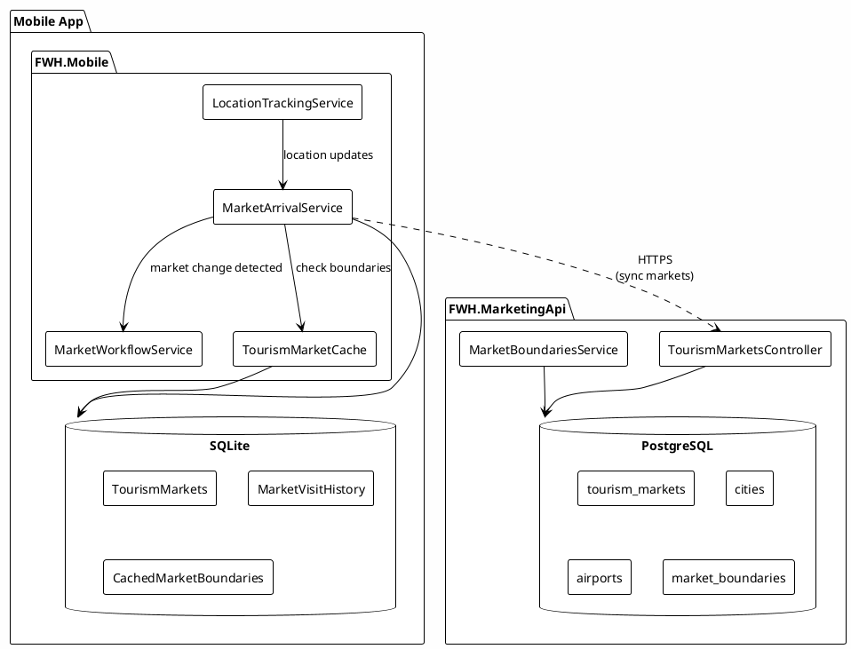
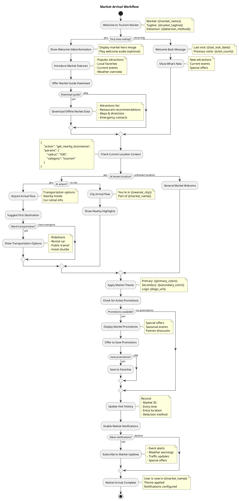
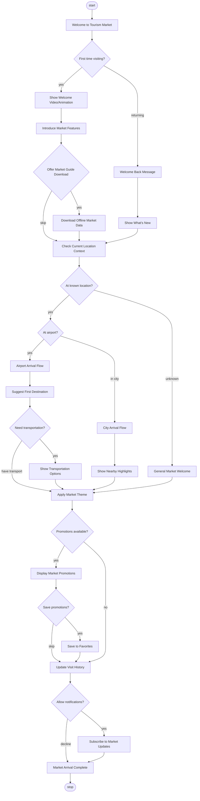

# MVP-APP-002: MarketArrival Workflow Implementation Plan

## Overview

Implement a Tourism Market detection and arrival workflow system that identifies when users enter or exit tourism markets based on their device location, triggering personalized welcome experiences and market-specific content.

**Estimate:** 96-128 hours (12-16 days)

---

## Goals

1. Detect current tourism market on app startup based on device location
2. Monitor for tourism market changes during app usage
3. Trigger MarketArrival workflow when entering a new tourism market
4. Provide market-specific welcome content, themes, and recommendations
5. Support offline market detection using cached market boundaries

---

## Architecture

### Components



### Key Design Decisions

| Decision | Rationale |
|----------|-----------|
| GPS-based detection | Most reliable for outdoor/travel scenarios |
| Polygon boundaries | More accurate than simple radius from city center |
| Offline-first | Markets are cached locally for offline detection |
| Debounced transitions | Prevent rapid market flip-flopping at boundaries |
| Airport detection | Airports often serve as tourism market entry points |

---

## Data Models

### TourismMarket (Enhanced)

```csharp
namespace FWH.Common.TourismMarket.Models;

/// <summary>
/// Represents a tourism market - a geographic region marketed as a travel destination.
/// Examples: "Austin Metro", "Greater San Antonio", "Texas Hill Country"
/// </summary>
public record TourismMarket
{
    /// <summary>
    /// Unique identifier.
    /// </summary>
    public long Id { get; init; }
    
    /// <summary>
    /// Display name of the tourism market.
    /// </summary>
    public required string Name { get; init; }
    
    /// <summary>
    /// Marketing tagline or slogan.
    /// </summary>
    public string? Tagline { get; init; }
    
    /// <summary>
    /// Detailed description of the tourism market.
    /// </summary>
    public string? Description { get; init; }
    
    /// <summary>
    /// Official tourism website URL.
    /// </summary>
    public string? WebsiteUrl { get; init; }
    
    /// <summary>
    /// URL for market logo/icon.
    /// </summary>
    public string? LogoUrl { get; init; }
    
    /// <summary>
    /// URL for hero/banner image.
    /// </summary>
    public string? HeroImageUrl { get; init; }
    
    /// <summary>
    /// Primary theme color (hex).
    /// </summary>
    public string? PrimaryColor { get; init; }
    
    /// <summary>
    /// Secondary theme color (hex).
    /// </summary>
    public string? SecondaryColor { get; init; }
    
    /// <summary>
    /// Center point latitude for the market.
    /// </summary>
    public double CenterLatitude { get; init; }
    
    /// <summary>
    /// Center point longitude for the market.
    /// </summary>
    public double CenterLongitude { get; init; }
    
    /// <summary>
    /// Approximate radius in kilometers (for simple distance checks).
    /// </summary>
    public double RadiusKm { get; init; }
    
    /// <summary>
    /// Time zone identifier (e.g., "America/Chicago").
    /// </summary>
    public string? TimeZoneId { get; init; }
    
    /// <summary>
    /// Primary language code (e.g., "en-US").
    /// </summary>
    public string? PrimaryLanguage { get; init; }
    
    /// <summary>
    /// Currency code (e.g., "USD").
    /// </summary>
    public string? CurrencyCode { get; init; }
    
    /// <summary>
    /// Whether this market is currently active.
    /// </summary>
    public bool IsActive { get; init; }
    
    /// <summary>
    /// Sort order for display purposes.
    /// </summary>
    public int SortOrder { get; init; }
    
    /// <summary>
    /// Associated cities in this market.
    /// </summary>
    public IReadOnlyList<MarketCity> Cities { get; init; } = [];
    
    /// <summary>
    /// Associated airports serving this market.
    /// </summary>
    public IReadOnlyList<MarketAirport> Airports { get; init; } = [];
    
    /// <summary>
    /// Boundary polygon for precise detection.
    /// </summary>
    public MarketBoundary? Boundary { get; init; }
    
    /// <summary>
    /// When the market data was last updated.
    /// </summary>
    public DateTimeOffset UpdatedAt { get; init; }
}

/// <summary>
/// A city within a tourism market.
/// </summary>
public record MarketCity
{
    public long Id { get; init; }
    public required string Name { get; init; }
    public required string State { get; init; }
    public required string Country { get; init; }
    public double Latitude { get; init; }
    public double Longitude { get; init; }
    public bool IsPrimaryCity { get; init; }
}

/// <summary>
/// An airport serving a tourism market.
/// </summary>
public record MarketAirport
{
    public long Id { get; init; }
    public required string Name { get; init; }
    public required string IataCode { get; init; }
    public string? IcaoCode { get; init; }
    public double Latitude { get; init; }
    public double Longitude { get; init; }
    public bool IsPrimaryAirport { get; init; }
}

/// <summary>
/// Geographic boundary polygon for a tourism market.
/// </summary>
public record MarketBoundary
{
    public long Id { get; init; }
    public long TourismMarketId { get; init; }
    
    /// <summary>
    /// GeoJSON polygon coordinates.
    /// Format: [[[lon, lat], [lon, lat], ...]]
    /// </summary>
    public required string GeoJsonPolygon { get; init; }
    
    /// <summary>
    /// Simplified bounding box for quick rejection.
    /// </summary>
    public double MinLatitude { get; init; }
    public double MaxLatitude { get; init; }
    public double MinLongitude { get; init; }
    public double MaxLongitude { get; init; }
    
    public DateTimeOffset UpdatedAt { get; init; }
}
```

### MarketVisit (Local Storage)

```csharp
namespace FWH.Mobile.Data.Entities;

/// <summary>
/// Records a visit to a tourism market.
/// Stored locally on device for history and analytics.
/// </summary>
public class MarketVisitEntity
{
    public long Id { get; set; }
    
    /// <summary>
    /// Device identifier.
    /// </summary>
    public required string DeviceId { get; set; }
    
    /// <summary>
    /// Tourism market ID.
    /// </summary>
    public long TourismMarketId { get; set; }
    
    /// <summary>
    /// Name of the market (cached for offline display).
    /// </summary>
    public required string MarketName { get; set; }
    
    /// <summary>
    /// When the user entered the market.
    /// </summary>
    public DateTimeOffset EnteredAt { get; set; }
    
    /// <summary>
    /// When the user exited the market (null if still present).
    /// </summary>
    public DateTimeOffset? ExitedAt { get; set; }
    
    /// <summary>
    /// Entry location coordinates.
    /// </summary>
    public double EntryLatitude { get; set; }
    public double EntryLongitude { get; set; }
    
    /// <summary>
    /// Exit location coordinates.
    /// </summary>
    public double? ExitLatitude { get; set; }
    public double? ExitLongitude { get; set; }
    
    /// <summary>
    /// How the market was detected (GPS, Airport, Manual).
    /// </summary>
    public required string DetectionMethod { get; set; }
    
    /// <summary>
    /// Whether the arrival workflow was triggered.
    /// </summary>
    public bool WorkflowTriggered { get; set; }
    
    /// <summary>
    /// Workflow instance ID if triggered.
    /// </summary>
    public string? WorkflowInstanceId { get; set; }
    
    /// <summary>
    /// Total time spent in market (calculated on exit).
    /// </summary>
    public TimeSpan? Duration { get; set; }
    
    public DateTimeOffset CreatedAt { get; set; }
    public DateTimeOffset? UpdatedAt { get; set; }
}
```

### MarketArrivalEvent

```csharp
namespace FWH.Mobile.Services;

/// <summary>
/// Event arguments for market arrival/departure events.
/// </summary>
public class MarketArrivalEventArgs : EventArgs
{
    /// <summary>
    /// The tourism market that was entered.
    /// </summary>
    public required TourismMarket Market { get; init; }
    
    /// <summary>
    /// The previous market (null if first detection or unknown).
    /// </summary>
    public TourismMarket? PreviousMarket { get; init; }
    
    /// <summary>
    /// Location where market change was detected.
    /// </summary>
    public required GpsCoordinates Location { get; init; }
    
    /// <summary>
    /// How the market was detected.
    /// </summary>
    public MarketDetectionMethod DetectionMethod { get; init; }
    
    /// <summary>
    /// Whether this is the first visit to this market.
    /// </summary>
    public bool IsFirstVisit { get; init; }
    
    /// <summary>
    /// Last visit to this market (if returning).
    /// </summary>
    public DateTimeOffset? LastVisitDate { get; init; }
    
    /// <summary>
    /// Number of previous visits to this market.
    /// </summary>
    public int PreviousVisitCount { get; init; }
    
    /// <summary>
    /// When the event occurred.
    /// </summary>
    public DateTimeOffset Timestamp { get; init; } = DateTimeOffset.UtcNow;
}

/// <summary>
/// How the tourism market was detected.
/// </summary>
public enum MarketDetectionMethod
{
    /// <summary>
    /// Detected via GPS coordinates within market boundary.
    /// </summary>
    GpsBoundary,
    
    /// <summary>
    /// Detected via proximity to airport serving the market.
    /// </summary>
    AirportProximity,
    
    /// <summary>
    /// Detected via proximity to city center.
    /// </summary>
    CityProximity,
    
    /// <summary>
    /// User manually selected the market.
    /// </summary>
    ManualSelection,
    
    /// <summary>
    /// Detected on app startup from last known location.
    /// </summary>
    AppStartup
}

/// <summary>
/// Event arguments for market departure.
/// </summary>
public class MarketDepartureEventArgs : EventArgs
{
    public required TourismMarket Market { get; init; }
    public required GpsCoordinates Location { get; init; }
    public DateTimeOffset EnteredAt { get; init; }
    public TimeSpan Duration { get; init; }
    public DateTimeOffset Timestamp { get; init; } = DateTimeOffset.UtcNow;
}
```

---

## Service Interfaces

### IMarketArrivalService

```csharp
namespace FWH.Mobile.Services;

/// <summary>
/// Service for detecting and managing tourism market arrivals/departures.
/// </summary>
public interface IMarketArrivalService
{
    /// <summary>
    /// Current tourism market (null if not in any market).
    /// </summary>
    TourismMarket? CurrentMarket { get; }
    
    /// <summary>
    /// Whether the service is actively monitoring for market changes.
    /// </summary>
    bool IsMonitoring { get; }
    
    /// <summary>
    /// Event fired when entering a new tourism market.
    /// </summary>
    event EventHandler<MarketArrivalEventArgs>? MarketArrived;
    
    /// <summary>
    /// Event fired when exiting a tourism market.
    /// </summary>
    event EventHandler<MarketDepartureEventArgs>? MarketDeparted;
    
    /// <summary>
    /// Start monitoring for market changes.
    /// </summary>
    Task StartMonitoringAsync(CancellationToken cancellationToken = default);
    
    /// <summary>
    /// Stop monitoring for market changes.
    /// </summary>
    Task StopMonitoringAsync();
    
    /// <summary>
    /// Detect current market from a location.
    /// </summary>
    Task<TourismMarket?> DetectMarketAsync(
        double latitude, 
        double longitude,
        CancellationToken cancellationToken = default);
    
    /// <summary>
    /// Force a market check at current location.
    /// </summary>
    Task<TourismMarket?> CheckCurrentMarketAsync(CancellationToken cancellationToken = default);
    
    /// <summary>
    /// Get visit history for a market.
    /// </summary>
    Task<IReadOnlyList<MarketVisitEntity>> GetMarketHistoryAsync(
        long? tourismMarketId = null,
        int limit = 50,
        CancellationToken cancellationToken = default);
    
    /// <summary>
    /// Manually set current market (user override).
    /// </summary>
    Task SetCurrentMarketAsync(
        TourismMarket market,
        CancellationToken cancellationToken = default);
    
    /// <summary>
    /// Sync tourism markets from API.
    /// </summary>
    Task<bool> SyncMarketsAsync(CancellationToken cancellationToken = default);
}
```

### ITourismMarketCache

```csharp
namespace FWH.Mobile.Services;

/// <summary>
/// Local cache for tourism markets and boundaries.
/// </summary>
public interface ITourismMarketCache
{
    /// <summary>
    /// Get all cached markets.
    /// </summary>
    Task<IReadOnlyList<TourismMarket>> GetAllMarketsAsync(
        CancellationToken cancellationToken = default);
    
    /// <summary>
    /// Get a market by ID.
    /// </summary>
    Task<TourismMarket?> GetMarketByIdAsync(
        long marketId,
        CancellationToken cancellationToken = default);
    
    /// <summary>
    /// Find markets containing a point.
    /// </summary>
    Task<IReadOnlyList<TourismMarket>> FindMarketsAtLocationAsync(
        double latitude,
        double longitude,
        CancellationToken cancellationToken = default);
    
    /// <summary>
    /// Find nearby markets (within radius).
    /// </summary>
    Task<IReadOnlyList<TourismMarket>> FindNearbyMarketsAsync(
        double latitude,
        double longitude,
        double radiusKm = 100,
        CancellationToken cancellationToken = default);
    
    /// <summary>
    /// Find market by airport code.
    /// </summary>
    Task<TourismMarket?> FindMarketByAirportAsync(
        string iataCode,
        CancellationToken cancellationToken = default);
    
    /// <summary>
    /// Update cache from API.
    /// </summary>
    Task<bool> RefreshCacheAsync(CancellationToken cancellationToken = default);
    
    /// <summary>
    /// Last successful cache refresh.
    /// </summary>
    DateTimeOffset? LastRefreshTime { get; }
    
    /// <summary>
    /// Number of cached markets.
    /// </summary>
    int CachedMarketCount { get; }
}
```

---

## Service Implementations

### MarketArrivalService

```csharp
using FWH.Common.Location.Models;
using FWH.Mobile.Data.Data;
using FWH.Mobile.Data.Entities;
using Microsoft.Extensions.Logging;

namespace FWH.Mobile.Services;

/// <summary>
/// Monitors device location and detects tourism market arrivals/departures.
/// </summary>
public class MarketArrivalService : IMarketArrivalService, IDisposable
{
    private readonly ILocationTrackingService _locationService;
    private readonly ITourismMarketCache _marketCache;
    private readonly NotesDbContext _dbContext;
    private readonly ILogger<MarketArrivalService> _logger;
    private readonly string _deviceId;
    
    private TourismMarket? _currentMarket;
    private MarketVisitEntity? _currentVisit;
    private DateTimeOffset? _lastMarketCheck;
    private bool _isMonitoring;
    
    // Debounce settings to prevent rapid market switching at boundaries
    private const int MinSecondsBetweenMarketChanges = 300; // 5 minutes
    private const int BoundaryBufferMeters = 500; // Hysteresis zone
    
    public TourismMarket? CurrentMarket => _currentMarket;
    public bool IsMonitoring => _isMonitoring;
    
    public event EventHandler<MarketArrivalEventArgs>? MarketArrived;
    public event EventHandler<MarketDepartureEventArgs>? MarketDeparted;
    
    public MarketArrivalService(
        ILocationTrackingService locationService,
        ITourismMarketCache marketCache,
        NotesDbContext dbContext,
        ILogger<MarketArrivalService> logger)
    {
        _locationService = locationService ?? throw new ArgumentNullException(nameof(locationService));
        _marketCache = marketCache ?? throw new ArgumentNullException(nameof(marketCache));
        _dbContext = dbContext ?? throw new ArgumentNullException(nameof(dbContext));
        _logger = logger ?? throw new ArgumentNullException(nameof(logger));
        
        _deviceId = Guid.NewGuid().ToString();
    }
    
    public async Task StartMonitoringAsync(CancellationToken cancellationToken = default)
    {
        if (_isMonitoring)
        {
            _logger.LogWarning("Market monitoring is already active");
            return;
        }
        
        _logger.LogInformation("Starting tourism market monitoring");
        
        // Subscribe to location updates
        _locationService.LocationUpdated += OnLocationUpdated;
        
        // Check current market on startup
        await CheckCurrentMarketAsync(cancellationToken).ConfigureAwait(false);
        
        _isMonitoring = true;
    }
    
    public Task StopMonitoringAsync()
    {
        if (!_isMonitoring)
        {
            return Task.CompletedTask;
        }
        
        _logger.LogInformation("Stopping tourism market monitoring");
        
        _locationService.LocationUpdated -= OnLocationUpdated;
        _isMonitoring = false;
        
        return Task.CompletedTask;
    }
    
    public async Task<TourismMarket?> DetectMarketAsync(
        double latitude,
        double longitude,
        CancellationToken cancellationToken = default)
    {
        // First, check for markets with boundary polygons
        var marketsAtLocation = await _marketCache.FindMarketsAtLocationAsync(
            latitude, longitude, cancellationToken).ConfigureAwait(false);
        
        if (marketsAtLocation.Any())
        {
            // Return the most specific market (smallest area)
            return marketsAtLocation
                .OrderBy(m => m.RadiusKm)
                .First();
        }
        
        // Fallback: check nearby markets by distance
        var nearbyMarkets = await _marketCache.FindNearbyMarketsAsync(
            latitude, longitude, radiusKm: 50, cancellationToken).ConfigureAwait(false);
        
        if (nearbyMarkets.Any())
        {
            // Return closest market within its defined radius
            foreach (var market in nearbyMarkets.OrderBy(m => 
                CalculateDistance(latitude, longitude, m.CenterLatitude, m.CenterLongitude)))
            {
                var distance = CalculateDistance(latitude, longitude, 
                    market.CenterLatitude, market.CenterLongitude);
                
                if (distance <= market.RadiusKm)
                {
                    return market;
                }
            }
        }
        
        return null;
    }
    
    public async Task<TourismMarket?> CheckCurrentMarketAsync(CancellationToken cancellationToken = default)
    {
        var location = _locationService.LastKnownLocation;
        if (location == null)
        {
            _logger.LogDebug("No location available for market check");
            return _currentMarket;
        }
        
        var market = await DetectMarketAsync(
            location.Latitude, 
            location.Longitude, 
            cancellationToken).ConfigureAwait(false);
        
        await HandleMarketChangeAsync(market, location, MarketDetectionMethod.AppStartup, cancellationToken)
            .ConfigureAwait(false);
        
        return _currentMarket;
    }
    
    public async Task<IReadOnlyList<MarketVisitEntity>> GetMarketHistoryAsync(
        long? tourismMarketId = null,
        int limit = 50,
        CancellationToken cancellationToken = default)
    {
        var query = _dbContext.MarketVisits
            .Where(v => v.DeviceId == _deviceId)
            .OrderByDescending(v => v.EnteredAt);
        
        if (tourismMarketId.HasValue)
        {
            query = (IOrderedQueryable<MarketVisitEntity>)query
                .Where(v => v.TourismMarketId == tourismMarketId.Value);
        }
        
        return await query
            .Take(limit)
            .ToListAsync(cancellationToken)
            .ConfigureAwait(false);
    }
    
    public async Task SetCurrentMarketAsync(
        TourismMarket market,
        CancellationToken cancellationToken = default)
    {
        var location = _locationService.LastKnownLocation ?? 
            new GpsCoordinates 
            { 
                Latitude = market.CenterLatitude, 
                Longitude = market.CenterLongitude,
                Timestamp = DateTimeOffset.UtcNow
            };
        
        await HandleMarketChangeAsync(market, location, MarketDetectionMethod.ManualSelection, cancellationToken)
            .ConfigureAwait(false);
    }
    
    public async Task<bool> SyncMarketsAsync(CancellationToken cancellationToken = default)
    {
        return await _marketCache.RefreshCacheAsync(cancellationToken).ConfigureAwait(false);
    }
    
    private async void OnLocationUpdated(object? sender, GpsCoordinates location)
    {
        try
        {
            // Throttle market checks
            if (_lastMarketCheck.HasValue && 
                (DateTimeOffset.UtcNow - _lastMarketCheck.Value).TotalSeconds < 60)
            {
                return;
            }
            
            _lastMarketCheck = DateTimeOffset.UtcNow;
            
            var market = await DetectMarketAsync(location.Latitude, location.Longitude)
                .ConfigureAwait(false);
            
            await HandleMarketChangeAsync(market, location, MarketDetectionMethod.GpsBoundary)
                .ConfigureAwait(false);
        }
        catch (Exception ex)
        {
            _logger.LogError(ex, "Error processing location update for market detection");
        }
    }
    
    private async Task HandleMarketChangeAsync(
        TourismMarket? newMarket,
        GpsCoordinates location,
        MarketDetectionMethod detectionMethod,
        CancellationToken cancellationToken = default)
    {
        // No change
        if (newMarket?.Id == _currentMarket?.Id)
        {
            return;
        }
        
        // Debounce rapid changes
        if (_currentVisit != null && 
            (DateTimeOffset.UtcNow - _currentVisit.EnteredAt).TotalSeconds < MinSecondsBetweenMarketChanges)
        {
            _logger.LogDebug("Ignoring market change within debounce window");
            return;
        }
        
        var previousMarket = _currentMarket;
        
        // Handle departure from current market
        if (_currentMarket != null && _currentVisit != null)
        {
            _currentVisit.ExitedAt = DateTimeOffset.UtcNow;
            _currentVisit.ExitLatitude = location.Latitude;
            _currentVisit.ExitLongitude = location.Longitude;
            _currentVisit.Duration = _currentVisit.ExitedAt.Value - _currentVisit.EnteredAt;
            _currentVisit.UpdatedAt = DateTimeOffset.UtcNow;
            
            await _dbContext.SaveChangesAsync(cancellationToken).ConfigureAwait(false);
            
            _logger.LogInformation(
                "Departed market {MarketName} after {Duration}",
                _currentMarket.Name,
                _currentVisit.Duration);
            
            MarketDeparted?.Invoke(this, new MarketDepartureEventArgs
            {
                Market = _currentMarket,
                Location = location,
                EnteredAt = _currentVisit.EnteredAt,
                Duration = _currentVisit.Duration.Value
            });
            
            _currentVisit = null;
        }
        
        _currentMarket = newMarket;
        
        // Handle arrival at new market
        if (newMarket != null)
        {
            // Check visit history
            var previousVisits = await _dbContext.MarketVisits
                .Where(v => v.DeviceId == _deviceId && v.TourismMarketId == newMarket.Id)
                .OrderByDescending(v => v.EnteredAt)
                .ToListAsync(cancellationToken)
                .ConfigureAwait(false);
            
            var isFirstVisit = !previousVisits.Any();
            var lastVisit = previousVisits.FirstOrDefault();
            
            // Create visit record
            _currentVisit = new MarketVisitEntity
            {
                DeviceId = _deviceId,
                TourismMarketId = newMarket.Id,
                MarketName = newMarket.Name,
                EnteredAt = DateTimeOffset.UtcNow,
                EntryLatitude = location.Latitude,
                EntryLongitude = location.Longitude,
                DetectionMethod = detectionMethod.ToString(),
                CreatedAt = DateTimeOffset.UtcNow
            };
            
            _dbContext.MarketVisits.Add(_currentVisit);
            await _dbContext.SaveChangesAsync(cancellationToken).ConfigureAwait(false);
            
            _logger.LogInformation(
                "Arrived at market {MarketName} ({Method}), first visit: {IsFirst}",
                newMarket.Name,
                detectionMethod,
                isFirstVisit);
            
            // Fire arrival event
            MarketArrived?.Invoke(this, new MarketArrivalEventArgs
            {
                Market = newMarket,
                PreviousMarket = previousMarket,
                Location = location,
                DetectionMethod = detectionMethod,
                IsFirstVisit = isFirstVisit,
                LastVisitDate = lastVisit?.EnteredAt,
                PreviousVisitCount = previousVisits.Count
            });
        }
    }
    
    private static double CalculateDistance(double lat1, double lon1, double lat2, double lon2)
    {
        const double earthRadiusKm = 6371;
        var dLat = (lat2 - lat1) * Math.PI / 180.0;
        var dLon = (lon2 - lon1) * Math.PI / 180.0;
        
        var a = Math.Sin(dLat / 2) * Math.Sin(dLat / 2) +
                Math.Cos(lat1 * Math.PI / 180.0) * Math.Cos(lat2 * Math.PI / 180.0) *
                Math.Sin(dLon / 2) * Math.Sin(dLon / 2);
        
        var c = 2 * Math.Atan2(Math.Sqrt(a), Math.Sqrt(1 - a));
        return earthRadiusKm * c;
    }
    
    public void Dispose()
    {
        if (_isMonitoring)
        {
            _locationService.LocationUpdated -= OnLocationUpdated;
            _isMonitoring = false;
        }
    }
}
```

### TourismMarketCache

```csharp
using System.Net.Http.Json;
using System.Text.Json;
using Microsoft.EntityFrameworkCore;
using Microsoft.Extensions.Logging;
using Microsoft.Extensions.Options;
using NetTopologySuite.Geometries;
using NetTopologySuite.IO;

namespace FWH.Mobile.Services;

/// <summary>
/// SQLite-backed cache for tourism markets with polygon containment checks.
/// </summary>
public class TourismMarketCache : ITourismMarketCache
{
    private readonly NotesDbContext _dbContext;
    private readonly HttpClient _httpClient;
    private readonly ILogger<TourismMarketCache> _logger;
    private readonly MarketCacheOptions _options;
    
    private readonly GeoJsonReader _geoJsonReader = new();
    private DateTimeOffset? _lastRefreshTime;
    
    public DateTimeOffset? LastRefreshTime => _lastRefreshTime;
    public int CachedMarketCount { get; private set; }
    
    public TourismMarketCache(
        NotesDbContext dbContext,
        HttpClient httpClient,
        IOptions<MarketCacheOptions> options,
        ILogger<TourismMarketCache> logger)
    {
        _dbContext = dbContext;
        _httpClient = httpClient;
        _options = options.Value;
        _logger = logger;
    }
    
    public async Task<IReadOnlyList<TourismMarket>> GetAllMarketsAsync(
        CancellationToken cancellationToken = default)
    {
        var entities = await _dbContext.CachedTourismMarkets
            .Include(m => m.Cities)
            .Include(m => m.Airports)
            .Include(m => m.Boundary)
            .Where(m => m.IsActive)
            .OrderBy(m => m.SortOrder)
            .ThenBy(m => m.Name)
            .ToListAsync(cancellationToken)
            .ConfigureAwait(false);
        
        CachedMarketCount = entities.Count;
        return entities.Select(MapToModel).ToList();
    }
    
    public async Task<TourismMarket?> GetMarketByIdAsync(
        long marketId,
        CancellationToken cancellationToken = default)
    {
        var entity = await _dbContext.CachedTourismMarkets
            .Include(m => m.Cities)
            .Include(m => m.Airports)
            .Include(m => m.Boundary)
            .FirstOrDefaultAsync(m => m.Id == marketId, cancellationToken)
            .ConfigureAwait(false);
        
        return entity != null ? MapToModel(entity) : null;
    }
    
    public async Task<IReadOnlyList<TourismMarket>> FindMarketsAtLocationAsync(
        double latitude,
        double longitude,
        CancellationToken cancellationToken = default)
    {
        var markets = await GetAllMarketsAsync(cancellationToken).ConfigureAwait(false);
        var matchingMarkets = new List<TourismMarket>();
        
        var point = new Point(longitude, latitude) { SRID = 4326 };
        
        foreach (var market in markets)
        {
            if (market.Boundary != null)
            {
                try
                {
                    var polygon = _geoJsonReader.Read<Geometry>(market.Boundary.GeoJsonPolygon);
                    if (polygon != null && polygon.Contains(point))
                    {
                        matchingMarkets.Add(market);
                    }
                }
                catch (Exception ex)
                {
                    _logger.LogWarning(ex, 
                        "Error parsing boundary for market {MarketId}", market.Id);
                }
            }
            else
            {
                // Fallback to radius check
                var distance = CalculateDistanceKm(latitude, longitude, 
                    market.CenterLatitude, market.CenterLongitude);
                
                if (distance <= market.RadiusKm)
                {
                    matchingMarkets.Add(market);
                }
            }
        }
        
        return matchingMarkets;
    }
    
    public async Task<IReadOnlyList<TourismMarket>> FindNearbyMarketsAsync(
        double latitude,
        double longitude,
        double radiusKm = 100,
        CancellationToken cancellationToken = default)
    {
        var markets = await GetAllMarketsAsync(cancellationToken).ConfigureAwait(false);
        
        return markets
            .Select(m => new
            {
                Market = m,
                Distance = CalculateDistanceKm(latitude, longitude, 
                    m.CenterLatitude, m.CenterLongitude)
            })
            .Where(x => x.Distance <= radiusKm)
            .OrderBy(x => x.Distance)
            .Select(x => x.Market)
            .ToList();
    }
    
    public async Task<TourismMarket?> FindMarketByAirportAsync(
        string iataCode,
        CancellationToken cancellationToken = default)
    {
        var entity = await _dbContext.CachedTourismMarkets
            .Include(m => m.Cities)
            .Include(m => m.Airports)
            .Include(m => m.Boundary)
            .FirstOrDefaultAsync(m => 
                m.Airports.Any(a => a.IataCode == iataCode.ToUpperInvariant()),
                cancellationToken)
            .ConfigureAwait(false);
        
        return entity != null ? MapToModel(entity) : null;
    }
    
    public async Task<bool> RefreshCacheAsync(CancellationToken cancellationToken = default)
    {
        try
        {
            _logger.LogInformation("Refreshing tourism market cache from API");
            
            var response = await _httpClient.GetAsync(
                $"{_options.ApiBaseUrl}/api/tourismmarkets",
                cancellationToken).ConfigureAwait(false);
            
            if (!response.IsSuccessStatusCode)
            {
                _logger.LogWarning("Failed to fetch markets: {StatusCode}", response.StatusCode);
                return false;
            }
            
            var markets = await response.Content
                .ReadFromJsonAsync<List<TourismMarketDto>>(cancellationToken: cancellationToken)
                .ConfigureAwait(false);
            
            if (markets == null || !markets.Any())
            {
                _logger.LogWarning("No markets returned from API");
                return false;
            }
            
            // Update local cache
            await UpdateCacheAsync(markets, cancellationToken).ConfigureAwait(false);
            
            _lastRefreshTime = DateTimeOffset.UtcNow;
            CachedMarketCount = markets.Count;
            
            _logger.LogInformation("Refreshed {Count} tourism markets", markets.Count);
            return true;
        }
        catch (Exception ex)
        {
            _logger.LogError(ex, "Error refreshing market cache");
            return false;
        }
    }
    
    private async Task UpdateCacheAsync(
        List<TourismMarketDto> markets,
        CancellationToken cancellationToken)
    {
        // Clear existing cache
        _dbContext.CachedMarketBoundaries.RemoveRange(_dbContext.CachedMarketBoundaries);
        _dbContext.CachedMarketAirports.RemoveRange(_dbContext.CachedMarketAirports);
        _dbContext.CachedMarketCities.RemoveRange(_dbContext.CachedMarketCities);
        _dbContext.CachedTourismMarkets.RemoveRange(_dbContext.CachedTourismMarkets);
        
        await _dbContext.SaveChangesAsync(cancellationToken).ConfigureAwait(false);
        
        // Insert new data
        foreach (var dto in markets)
        {
            var entity = new CachedTourismMarketEntity
            {
                Id = dto.Id,
                Name = dto.Name,
                Tagline = dto.Tagline,
                Description = dto.Description,
                WebsiteUrl = dto.WebsiteUrl,
                LogoUrl = dto.LogoUrl,
                HeroImageUrl = dto.HeroImageUrl,
                PrimaryColor = dto.PrimaryColor,
                SecondaryColor = dto.SecondaryColor,
                CenterLatitude = dto.CenterLatitude,
                CenterLongitude = dto.CenterLongitude,
                RadiusKm = dto.RadiusKm,
                TimeZoneId = dto.TimeZoneId,
                IsActive = dto.IsActive,
                SortOrder = dto.SortOrder,
                UpdatedAt = dto.UpdatedAt,
                CachedAt = DateTimeOffset.UtcNow
            };
            
            _dbContext.CachedTourismMarkets.Add(entity);
            
            // Add cities
            foreach (var city in dto.Cities ?? [])
            {
                _dbContext.CachedMarketCities.Add(new CachedMarketCityEntity
                {
                    TourismMarketId = dto.Id,
                    Name = city.Name,
                    State = city.State,
                    Country = city.Country,
                    Latitude = city.Latitude,
                    Longitude = city.Longitude,
                    IsPrimaryCity = city.IsPrimaryCity
                });
            }
            
            // Add airports
            foreach (var airport in dto.Airports ?? [])
            {
                _dbContext.CachedMarketAirports.Add(new CachedMarketAirportEntity
                {
                    TourismMarketId = dto.Id,
                    Name = airport.Name,
                    IataCode = airport.IataCode,
                    IcaoCode = airport.IcaoCode,
                    Latitude = airport.Latitude,
                    Longitude = airport.Longitude,
                    IsPrimaryAirport = airport.IsPrimaryAirport
                });
            }
            
            // Add boundary
            if (dto.Boundary != null)
            {
                _dbContext.CachedMarketBoundaries.Add(new CachedMarketBoundaryEntity
                {
                    TourismMarketId = dto.Id,
                    GeoJsonPolygon = dto.Boundary.GeoJsonPolygon,
                    MinLatitude = dto.Boundary.MinLatitude,
                    MaxLatitude = dto.Boundary.MaxLatitude,
                    MinLongitude = dto.Boundary.MinLongitude,
                    MaxLongitude = dto.Boundary.MaxLongitude,
                    UpdatedAt = dto.Boundary.UpdatedAt
                });
            }
        }
        
        await _dbContext.SaveChangesAsync(cancellationToken).ConfigureAwait(false);
    }
    
    private static TourismMarket MapToModel(CachedTourismMarketEntity entity)
    {
        return new TourismMarket
        {
            Id = entity.Id,
            Name = entity.Name,
            Tagline = entity.Tagline,
            Description = entity.Description,
            WebsiteUrl = entity.WebsiteUrl,
            LogoUrl = entity.LogoUrl,
            HeroImageUrl = entity.HeroImageUrl,
            PrimaryColor = entity.PrimaryColor,
            SecondaryColor = entity.SecondaryColor,
            CenterLatitude = entity.CenterLatitude,
            CenterLongitude = entity.CenterLongitude,
            RadiusKm = entity.RadiusKm,
            TimeZoneId = entity.TimeZoneId,
            IsActive = entity.IsActive,
            SortOrder = entity.SortOrder,
            UpdatedAt = entity.UpdatedAt,
            Cities = entity.Cities?.Select(c => new MarketCity
            {
                Id = c.Id,
                Name = c.Name,
                State = c.State,
                Country = c.Country,
                Latitude = c.Latitude,
                Longitude = c.Longitude,
                IsPrimaryCity = c.IsPrimaryCity
            }).ToList() ?? [],
            Airports = entity.Airports?.Select(a => new MarketAirport
            {
                Id = a.Id,
                Name = a.Name,
                IataCode = a.IataCode,
                IcaoCode = a.IcaoCode,
                Latitude = a.Latitude,
                Longitude = a.Longitude,
                IsPrimaryAirport = a.IsPrimaryAirport
            }).ToList() ?? [],
            Boundary = entity.Boundary != null ? new MarketBoundary
            {
                Id = entity.Boundary.Id,
                TourismMarketId = entity.Boundary.TourismMarketId,
                GeoJsonPolygon = entity.Boundary.GeoJsonPolygon,
                MinLatitude = entity.Boundary.MinLatitude,
                MaxLatitude = entity.Boundary.MaxLatitude,
                MinLongitude = entity.Boundary.MinLongitude,
                MaxLongitude = entity.Boundary.MaxLongitude,
                UpdatedAt = entity.Boundary.UpdatedAt
            } : null
        };
    }
    
    private static double CalculateDistanceKm(double lat1, double lon1, double lat2, double lon2)
    {
        const double earthRadiusKm = 6371;
        var dLat = (lat2 - lat1) * Math.PI / 180.0;
        var dLon = (lon2 - lon1) * Math.PI / 180.0;
        
        var a = Math.Sin(dLat / 2) * Math.Sin(dLat / 2) +
                Math.Cos(lat1 * Math.PI / 180.0) * Math.Cos(lat2 * Math.PI / 180.0) *
                Math.Sin(dLon / 2) * Math.Sin(dLon / 2);
        
        var c = 2 * Math.Atan2(Math.Sqrt(a), Math.Sqrt(1 - a));
        return earthRadiusKm * c;
    }
}

/// <summary>
/// Configuration options for market cache.
/// </summary>
public class MarketCacheOptions
{
    public const string SectionName = "TourismMarkets";
    
    public string ApiBaseUrl { get; set; } = "https://marketing-api.funwashad.app";
    public TimeSpan CacheExpiry { get; set; } = TimeSpan.FromDays(7);
    public TimeSpan RefreshInterval { get; set; } = TimeSpan.FromHours(24);
}
```

### MarketWorkflowService

```csharp
using System.Security.Cryptography;
using System.Text;
using FWH.Common.Workflow;
using FWH.Mobile.Data.Repositories;
using Microsoft.Extensions.Logging;

namespace FWH.Mobile.Services;

/// <summary>
/// Service that manages market arrival workflows.
/// </summary>
public class MarketWorkflowService
{
    private readonly IWorkflowService _workflowService;
    private readonly IWorkflowRepository _workflowRepository;
    private readonly IMarketArrivalService _marketArrivalService;
    private readonly ILogger<MarketWorkflowService> _logger;
    
    private const string MarketArrivalWorkflowFile = "market-arrival.puml";
    private const int WorkflowTimeWindowHours = 168; // 7 days
    
    private static string? _cachedWorkflowContent;
    private static readonly object _cacheLock = new();
    
    public MarketWorkflowService(
        IWorkflowService workflowService,
        IWorkflowRepository workflowRepository,
        IMarketArrivalService marketArrivalService,
        ILogger<MarketWorkflowService> logger)
    {
        _workflowService = workflowService;
        _workflowRepository = workflowRepository;
        _marketArrivalService = marketArrivalService;
        _logger = logger;
        
        // Subscribe to market arrival events
        _marketArrivalService.MarketArrived += OnMarketArrived;
    }
    
    private async void OnMarketArrived(object? sender, MarketArrivalEventArgs e)
    {
        try
        {
            _logger.LogInformation(
                "Market arrival detected: {MarketName} ({Method})",
                e.Market.Name,
                e.DetectionMethod);
            
            await HandleMarketArrivalAsync(e).ConfigureAwait(false);
        }
        catch (Exception ex)
        {
            _logger.LogError(ex, "Error handling market arrival for {MarketName}", e.Market.Name);
        }
    }
    
    public async Task HandleMarketArrivalAsync(MarketArrivalEventArgs eventArgs)
    {
        // Generate workflow ID based on market
        var workflowId = $"market:{eventArgs.Market.Id}";
        
        // Check for existing workflow within time window
        var since = DateTimeOffset.UtcNow.AddHours(-WorkflowTimeWindowHours);
        var existingWorkflows = await _workflowRepository
            .FindByNamePatternAsync(workflowId, since)
            .ConfigureAwait(false);
        
        var existingWorkflow = existingWorkflows.FirstOrDefault();
        
        if (existingWorkflow != null && !eventArgs.IsFirstVisit)
        {
            _logger.LogInformation(
                "Found existing workflow {WorkflowId} for market {MarketName}, resuming",
                existingWorkflow.Id,
                eventArgs.Market.Name);
            
            await _workflowService.StartInstanceAsync(existingWorkflow.Id).ConfigureAwait(false);
            return;
        }
        
        // Load workflow definition
        var pumlContent = await LoadMarketWorkflowFileAsync().ConfigureAwait(false);
        if (string.IsNullOrEmpty(pumlContent))
        {
            _logger.LogWarning(
                "Failed to load {FileName}, cannot start market arrival workflow",
                MarketArrivalWorkflowFile);
            return;
        }
        
        // Import and start new workflow
        var workflow = await _workflowService.ImportWorkflowAsync(
            pumlContent,
            workflowId,
            $"Welcome to {eventArgs.Market.Name}").ConfigureAwait(false);
        
        // Set workflow variables
        await SetWorkflowVariablesAsync(workflow.Id, eventArgs).ConfigureAwait(false);
        
        _logger.LogInformation(
            "Started market arrival workflow {WorkflowId} for {MarketName}",
            workflow.Id,
            eventArgs.Market.Name);
    }
    
    private async Task SetWorkflowVariablesAsync(string workflowId, MarketArrivalEventArgs eventArgs)
    {
        // Log variables that would be set
        _logger.LogDebug(
            "Workflow {WorkflowId} variables: " +
            "market_id={MarketId}, market_name={MarketName}, " +
            "is_first_visit={IsFirst}, previous_visits={Visits}, " +
            "detection_method={Method}",
            workflowId,
            eventArgs.Market.Id,
            eventArgs.Market.Name,
            eventArgs.IsFirstVisit,
            eventArgs.PreviousVisitCount,
            eventArgs.DetectionMethod);
        
        // TODO: Set actual workflow variables when system supports it
        await Task.CompletedTask.ConfigureAwait(false);
    }
    
    private async Task<string?> LoadMarketWorkflowFileAsync()
    {
        lock (_cacheLock)
        {
            if (_cachedWorkflowContent != null)
            {
                return _cachedWorkflowContent;
            }
        }
        
        string? content = null;
        
        try
        {
            var baseDir = AppDomain.CurrentDomain.BaseDirectory;
            var pumlPath = Path.Combine(baseDir, MarketArrivalWorkflowFile);
            
            if (File.Exists(pumlPath))
            {
                content = await File.ReadAllTextAsync(pumlPath).ConfigureAwait(false);
            }
        }
        catch (Exception ex)
        {
            _logger.LogWarning(ex, "Failed to load {FileName}", MarketArrivalWorkflowFile);
        }
        
        if (content != null)
        {
            lock (_cacheLock)
            {
                _cachedWorkflowContent = content;
            }
        }
        
        return content;
    }
}
```

---

## MarketArrival Workflow Definition

### market-arrival.puml



### Mermaid Equivalent



---

## API Endpoints

### Tourism Markets API

Add new endpoints to `FWH.MarketingApi`:

```csharp
using Microsoft.AspNetCore.Mvc;
using Microsoft.EntityFrameworkCore;

namespace FWH.MarketingApi.Controllers;

/// <summary>
/// API controller for tourism market data.
/// </summary>
[ApiController]
[Route("api/[controller]")]
public class TourismMarketsController : ControllerBase
{
    private readonly MarketingDbContext _context;
    private readonly ILogger<TourismMarketsController> _logger;
    
    public TourismMarketsController(
        MarketingDbContext context,
        ILogger<TourismMarketsController> logger)
    {
        _context = context;
        _logger = logger;
    }
    
    /// <summary>
    /// Get all active tourism markets.
    /// </summary>
    [HttpGet]
    [ProducesResponseType(StatusCodes.Status200OK)]
    public async Task<ActionResult<List<TourismMarketDto>>> GetAllMarkets(
        [FromQuery] bool includeBoundaries = true,
        CancellationToken cancellationToken = default)
    {
        var query = _context.TourismMarkets
            .Include(m => m.CityTourismMarkets)
                .ThenInclude(cm => cm.City)
            .Include(m => m.AirportTourismMarkets)
                .ThenInclude(am => am.Airport)
            .Where(m => m.IsActive);
        
        if (includeBoundaries)
        {
            query = query.Include(m => m.Boundary);
        }
        
        var markets = await query
            .OrderBy(m => m.Name)
            .ToListAsync(cancellationToken)
            .ConfigureAwait(false);
        
        var dtos = markets.Select(MapToDto).ToList();
        
        _logger.LogDebug("Retrieved {Count} tourism markets", dtos.Count);
        return Ok(dtos);
    }
    
    /// <summary>
    /// Get a specific tourism market by ID.
    /// </summary>
    [HttpGet("{marketId}")]
    [ProducesResponseType(StatusCodes.Status200OK)]
    [ProducesResponseType(StatusCodes.Status404NotFound)]
    public async Task<ActionResult<TourismMarketDto>> GetMarket(
        long marketId,
        CancellationToken cancellationToken = default)
    {
        var market = await _context.TourismMarkets
            .Include(m => m.CityTourismMarkets)
                .ThenInclude(cm => cm.City)
            .Include(m => m.AirportTourismMarkets)
                .ThenInclude(am => am.Airport)
            .Include(m => m.Boundary)
            .FirstOrDefaultAsync(m => m.Id == marketId, cancellationToken)
            .ConfigureAwait(false);
        
        if (market == null)
        {
            return NotFound();
        }
        
        return Ok(MapToDto(market));
    }
    
    /// <summary>
    /// Find tourism market at a specific location.
    /// </summary>
    [HttpGet("at-location")]
    [ProducesResponseType(StatusCodes.Status200OK)]
    public async Task<ActionResult<TourismMarketDto?>> GetMarketAtLocation(
        [FromQuery] double latitude,
        [FromQuery] double longitude,
        CancellationToken cancellationToken = default)
    {
        if (latitude < -90 || latitude > 90)
        {
            return BadRequest("Latitude must be between -90 and 90");
        }
        
        if (longitude < -180 || longitude > 180)
        {
            return BadRequest("Longitude must be between -180 and 180");
        }
        
        // Try PostGIS spatial query first
        try
        {
            var market = await _context.TourismMarkets
                .FromSqlInterpolated($@"
                    SELECT m.*
                    FROM tourism_markets m
                    JOIN market_boundaries b ON m.id = b.tourism_market_id
                    WHERE m.is_active = true
                      AND ST_Contains(
                          b.boundary_polygon,
                          ST_SetSRID(ST_MakePoint({longitude}, {latitude}), 4326)
                      )
                    ORDER BY ST_Area(b.boundary_polygon)
                    LIMIT 1
                ")
                .Include(m => m.CityTourismMarkets)
                    .ThenInclude(cm => cm.City)
                .Include(m => m.AirportTourismMarkets)
                    .ThenInclude(am => am.Airport)
                .Include(m => m.Boundary)
                .FirstOrDefaultAsync(cancellationToken)
                .ConfigureAwait(false);
            
            if (market != null)
            {
                return Ok(MapToDto(market));
            }
        }
        catch (Exception ex) when (ex.Message.Contains("postgis", StringComparison.OrdinalIgnoreCase))
        {
            _logger.LogWarning("PostGIS not available, using fallback distance query");
        }
        
        // Fallback: distance-based query
        var allMarkets = await _context.TourismMarkets
            .Include(m => m.CityTourismMarkets)
                .ThenInclude(cm => cm.City)
            .Include(m => m.AirportTourismMarkets)
                .ThenInclude(am => am.Airport)
            .Where(m => m.IsActive)
            .ToListAsync(cancellationToken)
            .ConfigureAwait(false);
        
        var closest = allMarkets
            .Select(m => new
            {
                Market = m,
                Distance = CalculateDistanceKm(latitude, longitude, m.CenterLatitude, m.CenterLongitude)
            })
            .Where(x => x.Distance <= x.Market.RadiusKm)
            .OrderBy(x => x.Distance)
            .FirstOrDefault();
        
        return Ok(closest != null ? MapToDto(closest.Market) : null);
    }
    
    /// <summary>
    /// Find tourism market by airport code.
    /// </summary>
    [HttpGet("by-airport/{iataCode}")]
    [ProducesResponseType(StatusCodes.Status200OK)]
    [ProducesResponseType(StatusCodes.Status404NotFound)]
    public async Task<ActionResult<TourismMarketDto>> GetMarketByAirport(
        string iataCode,
        CancellationToken cancellationToken = default)
    {
        var market = await _context.TourismMarkets
            .Include(m => m.CityTourismMarkets)
                .ThenInclude(cm => cm.City)
            .Include(m => m.AirportTourismMarkets)
                .ThenInclude(am => am.Airport)
            .Include(m => m.Boundary)
            .FirstOrDefaultAsync(m => 
                m.IsActive && 
                m.AirportTourismMarkets.Any(am => 
                    am.Airport.IataCode == iataCode.ToUpperInvariant()),
                cancellationToken)
            .ConfigureAwait(false);
        
        if (market == null)
        {
            return NotFound($"No market found for airport {iataCode}");
        }
        
        return Ok(MapToDto(market));
    }
    
    /// <summary>
    /// Get nearby tourism markets.
    /// </summary>
    [HttpGet("nearby")]
    [ProducesResponseType(StatusCodes.Status200OK)]
    public async Task<ActionResult<List<TourismMarketDto>>> GetNearbyMarkets(
        [FromQuery] double latitude,
        [FromQuery] double longitude,
        [FromQuery] double radiusKm = 100,
        CancellationToken cancellationToken = default)
    {
        var allMarkets = await _context.TourismMarkets
            .Include(m => m.CityTourismMarkets)
                .ThenInclude(cm => cm.City)
            .Include(m => m.AirportTourismMarkets)
                .ThenInclude(am => am.Airport)
            .Where(m => m.IsActive)
            .ToListAsync(cancellationToken)
            .ConfigureAwait(false);
        
        var nearby = allMarkets
            .Select(m => new
            {
                Market = m,
                Distance = CalculateDistanceKm(latitude, longitude, m.CenterLatitude, m.CenterLongitude)
            })
            .Where(x => x.Distance <= radiusKm)
            .OrderBy(x => x.Distance)
            .Select(x => MapToDto(x.Market))
            .ToList();
        
        return Ok(nearby);
    }
    
    private static TourismMarketDto MapToDto(TourismMarket market)
    {
        return new TourismMarketDto
        {
            Id = market.Id,
            Name = market.Name,
            Tagline = market.Tagline,
            Description = market.Description,
            WebsiteUrl = market.WebsiteUrl,
            LogoUrl = market.LogoUrl,
            HeroImageUrl = market.HeroImageUrl,
            PrimaryColor = market.PrimaryColor,
            SecondaryColor = market.SecondaryColor,
            CenterLatitude = market.CenterLatitude,
            CenterLongitude = market.CenterLongitude,
            RadiusKm = market.RadiusKm,
            TimeZoneId = market.TimeZoneId,
            IsActive = market.IsActive,
            SortOrder = market.SortOrder,
            UpdatedAt = market.UpdatedAt ?? market.CreatedAt,
            Cities = market.CityTourismMarkets?.Select(cm => new MarketCityDto
            {
                Id = cm.City.Id,
                Name = cm.City.Name,
                State = cm.City.State,
                Country = cm.City.Country,
                Latitude = cm.City.Latitude ?? 0,
                Longitude = cm.City.Longitude ?? 0,
                IsPrimaryCity = cm.IsPrimary
            }).ToList() ?? [],
            Airports = market.AirportTourismMarkets?.Select(am => new MarketAirportDto
            {
                Id = am.Airport.Id,
                Name = am.Airport.Name,
                IataCode = am.Airport.IataCode,
                IcaoCode = am.Airport.IcaoCode,
                Latitude = am.Airport.Latitude,
                Longitude = am.Airport.Longitude,
                IsPrimaryAirport = am.IsPrimary
            }).ToList() ?? [],
            Boundary = market.Boundary != null ? new MarketBoundaryDto
            {
                Id = market.Boundary.Id,
                GeoJsonPolygon = market.Boundary.GeoJsonPolygon,
                MinLatitude = market.Boundary.MinLatitude,
                MaxLatitude = market.Boundary.MaxLatitude,
                MinLongitude = market.Boundary.MinLongitude,
                MaxLongitude = market.Boundary.MaxLongitude,
                UpdatedAt = market.Boundary.UpdatedAt ?? market.Boundary.CreatedAt
            } : null
        };
    }
    
    private static double CalculateDistanceKm(double lat1, double lon1, double lat2, double lon2)
    {
        const double earthRadiusKm = 6371;
        var dLat = (lat2 - lat1) * Math.PI / 180.0;
        var dLon = (lon2 - lon1) * Math.PI / 180.0;
        
        var a = Math.Sin(dLat / 2) * Math.Sin(dLat / 2) +
                Math.Cos(lat1 * Math.PI / 180.0) * Math.Cos(lat2 * Math.PI / 180.0) *
                Math.Sin(dLon / 2) * Math.Sin(dLon / 2);
        
        var c = 2 * Math.Atan2(Math.Sqrt(a), Math.Sqrt(1 - a));
        return earthRadiusKm * c;
    }
}
```

### DTOs

```csharp
namespace FWH.MarketingApi.Models;

public record TourismMarketDto
{
    public long Id { get; init; }
    public required string Name { get; init; }
    public string? Tagline { get; init; }
    public string? Description { get; init; }
    public string? WebsiteUrl { get; init; }
    public string? LogoUrl { get; init; }
    public string? HeroImageUrl { get; init; }
    public string? PrimaryColor { get; init; }
    public string? SecondaryColor { get; init; }
    public double CenterLatitude { get; init; }
    public double CenterLongitude { get; init; }
    public double RadiusKm { get; init; }
    public string? TimeZoneId { get; init; }
    public bool IsActive { get; init; }
    public int SortOrder { get; init; }
    public DateTimeOffset UpdatedAt { get; init; }
    public IReadOnlyList<MarketCityDto> Cities { get; init; } = [];
    public IReadOnlyList<MarketAirportDto> Airports { get; init; } = [];
    public MarketBoundaryDto? Boundary { get; init; }
}

public record MarketCityDto
{
    public long Id { get; init; }
    public required string Name { get; init; }
    public required string State { get; init; }
    public required string Country { get; init; }
    public double Latitude { get; init; }
    public double Longitude { get; init; }
    public bool IsPrimaryCity { get; init; }
}

public record MarketAirportDto
{
    public long Id { get; init; }
    public required string Name { get; init; }
    public required string IataCode { get; init; }
    public string? IcaoCode { get; init; }
    public double Latitude { get; init; }
    public double Longitude { get; init; }
    public bool IsPrimaryAirport { get; init; }
}

public record MarketBoundaryDto
{
    public long Id { get; init; }
    public required string GeoJsonPolygon { get; init; }
    public double MinLatitude { get; init; }
    public double MaxLatitude { get; init; }
    public double MinLongitude { get; init; }
    public double MaxLongitude { get; init; }
    public DateTimeOffset UpdatedAt { get; init; }
}
```

---

## Database Migrations

### PostgreSQL (Marketing API)

```sql
-- Migration: Add tourism market enhancements
-- File: src/FWH.MarketingApi/Migrations/002_enhance_tourism_markets.sql

-- Add new columns to tourism_markets
ALTER TABLE tourism_markets
ADD COLUMN IF NOT EXISTS tagline VARCHAR(200),
ADD COLUMN IF NOT EXISTS website_url VARCHAR(500),
ADD COLUMN IF NOT EXISTS logo_url VARCHAR(500),
ADD COLUMN IF NOT EXISTS hero_image_url VARCHAR(500),
ADD COLUMN IF NOT EXISTS primary_color VARCHAR(7),
ADD COLUMN IF NOT EXISTS secondary_color VARCHAR(7),
ADD COLUMN IF NOT EXISTS center_latitude DOUBLE PRECISION NOT NULL DEFAULT 0,
ADD COLUMN IF NOT EXISTS center_longitude DOUBLE PRECISION NOT NULL DEFAULT 0,
ADD COLUMN IF NOT EXISTS radius_km DOUBLE PRECISION NOT NULL DEFAULT 50,
ADD COLUMN IF NOT EXISTS time_zone_id VARCHAR(50),
ADD COLUMN IF NOT EXISTS sort_order INTEGER NOT NULL DEFAULT 0;

-- Create market_boundaries table
CREATE TABLE IF NOT EXISTS market_boundaries (
    id BIGSERIAL PRIMARY KEY,
    tourism_market_id BIGINT NOT NULL REFERENCES tourism_markets(id) ON DELETE CASCADE,
    geojson_polygon TEXT NOT NULL,
    boundary_polygon GEOMETRY(POLYGON, 4326),
    min_latitude DOUBLE PRECISION NOT NULL,
    max_latitude DOUBLE PRECISION NOT NULL,
    min_longitude DOUBLE PRECISION NOT NULL,
    max_longitude DOUBLE PRECISION NOT NULL,
    created_at TIMESTAMPTZ NOT NULL DEFAULT NOW(),
    updated_at TIMESTAMPTZ,
    UNIQUE(tourism_market_id)
);

-- Create spatial index on boundary polygon
CREATE INDEX IF NOT EXISTS idx_market_boundaries_polygon 
ON market_boundaries USING GIST (boundary_polygon);

-- Add is_primary flags to join tables
ALTER TABLE city_tourism_markets
ADD COLUMN IF NOT EXISTS is_primary BOOLEAN NOT NULL DEFAULT FALSE;

ALTER TABLE airport_tourism_markets
ADD COLUMN IF NOT EXISTS is_primary BOOLEAN NOT NULL DEFAULT FALSE;

-- Insert sample tourism markets
INSERT INTO tourism_markets (name, tagline, description, center_latitude, center_longitude, radius_km, time_zone_id, is_active, sort_order, created_at)
VALUES 
    ('Austin Metro', 'Keep Austin Weird', 'The Live Music Capital of the World', 30.2672, -97.7431, 40, 'America/Chicago', true, 1, NOW()),
    ('San Antonio', 'Deep in the Heart', 'Home of the Alamo and River Walk', 29.4241, -98.4936, 35, 'America/Chicago', true, 2, NOW()),
    ('Texas Hill Country', 'Wine, Nature, Adventure', 'Rolling hills, wineries, and small-town charm', 30.1500, -98.5000, 80, 'America/Chicago', true, 3, NOW()),
    ('Dallas-Fort Worth', 'Big Things Happen Here', 'The Metroplex - Where Texas meets the world', 32.7767, -96.7970, 60, 'America/Chicago', true, 4, NOW()),
    ('Houston', 'Space City', 'Diversity, culture, and innovation', 29.7604, -95.3698, 50, 'America/Chicago', true, 5, NOW())
ON CONFLICT DO NOTHING;
```

### SQLite (Mobile Client Cache)

```csharp
// Migration: Add tourism market cache tables
// File: src/FWH.Mobile.Data/Migrations/AddTourismMarketCache.cs

using Microsoft.EntityFrameworkCore.Migrations;

namespace FWH.Mobile.Data.Migrations;

public partial class AddTourismMarketCache : Migration
{
    protected override void Up(MigrationBuilder migrationBuilder)
    {
        // Cached tourism markets
        migrationBuilder.CreateTable(
            name: "CachedTourismMarkets",
            columns: table => new
            {
                Id = table.Column<long>(nullable: false),
                Name = table.Column<string>(maxLength: 200, nullable: false),
                Tagline = table.Column<string>(maxLength: 200, nullable: true),
                Description = table.Column<string>(nullable: true),
                WebsiteUrl = table.Column<string>(maxLength: 500, nullable: true),
                LogoUrl = table.Column<string>(maxLength: 500, nullable: true),
                HeroImageUrl = table.Column<string>(maxLength: 500, nullable: true),
                PrimaryColor = table.Column<string>(maxLength: 7, nullable: true),
                SecondaryColor = table.Column<string>(maxLength: 7, nullable: true),
                CenterLatitude = table.Column<double>(nullable: false),
                CenterLongitude = table.Column<double>(nullable: false),
                RadiusKm = table.Column<double>(nullable: false),
                TimeZoneId = table.Column<string>(maxLength: 50, nullable: true),
                IsActive = table.Column<bool>(nullable: false),
                SortOrder = table.Column<int>(nullable: false),
                UpdatedAt = table.Column<DateTimeOffset>(nullable: false),
                CachedAt = table.Column<DateTimeOffset>(nullable: false)
            },
            constraints: table =>
            {
                table.PrimaryKey("PK_CachedTourismMarkets", x => x.Id);
            });
        
        // Cached market cities
        migrationBuilder.CreateTable(
            name: "CachedMarketCities",
            columns: table => new
            {
                Id = table.Column<long>(nullable: false)
                    .Annotation("Sqlite:Autoincrement", true),
                TourismMarketId = table.Column<long>(nullable: false),
                Name = table.Column<string>(maxLength: 200, nullable: false),
                State = table.Column<string>(maxLength: 100, nullable: false),
                Country = table.Column<string>(maxLength: 100, nullable: false),
                Latitude = table.Column<double>(nullable: false),
                Longitude = table.Column<double>(nullable: false),
                IsPrimaryCity = table.Column<bool>(nullable: false)
            },
            constraints: table =>
            {
                table.PrimaryKey("PK_CachedMarketCities", x => x.Id);
                table.ForeignKey(
                    name: "FK_CachedMarketCities_CachedTourismMarkets",
                    column: x => x.TourismMarketId,
                    principalTable: "CachedTourismMarkets",
                    principalColumn: "Id",
                    onDelete: ReferentialAction.Cascade);
            });
        
        // Cached market airports
        migrationBuilder.CreateTable(
            name: "CachedMarketAirports",
            columns: table => new
            {
                Id = table.Column<long>(nullable: false)
                    .Annotation("Sqlite:Autoincrement", true),
                TourismMarketId = table.Column<long>(nullable: false),
                Name = table.Column<string>(maxLength: 200, nullable: false),
                IataCode = table.Column<string>(maxLength: 3, nullable: false),
                IcaoCode = table.Column<string>(maxLength: 4, nullable: true),
                Latitude = table.Column<double>(nullable: false),
                Longitude = table.Column<double>(nullable: false),
                IsPrimaryAirport = table.Column<bool>(nullable: false)
            },
            constraints: table =>
            {
                table.PrimaryKey("PK_CachedMarketAirports", x => x.Id);
                table.ForeignKey(
                    name: "FK_CachedMarketAirports_CachedTourismMarkets",
                    column: x => x.TourismMarketId,
                    principalTable: "CachedTourismMarkets",
                    principalColumn: "Id",
                    onDelete: ReferentialAction.Cascade);
            });
        
        // Cached market boundaries
        migrationBuilder.CreateTable(
            name: "CachedMarketBoundaries",
            columns: table => new
            {
                Id = table.Column<long>(nullable: false)
                    .Annotation("Sqlite:Autoincrement", true),
                TourismMarketId = table.Column<long>(nullable: false),
                GeoJsonPolygon = table.Column<string>(nullable: false),
                MinLatitude = table.Column<double>(nullable: false),
                MaxLatitude = table.Column<double>(nullable: false),
                MinLongitude = table.Column<double>(nullable: false),
                MaxLongitude = table.Column<double>(nullable: false),
                UpdatedAt = table.Column<DateTimeOffset>(nullable: false)
            },
            constraints: table =>
            {
                table.PrimaryKey("PK_CachedMarketBoundaries", x => x.Id);
                table.ForeignKey(
                    name: "FK_CachedMarketBoundaries_CachedTourismMarkets",
                    column: x => x.TourismMarketId,
                    principalTable: "CachedTourismMarkets",
                    principalColumn: "Id",
                    onDelete: ReferentialAction.Cascade);
            });
        
        // Market visit history
        migrationBuilder.CreateTable(
            name: "MarketVisits",
            columns: table => new
            {
                Id = table.Column<long>(nullable: false)
                    .Annotation("Sqlite:Autoincrement", true),
                DeviceId = table.Column<string>(maxLength: 100, nullable: false),
                TourismMarketId = table.Column<long>(nullable: false),
                MarketName = table.Column<string>(maxLength: 200, nullable: false),
                EnteredAt = table.Column<DateTimeOffset>(nullable: false),
                ExitedAt = table.Column<DateTimeOffset>(nullable: true),
                EntryLatitude = table.Column<double>(nullable: false),
                EntryLongitude = table.Column<double>(nullable: false),
                ExitLatitude = table.Column<double>(nullable: true),
                ExitLongitude = table.Column<double>(nullable: true),
                DetectionMethod = table.Column<string>(maxLength: 50, nullable: false),
                WorkflowTriggered = table.Column<bool>(nullable: false),
                WorkflowInstanceId = table.Column<string>(maxLength: 100, nullable: true),
                DurationTicks = table.Column<long>(nullable: true),
                CreatedAt = table.Column<DateTimeOffset>(nullable: false),
                UpdatedAt = table.Column<DateTimeOffset>(nullable: true)
            },
            constraints: table =>
            {
                table.PrimaryKey("PK_MarketVisits", x => x.Id);
            });
        
        // Indexes
        migrationBuilder.CreateIndex(
            name: "IX_CachedMarketCities_TourismMarketId",
            table: "CachedMarketCities",
            column: "TourismMarketId");
        
        migrationBuilder.CreateIndex(
            name: "IX_CachedMarketAirports_TourismMarketId",
            table: "CachedMarketAirports",
            column: "TourismMarketId");
        
        migrationBuilder.CreateIndex(
            name: "IX_CachedMarketAirports_IataCode",
            table: "CachedMarketAirports",
            column: "IataCode");
        
        migrationBuilder.CreateIndex(
            name: "IX_CachedMarketBoundaries_TourismMarketId",
            table: "CachedMarketBoundaries",
            column: "TourismMarketId",
            unique: true);
        
        migrationBuilder.CreateIndex(
            name: "IX_MarketVisits_DeviceId_TourismMarketId",
            table: "MarketVisits",
            columns: new[] { "DeviceId", "TourismMarketId" });
        
        migrationBuilder.CreateIndex(
            name: "IX_MarketVisits_EnteredAt",
            table: "MarketVisits",
            column: "EnteredAt");
    }
    
    protected override void Down(MigrationBuilder migrationBuilder)
    {
        migrationBuilder.DropTable(name: "MarketVisits");
        migrationBuilder.DropTable(name: "CachedMarketBoundaries");
        migrationBuilder.DropTable(name: "CachedMarketAirports");
        migrationBuilder.DropTable(name: "CachedMarketCities");
        migrationBuilder.DropTable(name: "CachedTourismMarkets");
    }
}
```

---

## Implementation Phases

### Phase 1: Planning and Documentation (8-12 hours)

- [ ] Review existing TourismMarket, City, Airport models
- [ ] Design database schema for market boundaries
- [ ] Document API endpoint specifications
- [ ] Create workflow diagram (market-arrival.puml)
- [ ] Define acceptance criteria

**Deliverables:**
- Updated database schema
- API specification document
- market-arrival.puml workflow file

### Phase 2: AI Test Generation (16-20 hours)

- [ ] Unit tests for MarketArrivalService
- [ ] Unit tests for TourismMarketCache
- [ ] Unit tests for MarketWorkflowService
- [ ] Integration tests for TourismMarketsController
- [ ] Tests for polygon containment logic
- [ ] Tests for market transition debouncing

**Test Files:**
```
tests/FWH.Mobile.Services.Tests/
├── MarketArrivalServiceTests.cs
├── TourismMarketCacheTests.cs
└── MarketWorkflowServiceTests.cs

tests/FWH.MarketingApi.Tests/
└── TourismMarketsControllerTests.cs
```

### Phase 3: AI Implementation (48-64 hours)

#### 3.1 Database Layer (8-12 hours)
- [ ] Create PostgreSQL migration for market enhancements
- [ ] Create SQLite migration for mobile cache
- [ ] Update MarketingDbContext with new entities
- [ ] Update NotesDbContext with cache entities
- [ ] Seed sample tourism markets

#### 3.2 API Implementation (12-16 hours)
- [ ] Implement TourismMarketsController
- [ ] Add DTOs for API responses
- [ ] Implement spatial queries (PostGIS + fallback)
- [ ] Add API key authentication
- [ ] Document endpoints in OpenAPI

#### 3.3 Mobile Services (20-28 hours)
- [ ] Implement TourismMarketCache
- [ ] Implement MarketArrivalService
- [ ] Implement MarketWorkflowService
- [ ] Integrate with LocationTrackingService
- [ ] Create market-arrival.puml workflow
- [ ] Add DI registration

#### 3.4 Mobile UI (8-12 hours)
- [ ] Market welcome view/modal
- [ ] Market theme application
- [ ] Visit history view
- [ ] Market selection UI (manual override)

### Phase 4: AI Test and Debug (16-20 hours)

- [ ] Run all unit tests, fix failures
- [ ] Test market detection accuracy
- [ ] Test boundary polygon containment
- [ ] Test market transition debouncing
- [ ] Test offline cache functionality
- [ ] Test workflow triggering

### Phase 5: Human Test and Debug (8-12 hours)

- [ ] Test on physical Android device
- [ ] Test on physical iOS device
- [ ] Test with real GPS locations
- [ ] Verify market detection at airports
- [ ] Test theme application
- [ ] Verify workflow execution

### Phase 6: Final Validation (4-6 hours)

- [ ] All tests passing (≥ 80% coverage)
- [ ] API documentation complete
- [ ] Code review completed
- [ ] PR approved and merged

---

## Dependencies

### NuGet Packages

```xml
<!-- FWH.Mobile -->
<PackageReference Include="NetTopologySuite" Version="2.5.0" />
<PackageReference Include="NetTopologySuite.IO.GeoJSON" Version="4.0.0" />

<!-- FWH.MarketingApi -->
<PackageReference Include="Npgsql.EntityFrameworkCore.PostgreSQL.NetTopologySuite" Version="9.0.0" />
```

### Project References

```xml
<!-- FWH.Mobile -->
<ProjectReference Include="..\FWH.Common.Location\FWH.Common.Location.csproj" />
<ProjectReference Include="..\FWH.Common.Workflow\FWH.Common.Workflow.csproj" />
```

---

## Risks and Mitigations

| Risk | Mitigation |
|------|------------|
| GPS accuracy in dense areas | Use polygon boundaries with buffer zones |
| Rapid market transitions at borders | 5-minute debounce timer |
| Offline market detection | Pre-cache market data with 7-day expiry |
| PostGIS not available | Fallback to distance-based queries |
| Large GeoJSON polygons | Bounding box pre-filter for quick rejection |

---

## Success Criteria

- [ ] Market detected within 30 seconds of app startup
- [ ] Market transitions detected within 2 minutes
- [ ] Workflow triggers for 95%+ of market arrivals
- [ ] Offline detection works with cached data
- [ ] No false market transitions within 5-minute window
- [ ] Theme applied within 5 seconds of arrival

---

## References

- [PostGIS ST_Contains](https://postgis.net/docs/ST_Contains.html)
- [NetTopologySuite Documentation](https://nettopologysuite.github.io/NetTopologySuite/)
- [GeoJSON Specification](https://datatracker.ietf.org/doc/html/rfc7946)
- [Existing LocationTrackingService](../src/FWH.Mobile/FWH.Mobile/Services/LocationTrackingService.cs)
- [Existing LocationWorkflowService](../src/FWH.Mobile/FWH.Mobile/Services/LocationWorkflowService.cs)

---

*Created: 2026-01-26*
*Status: Planning*
