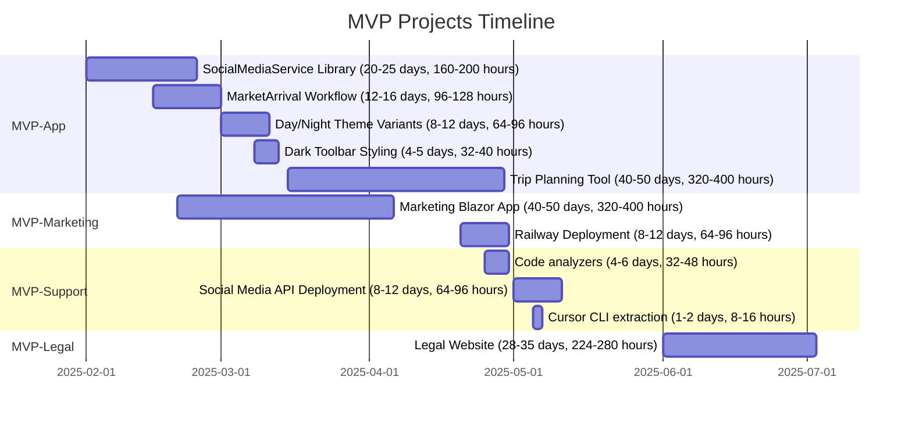

# Project Status

This document tracks the current status of each MVP project in the FunWasHad solution.

*Last updated: 2026-01-27*

---

## Overview

| Project | Status | High Priority | Medium Priority | Total Items |
|---------|--------|---------------|-----------------|-------------|
| MVP-App | 🔴 Planning | 2 | 3 | 5 |
| MVP-Marketing | 🔴 Planning | 0 | 2 | 2 |
| MVP-Support | 🔴 Planning | 1 | 3 | 4 |
| MVP-Legal | 🔴 Planning | 1 | 0 | 1 |

**Legend:**
- 🟢 **Active** - Work in progress
- 🔴 **Planning** - Not yet started, in planning phase
- 🟡 **Blocked** - Blocked by dependencies or issues
- ⚪ **Not Started** - No items assigned
- ✅ **Complete** - All items completed

---

## Project Timeline

The following Gantt chart shows the planned timeline for MVP projects:

*Note: Dates are estimates and subject to change based on priorities and resource availability.*

---

## MVP-App

**Status:** 🔴 Planning  
**Focus:** Mobile application features and user experience

### High Priority Items (2)
- [ ] Create a SocialMediaService library for client side operation
- [ ] MarketArrival workflow implementation

### Medium Priority Items (3)
- [ ] Day and night theme variants
- [ ] Dark toolbar styling
- [ ] Trip planning tool (Blazor website + mobile integration)

### Progress Summary
- **Total Items:** 5
- **Completed:** 0
- **In Progress:** 0
- **Pending:** 5

### Notes
- Core mobile app functionality is operational
- Focus areas: social media integration, location-based workflows, UI enhancements, and trip planning features

---

## MVP-Marketing

**Status:** 🔴 Planning  
**Focus:** Marketing content management and administration

### High Priority Items (0)
*None currently*

### Medium Priority Items (2)
- [ ] Marketing Blazor application for API management
- [ ] Railway deployment and CI/CD pipeline setup

### Progress Summary
- **Total Items:** 2
- **Completed:** 0
- **In Progress:** 0
- **Pending:** 2

### Notes
- Marketing API is operational and tested
- Pending: Administrative interface and deployment automation

---

## MVP-Support

**Status:** 🔴 Planning  
**Focus:** Infrastructure and support services

### High Priority Items (1)
- [ ] Update extension to execute prompts via Cursor agent in WSL

### Medium Priority Items (3)
- [ ] Railway deployment for Social Media API
- [ ] Extract Cursor CLI (PowerShell module, FWH.Documentation.Sync) to `sharpninja/cursor-cli` on GitHub *(FWH.CLI.Agent removed per MVP-SUPPORT-007)*
- [ ] Convert solution to XML format

### Completed
- [x] **MVP-SUPPORT-003:** Code analyzers *(completed 2026-01-27)*

### Progress Summary
- **Total Items:** 4
- **Completed:** 1 (MVP-SUPPORT-003: Code analyzers)
- **In Progress:** 0
- **Pending:** 3

### Notes
- Extension update for Cursor agent integration is high priority
- Social Media API project is planned but not yet created
- Cursor CLI (powershell prompts, doc-sync) to be moved to sibling repo sharpninja/cursor-cli

---

## MVP-Legal

**Status:** 🔴 Planning  
**Focus:** Legal compliance and documentation

### High Priority Items (1)
- [ ] Legal website for EULA, Privacy Policy, and Corporate Contact information

### Medium Priority Items (0)
*None currently*

### Progress Summary
- **Total Items:** 1
- **Completed:** 0
- **In Progress:** 0
- **Pending:** 1

### Notes
- Legal website project defined
- Focus: Create web application for hosting legal notices, EULA, Privacy Policy, and corporate contact information

---

## Overall Statistics

- **Total Projects:** 4
- **Active Projects:** 0
- **Planning Projects:** 3
- **Not Started Projects:** 1
- **Total TODO Items:** 12
- **Completed Items:** 1 (MVP-SUPPORT-003: Code analyzers)
- **Completion Rate:** 8% (1/12)

---

## Recent Updates

### 2026-01-27
- Requirements documents updated to reflect current code: Location API reverse geocoding (GET /api/locations/address), location tracking (UI on every poll; local-only persistence), movement state on startup, FR-CODE-001 (Code Analyzers) marked implemented
- MVP-SUPPORT-003 (Code analyzers) completed

### 2025-01-27
- Created project-based organization structure
- Initialized Status document
- All projects currently in planning phase

---

## Next Steps

1. **MVP-App:** Begin implementation of high-priority items (SocialMediaService, MarketArrival workflow)
2. **MVP-Marketing:** Start development of Marketing Blazor application
3. **MVP-Support:** Add code analyzers; create SocialMediaApi project and plan deployment; extract Cursor CLI to sharpninja/cursor-cli
4. **MVP-Legal:** Begin development of legal website for EULA, Privacy Policy, and corporate contact information

---

*For detailed task breakdown, see [TODO.md](./TODO.md)*
