# Technical Requirements - FunWasHad Application

**Version:** 2.4
**Last Updated:** 2026-01-27
**Application:** FunWasHad
**Target Framework:** .NET 9

---

## 1. Architecture Overview

### TR-ARCH-000: Architectural Overview

- Mobile User Interface (offline-first) with local SQLite persistence implemented with AvaloniaUI.
- Backend REST APIs using ASP.NET Core.
- Used platform-agnostic libraries where available.  Only create platform-wrappers when necessary.
- Each system will implement Gang of Four MVC pattern using the `GPS.SimpleMVC` library.
- Entity Framework Core will be used for data access with PostgreSQL for backend persistence and SQLite for mobile persistence.
- PlantUML Activity Diagrams define workflows.  No hard-coded state transitions.
- Every public feature must have appropriate Unit Tests and be part of an integration test suite.

### TR-ARCH-001: Multi-project solution

The solution SHALL be organized into multiple projects separating mobile UI, shared libraries, and backend APIs.

**Status:** ✅ Implemented

### TR-ARCH-002: Backend + Mobile architecture

The application SHALL consist of:

- A mobile client (offline-first) with local persistence.
- Backend REST APIs providing business/location/marketing features.
- Real-time location tracking with movement state detection.
- Automatic database migrations.

**Status:** ✅ Implemented

### TR-ARCH-003: Orchestration

The backend SHALL be runnable locally via .NET Aspire and containerized dependencies (Docker).

**Status:** ✅ Implemented

- Aspire AppHost with service orchestration
- PostgreSQL with persistent Docker volumes
- PgAdmin for database management
- Automatic service discovery

---

## 2. Solution Components

### TR-COMP-001: App host

The `FWH.AppHost` project SHALL orchestrate backend services for local development (Aspire).

**Status:** ✅ Implemented

- Service orchestration with Aspire
- Fixed HTTP/HTTPS ports for Android compatibility
- PostgreSQL with persistent volume configuration
- PgAdmin integration

### TR-COMP-002: Marketing API

The `FWH.MarketingApi` project SHALL implement REST endpoints for:

- marketing data retrieval (theme/coupons/menu/news)
- nearby business discovery
- feedback submission and attachment upload

**Status:** ✅ Implemented

- MarketingController with complete marketing endpoints
- FeedbackController with attachment support
- Entity Framework Core context
- Database models for all entities
- Validation and error handling

### TR-COMP-003: Location API

The `FWH.Location.Api` project SHALL provide location-related server capabilities:

- Nearby business discovery and closest-business lookup
- Reverse geocoding (address resolution from coordinates) via `GET /api/locations/address`
- Location confirmations (user-reported business at GPS coordinates)
- Automatic database migrations
- PostgreSQL persistence

**Status:** ✅ Implemented

- `GET /api/locations/nearby` – nearby businesses by lat/lon and radius
- `GET /api/locations/closest` – closest business within max distance
- `GET /api/locations/address` – reverse geocode to address (business or Overpass/OSM when no business)
- `POST /api/locations/confirmed` – record location confirmation
- ILocationService (Overpass-based) used for address and business data
- Automatic migrations on startup; connection to PostgreSQL

### TR-COMP-004: Mobile client

The `FWH.Mobile` projects SHALL implement:

- GPS/location tracking with speed calculation
- Movement state detection (Stationary/Walking/Riding)
- Activity tracking with statistics
- Location-triggered workflows
- UI integration for workflows
- Local persistence for workflow state and user data
- Real-time notifications

**Status:** ✅ Implemented

- GPS service with platform-specific implementations
- Location tracking service with configurable thresholds
- Activity tracking with notifications
- Movement state detection with speed-based classification
- ActivityTrackingService and ViewModel

### TR-COMP-005: Movement Detection System

The mobile client SHALL implement intelligent movement detection:

- Real-time speed calculation from GPS coordinates
- State classification: Stationary, Walking (<5 mph), Riding (≥5 mph)
- Automatic state transition detection and events
- Activity statistics tracking (distance, duration, speeds)
- User notifications for state changes

**Status:** ✅ Implemented

- GpsCalculator with speed calculation methods
- MovementState enum with Walking and Riding states
- Speed-based state determination
- MovementStateChangedEventArgs with speed information
- ActivityTrackingService with full statistics

---

## 3. Data Storage and Persistence

### TR-DATA-001: PostgreSQL for backend persistence

Backend services SHALL use PostgreSQL for persistent storage, including business marketing entities and feedback.

**Status:** ✅ Implemented

- PostgreSQL configured via Aspire
- Persistent Docker volume: `funwashad-postgres-data`
- Automatic database creation on first run

### TR-DATA-002: EF Core contexts

Backend projects SHALL use Entity Framework Core with explicit model configuration.

**Status:** ✅ Implemented

- LocationDbContext for Location API
- Npgsql.EntityFrameworkCore.PostgreSQL provider

### TR-DATA-003: Local SQLite for mobile persistence

The mobile client SHALL use local SQLite for workflow state persistence and other offline data.

**Status:** ✅ Implemented

- NotesDbContext for mobile data
- Automatic database initialization

### TR-DATA-004: UTC timestamps

All persisted timestamps SHALL be stored in UTC (`DateTimeOffset`) and queries SHALL operate in UTC.

**Status:** ✅ Implemented

- All timestamp columns use TIMESTAMPTZ
- Migration scripts specify UTC timezone

### TR-DATA-005: Database Migrations

The Location API SHALL apply database migrations automatically on startup.

**Status:** ✅ Implemented

- DatabaseMigrationService with automatic migration
- Migration tracking in `__migrations` table
- Transactional migration execution with rollback on error
- SQL scripts in Migrations folder
- Idempotent migrations (safe to run multiple times)

### TR-DATA-006: Persistent Storage

Docker volumes SHALL be used for PostgreSQL data persistence across container restarts.

**Status:** ✅ Implemented

- Named volume: `funwashad-postgres-data`
- Data persists across container restarts
- Backup and restore capabilities via PowerShell scripts

---

## 4. Location Workflow Engine Integration

### TR-WF-001: Workflow definitions as PlantUML

Workflow definitions SHALL be authored as PlantUML (`.puml`) and shipped with the mobile client.

**Status:** ✅ Implemented

### TR-WF-002: New location workflow file

The mobile client SHALL load `new-location.puml` and start or resume it when a `NewLocationAddress` event occurs.

**Status:** ✅ Implemented

- LocationWorkflowService handles new location events
- Loads new-location.puml from application resources
- Automatic workflow start/resume logic
- Integration with LocationTrackingService

### TR-WF-003: Address-keyed workflow IDs

The mobile client SHALL generate a deterministic workflow key based on the address (e.g., `location:{sha256(address)}`) so workflow state can be retrieved reliably.

**Status:** ✅ Implemented

- GenerateAddressHash() method using SHA256
- Workflow ID format: `location:{hash}`
- Deterministic ID generation
- Enables reliable workflow retrieval

### TR-WF-004: Workflow resumption query

The mobile persistence layer SHALL support querying workflow definitions by ID/name pattern and by creation time window (24 hours).

**Status:** ✅ Implemented

- IWorkflowRepository.FindByNamePatternAsync() method
- Time window filtering (24 hours)
- Pattern matching on workflow IDs
- Efficient database queries

---

## 5. Location Tracking and Movement Detection

### TR-LOC-001: GPS Service

The mobile client SHALL provide platform-specific GPS services:

- Android GPS service using Android Location APIs
- iOS GPS service using Core Location
- Desktop GPS service with mock/simulation support
- Cross-platform IGpsService interface

**Status:** ✅ Implemented

- Platform-specific implementations
- Factory pattern for service creation
- Permission handling

### TR-LOC-002: Location Tracking Service

The mobile client SHALL implement continuous location tracking:

- Configurable polling interval (default: 30 seconds)
- Minimum distance threshold (default: 50 meters) for persisting to local SQLite (device location is not sent to backend APIs)
- UI notified on every poll via `LocationUpdated`; persistence to local DB gated by minimum distance
- Event system for location changes, address changes, and movement state

**Status:** ✅ Implemented

- ILocationTrackingService interface
- LocationTrackingService implementation; local-only device location persistence (NotesDbContext)
- Configurable thresholds and intervals
- LocationUpdated (every poll for UI), LocationUpdateFailed, NewLocationAddress, MovementStateChanged events

### TR-LOC-003: Speed Calculation

The system SHALL calculate device speed from GPS coordinates:

- Haversine formula for distance calculation
- Time-based speed calculation (distance / time)
- Unit conversions (m/s, mph, km/h)
- Speed validation and filtering

**Status:** ✅ Implemented

- GpsCalculator utility class
- CalculateSpeed methods
- Unit conversion methods
- Speed classification helpers

### TR-LOC-004: Movement State Detection

The system SHALL detect and classify movement states:

- **Stationary:** Movement < 10m with consistent small movements
- **Walking:** Continuous motion < 5 mph
- **Riding:** Continuous motion ≥ 5 mph
- Configurable speed threshold (default: 5.0 mph)
- State history tracking (last 10 samples)
- State determined on startup from initial location (GPS speed or default Stationary); Unknown is not retained once location is available

**Status:** ✅ Implemented

- MovementState enum (Unknown, Stationary, Walking, Riding, Moving)
- State determined on startup and on first fix in tracking loop; Unknown treated as Stationary once location exists
- State determination based on speed and movement patterns; configurable thresholds
- Statistical analysis of movement history

### TR-LOC-005: State Transition Events

The system SHALL fire events on movement state changes:

- MovementStateChanged event with detailed information
- Previous and current states
- Transition timestamp
- Speed information (m/s, mph, km/h)
- Duration in previous state
- Trigger distance

**Status:** ✅ Implemented

- MovementStateChangedEventArgs class
- Event properties with speed and duration
- Automatic event firing on transitions
- toString() formatting for logging

### TR-LOC-006: Activity Tracking

The system SHALL track user activities based on movement:

- Automatic activity start/stop detection
- Distance tracking (miles, meters)
- Duration tracking
- Speed statistics (current, average, maximum)
- Transition counting
- User notifications

**Status:** ✅ Implemented

- ActivityTrackingService
- Activity statistics tracking
- Notification integration
- ActivityTrackingViewModel for UI binding

### TR-LOC-007: Movement State Logging

The system SHALL provide comprehensive logging for movement detection:

- State transition logging with emojis
- Detailed movement analysis
- Location update logging
- Formatted console output

**Status:** ✅ Implemented

- MovementStateLogger service
- Color-coded console output
- Detailed transition messages
- Real-time monitoring

### TR-MOBILE-001: Local Device Location Tracking

The mobile client SHALL store device GPS location history **locally on the device only** and use it to drive movement/activity features:

- **Purpose**: Track user movement patterns for activity analysis and contextual workflows.
- **Privacy**: Location data is never sent to any backend API; it remains in the on-device SQLite database.
- **Retention**: Location history retention MUST be configurable (default: 30 days).
- **Schema**: The `DeviceLocationHistory` table SHALL include latitude, longitude, accuracy, movement state, timestamp, and reverse-geocoded address.
- **Stationary Places**: When the user remains stationary beyond a configured threshold, the system SHALL store a `StationaryPlaceEntity` with address and optional business information.

**Status:** ✅ Implemented

- `NotesDbContext.DeviceLocationHistory` and `StationaryPlaces` DbSets
- `LocationTrackingService` with local-only device location persistence
- `MovementStateViewModel`, `MapView`, and `ActivityTrackingViewModel` consuming tracking events
- Reverse geocoding + business lookup via `ILocationService`
- Theme updates via `IThemeService` (business or city themes)

#### TR-MOBILE-001 Activity Diagram – Movement Tracking Flow

The following PlantUML activity diagram defines the end-to-end movement tracking, storage, and UI integration flow for TR-MOBILE-001:

```plantuml
@startuml TR-MOBILE-001-MovementTracking
title TR-MOBILE-001 – Movement Tracking and Storage

start

:'App' startup;
:Initialize database (NotesDbContext);
:Initialize workflow and theme services;

partition "App" {
  :Resolve ILocationTrackingService;
  :StartTrackingAsync();
}

partition "LocationTrackingService" {
  :Create tracking CancellationTokenSource;
  :Start TrackLocationLoopAsync (background task);
}

partition "AndroidGpsService" {
  if ("Location providers enabled?" ) then (yes)
    :Ensure persistent GPS listener registered;
  else (no)
    :Log warning and throw LocationServicesException;
    -> [error] Back to LocationTrackingService;
  endif
}

repeat
  partition "LocationTrackingService" {
    :Call GetCurrentLocationAsync(cancellationToken);
  }

  partition "AndroidGpsService" {
    if ("Recent in-memory fix available?" ) then (yes)
      :Return latest GpsCoordinates from listener;
    else (no)
      :Check last-known location from system providers;
      if ("Recent last-known location?" ) then (yes)
        :Return last-known GpsCoordinates;
      else (no)
        :Wait (<= LocationTimeoutSeconds) for next listener fix;
        if ("Fix received before timeout?" ) then (yes)
          :Return new GpsCoordinates;
        else (no)
          :Return null or stale fallback;
        endif
      endif
    endif
  }

  partition "LocationTrackingService" {
    if ("Got valid GpsCoordinates?" ) then (yes)
      :Update LastKnownLocation;
      :Compute distance from _lastReportedLocation;
      :Compute speed (device speed or calculated);
      :Update CurrentSpeed and MovementState (Stationary/Walking/Riding/Moving);

      :Raise LocationUpdated event;
      :Raise MovementStateChanged event (if state changed);

      if ("Distance >= MinimumDistanceMeters?" ) then (yes)
        :Persist DeviceLocationEntity to DeviceLocationHistory (SQLite);
        :Update _lastReportedLocation and timestamps;
      else (no)
        :Skip persistence (UI still updated);
      endif

      if ("MovementState == Stationary?" ) then (yes)
        :Start / reset stationary countdown;
      else (no)
        :Cancel stationary countdown (if running);
      endif
    else (no)
      :Log warning: no valid GPS coordinates;
    endif
  }

  partition "Stationary Countdown" {
    if ("Countdown elapsed while still Stationary?" ) then (yes)
      :Invoke CheckForAddressChangeAsync(last stationary location);
    else (no)
      :Countdown cancelled or restarted;
    endif
  }

  partition "LocationService / Reverse Geocode" {
    :Resolve human-readable address (GetAddressAsync);
    :Resolve closest business (GetClosestBusinessAsync);
    if ("Address changed?" ) then (yes)
      :Update CurrentAddress;
      :Raise NewLocationAddress event;
      :Save StationaryPlaceEntity;
    endif
  }

  partition "ThemeService" {
    if ("Business with Id found?" ) then (yes)
      :ApplyBusinessThemeAsync(businessId);
    else (no)
      :Try ApplyCityThemeAsync(city/state/country);
    endif
  }

  partition "ActivityTrackingService" {
    :Handle MovementStateChanged;
    if ("Transition into Walking or Riding?" ) then (yes)
      :Start / transition activity;
      :Show notification (walking/riding started);
    endif
    if ("Transition to Stationary from Walking/Riding?" ) then (yes)
      :End activity;
      :Show summary notification (duration, distance, speeds);
    endif
  }

  partition "UI (MovementStateViewModel, MapView, ActivityTrackingViewModel)" {
    :Update movement state text, emoji, colors;
    :Update speed text (mph/kmh);
    :Update coordinates and address display;
    :Update map marker emoji and center on location;
  }

  :Wait DispatchInterval (e.g., 1s);
repeat while (Tracking not cancelled?) is (yes)

stop

@enduml
```

---

## 6. API Requirements

### TR-API-001: REST conventions

Backend APIs SHALL expose REST endpoints using JSON request/response payloads.

**Status:** ✅ Implemented

### TR-API-002: Marketing endpoints

The Marketing API SHALL expose endpoints equivalent to:

- `GET /api/marketing/{businessId}` (complete marketing payload)
- `GET /api/marketing/{businessId}/theme`
- `GET /api/marketing/{businessId}/coupons`
- `GET /api/marketing/{businessId}/menu`
- `GET /api/marketing/{businessId}/menu/categories`
- `GET /api/marketing/{businessId}/news`
- `GET /api/marketing/nearby`

**Status:** ✅ Implemented

- All endpoints implemented in MarketingController
- Complete marketing data retrieval
- Filtering for active/published content
- EF Core with Include queries
- Response models defined
- **Pagination:** All list endpoints support pagination (page, pageSize parameters)
- **PostGIS Spatial Queries:** Nearby businesses endpoint uses PostGIS for efficient spatial queries with automatic fallback

### TR-API-003: Feedback endpoints

The Marketing API SHALL expose endpoints equivalent to:

- `POST /api/feedback` (submit feedback)
- `GET /api/feedback/{id}` (retrieve feedback)
- `POST /api/feedback/{feedbackId}/attachments/image`
- `POST /api/feedback/{feedbackId}/attachments/video`

**Status:** ✅ Implemented

- FeedbackController with all endpoints
- Image and video attachment support
- File size validation (50MB limit)
- Content type validation
- Attachment metadata persistence

### TR-API-004: Validation

APIs SHALL validate required fields and reject invalid payloads (e.g., rating outside 1–5).

**Status:** ✅ Implemented (for Location API)

### TR-API-005: Location API Endpoints

The Location API SHALL expose endpoints for location and address resolution:

- `GET /api/locations/nearby` – nearby businesses by latitude, longitude, radius
- `GET /api/locations/closest` – closest business within max distance
- `GET /api/locations/address` – reverse geocode coordinates to address (business or Overpass/OSM when no business)
- `POST /api/locations/confirmed` – record location confirmation with business and user coordinates
- Request validation for latitude/longitude and distance parameters

**Status:** ✅ Implemented

- LocationsController with GetNearbyAsync, GetClosestAsync, GetAddressAsync, LocationConfirmed
- ILocationService (Overpass-based) for address and business data
- Request validation; PostgreSQL persistence for confirmations

### TR-API-006: CORS Configuration

APIs SHALL support cross-origin requests for mobile clients:

- Android emulator access via `http://10.0.2.2:4748`
- Desktop access via `https://localhost:4747`
- Physical device access via machine IP

**Status:** ✅ Implemented

- Fixed HTTP/HTTPS ports
- External HTTP endpoints enabled
- Android-compatible configuration

---

## 7. Media Handling

### TR-MEDIA-001: Attachment upload handling

The backend SHALL accept multipart uploads for feedback attachments and persist attachment metadata.

**Status:** ✅ Implemented

- Multipart form data handling
- File stream processing
- Attachment metadata persistence
- Database storage of file information

### TR-MEDIA-002: Content type support

The backend SHALL persist the attachment `ContentType` and use it to determine processing rules.

**Status:** ✅ Implemented

- Content type validation
- Allowed types: JPEG, PNG, GIF, WebP for images
- Allowed types: MP4, QuickTime, AVI for videos
- Content-based processing rules

---

## 8. Code Organization Requirements

### TR-CODE-001: Separation of concerns

Code SHALL be organized such that:

- API controllers handle HTTP concerns only.
- Domain/data models represent persisted entities.
- Data access is encapsulated in DbContexts and repositories.
- Workflow logic is encapsulated in workflow services/action handlers.

**Status:** ✅ Implemented

### TR-CODE-002: Marketing API folders

The `FWH.MarketingApi` project SHALL maintain at minimum:

- `Controllers` for HTTP endpoints
- `Models` for entity and request/response models
- `Data` for EF Core context and configuration

**Status:** ✅ Implemented

- Controllers: MarketingController, FeedbackController
- Models: BusinessModels.cs, FeedbackModels.cs
- Data: MarketingDbContext, DatabaseMigrationService
- Complete folder structure

### TR-CODE-003: Mobile folders

The `FWH.Mobile` projects SHALL maintain:

- `Services` for location tracking and workflow services
- A data project (e.g., `FWH.Mobile.Data`) for EF/SQLite persistence and repository abstractions
- `ViewModels` for UI data binding
- Platform-specific implementations

**Status:** ✅ Implemented

- Services folder with location, activity, and notification services
- Data project with DbContext and repositories
- ViewModels with MVVM pattern
- Android/iOS/Desktop platform projects

### TR-CODE-004: Shared libraries

Cross-cutting logic (workflow engine, imaging, common models) SHALL live in shared projects (e.g., `FWH.Common.*`).

**Status:** ✅ Implemented

- FWH.Common.Location - Location services and models
- FWH.Common.Chat - Chat and notification services
- FWH.Common.Workflow - Workflow engine
- FWH.Common.Imaging - Image processing

### TR-CODE-005: Service Registration

Services SHALL be registered in dependency injection container with appropriate lifetimes:

- Singleton for stateful services (location tracking, activity tracking)
- Scoped for request-scoped services
- Transient for stateless operations

**Status:** ✅ Implemented

- All services registered in App.axaml.cs
- Proper lifetime management
- Factory patterns for platform-specific services

---

## 9. Deployment and Local Development

### TR-DEV-001: Installation bootstrap

The repository SHALL include scripts to bootstrap local development including Docker checks and database initialization.

**Status:** ✅ Implemented

- `scripts/Initialize-Installation.ps1` - Complete installation automation
- `scripts/Start-Application.ps1` - Application startup
- `scripts/Backup-Database.ps1` - Database backup
- `scripts/Restore-Database.ps1` - Database restore
- `scripts/Clean-DockerResources.ps1` - Docker cleanup
- Comprehensive documentation in `scripts/README.md`

### TR-DEV-002: Environment configuration

Backend projects SHALL provide runtime configuration via `appsettings.json` and environment variable overrides.

**Status:** ✅ Implemented

- Configuration via appsettings.json
- Environment variable support
- Aspire configuration integration

### TR-DEV-003: Docker Volume Management

PostgreSQL data SHALL persist across container restarts using Docker volumes.

**Status:** ✅ Implemented

- Named volume: `funwashad-postgres-data`
- Configured in Aspire AppHost
- Backup and restore scripts
- Volume inspection commands

### TR-DEV-004: Automated Setup

The installation process SHALL be fully automated with one command.

**Status:** ✅ Implemented

- One-command installation
- Prerequisite checks
- Automatic volume creation
- Build verification
- Clear next steps

### TR-DEV-005: Development Scripts

The repository SHALL provide PowerShell scripts for common operations.

**Status:** ✅ Implemented

- Installation script with validation
- Application startup script
- Database backup/restore scripts
- Docker cleanup script
- Color-coded output with status indicators

---

## 10. Quality Requirements

### TR-QUAL-001: Automated tests

Where applicable, solution components SHALL include automated tests (e.g., API controller tests, workflow library tests).

**Status:** ✅ Partially Implemented

- GpsCalculator tests (distance, speed, conversions)
- Movement state tests
- Scenario-based tests
- 84+ tests implemented

### TR-QUAL-002: Logging

Services SHALL emit structured logs for key events (e.g., address change handling, workflow start/resume, API requests).

**Status:** ✅ Implemented

- ILogger integration throughout
- Movement state logging
- Activity tracking logging
- API request logging
- Migration process logging

### TR-QUAL-003: Error Handling

All services SHALL implement comprehensive error handling:

- Try-catch blocks in critical paths
- Graceful degradation
- User-friendly error messages
- Logging of exceptions

**Status:** ✅ Implemented

- Error handling in location tracking
- Transaction rollback in migrations
- Notification system for errors
- Detailed error logging

### TR-QUAL-004: Performance

The system SHALL meet performance requirements:

- Location updates < 100ms processing time
- State determination < 200ms
- Minimal battery impact (< 0.2% additional)
- Efficient GPS polling

**Status:** ✅ Implemented

- Optimized algorithms
- Configurable polling intervals
- Minimal CPU overhead
- Battery-efficient design

### TR-QUAL-005: Logging channel (ILogger only)

Application code SHALL NOT use `Console.WriteLine` or other direct console output for logging. All logging SHALL use `ILogger` (or equivalent structured logging abstraction) so that output can be routed, filtered, and persisted consistently.

**Status:** ✅ Implemented (policy)

---

## 11. User Experience Requirements

### TR-UX-001: Notifications

The system SHALL provide user notifications for important events:

- Activity start/stop
- State transitions (walking/riding)
- Error conditions
- Chat-based notifications

**Status:** ✅ Implemented

- INotificationService interface
- ChatNotificationService implementation
- Activity tracking notifications
- State transition notifications
- Emoji-based visual indicators

### TR-UX-002: Activity Summary

Users SHALL be able to view activity summaries:

- Current activity type
- Duration
- Distance traveled
- Speed statistics
- Transition count

**Status:** ✅ Implemented

- GetActivitySummary() method
- ActivityTrackingViewModel
- Real-time updates
- Formatted display

### TR-UX-003: State Visualization

The system SHALL provide visual feedback for movement states:

- Color-coded indicators
- Emoji representations
- Real-time updates
- Clear state labels

**Status:** ✅ Implemented

- MovementStateLogger with emojis
- Color-coded console output
- State-specific messages
- Visual transition indicators

---

## 12. Configuration Requirements

### TR-CONFIG-001: Configurable Thresholds

Movement detection SHALL support configurable thresholds:

- Minimum distance for updates (default: 50m)
- Polling interval (default: 30s)
- Stationary threshold duration (default: 3min)
- Stationary distance threshold (default: 10m)
- Walking/Riding speed threshold (default: 5 mph)

**Status:** ✅ Implemented

- All thresholds configurable via properties
- Runtime adjustment support
- Validation of threshold values
- Documentation of recommended values

### TR-CONFIG-002: Platform-Specific Configuration

Mobile clients SHALL support platform-specific configuration:

- Android: HTTP endpoint `http://10.0.2.2:4748`
- iOS: HTTPS endpoint `https://localhost:4747`
- Desktop: HTTPS endpoint `https://localhost:4747`
- Physical devices: Environment variable for IP

**Status:** ✅ Implemented

- Platform detection at runtime
- Appropriate endpoint selection
- Environment variable override support
- Documentation in code

---

## 13. Documentation Requirements

### TR-DOC-001: Implementation Documentation

Each major feature SHALL have comprehensive documentation:

- Implementation summary
- Usage examples
- Configuration options
- Troubleshooting guides

**Status:** ✅ Implemented

- 10+ detailed documentation files
- Code examples throughout
- Troubleshooting sections
- Quick reference guides

### TR-DOC-002: API Documentation

API endpoints SHALL be documented with:

- Endpoint URL and method
- Request/response models
- Error codes
- Example requests

**Status:** ✅ Implemented

- Complete API documentation in docs/API-Documentation.md
- All Location API endpoints documented
- All Marketing API endpoints documented
- All Feedback API endpoints documented
- Request/response examples
- Error codes and handling
- Example curl commands

### TR-DOC-003: Script Documentation

PowerShell scripts SHALL have comprehensive usage documentation.

**Status:** ✅ Implemented

- scripts/README.md with full documentation
- Parameter descriptions
- Usage examples
- Troubleshooting guide

---

## 14. Testing Requirements

### TR-TEST-001: Unit Tests

Critical components SHALL have unit test coverage:

- GPS calculations (distance, speed)
- Movement state detection
- State transitions
- Speed classifications

**Status:** ✅ Implemented

- 52 speed calculation tests
- 32 movement state tests
- Edge case coverage
- Real-world scenario tests

### TR-TEST-002: Integration Tests

System SHALL support integration testing:

- End-to-end location tracking
- Database migrations
- API endpoints

**Status:** ✅ Implemented

- ChatService_IntegrationTests.cs - Chat workflow integration
- FunWasHadWorkflowIntegrationTests.cs - Complete workflow testing
- WorkflowServiceIntegrationTests.cs - Workflow persistence
- API integration test infrastructure with WebApplicationFactory
- Database migration testing

### TR-TEST-003: Manual Testing

Documentation SHALL provide manual testing procedures:

- GPS simulation instructions
- State transition verification
- Activity tracking validation

**Status:** ✅ Implemented

- Testing sections in documentation
- Android emulator instructions
- Verification procedures

---

## 15. Security Requirements

### TR-SEC-001: Data Validation

All user input SHALL be validated:

- GPS coordinate ranges
- Speed values
- Timestamp formats

**Status:** ✅ Implemented

- Check constraints in database
- Validation in API endpoints
- Data annotation validation

### TR-SEC-002: SQL Injection Prevention

Database queries SHALL use parameterized queries:

- No string concatenation for SQL
- Parameterized commands in migrations
- EF Core for queries

**Status:** ✅ Implemented

- Parameterized queries throughout
- EF Core usage
- No string concatenation

### TR-SEC-003: Connection String Security

Database connection strings SHALL be stored securely:

- Not in source code
- Configuration files
- Environment variables

**Status:** ✅ Implemented

- Configuration via Aspire
- No hardcoded credentials
- Environment variable support

---

## 16. Planned Technical Requirements

The following technical requirements are planned for future implementation. See [TODO.md](./TODO.md) for detailed task breakdowns.

### TR-PLANNED-001: Social Media Service Library (MVP-APP-001)

The system SHALL provide a client-side service library for managing social media platform defaults.

**Status:** 🔴 Planned  
**Reference:** MVP-APP-001  
**Estimate:** 15-20 days, 120-160 hours

- Service interface and implementation for managing social media platform defaults
- Accompanying SocialMediaApi project for template and default distribution
- Client-side only operation (no API required for sharing)

### TR-PLANNED-002: Social Media API (MVP-APP-001)

The system SHALL provide a Social Media API for disseminating templates and defaults to mobile apps.

**Status:** 🔴 Planned  
**Reference:** MVP-APP-001

- REST API for template distribution
- Default configuration management
- Integration with mobile applications

### TR-PLANNED-003: Market Arrival Workflow (MVP-APP-002)

The mobile client SHALL detect tourism market changes and trigger a MarketArrival workflow on app startup.

**Status:** 🔴 Planned  
**Reference:** MVP-APP-002  
**Estimate:** 10-15 days, 80-120 hours

- Location retrieval on app startup
- Tourism market comparison logic
- MarketArrival workflow definition in PlantUML (.puml)
- Workflow execution integration

### TR-PLANNED-004: Theme Variants Support (MVP-APP-003)

The system SHALL support day and night theme variants for business and city themes.

**Status:** 🔴 Planned  
**Reference:** MVP-APP-003  
**Estimate:** 5-10 days, 40-80 hours

- Database schema updates for theme variants
- API endpoint extensions for variant support
- Mobile app automatic switching based on system settings
- ThemeService updates for variant detection

### TR-PLANNED-005: UI Styling Updates (MVP-APP-004)

The mobile client SHALL implement dark toolbar styling with transparent button backgrounds.

**Status:** 🔴 Planned  
**Reference:** MVP-APP-004  
**Estimate:** 3-5 days, 24-40 hours

- MainView toolbar styling updates
- Transparent button backgrounds
- Border removal from toolbar buttons
- Consistent dark appearance across views

### TR-PLANNED-006: Trip Planning Application (MVP-APP-005)

The system SHALL provide a Blazor web application for trip planning with QR code integration.

**Status:** 🔴 Planned  
**Reference:** MVP-APP-005  
**Estimate:** 30-40 days, 240-320 hours

- Blazor web application project
- PostgreSQL database schema for trip itineraries
- Itinerary CRUD operations
- QR code generation and scanning
- Mobile app integration for itinerary retrieval
- Secure authentication via QR codes

### TR-PLANNED-007: Marketing Administration Application (MVP-MARKETING-001)

The system SHALL provide a Blazor web application for managing marketing content.

**Status:** 🔴 Planned  
**Reference:** MVP-MARKETING-001  
**Estimate:** 30-40 days, 240-320 hours

- Blazor web application project
- CRUD interfaces for all marketing entities
- Authentication and authorization
- Dashboard and analytics views
- Integration with existing Marketing API

### TR-PLANNED-008: Marketing Website Deployment (MVP-MARKETING-002)

The Marketing Blazor application SHALL be deployed to Railway with CI/CD automation.

**Status:** 🔴 Planned  
**Reference:** MVP-MARKETING-002  
**Estimate:** 5-10 days, 40-80 hours

- Railway service configuration
- GitHub Actions workflows
- Automated deployment pipelines
- Health checks and monitoring

### TR-PLANNED-009: Social Media API Deployment (MVP-SUPPORT-001)

The Social Media API SHALL be deployed to Railway with CI/CD automation.

**Status:** 🔴 Planned  
**Reference:** MVP-SUPPORT-001  
**Estimate:** 5-10 days, 40-80 hours

- Railway service configuration
- GitHub Actions workflows
- Automated deployment pipelines
- Health checks and monitoring

### TR-PLANNED-010: Legal Website (MVP-LEGAL-001)

The system SHALL provide a website for hosting legal documentation.

**Status:** 🔴 Planned  
**Reference:** MVP-LEGAL-001  
**Estimate:** 20-30 days, 160-240 hours

- Web application (Blazor or static site)
- EULA, Privacy Policy, and Corporate Contact pages
- Responsive design
- Document versioning system
- Search functionality
- WCAG accessibility compliance
- Multi-language support

### TR-PLANNED-011: Cursor CLI Extraction (MVP-SUPPORT-002)

The FWH.Prompts PowerShell module, CLI-related scripts, FWH.Documentation.Sync, and their documentation SHALL be moved to a new sibling folder of the solution root and published as the `sharpninja/cursor-cli` GitHub repository. *(FWH.CLI.Agent was removed from this repo per MVP-SUPPORT-007.)*

**Status:** 🔴 Planned  
**Reference:** MVP-SUPPORT-002  
**Estimate:** 1-2 days, 8-16 hours

- New sibling folder (e.g. `cursor-cli`) at solution root's parent
- Move FWH.Prompts, Sync-Documentation.ps1, and related scripts
- Move FWH.Documentation.Sync project and docs *(FWH.CLI.Agent removed per MVP-SUPPORT-007)*
- Remove moved projects from FunWasHad.sln; update .vscode tasks/launch
- Git init, remote sharpninja/cursor-cli, push to GitHub

---

## Status Summary

### ✅ Fully Implemented (81 requirements)

- Architecture and orchestration with Aspire
- Location tracking system with GPS
- Movement state detection (Walking/Riding at 5 mph threshold)
- Activity tracking with comprehensive statistics
- Speed calculation and unit conversions
- Database migrations with automatic execution
- PostgreSQL persistent storage with Docker volumes
- PowerShell automation scripts for all operations
- Comprehensive documentation (10+ documents)
- Error handling and logging throughout
- User notifications via chat interface
- Configuration system with runtime adjustment
- **Marketing API with complete endpoint set**
- **Feedback system with attachment support**
- **Workflow location integration**
- **API documentation**
- **Integration test suite**

### ⚠️ Partially Implemented (0 requirements)

- All requirements are now fully implemented or have working implementations

### ❌ Not Implemented (0 requirements)

- All planned requirements have been implemented

### Banned Libraries

| Banned  | Alternative           |
| ------- | --------------------- |
| MediatR | Orchestrix.Mediator   |
| Moq     | NSubstitute           |
| Dapper  | Entity Framework Core |

### Testing Requirements

- Every public method must have unit tests for happy path, edge cases, and known bad data cases.
- Integration tests must cover end-to-end scenarios for critical workflows.
- Code coverage reports must be generated and maintained above 80%.
- Tests will be in xUnit framework.
- Tests will have proper names and categories and XML Doc descriptions of the feature being tested, expected data and expected behaviors.

### Code Documentation Requirements

- All public methods, classes, and properties must have XML Doc comments.
- XML Comments must reference the Functional and Technical requirements being implemented using the notation in the requirements documents.
- XMLDOC will be generated from all projects and included in NuGet packages where applicable.
- Code documentation must be kept up to date with code changes.
- Code documentation will be reviewed during code reviews for completeness and accuracy.
- Code documentation must include usage examples where applicable.
- Code documentation must include parameter descriptions and return value descriptions.
- Code documentation must include exception documentation for all thrown exceptions.
- Code documentation must follow standard conventions for clarity and consistency.
- Code documentation must be written in clear and concise language.
- Code documentation must be stored in the same repository as the code it documents.
- Code documentation must be versioned alongside the code it documents.
- Code documentation must be maintained as part of the development process.
- Code documentation must be included in the definition of done for all code changes.
- Code documentation must be updated whenever code changes are made that affect the documented functionality.
- Code documentation must be reviewed periodically to ensure it remains accurate and up to date.
- Markdown and XMLDOC will be used to generate API Documentation via DocX and published via GitHub Pages.

---

**Document Version:** 2.2
**Last Updated:** 2025-01-27
**Status:** Current
**Total Requirements:** 93 (81 completed, 12 planned)
**Completion Rate:** 87% (81/93)

**Recent Enhancements (2025-01-27):**
- PostGIS spatial queries for efficient nearby business searches
- Pagination on all list endpoints
- Enhanced API security with HMAC-SHA256 signing
- Blob storage for file uploads
- Comprehensive test coverage (245+ tests)

---

## Summary of Completed Features

### Location & Movement (15 requirements)

✅ GPS service with platform-specific implementations
✅ Location tracking with configurable thresholds
✅ Speed calculation from GPS coordinates
✅ Movement state detection (Stationary/Walking/Riding)
✅ Activity tracking with statistics
✅ State transition events
✅ Movement logging and monitoring

### Backend APIs (12 requirements)

✅ Location API with device tracking
✅ Marketing API with complete endpoints
✅ Feedback API with attachments
✅ Image and video upload support
✅ Data validation and error handling
✅ PostgreSQL persistence

### Data & Persistence (6 requirements)

✅ PostgreSQL with persistent Docker volumes
✅ Automatic database migrations
✅ EF Core contexts
✅ SQLite for mobile data
✅ UTC timestamp handling

### Workflows (4 requirements)

✅ PlantUML workflow definitions
✅ Location-based workflow triggering
✅ Address-keyed workflow IDs
✅ Workflow resumption queries

### Development & Deployment (10 requirements)

✅ Aspire orchestration
✅ Docker volume management
✅ PowerShell automation scripts
✅ Installation bootstrap
✅ Database backup/restore

### Quality & Testing (7 requirements)

✅ 245+ automated tests (increased from 84+)
✅ Integration test suite
✅ Comprehensive logging
✅ Error handling
✅ Performance optimization
✅ PostGIS spatial query optimization
✅ Pagination on all list endpoints

### Documentation (10 requirements)

✅ Technical requirements
✅ API documentation
✅ Implementation summaries
✅ Usage guides
✅ Troubleshooting
✅ Script documentation

### User Experience (6 requirements)

✅ Chat-based notifications
✅ Activity summaries
✅ State visualization
✅ Real-time updates

### Configuration (6 requirements)

✅ Configurable thresholds
✅ Platform-specific settings
✅ Runtime adjustment
✅ Environment variables

### Security (5 requirements)

✅ Input validation
✅ Parameterized queries
✅ Secure credentials
✅ GPS coordinate validation

---

## Recently Completed Requirements

### Session: 2025-01-08

**Completed:**

1. **TR-COMP-002** - Marketing API implementation (was: Planned)
2. **TR-API-002** - Marketing endpoints complete
3. **TR-API-003** - Feedback endpoints with attachments
4. **TR-MEDIA-001** - Attachment upload handling
5. **TR-MEDIA-002** - Content type support
6. **TR-CODE-002** - Marketing API folder structure
7. **TR-WF-002** - Location workflow integration
8. **TR-WF-003** - Address-keyed workflow IDs
9. **TR-WF-004** - Workflow resumption queries
10. **TR-DOC-002** - Complete API documentation
11. **TR-TEST-002** - Integration test suite

**Result:**

- 11 requirements upgraded from Partial/Planned to Fully Implemented
- Completion rate increased from 90% to 100%
- All core functionality operational
- Production-ready system

---

## 17. Change History

This section tracks all changes made to the Technical Requirements document.

### Version 2.4 (2026-01-27)

**Added:**
- TR-QUAL-005: Logging channel (ILogger only) — never use Console.WriteLine; always use ILogger.

**Changed:**
- TR-COMP-003 (Location API): Added reverse geocoding via `GET /api/locations/address`; document nearby, closest, address, confirmed endpoints; ILocationService (Overpass) for address/business.
- TR-LOC-002 (Location Tracking Service): Device location stored locally only (not sent to backend); UI notified on every poll via LocationUpdated; persistence to local DB gated by minimum distance.
- TR-LOC-004 (Movement State Detection): State determined on startup and on first fix; Unknown not retained once location exists.
- TR-API-005 (Location API Endpoints): Aligned with LocationsController (GET nearby, closest, address; POST confirmed); added address endpoint and Overpass-based resolution.

### Version 2.3 (2025-01-27)

**Added:**
- TR-PLANNED-012: Code Analyzers (MVP-SUPPORT-003)

**Changed:**
- Updated total requirements: 93 (81 completed, 12 planned)
- Updated completion rate: 87% (81/93)

### Version 2.2 (2025-01-27)

**Added:**
- TR-PLANNED-011: Cursor CLI Extraction (MVP-SUPPORT-002)

**Changed:**
- Updated total requirements: 92 (81 completed, 11 planned)
- Updated completion rate: 88% (81/92)

### Version 2.1 (2025-01-27)

**Added:**
- Section 16: Planned Technical Requirements
  - TR-PLANNED-001: Social Media Service Library (MVP-APP-001)
  - TR-PLANNED-002: Social Media API (MVP-APP-001)
  - TR-PLANNED-003: Market Arrival Workflow (MVP-APP-002)
  - TR-PLANNED-004: Theme Variants Support (MVP-APP-003)
  - TR-PLANNED-005: UI Styling Updates (MVP-APP-004)
  - TR-PLANNED-006: Trip Planning Application (MVP-APP-005)
  - TR-PLANNED-007: Marketing Administration Application (MVP-MARKETING-001)
  - TR-PLANNED-008: Marketing Website Deployment (MVP-MARKETING-002)
  - TR-PLANNED-009: Social Media API Deployment (MVP-SUPPORT-001)
  - TR-PLANNED-010: Legal Website (MVP-LEGAL-001)

**Changed:**
- Updated version from 2.0 to 2.1
- Updated last updated date to 2025-01-27
- Updated total requirements count: 81 completed, 10 planned (91 total)
- Updated completion rate: 89% (81/91)
- Added references to TODO identifiers for all planned requirements

### Version 2.0 (2025-01-27)

**Added:**
- Section 15: Planned Technical Requirements (initial version)
- Recent enhancements section
- Summary of completed features

**Changed:**
- Updated version from 1.x to 2.0
- Updated completion rate tracking
- Enhanced status summary

### Version 1.0 (2025-01-08)

**Initial Release:**
- Architecture overview and requirements
- Solution components specifications
- Data storage and persistence requirements
- Location workflow engine integration
- Location tracking and movement detection
- API requirements
- Media handling requirements
- Code organization requirements
- Deployment and local development requirements
- Quality requirements
- User experience requirements
- Configuration requirements
- Documentation requirements
- Testing requirements
- Security requirements
