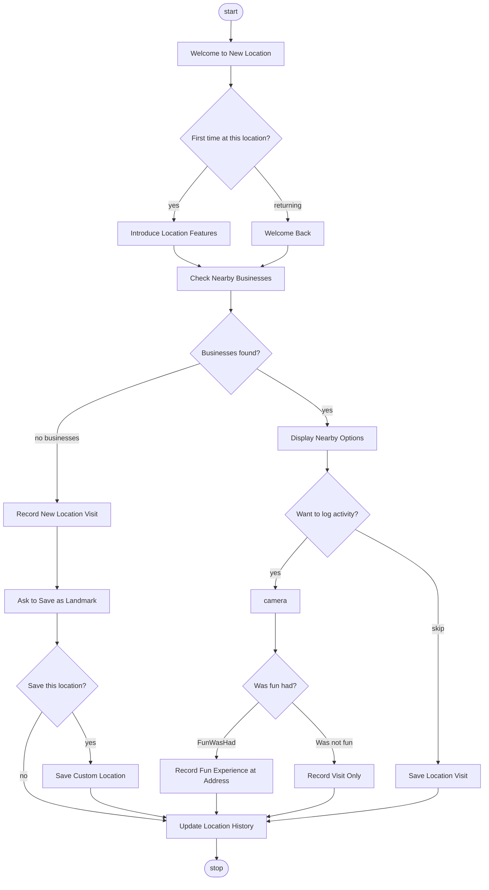

# New Location Detected Workflow

**Source:** `new-location.puml`
**Title:** New Location Detected Workflow

---

## Overview

The **New Location Detected** workflow runs when the app detects that the user has arrived at a new address (`NewLocationAddress` event). It is loaded from `new-location.puml` by `LocationWorkflowService`, which starts or resumes a workflow instance keyed by `location:{address_hash}`. The flow welcomes the user (first-time vs returning), checks for nearby businesses, optionally logs an activity (with photo and “fun had?”), and can prompt to save the location as a landmark. State is persisted so the workflow can be resumed within a 24‑hour window for the same address.

---

## Rendered Diagram

The diagram below is rendered from `new-location.puml`. To generate the PlantUML SVG, run `dotnet run --project tools/PlantUmlRender -- -o docs/workflows -f svg new-location.puml` (requires PlantUML remote server). The Mermaid diagram is the guaranteed fallback.

### Mermaid

The following Mermaid diagram represents the same flow as `new-location.puml`. The canonical definition is in the PlantUML source below.



### PlantUML Source (canonical)

The official workflow definition is in the repository root as `new-location.puml`. To view the rendered PlantUML diagram, paste the contents of `new-location.puml` into [PlantUML Online](http://www.plantuml.com/plantuml/uml) or use a PlantUML editor/IDE extension.

```plantuml
@startuml
title New Location Detected Workflow

start;

:Welcome to New Location;
note right of Welcome to New Location
Address: {{address}}
Latitude: {{latitude}}
Longitude: {{longitude}}
end note

if (First time at this location?) then (yes)
  :Introduce Location Features;
  note right
  Show available features:
  - Nearby businesses
  - Local events
  - Save as favorite
  end note
else (returning)
  :Welcome Back;
  note right
  Last visit: {{last_visit}}
  Previous activities: {{activity_count}}
  end note
endif

:Check Nearby Businesses;
note left of Check Nearby Businesses
{
  "action": "get_nearby_businesses",
  "params": {
    "radius": "100"
  }
}
end note

if (Businesses found?) then (yes)
  :Display Nearby Options;
  note right
  Show top businesses:
  {{businesses}}
  end note

  if (Want to log activity?) then (yes)
    :camera;
    note right: Take a photo of the location

    if (Was fun had?) then (#FunWasHad)
      :Record Fun Experience at Address;
      note right
      Saving fun experience
      Address: {{address}}
      Business: {{closest_business}}
      Time: {{timestamp}}
      end note
    else (Was not fun)
      :Record Visit Only;
      note right
      Recording location visit
      No fun logged
      end note
    endif
  else (skip)
    :Save Location Visit;
    note right
    Recording visit without activity
    end note
  endif

else (no businesses)
  :Record New Location Visit;
  note right
  Remote or residential area
  No nearby businesses
  end note

  :Ask to Save as Landmark;
  if (Save this location?) then (yes)
    :Save Custom Location;
    note right
    User defined location name
    end note
  endif
endif

:Update Location History;
note right
Persist to database:
- Address
- Visit timestamp
- Activities logged
- Businesses visited
end note

stop;

@enduml
```

---

## States and Transitions

### States / nodes

| State / Node                      | Type     | Description |
|-----------------------------------|----------|-------------|
| **start**                         | Start    | Workflow entry. |
| **Welcome to New Location**       | Activity | Greets user; uses `{{address}}`, `{{latitude}}`, `{{longitude}}`. |
| **First time at this location?**  | Decision | Branches on whether this is the first visit to this address. |
| **Introduce Location Features**  | Activity | First-time: show nearby businesses, local events, save as favorite. |
| **Welcome Back**                  | Activity | Returning: show `{{last_visit}}`, `{{activity_count}}`. |
| **Check Nearby Businesses**       | Action   | Invokes `get_nearby_businesses` with `radius: 100`. |
| **Businesses found?**             | Decision | Branches on whether any businesses were found. |
| **Display Nearby Options**        | Activity | Shows top `{{businesses}}`. |
| **Want to log activity?**         | Decision | User chooses to log an activity or skip. |
| **camera**                        | Activity | Take a photo of the location. |
| **Was fun had?**                  | Decision | User’s “fun had?” choice. |
| **Record Fun Experience at Address** | Activity | Saves fun experience with address, `{{closest_business}}`, `{{timestamp}}`. |
| **Record Visit Only**             | Activity | Records visit without fun. |
| **Save Location Visit**           | Activity | Records visit when user skips activity. |
| **Record New Location Visit**      | Activity | No businesses; records visit as remote/residential. |
| **Ask to Save as Landmark**       | Activity | Asks user to save the location. |
| **Save this location?**           | Decision | User’s choice to save as landmark. |
| **Save Custom Location**          | Activity | Saves user-defined location name. |
| **Update Location History**       | Activity | Persists address, visit timestamp, activities, businesses visited. |
| **stop**                          | End      | Workflow ends. |

### Transitions

| From                            | To                              | Condition / Label      |
|---------------------------------|----------------------------------|-------------------------|
| start                           | Welcome to New Location          | (immediate)             |
| Welcome to New Location         | First time at this location?     | (immediate)             |
| First time at this location?    | Introduce Location Features      | yes                     |
| First time at this location?    | Welcome Back                     | returning               |
| Introduce Location Features    | Check Nearby Businesses          | (immediate)             |
| Welcome Back                    | Check Nearby Businesses          | (immediate)             |
| Check Nearby Businesses         | Businesses found?                | (immediate)             |
| Businesses found?               | Display Nearby Options           | yes                     |
| Businesses found?               | Record New Location Visit        | no businesses           |
| Display Nearby Options          | Want to log activity?            | (immediate)             |
| Want to log activity?           | camera                           | yes                     |
| Want to log activity?           | Save Location Visit              | skip                    |
| camera                          | Was fun had?                     | (immediate)             |
| Was fun had?                    | Record Fun Experience at Address | FunWasHad               |
| Was fun had?                    | Record Visit Only                | Was not fun             |
| Record Fun Experience at Address| Update Location History          | (immediate)             |
| Record Visit Only               | Update Location History          | (immediate)             |
| Save Location Visit             | Update Location History          | (immediate)             |
| Record New Location Visit       | Ask to Save as Landmark          | (immediate)             |
| Ask to Save as Landmark         | Save this location?              | (immediate)             |
| Save this location?             | Save Custom Location             | yes                     |
| Save this location?             | Update Location History          | no                      |
| Save Custom Location            | Update Location History          | (immediate)             |
| Update Location History         | stop                             | (immediate)             |

---

## Actions Invoked

### `get_nearby_businesses` (at **Check Nearby Businesses**)

- **Handler:** `GetNearbyBusinessesActionHandler` (`Name` = `"get_nearby_businesses"`).
- **Parameters (from workflow note):**
  - `radius`: `100` (meters).
- **Behavior:** Same as in [Fun Was Had workflow](workflow.md#get_nearby_businesses): gets GPS, finds nearby businesses via `ILocationService`, writes `status`, `latitude`, `longitude`, `accuracy`, `radius`, `count`, `businesses`, `closest_business`, `closest_distance` into workflow state.

### `camera`

- **Behavior:** Prompts the user to take a photo; rendered as an `ImageChatEntry` in the chat UI. Treated as a built‑in/UI activity.

### Other activities (Record, Save, Update)

- **Behavior:** Represent persistence and UI steps (record visit, save as landmark, update location history). Implemented in app/repository layers; not wired as separate `IWorkflowActionHandler` actions in the codebase.

---

## Transitions to Other Workflows

**None.** This workflow is self‑contained and ends at `stop`. It does not start, resume, or branch to `workflow.puml` or any other workflow.

**Relationship to other workflows:** `new-location.puml` is **started or resumed** by `LocationWorkflowService` when a `NewLocationAddress` event occurs. The main `workflow.puml` is loaded separately by the app and is not invoked from `new-location.puml`.

---

## Workflow Variables

Available in the workflow (from `LocationWorkflowService` / event and from `get_nearby_businesses`):

| Variable            | Example / Meaning |
|---------------------|-------------------|
| `address`           | e.g. `"123 Main St, San Francisco, CA"` |
| `latitude`, `longitude` | e.g. `"37.774929"`, `"-122.419418"` |
| `accuracy`          | GPS accuracy in meters |
| `previous_address`  | Address before the change |
| `timestamp`         | When the address change was detected (ISO 8601) |
| `is_first_visit`    | Whether this is the first visit to this address |
| `last_visit`        | Last visit time if returning (ISO 8601) |
| `activity_count`    | Number of previous activities at this location |
| `radius`            | Search radius, default `"100"` |
| `count`             | Number of businesses found |
| `businesses`        | Comma‑separated business names (top 5) |
| `closest_business`  | Name of closest business |
| `closest_distance`  | Distance to closest business in meters |

### Workflow instance key

- **Format:** `location:{address_hash}` (e.g. `location:sha256_of_address`).
- **Purpose:** Enables resuming the same workflow for the same address within the configured time window (e.g. 24 hours). `LocationWorkflowService` uses `FindByNamePatternAsync` to find an existing instance before starting a new one.

Example usage in a node (e.g. `SendMessage`):
`{"action": "SendMessage", "params": {"text": "Welcome to {{address}}! Found {{count}} nearby businesses."}}`
