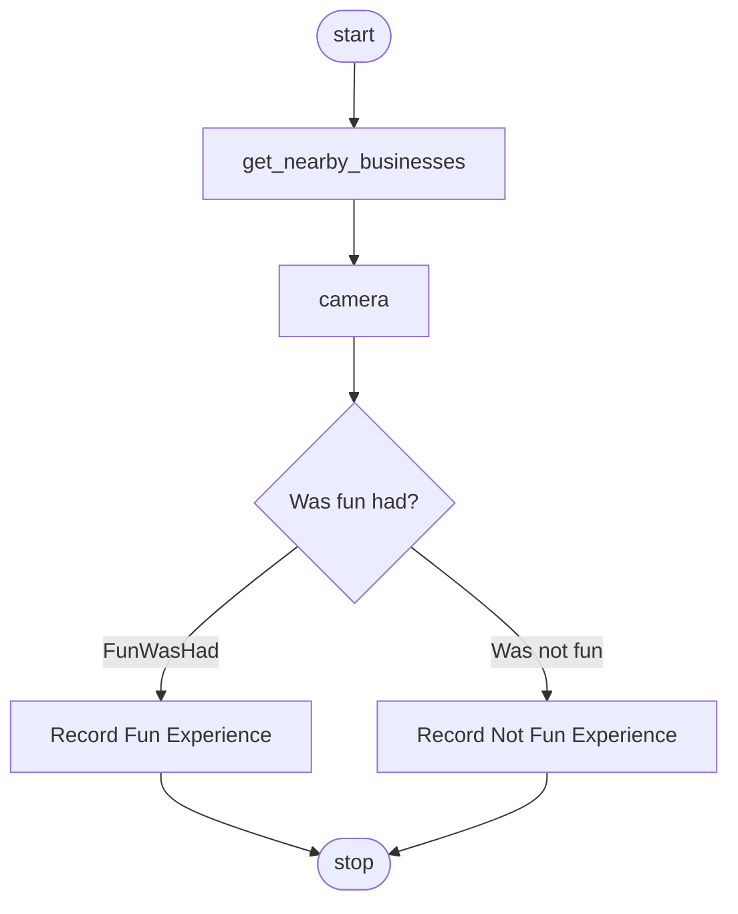

# Fun Was Had Workflow

**Source:** `workflow.puml`
**Title:** Fun Was Had Workflow

---

## Overview

The **Fun Was Had** workflow is the primary user flow for logging whether an outing was enjoyable. It is loaded by the mobile app (e.g. from `workflow.puml` in the app bundle or working directory) and drives the main chat/guided experience: get the user’s location, find nearby businesses, prompt a photo, then record whether fun was had or not.

---

## Rendered Diagram

The diagram below is rendered from `workflow.puml`. To generate the PlantUML SVG, run `dotnet run --project tools/PlantUmlRender -- -o docs/workflows -f svg workflow.puml` (requires PlantUML remote server). The Mermaid diagram is the guaranteed fallback.

### Mermaid

The following Mermaid diagram represents the same flow as `workflow.puml`. The canonical definition is in the PlantUML source below.



### PlantUML Source (canonical)

The official workflow definition is in the repository root as `workflow.puml`. To view the rendered PlantUML diagram, paste the contents of `workflow.puml` into [PlantUML Online](http://www.plantuml.com/plantuml/uml) or use a PlantUML editor/IDE extension.

```plantuml
@startuml
title Fun Was Had Workflow

start;

:get_nearby_businesses;
note right of get_nearby_businesses
Get your current GPS location
and find nearby businesses
end note
note left of get_nearby_businesses
{
  "action": "get_nearby_businesses",
  "params": {
    "radius": "1000"
  }
}
end note

:camera;
note right: Take a photo of where you are

if (Was fun had?) then (#FunWasHad)
  :Record Fun Experience;
  note right: User confirmed fun was had! 😁
else (Was not fun)
  :Record Not Fun Experience;
  note right: User reported no fun 😕
endif;

stop;

@enduml
```

---

## States and Transitions

| State / Node         | Type        | Description |
|----------------------|-------------|-------------|
| **start**            | Start       | Workflow entry. No prior state. |
| **get_nearby_businesses** | Action   | Gets current GPS, finds businesses within a radius. Sets `status`, `latitude`, `longitude`, `accuracy`, `radius`, `count`, `businesses`, `closest_business`, `closest_distance`. |
| **camera**           | Activity    | Prompts the user to take a photo of their location. |
| **Was fun had?**     | Decision    | Branch on user’s answer. |
| **Record Fun Experience** | Activity | User confirmed fun; experience is recorded positively. |
| **Record Not Fun Experience** | Activity | User said no fun; experience is recorded as not fun. |
| **stop**             | End         | Workflow terminates. |

### Transitions

| From                    | To                       | Condition / Label   |
|-------------------------|--------------------------|---------------------|
| start                   | get_nearby_businesses    | (immediate)         |
| get_nearby_businesses   | camera                   | (immediate)         |
| camera                  | Was fun had?             | (immediate)         |
| Was fun had?            | Record Fun Experience    | "FunWasHad" (yes)   |
| Was fun had?            | Record Not Fun Experience | "Was not fun" (no) |
| Record Fun Experience   | stop                     | (immediate)         |
| Record Not Fun Experience | stop                  | (immediate)         |

---

## Actions Invoked

### `get_nearby_businesses`

- **Handler:** `GetNearbyBusinessesActionHandler` (`Name` = `"get_nearby_businesses"`).
- **Parameters (from workflow note):**
  - `radius` (optional): search radius in meters; default in this workflow: `1000`.
- **Behavior:**
  - Ensures location is available and permission granted.
  - Gets current location via `IGpsService.GetCurrentLocationAsync`.
  - Calls `ILocationService.GetNearbyBusinessesAsync(lat, lon, radius, categories)`.
  - Pushes notifications for progress, success, and errors.
- **Output variables (written to workflow state):**
  - `status`: `success`, `error`, `permission_denied`, `location_unavailable`, or `cancelled`
  - `latitude`, `longitude`, `accuracy`, `radius`, `count`
  - `businesses` (comma‑separated, top 5), `closest_business`, `closest_distance`

### `camera`

- **Behavior:** Prompts the user to take a photo of where they are. Rendered in the chat UI as an `ImageChatEntry`. No dedicated `IWorkflowActionHandler` with name `"camera"`; treated as a built‑in/UI activity.

### Record Fun Experience / Record Not Fun Experience

- **Behavior:** Terminal activities that record the user’s choice. Implementation may be in persistence/chat layers; not exposed as a separate workflow action in the codebase.

---

## Transitions to Other Workflows

**None.** This workflow is self‑contained and ends at `stop`. It does not start, resume, or branch to `new-location.puml` or any other workflow.

---

## Workflow Variables (after `get_nearby_businesses`)

Available for use in later nodes (e.g. `SendMessage`):

| Variable           | Example / Meaning                                      |
|--------------------|--------------------------------------------------------|
| `status`           | `success`, `error`, `permission_denied`, `location_unavailable`, `cancelled` |
| `latitude`         | e.g. `"37.774929"`                                    |
| `longitude`        | e.g. `"-122.419418"`                                  |
| `accuracy`         | GPS accuracy in meters, e.g. `"25"`                   |
| `radius`           | Search radius used, e.g. `"1000"`                    |
| `count`            | Number of businesses found, e.g. `"15"`              |
| `businesses`       | Comma‑separated business names (top 5)                |
| `closest_business` | Name of closest business                             |
| `closest_distance` | Distance to closest business in meters                |

Example usage in a subsequent node (e.g. `SendMessage`):
`{"action": "SendMessage", "params": {"text": "Found {{count}} businesses near {{closest_business}}"}}`
