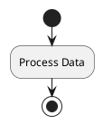

# PlantUML Activity Diagram Grammar for FWH Workflow Parser

**Version:** 1.0  
**Date:** 2026-01-07  
**Project:** FunWasHad Workflow Engine  
**Implementation:** `FWH.Common.Workflow.PlantUmlParser`

---

## Overview

This document defines the PlantUML activity diagram grammar supported by the FWH workflow parser. The parser converts PlantUML activity diagrams into executable workflow definitions with support for conditional branching, loops, notes (including JSON action metadata), and state transitions.

---

## Document Structure

The parser expects PlantUML activity diagram syntax within standard PlantUML document markers:

```plantuml
@startuml
<activity diagram content>
@enduml
```

**Rules:**
- Lines starting with `'` or `//` are treated as comments and ignored
- Blank lines are ignored
- Document markers `@startuml` and `@enduml` are removed during parsing
- All constructs are case-insensitive unless otherwise specified

---

## Basic Elements

### 1. Start and End Points

#### Start
```plantuml
start
```
- Marks the workflow entry point
- Creates a `StartPoint` in the workflow definition
- Optional; if omitted, the first node becomes the implicit start

#### End / Stop
```plantuml
end
stop
```
- Marks the workflow termination point
- Creates a terminal node
- Transitions from the current node to the stop node

**Example:**


---

### 2. Actions (Activity Nodes)

#### Syntax
```plantuml
:Action Label;
```

**Optional Color:**
```plantuml
#colorcode :Action Label;
```

**Rules:**
- Action text is enclosed between `:` and `;`
- Leading/trailing colons and semicolons are trimmed during normalization
- Actions create workflow nodes with the specified label
- Color codes are parsed but currently stored for future use

**Node ID Generation:**
- If the label is unique, the node ID = label
- Otherwise, a synthetic ID is generated: `{sanitized_label}_{index}`

**Examples:**
```plantuml
:Read File;
:Process Data;
#green :Success;
```

---

### 3. State Transitions (Arrows)

#### Syntax
```plantuml
NodeA --> NodeB
NodeA -> NodeB
NodeB <-- NodeA
NodeB <- NodeA
```

**Rules:**
- Single arrow (`->`) or double arrow (`-->`) both create transitions
- Reverse arrows (`<-`, `<--`) are parsed in reverse direction
- Quoted labels in arrow expressions are removed during parsing
- `[*]` represents an entry point and creates a `StartPoint`

**Examples:**
```plantuml
[*] --> InitialNode
:Step 1; --> :Step 2;
:End; <-- :Step 2;
```

---

## Control Flow Constructs

### 4. Conditional Branching (if/else)

#### Basic If-Then-Else
```plantuml
if (condition) then (label)
  :True Action;
else (label)
  :False Action;
endif
```

#### If with multiple branches
```plantuml
if (condition) then (yes)
  :Branch A;
elseif (other condition) then (label)
  :Branch B;
else (no)
  :Branch C;
endif
```

#### Alternate Syntax
```plantuml
if (value) is (expected) then
  :Action;
endif

if (value) equals (expected) then
  :Action;
endif
```

**Rules:**
- Creates a synthetic decision node with ID `if:_{condition}_{index}`
- Each branch gets a condition text (defaults to "else" for final else)
- Branches without actions create direct transitions from decision to join
- Join node created at `endif` with ID `join_{index}`
- Supports nested if statements (managed via internal stack)

**Branch Labels:**
- Optional labels in parentheses after `then` and `else`
- Used for transition display/documentation

**Examples:**
```plantuml
if (user authenticated?) then (yes)
  :Show Dashboard;
else (no)
  :Show Login;
endif
```

---

### 5. Loops (repeat/while)

#### Syntax
```plantuml
repeat
  :Loop Body;
repeat while (condition)
```

**Rules:**
- Creates synthetic nodes: `loop_entry_{index}` and `after_loop_{index}`
- Loop body actions connected in sequence
- Condition checked at end (do-while semantics)
- Creates two transitions from loop body:
  1. Back to `loop_entry` (with condition)
  2. Forward to `after_loop` (loop exit)
- Supports nested loops (managed via internal stack)

**Example:**
```plantuml
repeat
  :Process Item;
  :Validate;
repeat while (more items?)
```

---

## Metadata and Documentation

### 6. Notes

The parser supports three note attachment styles:

#### A. Shorthand Inline Note (Current Node)
```plantuml
:Action;
note right: This is a note
note left: Another note
note top: Top note
note bottom: Bottom note
```

**Rules:**
- Attaches to the most recently created node (`currentNodeId`)
- Direction keyword (`left`, `right`, `top`, `bottom`) is optional
- Note text stored in `WorkflowNode.NoteMarkdown`

#### B. Inline Note (Explicit Target)
```plantuml
note right of ActionName: Note text here
note left of :Process;: Note text
```

**Rules:**
- Direction keyword required
- `of` keyword optional
- Target can be node label or node ID
- Note text stored in target node's `NoteMarkdown`

#### C. Block Note (Multi-line)
```plantuml
note left of NodeName
  Line 1 of note
  Line 2 of note
  More content
end note
```

**Rules:**
- Supports multi-line content
- Lines collected until `end note` or `endnote` encountered
- All lines joined with newline (`\n`)
- Attached to specified target node

---

### 7. JSON Metadata (Action Definitions)

#### Syntax: JSON | Markdown Split
```plantuml
:Action;
note left: {"action":"SendMessage","params":{"to":"user"}}|User-visible message
```

**Rules:**
- If note contains `|` (pipe), splits into two parts:
  - **Left side (before `|`):** Parsed as JSON, stored in `WorkflowNode.JsonMetadata`
  - **Right side (after `|`):** Stored in `WorkflowNode.NoteMarkdown`
- Left side MUST be valid JSON object (`{...}`)
- If left side is not valid JSON, entire note stored as `NoteMarkdown`
- JSON must have `"action"` property to be executed by `WorkflowActionExecutor`

**JSON Action Schema:**
```json
{
  "action": "ActionName",
  "params": {
    "param1": "value1",
    "param2": "{{variableName}}"
  }
}
```

**Template Variables:**
- Parameters support mustache-style templates: `{{variableName}}`
- Variables resolved from `IWorkflowInstanceManager` at execution time
- Pattern: `\{\{\s*(?<key>[a-zA-Z0-9_.]+)\s*\}\}`

**Examples:**
```plantuml
:Send Email;
note right: {"action":"SendEmail","params":{"to":"{{userEmail}}"}}|Sending email to user

:Validate;
note left: {"action":"ValidateInput"}|Input validation step
```

---

## Advanced Constructs

### 8. Skinparam (Style Directives)

```plantuml
skinparam ParamName Value
skinparam BackgroundColor #FFFFFF;
```

**Rules:**
- Parsed and stored in internal dictionary (case-insensitive keys)
- Trailing semicolon optional
- Currently stored for future rendering use

---

### 9. Pragma Directives

```plantuml
!pragma name value
!pragma version 1.0
```

**Rules:**
- Parsed and stored as tuples: `(name, value?)`
- Value is optional
- Currently stored for future use

---

### 10. Style Blocks

```plantuml
<style>
  activityDiagram {
    BackgroundColor #FFFFFF
  }
</style>
```

**Rules:**
- Entire block collected (including markers)
- Stored as string for future rendering
- Multi-line content preserved

---

### 11. Stereotypes (SDL Activity Markup)

```plantuml
:Action; <<input>>
:Process; <<process>>
```

**Rules:**
- Pattern: `<<\s*(\w+)\s*>>`
- Appended to node's `NoteMarkdown` as `\n<<stereotype>>`
- Currently informational; reserved for future use

---

## Node and Transition ID Generation

### Node IDs

**Priority Order:**
1. **Explicit Label:** If label is unique and non-empty, use it as ID
2. **Synthetic ID:** `{sanitized_label}_{index}`
   - Sanitization: Replace whitespace with `_`, remove non-alphanumeric
   - Fallback: `node_{index}` if label is empty

**Special Nodes:**
- Start/Stop: Use label directly (`Start`, `Stop`)
- Decision nodes: `if:_{condition}_{index}`
- Join nodes: `join_{index}`
- Loop nodes: `loop_entry_{index}`, `after_loop_{index}`

### Transition IDs

Format: `t_{count}`

Where `count` is the sequential transition index.

**Self-Transition Rule:**
- Self-transitions (from == to) are **only** created if a condition is provided
- Prevents unintentional infinite loops

---

## Parsing Behavior

### Normalization
- Labels trimmed of leading `:` and trailing `;`
- Whitespace collapsed
- Node lookup by label is case-sensitive

### Context Tracking
- **Current Node ID:** Tracks last-created node for implicit transitions
- **If Stack:** Manages nested conditional branches
- **Loop Stack:** Manages nested loops

### Frame Management

#### If Frame
```csharp
class IfFrame {
    string DecisionNodeId;
    string ConditionText;
    List<Branch> Branches;
}

class Branch {
    string? Label;
    string? EntryNodeId;
    string? LastNodeId;
    string? ConditionText;
}
```

#### Loop Frame
```csharp
class LoopFrame {
    string LoopEntryNodeId;
    string? ConditionText;
    string? FirstNodeId;
    string? LastNodeId;
}
```

---

## Output Model

The parser produces a `WorkflowDefinition` with the following structure:

```csharp
public record WorkflowDefinition(
    string Id,
    string Name,
    IReadOnlyList<WorkflowNode> Nodes,
    IReadOnlyList<Transition> Transitions,
    IReadOnlyList<StartPoint> StartPoints
);

public record WorkflowNode(
    string Id, 
    string Label, 
    string? JsonMetadata = null, 
    string? NoteMarkdown = null
);

public record Transition(
    string Id, 
    string FromNodeId, 
    string ToNodeId, 
    string? Condition = null
);

public record StartPoint(
    string NodeId
);
```

---

## Complete Example

```plantuml
@startuml
skinparam BackgroundColor #F0F0F0

start

:Initialize System;
note right: {"action":"Init","params":{"mode":"production"}}|System initialization

if (user authenticated?) then (yes)
  :Load User Profile;
  note left: {"action":"LoadProfile","params":{"userId":"{{currentUserId}}"}}|Loading user data
  
  repeat
    :Process Request;
    note right: Handle incoming requests
  repeat while (queue not empty?)
  
  :Finalize;
else (no)
  :Show Login;
  note right: Redirect to login page
endif

:Cleanup;
stop
@enduml
```

**Parsed Result:**
- **Nodes:** `Start`, `Initialize System`, `if:_user authenticated?_0`, `Load User Profile`, `loop_entry_1`, `Process Request`, `after_loop_1`, `Finalize`, `Show Login`, `join_0`, `Cleanup`, `Stop`
- **StartPoints:** `[Start]`
- **Transitions:** Sequential flow with conditional branches and loop edges
- **JSON Actions:** Attached to `Initialize System` and `Load User Profile` nodes

---

## Parser Implementation Notes

### Key Methods

| Method | Purpose |
|--------|---------|
| `Parse(string? id, string? name)` | Main entry point; returns `WorkflowDefinition` |
| `GetOrCreateNode(string token)` | Retrieves or creates node by label |
| `CreateSyntheticNode(string label)` | Creates decision/join/loop nodes |
| `AttachNoteToNode(string target, string note)` | Attaches note to specified node |
| `SplitAndAttachMetadata(...)` | Splits JSON\|Markdown and assigns to node |
| `AddTransition(from, to, condition?)` | Creates transition with self-loop guard |

### Error Handling
- Invalid constructs are silently skipped
- Unclosed `if` or `repeat` blocks auto-closed at end of parsing
- Malformed JSON in notes treated as plain markdown

---

## Limitations and Extensions

### Current Limitations
1. Parallel/fork/join constructs not supported
2. Swimlanes not supported
3. Partitions not supported
4. Colors parsed but not applied during rendering
5. Stereotypes stored but not enforced

### Planned Extensions
1. Support for parallel execution (fork/join)
2. Swimlane-based role/actor assignment
3. Partition-based workflow segmentation
4. Advanced transition guards with expressions
5. Workflow validation rules

---

## Version History

| Version | Date | Changes |
|---------|------|---------|
| 1.0 | 2026-01-07 | Initial grammar documentation; JSON\|Markdown split support |

---

## References

- PlantUML Activity Diagram Official Docs: https://plantuml.com/activity-diagram-beta
- FWH Workflow Engine Documentation: (internal)
- Implementation: `FWH.Common.Workflow.PlantUmlParser.cs`

---

**Document Status:** ✅ Complete  
**Last Updated:** 2026-01-07  
**Maintainer:** FunWasHad Development Team
